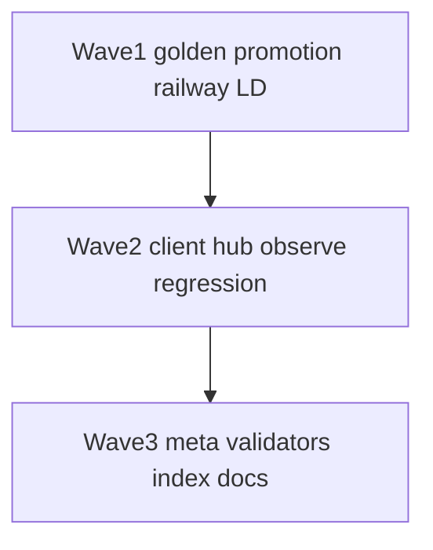

# Validator Hardening Plan — 44 fixes (Agent Runtime Control)

**Context:** Phase F validators all PASS today, but critique found false-green risk (strong golden 8/9, grep-only wiring, LD receipt existence-only, weak Railway “blocked” probe). This plan fixes **all** identified gaps. Do **not** edit [agent_runtime_phase_f_6abfeb9b.plan.md](/Users/sinakazemnezhad/.cursor/plans/agent_runtime_phase_f_6abfeb9b.plan.md).

**Law preserved:** Mac founder chat = light validators only · full contract suite = deploy/CI window · no agent auto-promote SSOT.

---

## Tier model

| Tier | When | Scripts |
|------|------|---------|
| **Mac-light** | Founder session, pre-reply | `validate-agent-runtime-mac-light-v1.sh` (≤90s) |
| **Ship** | After code change, local | bay + golden (no network) |
| **Cloud-CI** | Deploy / Railway | railway + hub smoke + eval batch |

---

## A. Golden eval & promotion (fixes 1–8)

1. **Skip escalation cases in strong-only batch** — In `scripts/fbe_comprehension_eval_batch_v1.py`, when `variation_key=strong`, skip cases with `expect_escalated: true`.
2. **Add `run_modes` per golden case** — In `data/comprehension-golden-v1.json`, optional `"run_modes": ["default"]` on golden-009 so strong batch excludes it explicitly.
3. **Per-case failure dump** — On batch fail, print failed `id`, `expect_verdict`, `actual_verdict`, `escalated` to stderr.
4. **Stable pass math** — Strong batch: `passed >= total - count(expect_escalated)` instead of fragile `pass_rate >= 0.875` on 9 cases.
5. **Decouple promotion from bay validator** — Remove `promotion_ready is True` from `scripts/validate-cloud-comprehension-bay-v1.sh`.
6. **New promotion validator** — `scripts/validate-agent-runtime-promotion-v1.sh`: assert report script, receipt file, schema keys.
7. **Promotion warn vs fail** — Default must be 100%; strong 8/9 → WARN line but PASS unless `< 0.875`.
8. **SSOT no-write check** — After promotion report run, assert `data/cloud-comprehension-bay-v1.json` `active_variation_key` unchanged (hash or parse compare).

---

## B. Bay validator depth (fixes 9–16)

9. **Escalated ACCEPT in bay validator** — Use golden-009 draft; assert `verdict==ACCEPT`, `escalated==True`, `len(attempts)==2`.
10. **Strong path assert ACCEPT** — Borderline strong test must assert `verdict==ACCEPT`, not only `variation_key`.
11. **Unified escalation draft** — Add `escalation_probe_draft` key in golden JSON; both validators read it via python.
12. **Client smoke** — New `scripts/validate-cloud-comprehension-client-v1.sh`: one client call; assert `proxied`, `headless_cloud`, `ACCEPT`.
13. **Client fallback document** — Env `ALLOW_MAC_FALLBACK=1`: PASS on `mac_local_fallback` only when documented degrade.
14. **Hub slim contract** — POST `:13020/api/comprehension-loop/v1` if hub up; assert `verdict`, `config_version`, `attempts`.
15. **Hub BLOCKED HTTP 200** — Parrot draft → HTTP 200, `verdict==BLOCKED` (not transport 422).
16. **Reduce grep-only** — Keep grep as fast pre-check; add live or static contract assert for hub 200-on-verdict behavior.

---

## C. Railway / cloud-CI probe (fixes 17–22)

17. **Railway escalation contract** — golden-009 draft → `ACCEPT`, `escalated==True`, `attempts==2`.
18. **Railway parrot BLOCKED** — golden-002 draft → `BLOCKED`, HTTP 200, `attempts>=1`.
19. **Log HTTP status** — Print response status code in railway validator output.
20. **Railway eval batch** — Optional POST `/api/fbe/comprehension-eval-batch/v1`; assert `ok`, `pass_rate>=0.875`.
21. **Deploy verify default** — `deploy_fbe_railway_v1.py`: run railway validator when `--verify-comprehension` or `FBE_VERIFY_COMPREHENSION=1`.
22. **Deploy receipt field** — Always write `comprehension_verify: { ok, skipped, tail }` in deploy receipt.

---

## D. LD drain validator (fixes 23–28)

23. **Evidence quality** — Each CLOUD-LD receipt: `http_status==200`, `bytes_fetched>1000`, `len(evidence_snippets)>=3`.
24. **Source URL host** — Assert `launchdarkly.com` in `source_url`.
25. **Newest receipt wins** — Sort by `at` desc per `plan_id`; evaluate latest only.
26. **Workstream coverage** — At least one PASS receipt per ws-ux, ws-pricing, ws-run, ws-onboard, ws-integrate across 001–010.
27. **Dry-run self-test** — `scripts/validate-cloud-dispatch-dry-run-v1.sh`: `--dry-run` on CLOUD-LD-001 returns ok schema.
28. **Archive vs live split** — `validate-cloud-ld-drain-archive-v1.sh` (disk) vs `-live-v1.sh` (one fetch, CI only).

---

## E. Rollout & runtime config (fixes 29–32)

29. **Integration via `load_bay_config()`** — Rollout validator uses env `AGENT_RUNTIME_BAY_SSOT` pointing at rollout test fixture.
30. **Boundary fixtures** — Add bucket boundary IDs at 49/50 slot in test JSON.
31. **Percent edge cases** — Test `_bucket` at percent 0, 1, 100.
32. **Production lock assert** — Prod SSOT: `active_variation_key==default`, `rollout.percent==100`.

---

## F. Observe / nerves / glance (fixes 33–36)

33. **Nerve line validator** — `scripts/validate-comprehension-nerve-line-v1.sh`: fresh bay receipt → surfaces `comprehension_line` contains verdict + cfg.
34. **Glance metrics keys** — Extend `validate-mac-health-cloud-glance-v1.sh`: `comprehension_last_verdict`, `_score`, `_execution_plane`.
35. **Worker hub slice** — Assert `cloud_glance_line` non-empty when Railway ok.
36. **Freshness decay** — Test stale receipt (>24h) yields empty nerve line.

---

## G. Serialization & regression (fixes 37–40)

37. **Circular JSON regression** — `json.dumps(json_safe_dict(row))` after `normalize_receipt` — no ValueError.
38. **422 transport regression** — Client must not treat BLOCKED bay result as `cloud_proxy_http_error`.
39. **Golden modes unit test** — `scripts/test_comprehension_golden_modes_v1.py`: document default vs strong vs escalation expectations.
40. **Validator index SSOT** — `data/agent-runtime-validator-index-v1.json`: tier, script, max_runtime_s, network per validator.

---

## H. Ops & hygiene (fixes 41–44)

41. **Mac-light meta-validator** — `validate-agent-runtime-mac-light-v1.sh`: ship tier only, ≤90s total.
42. **Cloud-CI meta-validator** — `validate-agent-runtime-cloud-ci-v1.sh`: railway + optional hub + eval.
43. **Tier pointer in bay SSOT** — Add `validator_tiers` block to `data/cloud-comprehension-bay-v1.json` (when to run which script).
44. **LD receipt policy** — Document newest-`at` wins; optional cleanup of duplicate dispatch JSON in infra note.

---

## Execution waves

| Wave | Priority | Fix IDs | Goal |
|------|----------|---------|------|
| **1** | P0 | 1, 2, 5, 9, 17, 23, 25 | Stop false green |
| **2** | P1 | 12, 14, 15, 18, 33, 34, 37 | Contract depth |
| **3** | P2 | 21, 41, 42, 40, 26–32, 43–44 | CI ops + completeness |



---

## Success criteria (all 44)

- Strong golden PASS without mis-scoring escalation cases
- Bay validator PASS without `promotion_ready` coupling
- Railway probe fails if golden-009 escalation broken on cloud
- LD validator fails on empty snippets or stale-wins-hidden-fail
- Client validator confirms `headless_cloud` on happy path
- Mac-light meta ≤90s; cloud-CI documents network deps

---

## Ready-to-paste (after implementation)

```bash
cd ~/Desktop/SourceA && bash scripts/validate-agent-runtime-mac-light-v1.sh
cd ~/Desktop/SourceA && bash scripts/validate-agent-runtime-cloud-ci-v1.sh
```

**Pre-write (every disk edit):**

```bash
cd ~/Desktop/SourceA && python3 scripts/pre_write_guard_v1.py check --agent cursor --path "<target>" --json
```
