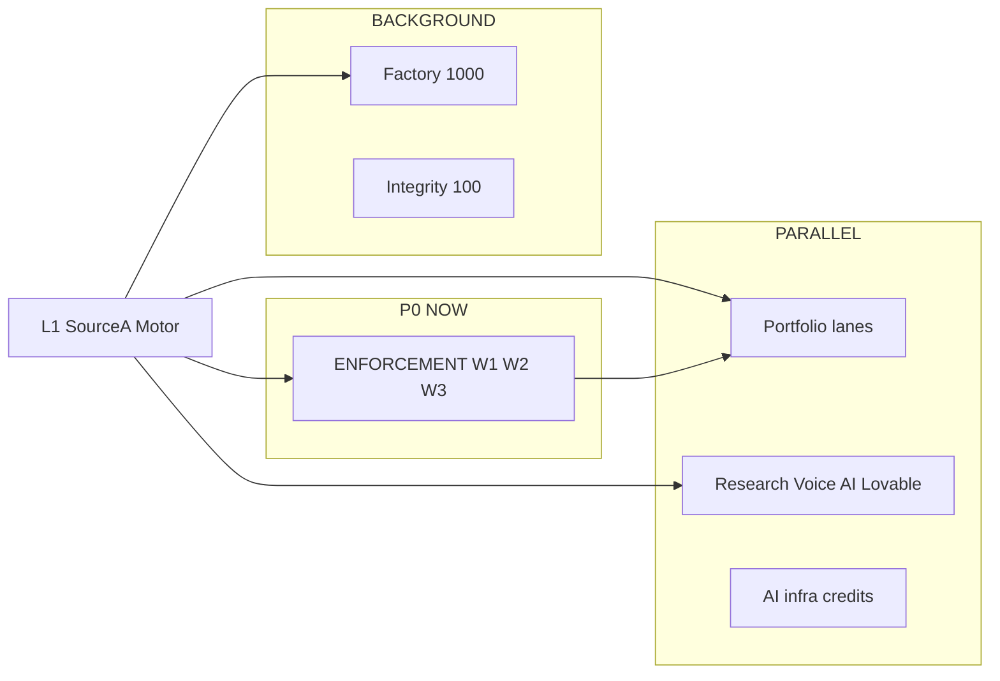

# Sina Multidimensional Parallel Engine — Master Map (LOCKED v1)

**Saved:** 2026-06-16T05:49:57Z · **Retrofit:** doc-datetime-law batch retrofit
**Open this file.** One picture of the motor, the wheels, the references, the paths, and what we are doing **right now**.  
**Machine twin:** `sina_engine_registry_v1.yaml` (analyze in Python/IDE)  
**Brain unification:** `SINA_BRAIN_PLATFORM_UNIFICATION_LOCKED_v1.md` · competition YAML · worker board  
**Parents:** `SINA_UNIFIED_ENGINE_STORY_LOCKED_v1.md` · Maintainer 1 archive · VC catalog

---

## 0. The motor (main thing)

```text
                    ┌─────────────────────────────────────┐
                    │   YOU (ASF) — hub tap · final call   │
                    └──────────────────┬──────────────────┘
                                       │
         ┌─────────────────────────────▼─────────────────────────────┐
         │  L3 AgentField — agentic ops target (n8n · social · outreach) [LAG] │
         └─────────────────────────────┬─────────────────────────────┘
                                       │
    ┌──────────────────────────────────▼──────────────────────────────────┐
    │  L1 SOURCEA — THE MOTOR (P0)                                         │
    │  spine · gatekeeper · validators · hub · demo BLOCK/ALLOW/tamper     │
    │  ═══════════════════════════════════════════════════════════════════ │
    │  Every lane plugs in here — NF · TF · Forge · 777 · VIRLUX · …       │
    └──────────────────────────────────┬──────────────────────────────────┘
                                       │
         ┌──────────────┬──────────────┼──────────────┬──────────────┐
         ▼              ▼              ▼              ▼              ▼
        NF            TF           Forge          777          VIRLUX …
      (W3 #1)       (W3 #2)      (SKU)        (mission)     (delivery)
```

**You are not ten engines. You are one motor with ten wheels.**

---

## 1. Layers — first · second · third (clear)

| Layer | Name | What it is | Status |
|-------|------|------------|--------|
| **L0** | Brain memory | Maintainer 1 mega chat · Mono mega · L0-meta · law writing | **~13k records preserved** |
| **L1** | **SourceA (P0)** | **THE MOTOR** — execution + governance + proof | **Working** — demo PASS |
| **L2** | FounderField | Signal · founder reg · 10 ideas | After W3 |
| **L3** | AgentField | Agentic face — posts · calls queue · n8n | Wiring now |
| **L4** | Portfolio lanes | NF · TF · Forge · 777 · … | Parallel on L1 |

**First layer of business = L1 SourceA.**  
**Second layer = L3 AgentField (how the motor touches the world).**  
**Third layer = L4 each company (product/GTM).**

---

## 2. Multidimensional parallel clocks (all capabilities at once)



| Clock | Job | Priority today |
|-------|-----|----------------|
| **C — ENFORCEMENT** | Film · write-path · **W3 money** | **P0 — main** |
| **B — Portfolio** | NF · TF · Forge · 777 · VL deliver | Parallel |
| **A — Factory** | 616/1000 receipts | Background |
| **D — Integrity** | 100-step playbook | Resume post-RT |
| **E — Credits** | Voyage · NVIDIA · Groq | Parallel |
| **R — Research** | Voice AI · Lovable compare | Inform only |

---

## 3. All businesses (lanes on the motor)

| Lane | Company | Role | W3? | Status |
|------|---------|------|-----|--------|
| **NF-001** | **Noetfield** | Copilot governance · trust layer | **Primary pilot** | **Test first (Part 2)** |
| **TF-001** | **TrustField** | MSB · RPAA · regulated receipts | Backup | Active |
| **AF** | **AgentField** | Agentic automation brand | — | Brand locked |
| **FF** | **FounderField** | VC signal · 10 ideas | Post-W3 | Named |
| **FORGE** | Forge | Governed app factory (sellable) | — | Launch-ready |
| **MP** | MergePack | Evidence → flywheel | — | Parallel |
| **RR** | RunReceipt | PASS/FAIL receipt pack | — | Package when W3 done |
| **ADB** | AI Dev Bridge | Wire · iPhone desk | — | Mostly PASS |
| **VL** | VIRLUX | Delivery / staging | — | Parallel |
| **777** | The 777 Foundation | Nonprofit mission | — | Parallel |
| **MONO** | SinaaiMonoRepo | Runtime · mx · L0-meta | — | Active |
| **COPRO** | Cursor OS Pro | Voice AI dev lane | — | Research |
| **SEMEJ** | SEMEJ | Chrome multi-AI chain | — | Optional |

---

## 4. All references (fuel — not separate engines)

### 4A — Governance & agent economy (deck + engine proof)

| Reference | What they do | We take |
|-----------|--------------|---------|
| **SourceA** (us) | Governance receipt · tamper FAIL | **We sell this** |
| **Paid** $21M | Agent economy infra | Category slide |
| **Botpress** $25M | Agent runtime | Compare |
| **Vybe** $10M | Build surface | AgentField analog |
| **Jetty** $2M+ | Reliable agents | Validator FAIL story |
| **Temporal** $300M | Durable workflows | Cascade pattern |
| **Presenc.ai** | Landscape May 2026 | One map slide |

### 4B — VC signal (FounderField — post-W3)

Evertrace · Fundverse · Crunchbase · Dealroom · CB Insights · PortfolioIQ · SignalFire

### 4C — Automation glue (AgentField — **use now**)

| Tool | Use |
|------|-----|
| **n8n** | Motor glue — schedules · webhooks |
| **Apollo** | W3 lists · sequences |
| **HubSpot** | Pipeline stages |
| **Buffer** | Social queue |
| **Make / Zapier** | Secondary connectors |

### 4D — App builders (compare — we are NOT Lovable-speed)

| Reference | Their wedge | Our wedge |
|-----------|-------------|-----------|
| **Lovable** / Bolt / Replit | Speed · vibe apps | **Proof · receipts · governance** |
| **Devin** / RAIS | Autonomous dev | Compare only |
| **Cursor** | IDE agent | Executor tool — not SSOT |

### 4E — Voice AI (future lane — research on disk)

| Reference | Path |
|-----------|------|
| Telnyx · Vapi · Bland · ElevenLabs class | `RESEARCH/ROUTING_VOICE_AI.yaml` |
| **Law** | Founder **never dials** — Voice AI + employees on agent slots |
| **Lane** | AgentField + TrustField + Cursor OS Pro |

**Full table:** `archive/attachments/2026-06-12/AGENTIC_REFERENCE_PLATFORM_VC_SIGNAL_CATALOG_v1.md`

---

## 5. Future ideas (brainstorm — on registry, gated by motor)

| ID | Idea | Like whom | Lane | When |
|----|------|-----------|------|------|
| FUT-VOICE | Voice AI outbound calls | Voice AI cos | AgentField + TF | Post-W3 pilot |
| FUT-LOVABLE | Rapid app gen with **receipts** | Lovable-class | Forge | After engine proof |
| FUT-DIVERGENT | AI divergent / paradox board | Council room | Mind Share | Parallel |
| FUT-SIGNAL | Signal Radar UI | Evertrace-class | FounderField | Post-W3 |
| FUT-24/7 | Full overnight agent loop | n8n + agents | AgentField | **Wiring this week** |
| FUT-FINTRAC | Regulated audit wedge | — | TrustField | W3 backup story |

---

## 6. Paths (Part 1 · 2 · 3 — what we are doing NOW)

```text
PART 1 — BUILD MOTOR     [████████░░] ~80%
  ✅ S1–S6 demo · validators · RT LIVE · spine
  ⏳ write-path validator (enf-0002)
  ⏳ film W1

PART 2 — TEST ONE CO     [░░░░░░░░░░] 0% revenue
  → NF-001 pilot (Noetfield)
  → agentic outreach batch 1 THIS WEEK

PART 3 — TRANSFER TO 10  [locked until W3 receipt]
  → same motor + AgentField glue → parallel lanes
```

---

## 7. Maintainer 1 — old brain database (NOT lost)

**Why you sent us here:** Maintainer 1 retired due to lag — but **~13,000 transcript records** are our system memory.

| Item | Location |
|------|----------|
| **Transcript** | `a53f3fa1-081c-4373-bc55-76feb501a61d` (~25 MB jsonl) |
| **Anchor register** | `archive/attachments/2026-06-11/MAINTAINER_1_MEGA_CHAT_ANCHOR_REGISTER_2026-06-11.md` |
| **Brain reference** | `~/.sina/brain/MEGA_CHAT_MAINTAINER_1_ARCHIVE_REFERENCE_LOCKED_v1.md` |
| **End of service** | `archive/attachments/2026-06-11/MAINTAINER_1_END_OF_SERVICE_HANDOFF_2026-06-11.md` |
| **Catalog row** | `ecosystem_master_catalog_v1.py` → `MAINTAINER_1` |

**What M1 gave us (still active law):**

- Sina Command hub · no Terminal for founder  
- RunReceipt 10-pack · prompt-fast loop  
- Goal 1 CHECK→ACT→VERIFY rhythm  
- Live founder form v2 · six picks  
- Integrity playbook · cascade/monitor  
- Brain picks · Worker builds one sa  

**Brain duty:** search M1 jsonl **before inventing** — keyword: `RunReceipt`, `prepare() was wiping`, `Private agents`, `Sina Command`.

---

## 8. Working RIGHT NOW (feel this — not theory)

| # | What | Who | Proof when done |
|---|------|-----|-----------------|
| 1 | `validate-demo-write-path-v1.sh` | Worker | Script PASS |
| 2 | Demo dry-run 3× | Worker | Log in archive |
| 3 | Agentic NF outreach 5 targets | Agents + n8n | Spine rows |
| 4 | Hub **Approve outbound batch** | You | One tap |
| 5 | FR-003 wiring | Maintainer 2 | Parallel |

**W3 today:** $0 — **everything above is to change that without forgetting the motor.**

---

## 9. Priority formula (every Brain turn)

```text
WHO AM I?     →  Motor builder (L1) in CLOCK C
MAIN JOB?     →  (1) close engine proof  (2) start NF pilot
NOISE?        →  new cos before W3 · Signal UI · PitchBook · critic reorder
```

---

## 10. Deep pointers (background — one click)

| Topic | File |
|-------|------|
| One story | `SINA_UNIFIED_ENGINE_STORY_LOCKED_v1.md` |
| All decisions locked | `SINA_ENFORCEMENT_PORTFOLIO_DECISION_FORM_LOCKED_v1.md` |
| Nothing superseded lost | `SINA_ENFORCEMENT_6MO_PRESERVED_SPIRIT_AND_LINEAGE_LOCKED_v1.md` |
| Week plan | `ENFORCEMENT_6MO_WEEKLY_OPERATING_PLAN` v1.1 + Annex A |
| 100 integrity forks | `SOURCEA_SYSTEM_INTEGRITY_100_STEP_PLAYBOOK` + Canvas |
| Analyze YAML | `python3 -c "import yaml; print(yaml.safe_load(open('sina_engine_registry_v1.yaml')))"` |

---

*End master map — one motor · many wheels · all dimensions visible*
