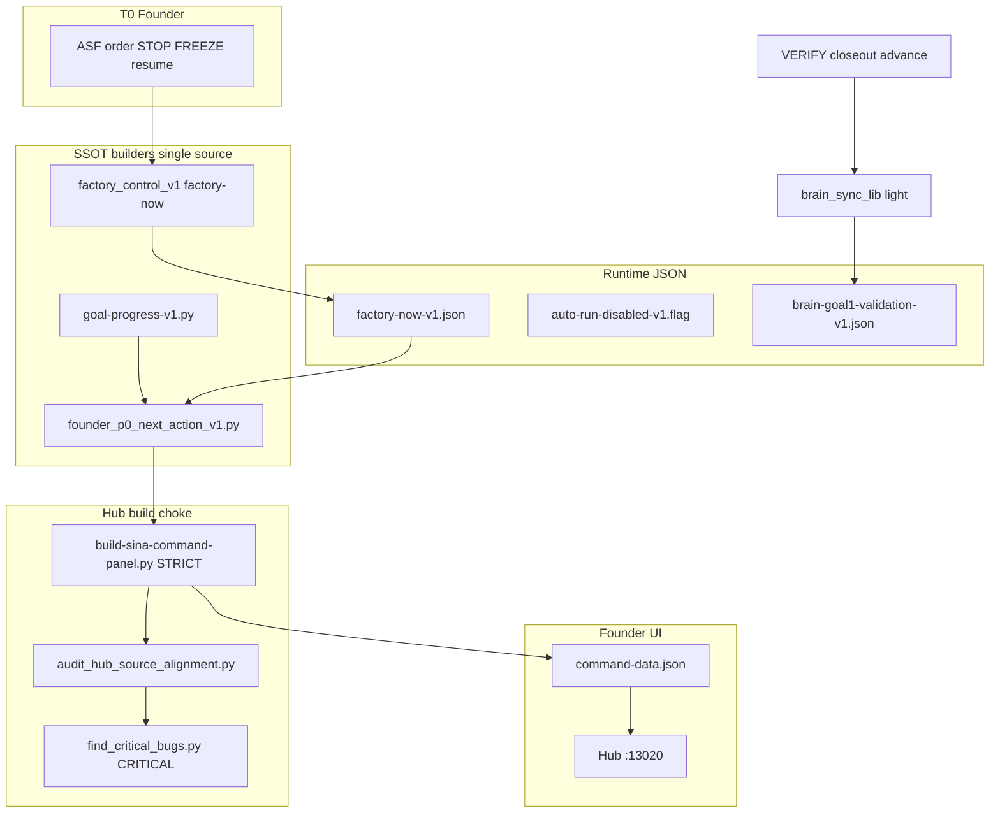

# SourceA — Anti-staleness machine enforcement plan (LOCKED v1)

**Saved:** 2026-06-16T05:49:57Z · **Retrofit:** doc-datetime-law batch retrofit
**Version:** 1.0 · **Locked:** 2026-06-10 · **Authority:** ASF  
**sequence_id:** SA-2026-06-10-ANTI-STALENESS-PLAN  
**Parent:** `SOURCEA_SYSTEM_MAP_TREE_LOCKED_v1.md` · INCIDENT-022 · INCIDENT-015-CONDUCT · INCIDENT-014  
**Validator (meta):** `scripts/validate-anti-staleness-bundle-v1.sh` (ship Phase 1)  
**Related:** `archive/attachments/2026-06-10/SOURCEA_MACHINE_ENFORCEMENT_REGISTRY_AND_AGENT_MAP_LOCKED_v1.md`

---

## 0. One sentence

**Staleness is projection drift — fix with one SSOT builder per founder-facing string, auto-sync on every honest write, and CRITICAL validators on every hub build that fail closed.**

---

## 1. What “stale” means in this system

| Class | Symptom | Example (disk-proven) |
|-------|---------|------------------------|
| **S1 Law latch gap** | LOCKED law changed · hub/code unchanged | Founder reject AUTO-RUN law · `sina_command_lib.py` still `START AUTO RUN` |
| **S2 Partial patch** | Band-aid on symptom not source | `_apply_factory_freeze_state` swaps suffix · keeps `Goal 1 auto-run:` prefix |
| **S3 Projection lag** | Work real · display wrong | INCIDENT-014 Brain column PEND |
| **S4 Chat memory** | Agent recycles pre-law advice | Maintainer Kill #6 after 2026-06-10 reject |
| **S5 Bowl drift** | `asf_duties` / `must_do_today` hardcoded | "Confirm P0: RunReceipt" vs hub STRATEGIC-SLICE |
| **S6 Path drift** | Mandatory read cites dead paths | `os/chat-handoffs/` vs `brain-os/` |
| **S7 Shell bypass** | Cursor background spawn ignores FREEZE | INCIDENT-015 autodrain after STOP |
| **S8 Build path split** | Light refresh skips audit | `hub_self_refresh` vs `build-sina-command-panel` strict |

**Founder rule:** Chat and hub are fast; **disk counters + factory-now JSON** are honest. Hub `command-data.json` is **projection** — must be rebuilt and validated, never trusted from chat.

---

## 2. Architecture — live enforcement stack (target)



**Principle:** No founder-facing string is assembled in more than **one** Python module. Validators run on **every strict build** and on **Safety** hub tap.

---

## 3. Staleness vectors — full inventory + permanent latch

### Phase 1 — P0 (ship first — blocks founder trust)

| ID | Vector | Current gate | Permanent fix | Validator |
|----|--------|--------------|---------------|-----------|
| **AS-01** | Hub `p0.next_action` AUTO-RUN copy | Partial freeze suffix | `founder_p0_next_action_v1.py` · wire `founder_automation_p0` + `sync_sa_queue_into_payload` | `validate-hub-p0-no-autorun-v1.sh` CRITICAL |
| **AS-02** | Partial freeze patch | `build-sina-command-panel._apply_factory_freeze_state` | **Remove** string-replace hack; builder emits FREEZE copy when `kill_flag` | AS-01 validator |
| **AS-03** | Policy law without hub latch | `validate-founder-agentic-commercial-policy-v1.sh` | Extend AS-01; fail if `Goal 1 auto-run` in command-data | merge into AS-01 |
| **AS-04** | Shell spawn under FREEZE | kill flag only on dispatcher | `exit_if_spawn_blocked()` at top of: `worker_healthy_pack_loop_v1.py`, `worker_healthy_pack_autodrain_v1.py`, `goal1_unified_autorun_v1.py` start | `validate-factory-spawn-gate-v1.sh` CRITICAL |
| **AS-05** | STOP words ignored | chat-only | `factory_control_v1.classify_founder_message` → write stop receipt; hub action `founder-factory-stop` | `validate-factory-conduct-v1.sh` extend |
| **AS-06** | Bowl P0 vs hub P0 | none | `validate-bowl-hub-p0-alignment-v1.sh` — bowl duty #3 vs `founder.p0.id` | CRITICAL |

### Phase 2 — P1 (projection + read chain)

| ID | Vector | Permanent fix | Validator |
|----|--------|---------------|-----------|
| **AS-07** | Brain snapshot lag | Auto `brain_sync_lib` on: closeout, advance, hygiene (already partial) — **mandate** on every `honest_done` delta | `validate-brain-sync-hooks-v1.sh` (exists) |
| **AS-08** | ACTIVE_NOW manual prose | `active_now_v1.py --sync-from-factory-now` only; markdown = generated stamp | `validate-active-now-factory-now-v1.sh` |
| **AS-09** | Mandatory read dead paths | `validate-mandatory-read-paths-v1.sh` — every path in `MANDATORY_READ_BY_ROLE` exists | CRITICAL |
| **AS-10** | Authority index omissions | Law ship checklist §12 in SYSTEM_MAP_TREE — CI fails if new `*_LOCKED_*.md` at root without index row | `validate-authority-index-coverage-v1.sh` |
| **AS-11** | `must_do_today` hardcoded | `build-sina-daily-bowl.py` derives duties from `factory-now` line + ACTIVE_NOW blocker | `validate-bowl-duties-fresh-v1.sh` |
| **AS-12** | Light hub refresh skips audit | `hub_self_refresh_v1.py` calls `validate-hub-p0-no-autorun-v1.sh` after align; FAIL → red Safety | wire in hub API |
| **AS-13** | serve-sina-command swallows build fail | `(build ... \|\| true)` → log + Safety red banner | `validate-serve-panel-build-v1.sh` |

### Phase 3 — P2 (agent session + docs)

| ID | Vector | Permanent fix | Validator |
|----|--------|---------------|-----------|
| **AS-14** | 16× `.mdc` vs law drift | `validate-agent-rules-in-charge-v1.sh` add content hash vs canonical law paths | extend existing |
| **AS-15** | Research/archive cited as law | `validate-no-archive-as-law-v1.sh` — agents must not register attachment-only as authority | new |
| **AS-16** | Incident ID collision | `validate-incident-registry-ids-v1.sh` — next id unique before filing | new |
| **AS-17** | Master tracker vs ACTIVE_NOW | `validate-master-tracker-active-now-v1.sh` — executive snapshot matches FREEZE | new |
| **AS-18** | Goal1 tab_hint AUTO-RUN | Demote to legacy block in `goal1_auto_run_payload` when kill_flag | `validate-goal1-tab-hint-no-autorun-v1.sh` |

---

## 4. Single modules to ship (SSOT builders)

### 4.1 `scripts/founder_p0_next_action_v1.py`

**Inputs:** `factory_control_v1.load_factory_now()`, `healthy_queue_status()`, `registry_honest_lib`, optional `live_pick_id`

**Output:** one string — **never** contains: `auto-run`, `auto run`, `START AUTO`, `▶ START`

**Templates:**

| Mode | Template |
|------|----------|
| FREEZE | `FREEZE · Valid YES {n}/{total} · {brief} · tap Safety · bounded resume on ASF order only` |
| RUN_INBOX | `Factory: RUN INBOX when Brain routes · {brief} · tap Safety · Brain sync if red` |
| Fallback | `Live pick {sa} · Hub Actions only · Cursor automation rejected` |

### 4.2 `scripts/validate-anti-staleness-bundle-v1.sh`

Runs Phase 1 validators in one tap (Hub Safety extension):

```bash
validate-hub-p0-no-autorun-v1.sh
validate-factory-spawn-gate-v1.sh
validate-bowl-hub-p0-alignment-v1.sh
validate-founder-agentic-commercial-policy-v1.sh
validate-brain-snapshot-sync-v1.sh
```

Wire: `find_critical_bugs.py` CRITICAL · `validate-ecosystem-safety-v1.sh` step 8.

### 4.3 `scripts/active_now_sync_from_factory_now_v1.py`

Regenerates `ACTIVE_NOW.md` blocker line from `~/.sina/factory-now-v1.json` — ASF edits only **Resume law** footer, not queue counters.

---

## 5. Build choke — mandatory path (no stale hub)

| Path | When | Must run |
|------|------|----------|
| **STRICT** | `build-sina-command-panel.py` | `build_payload` → `founder_p0_next_action` → `write_panel_outputs` → `audit_hub_source_alignment` → AS-01 |
| **ALIGN** | `align_command_data_ui_v1.py` | same P0 builder · AS-01 quick check |
| **REFRESH** | `hub_self_refresh_v1.py` | align + AS-01 |
| **SAFETY** | `founder-ecosystem-safety` | `validate-anti-staleness-bundle-v1.sh` |
| **CI** | `find_critical_bugs.py` | full CRITICAL chain |

**Delete:** `_apply_factory_freeze_state` string replace for `next_action` once AS-01 ships (keep `factory_state` block).

---

## 6. Agent conduct latches (non-code but machine-backed)

| Rule | Enforcement |
|------|-------------|
| Law change same turn → hub builder or validator FAIL | INCIDENT-022 never-again |
| ASF STOP → `factory_control.stop` before any shell | INCIDENT-015 |
| Progress claims → `goal-progress-v1.py` stdout in reply | INCIDENT-013 |
| Brain PEND all green → `brain_sync` not redo sas | INCIDENT-014 |
| No archive essay as law | SYSTEM_MAP_TREE §11 |

**Maintainer mandatory read add:** INCIDENT-022 + this plan §3 Phase 1.

---

## 7. Implementation phases (executor order)

### Phase 1 — Week 0 (founder-visible)

1. Ship `founder_p0_next_action_v1.py`
2. Wire `sina_command_lib.py` (2 call sites)
3. Ship `validate-hub-p0-no-autorun-v1.sh` + bundle
4. Remove/replace `_apply_factory_freeze_state` next_action hack
5. `build-sina-command-panel.py` + verify command-data
6. Wire `find_critical_bugs` + ecosystem-safety
7. Update `SOURCEA_SYSTEM_MAP_TREE` §5 GAP → AS-01 PASS
8. Close INCIDENT-022 remediation checkbox

### Phase 2 — Week 1 (spawn + bowl)

1. AS-04 spawn gate on all drain entrypoints
2. AS-06 bowl/hub P0 alignment
3. AS-08 ACTIVE_NOW sync script
4. AS-11 bowl duties from factory-now
5. Promote machine enforcement registry Layer G from archive → root row in authority index

### Phase 3 — Week 2 (surfaces + hygiene)

1. AS-18 Goal1 tab legacy demotion
2. AS-09 mandatory read path validator
3. AS-10 authority index coverage
4. AS-17 master tracker sync
5. Hub Action: **Anti-staleness check** (bundle one-tap)

---

## 8. Acceptance criteria (machine — not chat)

| Check | Command / artifact |
|-------|-------------------|
| Hub P0 clean | `validate-hub-p0-no-autorun-v1.sh` PASS |
| Kill flag honored | `test -f ~/.sina/auto-run-disabled-v1.flag` + spawn gate PASS |
| Brain sync | `validate-brain-snapshot-sync-v1.sh` PASS |
| Full critical | `python3 scripts/find_critical_bugs.py` critical=0 |
| Safety tap | `validate-ecosystem-safety-v1.sh` PASS |
| Founder sees | Reload hub → P0 contains FREEZE or RUN INBOX · **no** `Goal 1 auto-run` |

---

## 9. What we deliberately do NOT automate

- ASF bounded resume judgment (token still required)
- Commercial agentic outreach content (human/agent lane)
- Cursor IDE chat memory (mitigate via mandatory read + SSOT builders, not MCP inject)

---

## 10. Wire checklist (update on each phase)

- [ ] `SINA_AUTHORITY_INDEX_MAP` row `ANTI_STALENESS_PLAN`
- [ ] `SOURCEA_SYSTEM_MAP_TREE` §6 enforcement code
- [ ] `AGENT_INCIDENTS_REGISTRY` if new incident class
- [ ] `MANDATORY_READ_BY_ROLE` §Maintainer
- [ ] `find_critical_bugs.py` new validator ids
- [ ] Hub founder action if one-tap needed
- [ ] Archive registry Layer G status update

---

*End SOURCEA_ANTI_STALENESS_MACHINE_ENFORCEMENT_PLAN_LOCKED_v1*
