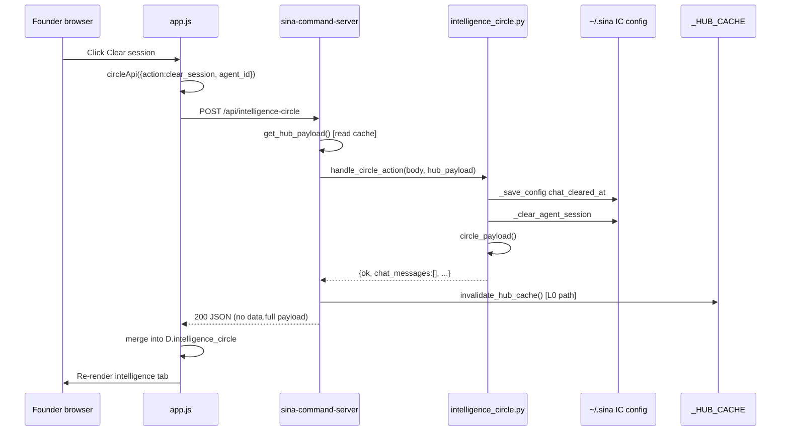
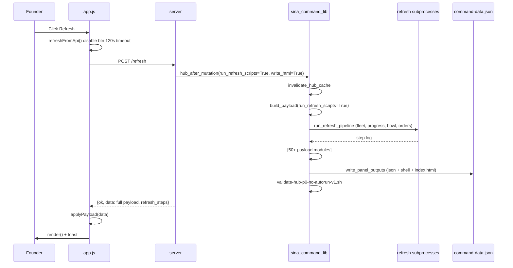

# ACTION_TRACE.md

Complete traces from UI action → server → disk → response.

---

## 1. Clear Session (Intelligence tab)



**Disk writes:** `intelligence-circle-config.json`, session JSON cleared  
**Panel rebuild:** No (L0)  
**Typical latency:** <1s (after 2026-06-10 L0 fix)

---

## 2. Refresh (founder button)



**Disk writes:** PROGRAM_PROGRESS, bowl, MASTER_ORDERS, command-data.json, shell, index.html  
**Typical latency:** 60–230s

---

## 3. Select Agent (Intelligence roster)

```
Click agent row [data-live-agent]
  → circleApi({ action: "select_agent", agent_id })
  → POST /api/intelligence-circle
  → handle_circle_action → _set selected_live_agent in config
  → circle_payload()
  → invalidate_hub_cache() [L0]
  → UI updates selected_live_agent in D
```

---

## 4. Chat (Intelligence — dry run)

```
Type message + Send
  → circleApi({ action: "chat", message, agent_id, inject_cursor: false })
  → talk_to_live_agent()
       → append to session JSON
       → inject_skipped: true (no Cursor inject)
  → [L0] invalidate_hub_cache if inject_skipped
  → Returns chat_messages in response
  → UI renders thread
```

---

## 5. Hub auto-sync (background — no founder click)

```
hubAutoSync({ silent: true })
  → fetch GET /api/hub-sync
  → build_payload(run_refresh_scripts=False)  [IN REQUEST THREAD]
  → applyPayload(json.data) if present
  → NO disk write
```

**Note:** Still expensive — builds full payload in memory on every poll.

---

## 6. Task close (todo done)

```
POST /todo/done {id}
  → mark_todo_done() → PROGRAM_PROGRESS.json write
  → hub_after_mutation(run_refresh_scripts=True)
  → full refresh pipeline + panel write
```

---

## 7. Goal1 STOP / FREEZE (factory)

```
POST /api/action { id: "founder-factory-stop" } or branch
  → run_branch_action()
  → factory_control_v1.freeze() / stop scripts
  → ~/.sina kill_flag + stop receipt
  → hub_after_mutation() on some branches
  → UI shows FROZEN banner on next payload
```

---

## 8. Resume drain (founder-gated)

```
Founder phrase → factory_control_v1.resume --max-turns 1
  → write_resume_token to ~/.sina
  → spawn gate allows one bounded drain turn
  → Does NOT auto-call hub_after_mutation unless via branch action
```

---

## 9. Advisor track decision click

```
POST /api/founder-advisor-discussion { action: update_decision, ... }
  → founder_advisor_discussion_v1.handle_action
  → write ~/.sina/founder-advisor-discussion-v1.json
  → hub_after_mutation()
  → full panel rebuild
```

---

## 10. Agent scoreboard verify

```
POST /api/agent-scoreboard { action: verify, agent_id }
  → handle_scoreboard_action
  → write scoreboard state
  → hub_after_mutation()
  → full panel rebuild
```

---

## Action → rebuild tier matrix

| Action | Rebuild tier |
|--------|--------------|
| Clear session | T0 |
| Select agent | T0 |
| Dry chat | T0 |
| Real chat (inject) | T2 |
| Refresh button | T3 |
| Todo done | T3 |
| Most POST /api/* mutations | T2 |
| hub-sync poll | T1 (in-memory build only) |
| GET /api/intelligence-circle | T1 if cache miss |
