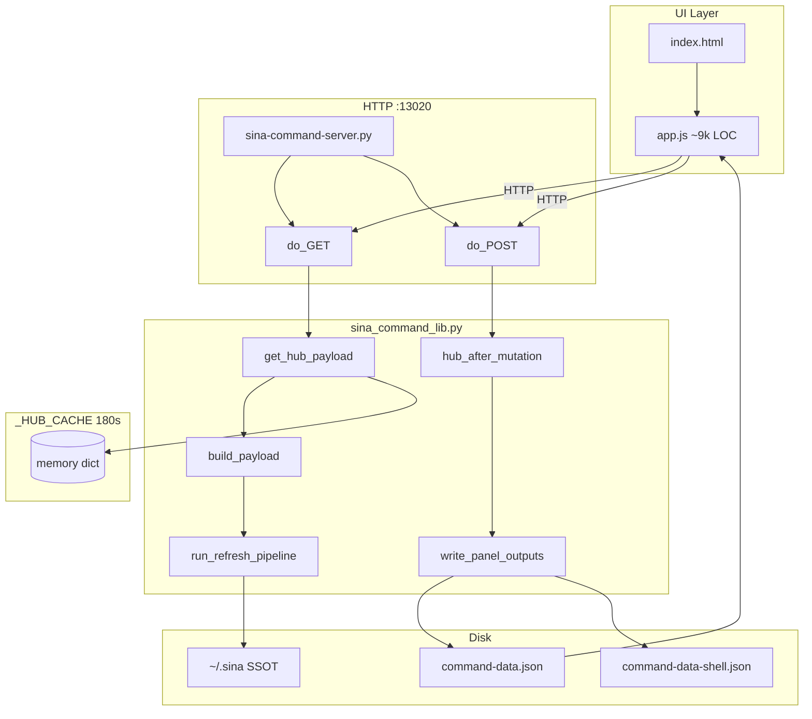

# DEPENDENCY_GRAPH.md

Vertical dependency stack for the Agentic OS Control Panel Hub.

## Layer diagram (Mermaid)



Source file: [DEPENDENCY_GRAPH.mmd](./DEPENDENCY_GRAPH.mmd) (full graph with modules, validators, workers).

## Dependency direction

```
UI (app.js)
  ↓ fetch GET/POST
API (SinaCommandHandler path router)
  ↓ module handlers
Builders (build_payload, *_payload functions)
  ↓ merge into dict
Cache (_HUB_CACHE via get_hub_payload)
  ↓ on mutation miss
Validators (AS-01 post-mutation, CI validators on strict build)
  ↓ gate write
Disk (command-data.json, shell, SSOT files, index.html)
  ↓ read on boot / shell load
Refresh (run_refresh_pipeline subprocesses)
  ↓ updates SSOT before rebuild
Worker (goal1 batch, brain loop, autorun kick)
  ↓ subprocess / background thread
Queue (factory-now, plan-registry, FREEZE)
  ↓ embedded in payload modules
Panel (JSON artifacts consumed by UI)
  ↓
Response (JSON to browser)
```

## Key edges

| From | To | Relationship |
|------|-----|--------------|
| `app.js` | `/command-data-shell.json` | Boot — light payload |
| `app.js` | `/command-data.json` | Lazy full load |
| `app.js` | `POST /refresh` | Founder refresh |
| `app.js` | `GET /api/hub-sync` | Background sync (expensive) |
| `do_POST` success | `hub_after_mutation` | Default mutation coupling |
| `hub_after_mutation` | `write_panel_outputs` | Always writes disk |
| `build_payload` | ~50 `*_payload()` | Monolithic assembly |
| `run_refresh_pipeline` | 4 subprocess scripts | External SSOT refresh |
| `warm_hub_cache_from_disk` | `command-data.json` | Server boot cache warm |

## Artifacts

| File | Format |
|------|--------|
| `DEPENDENCY_GRAPH.mmd` | Mermaid source (full) |
| `DEPENDENCY_GRAPH.svg` | Rendered SVG (if mermaid-cli available) |
| `DEPENDENCY_GRAPH.png` | Rendered PNG (if mermaid-cli available) |

## Render instructions

```bash
cd architecture_audit
npx @mermaid-js/mermaid-cli -i DEPENDENCY_GRAPH.mmd -o DEPENDENCY_GRAPH.svg
npx @mermaid-js/mermaid-cli -i DEPENDENCY_GRAPH.mmd -o DEPENDENCY_GRAPH.png -b transparent
```
