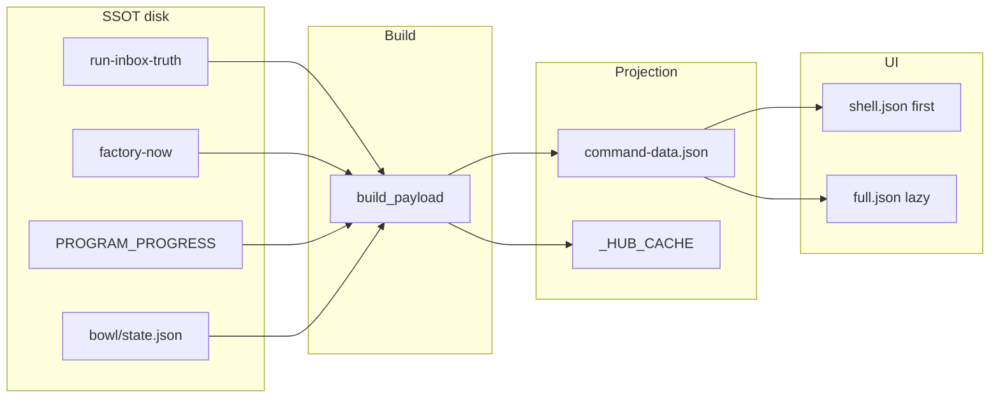

# STATE_MAP.md

## State taxonomy

| Class | Examples | Persistence |
|-------|----------|-------------|
| **SSOT (execution)** | `run-inbox-disk-truth-v1.json`, `factory-now-v1.json` | `~/.sina/` |
| **SSOT (progress)** | `PROGRAM_PROGRESS.json`, `sina-bowl/state.json` | Repo |
| **Projection (hub)** | `command-data.json` | Derived, rewritten often |
| **Cache (process)** | `_HUB_CACHE` | RAM, 180s TTL |
| **Module state** | intelligence-circle sessions, prompt-queue | `~/.sina/` per module |
| **Registry** | `REGISTRY.json` (1000 prompts) | Repo |

---

## Hub projection (derived — NOT SSOT)

### command-data.json

| Field | Owner | Readers | Writers | Invalidator | Dependencies |
|-------|-------|---------|---------|-------------|--------------|
| Full hub JSON | `build_payload` | UI `loadCommandDataFull`, audits | `write_panel_outputs`, `hub_after_mutation` | `invalidate_hub_cache` | All SSOT below |

### command-data-shell.json

| Field | Owner | Readers | Writers | Invalidator | Dependencies |
|-------|-------|---------|---------|-------------|--------------|
| Shell subset | `build_shell_payload` | UI first paint, E2E heal | `write_panel_outputs` | same | Strips 40+ `HEAVY_PAYLOAD_KEYS` |

### _HUB_CACHE (in-memory)

| Field | Owner | Readers | Writers | Invalidator | Persistence |
|-------|-------|---------|---------|-------------|-------------|
| Cached payload | `sina_command_lib` | `get_hub_payload`, all GET /api/state | `write_panel_outputs`, `warm_hub_cache_from_disk` | `invalidate_hub_cache` | None (180s TTL) |

---

## Factory / FREEZE state

| State | Path | Owner | Readers | Writers | Invalidator |
|-------|------|-------|---------|---------|-------------|
| factory-now | `~/.sina/factory-now-v1.json` | `factory_control_v1` | `build_payload`, goal1, pick lib | `rebuild_factory_now()` | freeze/resume/stop |
| factory-mode | `~/.sina/factory-mode-v1.json` | `factory_control_v1` | spawn gate | `_set_mode_file()` | freeze/resume |
| kill_flag | `~/.sina/auto-run-disabled-v1.flag` | `factory_control_v1` | drain gate | `freeze()`, stop receipt | resume |
| stop receipt | `~/.sina/founder-stop-receipt-v1.json` | `factory_control_v1` | hub banner | `write_stop_receipt()` | ASF clear |
| resume token | `~/.sina/founder-resume-drain-v1.json` | `factory_control_v1` | bounded drain | `write_resume_token()` | TTL expiry |

**Hub projection:** `_apply_factory_freeze_state()` overlays `command_center.founder.factory_state`, hides START button, sets tab hints.

---

## Queue state

| State | Path | Owner | Readers | Writers | Invalidator |
|-------|------|-------|---------|---------|-------------|
| queue_sa (disk truth) | `run-inbox-disk-truth-v1.json` | `run_inbox_disk_truth_v1` | `queue_sa_pick_lib`, factory-now | `write_truth()`, drain | new pick |
| healthy queue items | `healthy-queue-30-active.json` | `healthy_queue_ssot_lib` | drain, hub queue card | queue scripts | phase heal |
| queue cursor | `healthy-queue-state-v1.json` | `healthy_queue_ssot_lib` | drain advance | `advance_healthy_queue()` | drain |
| sourcea_sa_queue (hub key) | *derived in payload* | `sourcea_sa_queue_payload` | UI queue tab | `sync_sa_queue_into_payload` | each rebuild |
| REGISTRY | `brain-os/.../REGISTRY.json` | registry tooling | pick, goal-progress | closeout, worker | manual |

**Dual-pick law:** `queue_sa_from_disk()` reads truth → factory-now → registry phase-first fallback.

---

## Bowl / progress state

| State | Path | Owner | Readers | Writers |
|-------|------|-------|---------|---------|
| PROGRAM_PROGRESS | `PROGRAM_PROGRESS.json` | `update-program-progress.py` | `build_payload`, bowl | refresh pipeline, `mark_todo_done` |
| Bowl state | `sina-bowl/state.json` | `build-sina-daily-bowl.py` | `build_payload` | refresh pipeline |
| MASTER_ORDERS | `sina-bowl/MASTER_ORDERS.json` | `export-master-orders-json.py` | `build_payload` | refresh pipeline |
| DAILY_BOWL.md | `sina-bowl/DAILY_BOWL.md` | bowl builder | founder read | bowl builder |

---

## Goal / worker state

| State | Path | Readers (hub) | Writers |
|-------|------|---------------|---------|
| goal-progress cache | `~/.sina/goal-progress-v1.json` | validators (not hub build) | `goal-progress-v1.py` |
| goal1 broker | `~/.sina/goal1-lane-broker-v1.json` | `goal1_auto_run_payload` | broker scripts |
| executor lock | `~/.sina/brain-executor-lock-v1.json` | goal1 payload | drain/autorun |
| worker inbox | `~/.sina/worker-prompt-inbox-v1.json` | `inbox_status()` | worker inject |
| validation lock | `~/.sina/factory-validation-lock-v1.json` | strict build | panel build |

---

## Intelligence circle state

| State | Path | Owner | Writers |
|-------|------|-------|---------|
| IC config | `~/.sina/intelligence-circle-config.json` | `intelligence_circle` | clear_session, chat, select |
| Sessions | `live-agent-session-*.json` | `intelligence_circle` | talk_to_live_agent |
| Comms | `~/.sina/live-agent-comms.jsonl` | `intelligence_circle` | append_comms |
| Maintainer outbox | `live-agent-maintainer-outbox.md` | `intelligence_circle` | agent_reply |

---

## Prompt / advisor state

| State | Path | Owner |
|-------|------|-------|
| prompt-queue | `~/.sina/prompt-queue.json` | `prompt_queue.py` |
| founder-advisor-discussion | `~/.sina/founder-advisor-discussion-v1.json` | `founder_advisor_discussion_v1.py` |
| founder notes | module JSON under repo/`~/.sina` | `founder_notes.py` |

---

## Scoreboard / agent state

| State | Location | Module |
|-------|----------|--------|
| Session reports | per-agent workspace dirs | `agent_scoreboard.py` |
| Agent workspaces | `~/.cursor/...` registry | `agent_private_workspaces.py` |
| Vault/mirror | per-agent files | `agent_workspace_vault.py`, `agent_workspace_mirror.py` |

---

## Refresh state

| State | Where | Meaning |
|-------|-------|---------|
| `built_at` | payload root | ISO timestamp of last `build_payload` |
| `refresh_log` | payload | Steps from `run_refresh_pipeline` |
| `panel_build_stale.flag` | `~/.sina/` | Set when startup panel build fails |

---

## Command state

| State | Where |
|-------|-------|
| `founder_actions` | embedded in payload from `founder_actions_grouped()` |
| `branches_registry` | branch definitions for `/api/action` |
| `goal1_auto_run` / `goal1_loop` | subprocess-assembled in `goal1_auto_run_payload()` |

---

## Dependency diagram (state flow)

