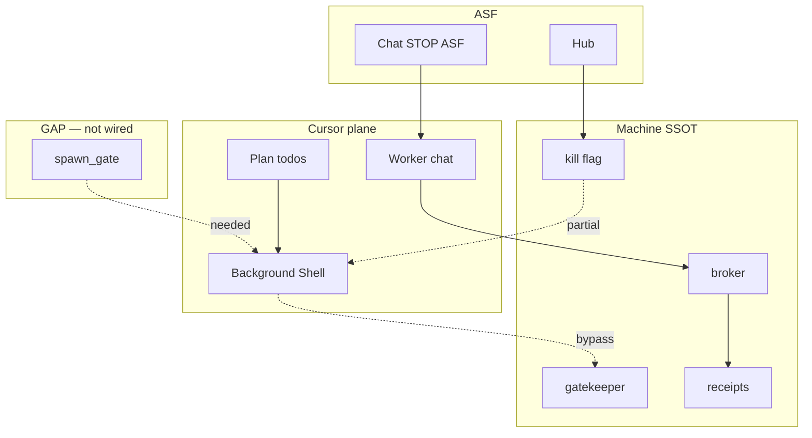

> **ARCHIVE ONLY — not canonical law.** Authority: `SINA_AUTHORITY_INDEX_MAP_LOCKED_v1.md` · `brain-os/incidents/AGENT_INCIDENTS_REGISTRY_LOCKED_v1.md`.

# SourceA — Machine enforcement registry + agent interaction map

**Saved:** 2026-06-10T12:00:00Z · **Retrofit:** doc-datetime-law batch retrofit
**Version:** 1.0 — FINAL LOCKED  
**Date:** 2026-06-10  
**Parent index:** `SOURCEA_MASTER_INDEX_ALL_SUBJECTS_LOCKED_v1.md`

---

## 1. Enforcement strength taxonomy

| Strength | Survives Cursor plan todos? | Example |
|----------|----------------------------|---------|
| **HARD** | Usually yes | closeout_gate · kill flag in dispatcher |
| **SOFT** | Sometimes | gatekeeper · find_critical_bugs |
| **PROJECTION** | No if bypass writes elsewhere | brain_sync · monitor |
| **CHAT-ONLY** | No | STOP lexicon · ASF_ORDER essays |

---

## 2. Registry by layer

### Layer A — Founder sovereignty
- `validate-founder-docs-no-terminal-v1.sh` — HARD CI
- `auto-run-disabled-v1.flag` — PARTIAL (not autodrain spawn)
- `stop_goal1_auto_run_v1.py` — HARD when run
- `validate-founder-agentic-commercial-policy-v1.sh` — HARD CI

### Layer B — Situation · engine
- `gatekeeper_v1.py` — SOFT
- `operating_mode_enforce_v1.py` — SOFT
- `execution_law_enforce_v1.py` — SOFT
- `prompt_feasibility_gate.py` — HARD inject
- `paid_engine_gate_v1.py` — HARD when flag

### Layer C — Factory proof
- `validate-registry-honest-gate-v1.sh` — HARD CI
- `closeout_gate_v1.py` — HARD path
- `worker_factory_evidence_gate_v1.py` — SOFT
- `goal1_lane_broker` — HARD submit
- `validate-healthy-pack-bind-v1.sh` — HARD when run

### Layer D — Projection
- `validate-monitor-honesty-v1.sh` — HARD CI
- `validate-brain-snapshot-sync-v1.sh` — HARD CI
- `validate-brain-sync-hooks-v1.sh` — HARD CI
- `brain_sync_lib_v1.py` — PROJECTION

### Layer E — Hub · ENFORCE
- Hub ENFORCE — HARD for OpenRouter planner
- **Cursor IDE — BYPASS** per `ENFORCE_BYPASS_MAP_LOCKED_v1.md`

### Layer F — Session · Cursor
- `cursor_entry_gate.py` — SOFT
- `cursor_agent_self_audit.py` — SOFT
- `factory_validation_lock_v1.py` — HARD E2E

### Layer G — Conduct (GAP)
- Audit prompt v2 — CHAT only
- **factory_spawn_gate** — NOT SHIPPED (P0)
- **factory-now-v1** — NOT SHIPPED (P0)

---

## 3. Agent interaction matrix

| Actor | Touches | HARD gates | Typical bypass | Incident |
|-------|---------|------------|----------------|----------|
| ASF Founder | Hub · chat | Stop API | — | — |
| Brain | Route · status | session soft | Shell · overclaim | 014·004 |
| Worker | Build · drain | closeout · broker | autodrain spawn | 006·007·015 |
| Maintainer | Validators · ship | CI critical | critic paste | 005a |
| GPT/Claude | Chat advise | none | stealth orders | 005a |
| Cursor plan | Todo momentum | **none** | > STOP | 015 |
| Cursor Shell | Background | partial flag | gatekeeper | 006·015 |
| Broker | Submit chain | STALE reject | — | 007 |
| Monitor | Display | honesty CI | stale brain | 014 |

---

## 4. Master flow (mermaid)

---

## 5. Incident → missing gate

| Incident | Missing HARD gate |
|----------|-------------------|
| 006 | closeout_gate (now yes) |
| 007 | spawn + evidence |
| 013 | factory-now |
| 014 | brain_sync (projection) |
| 015 | spawn_gate + lexicon |

---

## 6. Real solution (four invariants)

1. **ONE mode** — FREEZE default  
2. **ONE now** — factory-now-v1.json  
3. **ONE visibility** — receipt ≤60s or auto-freeze  
4. **ONE spawn gate** — drain_spawn_allowed()

**ENFORCE honesty:** Cursor Shell is outside airlock until spawn gate ships — same class as Cursor bypassing hub OpenRouter ENFORCE.

---

**END**
