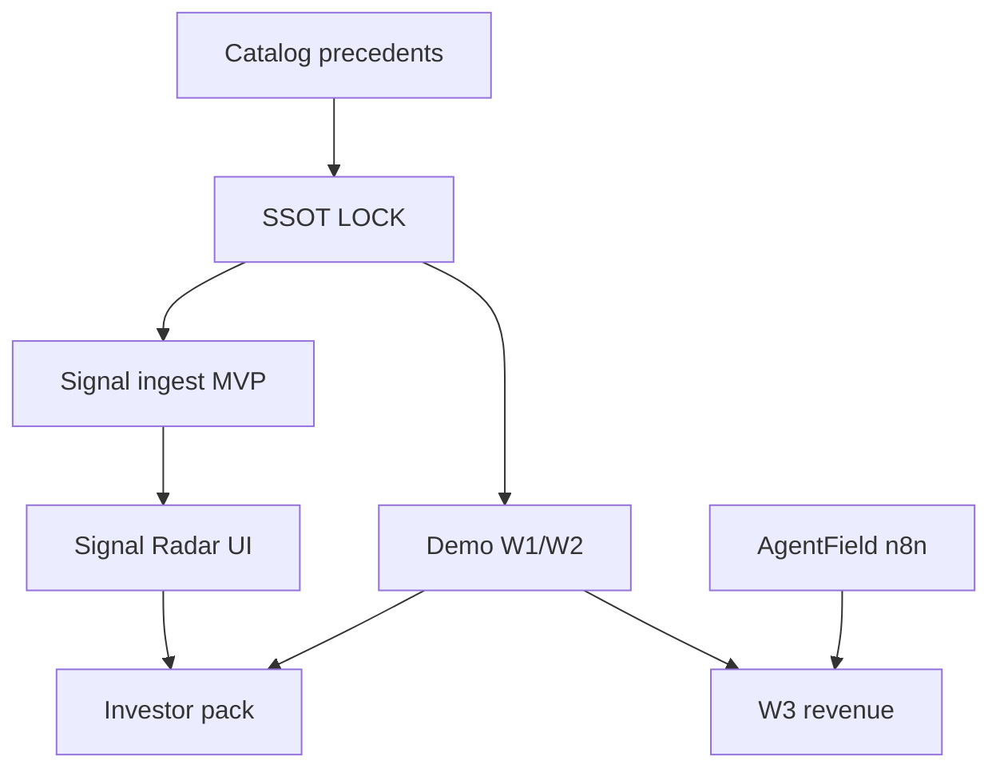

# Agentic Reference Platform — Blueprint (v1)

**Saved:** 2026-06-12T12:00:00Z · **Retrofit:** doc-datetime-law batch retrofit
**Status:** Nest (implementation arrangement — **not law**)  
**SSOT:** `AGENTIC_REFERENCE_PLATFORM_SSOT_DRAFT_v1.md`  
**Catalog:** `AGENTIC_REFERENCE_PLATFORM_VC_SIGNAL_CATALOG_v1.md`  
**Rule:** Blueprint arranges **how** — does not restate binding rules (Foundation Guide §5)

---

## Phase map (egg hatch order)

```text
1. Catalog rows complete (precedent)     ← DONE this attachment
2. SSOT DRAFT → ASF PICK → LOCKED        ← founder gate
3. Blueprint phases (this doc)           ← parallel planning OK
4. Validators + spine receipts           ← hatch
5. Hub projection cards                  ← pointer only
```

---

## Phase 0 — Foundation (Week 0)

| Task | Owner | Output |
|------|-------|--------|
| ASF answers Q1–Q8 | ASF | Pick card in Command |
| Register authority row | Maintainer | index map row |
| Copy catalog to knowledge-library | Research | `fields/vc-signal/` pointer |

---

## Phase 1 — W1/W2 enforcement (do not slip)

| Task | Command / path | Done when |
|------|----------------|-----------|
| Film demo | `INVESTOR_DEMO_RUNBOOK_v1.md` | video logged |
| Validator suite | `validate-demo-enforcement-v1.sh` | PASS |
| Tamper proof | `DEMO_BYPASS_AUDIT_v1.md` | FAIL on bypass |

**Reject:** Rebuilding commit_intent from Master Plan stale weeks.

---

## Phase 2 — Signal ingest MVP (Week 3–4)

| Component | Build | Precedent |
|-----------|-------|-----------|
| Ingest adapter | n8n webhook → spine JSONL | n8n commercial |
| Source pack v1 | Crunchbase OR free tier + manual CSV | Crunchbase class |
| SR-01 scorer | Rule-based lead-investor tag | Fundverse pattern |
| Receipt | `signal-ingest-v1.json` | SourceA spine |

**Validator:** `validate-signal-ingest-v1.sh` (create on ship)

---

## Phase 3 — Signal Radar UI (Week 5–6)

| Screen | Data | Label |
|--------|------|-------|
| Radar dashboard | SR-01..05 aggregates | RT or LAG |
| Company card | Licensed fields only | source badge |
| Compare table | Catalog §G | static pointer |

**Hub:** one-tap "Signal Radar" card — **Maintainer 2** lane (not this chat).

---

## Phase 4 — AgentField glue (Week 7–10)

| Workflow | Tool | Schedule |
|----------|------|----------|
| LinkedIn queue | Buffer-class + agent draft | 24/7 cron |
| CRM sync | Zapier → Affinity or minimal CSV | daily |
| Outreach | Apollo-class list → agent send | controlled — no founder dial |
| Portfolio site refresh | Make/n8n | weekly |

**Receipt:** each run → spine + `agentfield-run-v1.jsonl`

---

## Phase 5 — W3 commercial (parallel from Week 1)

| SKU | Offer | Proof |
|-----|-------|-------|
| NF-001 | Governance pilot | LOI or ≥CAD 2K |
| TF-001 | Trust field pilot | same |

**Agentic only** per `FOUNDER_AGENTIC_COMMERCIAL_AND_NO_CURSOR_AUTORUN_LOCKED_v1.md`

---

## Phase 6 — Investor pack (Week 8–12)

| Asset | Source |
|-------|--------|
| One-pager | `AGENTIC_REFERENCE_PLATFORM_ONE_PAGER_v1.md` |
| White paper | `AGENTIC_REFERENCE_PLATFORM_WHITE_PAPER_v1.md` |
| Landscape cite | Presenc May 2026 + catalog §F |
| Demo link | W1 film |

---

## Dependency graph



---

## Roles

| Role | Scope |
|------|-------|
| ASF | PICK · W3 approve · no Terminal |
| Brain | Route · classify critic · this SSOT package |
| Worker | enf-* · validators · signal ingest scripts |
| Maintainer 2 | Hub Signal Radar card · demo button |
| SinaaiDataBase | Hub/panel code only |

---

## Commands appendix (executor)

```bash
# Demo proof (existing)
./scripts/validate-demo-enforcement-v1.sh

# Universe (existing)
./scripts/validate-universe-invariants-v1.sh

# Future — create on Phase 2 ship
# ./scripts/validate-signal-ingest-v1.sh
```

---

*End blueprint*
