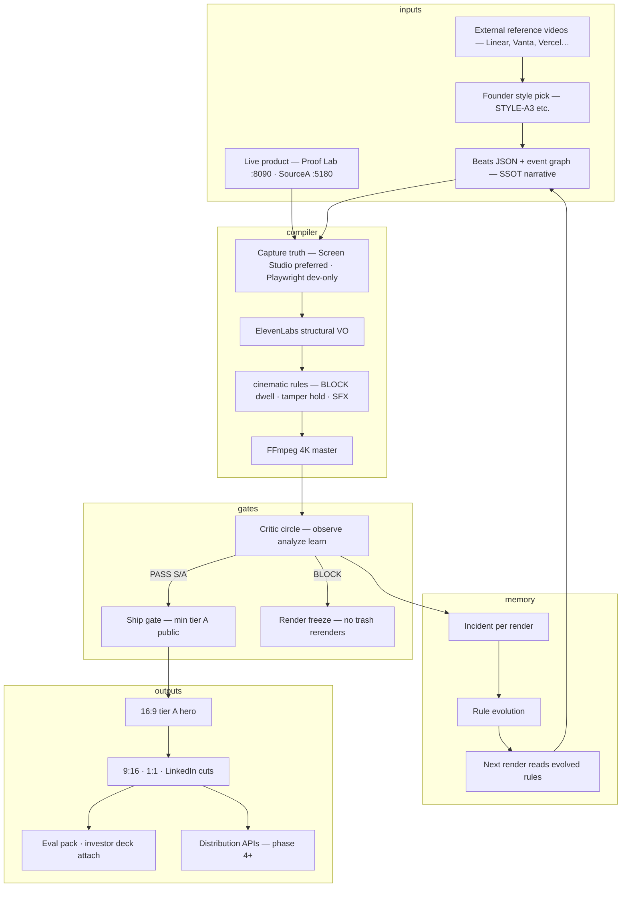

# Cinematic Film Factory — Big Picture · Full Analysis · Full Roadmap · Prompts

**Saved:** 2026-06-15T12:00:00Z · **Retrofit:** doc-datetime-law batch retrofit
**Schema:** `cinematic-film-factory-big-picture-v1`  
**Date:** 2026-06-15  
**Audience:** Founder + SourceA Worker + Brain  
**Law:** References are inputs. Foundation before workers. Workers before investors. Investors before sell.  
**Machine SSOT:** `data/commercial-film-factory-phases-v1.json` · `data/commercial-film-routing-v1.json` · `data/cinematic-film-factory-v1.json`

---

## Table of contents

1. [The picture you don't know yet](#1-the-picture-you-dont-know-yet)
2. [What we are NOT building](#2-what-we-are-not-building)
3. [Honest current state](#3-honest-current-state)
4. [Full architecture (7 layers)](#4-full-architecture-7-layers)
5. [Scale ladder: 100 → 1000](#5-scale-ladder-100--1000)
6. [Full roadmap (Phases 0–10)](#6-full-roadmap-phases-010)
7. [Sequence law: Reference → Foundation → Workers → Investors → Sell](#7-sequence-law)
8. [Step breakdown (120 steps)](#8-step-breakdown-120-steps)
9. [Milestone gates (PASS/FAIL)](#9-milestone-gates)
10. [Lane × tier matrix (full)](#10-lane--tier-matrix)
11. [Reference system (external only)](#11-reference-system)
12. [Identity & trust levels](#12-identity--trust-levels)
13. [Disk index (every file that matters)](#13-disk-index)
14. [Ready prompts (copy-paste)](#14-ready-prompts-copy-paste)
15. [What NOT to do (traps)](#15-what-not-to-do)
16. [One-line law](#16-one-line-law)

---

## 1. The picture you don't know yet

You are not building a **video editor** or a **marketing agency**. You are building a **cinematic trust compiler** — a factory that turns **live system behavior** (Proof Lab, W1 player, real gates, real receipts) into **proof films** that enterprise buyers, investors, and regulators can trust — then **routes** those films to the right surface (homepage, LinkedIn, eval pack, outbound) without inventing fiction.



### The mental model shift

| Old thinking | Factory thinking |
|--------------|------------------|
| "Make a video" | Compile system behavior → film |
| "Try another render" | Observe → analyze → one fix → re-ingest |
| "Our MP4 is the reference" | External outputs are references; our files are **subjects** |
| "Playwright is good enough" | Playwright = tier C dev capture only; public hero = Screen Studio S/A |
| "Ship when ffmpeg finishes" | Ship when **critic circle PASS** + ship gate PASS |
| "More references first" | References enough; **harden pipeline** first |
| "Invite workers now" | Foundation T0–T2 PASS first |
| "Pitch investors now" | One S/A hero + eval pack first |
| "Sell outbound now" | TrustField tier C tests after hero truth |

### End state (Level 1000 vision)

One command (`make_film` or n8n webhook) triggers:

1. Read founder style pick + shot brief  
2. Verify live product surfaces  
3. Capture truth (Screen Studio ingest or approved capture path)  
4. Apply cinematic rules engine (BLOCK dwell, tamper hold, logo wall)  
5. Structural VO + burned captions  
6. Critic circle scores vs external reference spec  
7. On PASS: emit master + 9:16 + LinkedIn + caption pack  
8. Route to lane policy (WitnessBC = institutional only; Fitness = volume OK)  
9. Record incident; evolve rules; never repeat same failure class  
10. Optional: publish APIs · eval pack attach · investor one-pager sync  

**Product:** Trust logged, visible in motion — not hype reels with fake UI.

---

## 2. What we are NOT building

| Trap | Verdict |
|------|---------|
| Second video repo (`witness-film/` greenfield) | ❌ Extend `cinematic-film-factory/` + existing scripts |
| ChatGPT as hero director every run | ❌ Beats SSOT + optional OpenRouter hook A/B in Phase 3 only |
| HeyGen avatar on WitnessBC tier A | ❌ Path A lock — product-led trust |
| CapCut AI fake product motion for GRC hero | ❌ Tier C fitness/social only |
| Auto TikTok publish before critic PASS | ❌ Phase 4 after Level 500 |
| n8n replacing shell entrypoints | ❌ n8n wraps existing bash/python — no duplicate compiler |
| Remotion as hero capture | ❌ Title cards + prospect reels only |
| Grade inflation (receipt A+ on Playwright C) | ❌ Critic circle blocks |

---

## 3. Honest current state

**Date probe:** 2026-06-15

| Item | Truth |
|------|-------|
| Deterministic compiler | ✅ Built — `commercial_short_film_v1.py` + `cinematic-film-factory/compiler.py` |
| Validators (7 film validators) | ✅ PASS |
| Critic circle | 🔴 **BLOCK** — correct; 0/6 public hero assets approved |
| Render freeze | 🔴 ON — `~/.sina/commercial-film-render-frozen-v1.flag` |
| Screen Studio ingest | ✅ Wired — waiting on `~/Desktop/SourceA-Commercial-Master.mov` |
| Founder style pick | ✅ STYLE-A3 (Vercel one-moment) + shot brief logged |
| Reference catalog | ✅ 60+ URLs — `VIDEO_REFERENCE_CATALOG_FULL_2026-06-15_v1.md` |
| Reference → compile enforcement | 🟡 Partial — pick logged; preflight not enforced yet |
| Memory loop | 🟡 v1 shipped — `film_memory.py`; not fully closed |
| n8n film wire | 🟡 P1 — ingest workflow + glue runner |
| Multi-format export | 🟡 Draft beats only |
| Distribution APIs | ⬜ Phase 4 — not started |
| Workers on film factory | ⬜ Deferred until Level 200 |
| Investor / sell motion | ⬜ Deferred until Level 500 |

**Current level estimate: ~85 / 1000** — engine exists; truth gates work; no S/A public hero yet.

---

## 4. Full architecture (7 layers)

### Layer 1 — Truth source

| Source | Tier | Use |
|--------|------|-----|
| Screen Studio 4K master | S/A | Public hero |
| Playwright + W1 player | C | Dev preview · sync test |
| Remotion TerminalMock | F | Never trust hero |
| HeyGen avatar | C | LinkedIn volume · not GRC hero |

**Ports:** Proof Lab `:8090` · SourceA landing `:5180` · Mac Guard `:13024`

### Layer 2 — Narrative SSOT

| Artifact | Path |
|----------|------|
| Routing | `data/commercial-film-routing-v1.json` |
| SourceA 32s beats | `data/commercial-short-film-beats-v1.json` |
| WitnessBC hero | `data/witnessbc-commercial-film-beats-v1.json` |
| WitnessBC v5 cinematic | `data/witnessbc-commercial-film-beats-v5.json` |
| Social 30s | `data/witnessbc-commercial-social-30s-beats-v1.json` |
| Style pick | `data/reference-board-v1.json` |
| Shot brief | `archive/.../STYLE_A3_SOURCEA_SHOT_MATCH_BRIEF_2026-06-15_v1.md` |
| Quality bar | `data/video-quality-bar-v1.json` |
| Cinematic rules | `data/cinematic-rules-engine-v1.json` |

### Layer 3 — Compiler stack

```text
capture → beats_timing + w1_sequence → ElevenLabs /with-timestamps
→ ASS/SRT captions → cinematic_finish + SFX → FFmpeg 4K → receipt
```

**Entrypoints:** `witnessbc-commercial-film.sh` · `sourcea-commercial-film.sh` · `witness-film-build.sh` · `sourcea-film-build.sh`

### Layer 4 — Gates (foundation core)

| Gate | Script |
|------|--------|
| Critic circle | `commercial_film_critic_circle_v1.py` |
| Render guard | `commercial_film_render_guard_v1.py` (R1–R16, RAM, Mac Guard) |
| Ship gate | `commercial_film_ship_gate_v1.py` |
| Sync validator | `validate-commercial-film-sync-v1.sh` |
| Render rules | `validate-commercial-film-render-rules-v1.sh` |

### Layer 5 — Observe → learn

| Component | Path |
|-----------|------|
| Critic law | `data/commercial-film-critic-circle-v1.json` |
| Film memory | `cinematic-film-factory/film_memory.py` |
| Incidents | `~/.sina/cinematic-film-memory-incidents-v1.jsonl` |
| Evolved rules | `~/.sina/cinematic-film-rules-evolved-v1.json` |

### Layer 6 — Orchestration (Phase 3+)

| Component | Status |
|-----------|--------|
| n8n workflows | `wf-film-screen-studio-ingest-v1` · compile · critic |
| Glue runner | `n8n_glue_runner_v1.py film-ingest|film-critic|film-ship-gate` |
| OpenAI director | Routed — not hot path |
| OpenRouter variations | Routed — hook/CTA A/B only |

### Layer 7 — Distribution (Phase 4+)

Per-run bundle: `final.mp4` · `final_9x16.mp4` · `caption.txt` · `hashtags.json` · `thumbnail.png`  
APIs: YouTube · LinkedIn · Instagram · TikTok · X (lane policy gated)

---

## 5. Scale ladder: 100 → 1000

### Level 100 — Foundation truth (YOU ARE HERE → target next 4 weeks)

**Definition:** One lane · one S/A hero · critic PASS · ship gate PASS · freeze lifted for that lane only.

| # | Capability | Done when |
|---|------------|-----------|
| 1 | Critic BLOCK enforced | ✅ |
| 2 | Render freeze ON | ✅ |
| 3 | Validators green | ✅ |
| 4 | Reference catalog + style pick | ✅ STYLE-A3 |
| 5 | Shot brief exists | ✅ |
| 6 | Screen Studio master ingested | ⬜ |
| 7 | Critic S/A PASS on ingested master | ⬜ |
| 8 | Site embed from master only | ⬜ |
| 9 | Reference preflight enforced (T1) | ⬜ |
| 10 | Phase doc honesty (no false A+) | ⬜ |

**Unlocks:** Internal confidence · one public hero slot · stop Playwright embarrassment.

---

### Level 200 — Factory hardened (multi-lane · memory closed)

**Definition:** SourceA + WitnessBC both S/A or A · memory loop closes · no repeat failure class · T1–T2 complete.

| # | Capability |
|---|------------|
| 11–20 | WitnessBC Screen Studio master + ingest |
| 21–30 | T2: incident → rule evolution → next render reads patch |
| 31–40 | Multi-format from ONE master (16:9 → 9:16 LinkedIn) |
| 41–50 | TrustField draft hero (tier C avatar OK) |
| 51–60 | All lane beats validated · routing SSOT complete |
| 61–70 | `validate-*` in CI pre-ship |
| 71–80 | Film factory Worker INBOX tasks wired |
| 81–90 | n8n end-to-end: ingest → critic → receipt (no Cursor) |
| 91–100 | **Invite workers** — RUN INBOX film tasks only |

**Unlocks:** Worker chat can execute film factory without founder Terminal.

---

### Level 500 — Orchestration + eval ready (investors)

**Definition:** Headless factory run · eval pack attach · investor 30s + 5min cuts · OpenAI director optional layer.

| # | Capability |
|---|------------|
| 101–150 | OpenAI director → beats draft (human approve) |
| 151–200 | OpenRouter hook/CTA A/B (deterministic pick) |
| 201–250 | Docker/Railway playwright sidecar for headless |
| 251–300 | R2/S3 upload + CDN URL in receipt |
| 301–350 | Eval pack auto-attach (TrustField ENGINE-404 pattern) |
| 351–400 | Investor room 5min + 30s cuts from same master |
| 401–450 | Avatar pipeline LinkedIn anchor (10–20% human) |
| 451–500 | **Invite investors** — eval materials truth-backed |

**Unlocks:** Outbound eval with proof film that matches live product.

---

### Level 1000 — Commercial distribution factory (sell)

**Definition:** Publish APIs · lane routing · volume tier C · self-healing at scale · portfolio-wide.

| # | Capability |
|---|------------|
| 501–600 | Social publisher engine (caption + hashtag + thumb) |
| 601–700 | Lane publish policy enforced (WitnessBC ≠ TikTok spam) |
| 701–800 | Watch metrics → dropoff → incident → rule delta |
| 801–900 | Noetfield + Fitness volume lanes |
| 901–950 | Supabase/multi-agent memory |
| 951–1000 | **Sell** — TrustField outbound · demo booking · pilot CTA with tier-appropriate film |

**Unlocks:** Commercial motion without lying about product state.

---

## 6. Full roadmap (Phases 0–10)

| Phase | Name | Level | Status | Acceptance |
|-------|------|-------|--------|------------|
| **0** | Deterministic compiler | 0–85 | LIVE (tier C output) | MP4 + receipt from shell; validators PASS |
| **0b** | Reference + pick system | 85–95 | LIVE | Catalog + STYLE pick + shot brief |
| **1** | Foundation hardening T1–T2 | 95–200 | **IN PROGRESS** | Preflight · ingest S/A · memory loop closed |
| **2** | Cinematic finish v5 | 150–250 | Blocked by critic | v5 with sfx + dark frame · receipt v5 |
| **3** | Multi-format export | 200–350 | Draft | One master → 9:16 · 1:1 · LinkedIn |
| **4** | n8n control plane | 350–500 | P1 wired | Webhook → shell → receipt headless |
| **5** | Avatar / digital twin | 400–550 | v1 wired | LinkedIn tier C · not GRC hero |
| **6** | Eval + investor pack | 500–650 | Routed | Attach to eval · 5min + 30s cuts |
| **7** | Distribution APIs | 650–800 | Future | Publish bundle + lane policy |
| **8** | Film memory at scale | 800–900 | v1 local | Metrics → incidents → rules |
| **9** | Portfolio lanes live | 900–950 | Partial | TrustField · Noetfield · Fitness |
| **10** | Commercial sell loop | 950–1000 | Future | Outbound + demo + pilot CTA |

---

## 7. Sequence law

```text
1. REFERENCES     — catalog + founder pick (STYLE-A3) ✅ enough for now
2. FOUNDATION     — T0 gates · T1 preflight · T2 memory · ingest S/A  ← NOW
3. WORKERS        — RUN INBOX film tasks · no founder Terminal
4. INVESTORS      — eval pack · institutional cuts · 5min room
5. SELL           — TrustField outbound · tier C tests · volume lanes
```

**Violating order produces:** tier-C heroes in investor meetings · worker thrash · reference hoarding without compile.

---

## 8. Step breakdown (120 steps)

Steps are grouped; execute in order within group; do not skip gates.

### Group A — Truth gates (A01–A15) · Level 100

| Step | Action | Command / path |
|------|--------|----------------|
| A01 | Confirm critic BLOCK | `python3 scripts/commercial_film_critic_circle_v1.py --json` |
| A02 | Confirm freeze ON | `test -f ~/.sina/commercial-film-render-frozen-v1.flag` |
| A03 | Run all film validators | `bash scripts/validate-commercial-film-routing-v1.sh` (+ 6 others) |
| A04 | Read quality bar | `data/video-quality-bar-v1.json` |
| A05 | Read critic SSOT | `data/commercial-film-critic-circle-v1.json` |
| A06 | Fix phase doc inflation | Update `commercial-film-factory-phases-v1.json` hero claims |
| A07 | Wire reference preflight | Require `style_reference` in beats before hero compile |
| A08 | Wire shot brief check | Fail compile if `founder_pick` lane has no `match_brief` |
| A09 | Block Playwright public ship | Ship gate enforces `min_tier_public: A` |
| A10 | Mac Guard live before render | `commercial_film_render_guard_v1.py ram-check` |
| A11 | Single render lock | acquire/release on render guard |
| A12 | Sync validator on SourceA | `validate-commercial-film-sync-v1.sh` — fix BLOCK late warn |
| A13 | Receipt schema honesty | No A+ unless capture tier S/A |
| A14 | Document freeze lift procedure | critic PASS → unfreeze script |
| A15 | Gate receipt chain | critic → ship → site deploy |

### Group B — Reference → compile (B01–B15) · T1

| Step | Action |
|------|--------|
| B01 | Founder picks STYLE-ID (STYLE-A3 ✅) |
| B02 | Agent writes shot-for-shot brief |
| B03 | Brief linked in `reference-board-v1.json` |
| B04 | Brief linked in beats JSON |
| B05 | Install Screen Studio on Mac |
| B06 | Pre-flight URLs live (:5180 proof page) |
| B07 | Record 28–32s one-arc (Vercel pattern) |
| B08 | Export `~/Desktop/SourceA-Commercial-Master.mov` 4K |
| B09 | Run ingest | `python3 scripts/sourcea_commercial_film_ingest_master_v1.py --json` |
| B10 | Run critic post-ingest | `commercial_film_critic_circle_v1.py --json` |
| B11 | If PASS: run ship gate | `sourcea-commercial-film-ship.sh` |
| B12 | If PASS: lift freeze for sourcea lane only |
| B13 | Verify site embed | `SourceA-landing/green-unified/assets/commercial-short-demo.mp4` |
| B14 | Log incident if FAIL | `film_memory.record_incident` |
| B15 | One fix only — re-record, not Playwright rerender |

### Group C — WitnessBC lane (C01–C15) · Level 150

| Step | Action |
|------|--------|
| C01 | Pick trust reference (STYLE-B1 Vanta or T-001) |
| C02 | Write WitnessBC shot brief |
| C03 | Record Proof Lab :8090 Screen Studio master |
| C04 | Export `~/Desktop/WitnessBC-Commercial-Master.mov` |
| C05 | Ingest | `witnessbc_commercial_film_ingest_master_v1.py --json` |
| C06 | Critic PASS tier A |
| C07 | v5 cinematic finish on master (not Playwright) |
| C08 | Social 30s cut from same master |
| C09 | LinkedIn institutional caption burn |
| C10 | witnessbc-site asset update |
| C11 | Receipt v5 logged |
| C12 | Routing flip `cinematic_finish_v5` when PASS |
| C13 | Eval pack slot for WitnessBC |
| C14 | Block HeyGen on tier A validator |
| C15 | Document lane policy in routing SSOT |

### Group D — Memory loop (D01–D15) · T2 · Level 200

| Step | Action |
|------|--------|
| D01 | Every render → incident row |
| D02 | Incident fields: dropoff, confusion, trust_peak, next_fix |
| D03 | `evolve_rules_from_incident` patches rules JSON |
| D04 | Next compile reads evolved rules |
| D05 | Critic compares to external ref spec (bitrate, pacing) |
| D06 | Block repeat failure class (same incident hash) |
| D07 | Grade inflation detector in critic |
| D08 | Memory dashboard in Hub (future) |
| D09 | SQLite local store (optional) |
| D10 | Analyzer prompt for rule delta (OpenAI phase 3) |
| D11 | Human approve rule delta before SSOT write |
| D12 | Validator for evolved rules schema |
| D13 | Weekly memory review (founder 5 min) |
| D14 | Archive incidents > 90d |
| D15 | Close loop: PASS rate trending up |

### Group E — Multi-format (E01–E15) · Level 250

| Step | Action |
|------|--------|
| E01 | Define crop rules 16:9 → 9:16 |
| E02 | Script `commercial_film_multi_format_v1.py` |
| E03 | LinkedIn 45s cut from STYLE-C1 recipe |
| E04 | Burn captions all social cuts |
| E05 | Sound-off test pass |
| E06 | 1:1 crop for feed |
| E07 | Thumbnail generator |
| E08 | caption.txt + hashtags.json per cut |
| E09 | Same master MD5 in all receipts |
| E10 | Validator multi-format outputs |
| E11 | n8n workflow multi-export |
| E12 | TrustField tier C variant |
| E13 | Noetfield NF-001 cut |
| E14 | Fitness volume template |
| E15 | Document in phase 2 acceptance |

### Group F — Workers invite (F01–F15) · Level 200–300

| Step | Action |
|------|--------|
| F01 | Film factory INBOX task schema |
| F02 | Worker prompt: run validators only |
| F03 | Worker prompt: ingest when master exists |
| F04 | Worker prompt: critic read — never unfreeze alone |
| F05 | Worker prompt: no Playwright hero while freeze ON |
| F06 | sa-* tasks for A01–A15 checks |
| F07 | Hub Next steps film row |
| F08 | Receipt visible in Worker Hub |
| F09 | Fail-closed on missing style pick |
| F10 | Broker YAML film lane |
| F11 | Training: L1 from 100 Q&A doc |
| F12 | Operator cert: L2 exam |
| F13 | Judge cert before ship recommend |
| F14 | No second build chat |
| F15 | **Founder says: invite workers** |

### Group G — Investors (G01–G15) · Level 500

| Step | Action |
|------|--------|
| G01 | Eval pack film attach wire |
| G02 | 30s investor cut |
| G03 | 5min room cut (Temporal×Stripe pattern) |
| G04 | Master Human Asset 20–40s anchor |
| G05 | HeyGen LinkedIn only — not eval hero |
| G06 | Proof Lab live link in pack |
| G07 | Receipt + hash in eval PDF |
| G08 | Tier S/A only in investor materials |
| G09 | Canada credibility layer doc |
| G10 | OpenAI director draft beats (approve gate) |
| G11 | R2 CDN URL in pack |
| G12 | n8n headless eval refresh |
| G13 | Founder review 10 min |
| G14 | Block stale embed |
| G15 | **Founder says: investor ready** |

### Group H — Sell (H01–H15) · Level 1000

| Step | Action |
|------|--------|
| H01 | TrustField outbound tier C tests |
| H02 | Demo booking film attach |
| H03 | LinkedIn paid 15–30s (Black Camel patterns) |
| H04 | Publish API smoke test |
| H05 | Lane policy enforce |
| H06 | Volume Fitness lane |
| H07 | Metrics → dropoff → memory |
| H08 | A/B hook via OpenRouter |
| H09 | Pilot CTA in caption pack |
| H10 | Commercial agent wire |
| H11 | No synthetic trust hero in outbound |
| H12 | Debrief receipt per send |
| H13 | Hub commercial tab sync |
| H14 | ASF ship pick for distribution |
| H15 | **Founder says: sell motion live** |

---

## 9. Milestone gates

| Gate | Criteria | Blocker if fail |
|------|----------|-----------------|
| **G100** | SourceA ingest S/A + critic PASS | Public hero |
| **G150** | WitnessBC ingest A+ | WitnessBC outbound |
| **G200** | Memory loop 3 incidents → 1 rule patch applied | Worker film autonomy |
| **G250** | Multi-format 9:16 from master | LinkedIn paid |
| **G500** | Headless n8n ingest→critic PASS | Investor eval auto |
| **G1000** | Publish API + lane policy | Commercial volume |

---

## 10. Lane × tier matrix (full)

| Lane | Tier A hero | Tier B proof | Tier C social | Capture | Avatar | Publish |
|------|-------------|--------------|---------------|---------|--------|---------|
| **sourcea** | STYLE-A3 queued | ACTIVE 32s | — | :5180 W1 | none | homepage |
| **witnessbc** | v5 queued | — | 30s draft | :8090 | **no synth** | LinkedIn institutional |
| **trustfield** | draft | — | HeyGen OK | TBD | tier C | demo CTA |
| **noetfield** | NF-001 draft | — | 30s draft | TBD | real pref | design partner |
| **fitness** | — | — | placeholder | — | UGC open | volume OK |

---

## 11. Reference system

**Definition:** Reference = external video OUTPUT to learn/clone. Our factory MP4s = subjects.

| Resource | Path |
|----------|------|
| Full catalog (60+ URLs) | `archive/attachments/2026-06-15/VIDEO_REFERENCE_CATALOG_FULL_2026-06-15_v1.md` |
| Style menu | `archive/attachments/2026-06-15/REFERENCE_STYLE_MENU_2026-06-15_v1.md` |
| Machine index | `data/reference-board-v1.json` |
| Founder pick | STYLE-A3 + shot brief |
| Workflow | pick → brief → record → ingest → critic |

**Do not** add more references until G100 PASS unless founder pastes a new link.

---

## 12. Identity & trust levels

| Level | Model | Lanes | Human % |
|-------|-------|-------|---------|
| L1 Face-first | Founder camera | Canada · early VC | 10–20% |
| L2 Product-first | UI + VO | witnessbc · sourcea | 0% hero |
| L3 Hybrid | 0–3s face → product | tier C social | 0–3s |
| L4 Digital twin | HeyGen from headshot | LinkedIn volume | AI face tier C only |

**Path A lock:** L2 for GRC tier A. No HeyGen trust hero.

---

## 13. Disk index

| Purpose | Path |
|---------|------|
| Master plan | `data/COMMERCIAL_FILM_FACTORY_MASTER_PLAN_v1.md` |
| Phases | `data/commercial-film-factory-phases-v1.json` |
| Routing | `data/commercial-film-routing-v1.json` |
| 100 Q&A mastery | `data/CINEMATIC_FACTORY_100_QA_v1.md` |
| Critic | `data/commercial-film-critic-circle-v1.json` |
| Compiler | `cinematic-film-factory/compiler.py` |
| Ingest sourcea | `scripts/sourcea_commercial_film_ingest_master_v1.py` |
| Render guard | `scripts/commercial_film_render_guard_v1.py` |
| Ship gate | `scripts/commercial_film_ship_gate_v1.py` |
| n8n ingest wf | `n8n/workflows/wf-film-screen-studio-ingest-v1.json` |
| Big picture (this doc) | `archive/attachments/2026-06-15/CINEMATIC_FILM_FACTORY_BIG_PICTURE_FULL_ROADMAP_2026-06-15_v1.md` |

---

## 14. Ready prompts (copy-paste)

### Prompt 0 — Brain session (orientation · read first)

```text
WORK: Cinematic Film Factory — foundation hardening only.

Read before acting:
- archive/attachments/2026-06-15/CINEMATIC_FILM_FACTORY_BIG_PICTURE_FULL_ROADMAP_2026-06-15_v1.md
- data/commercial-film-critic-circle-v1.json
- data/reference-board-v1.json (STYLE-A3 founder_pick)

Law:
- References = external outputs. Our MP4s = subjects.
- Critic BLOCK = correct. Do not unfreeze for Playwright.
- Sequence: Foundation → Workers → Investors → Sell.
- One fix per failure. No trash rerenders.

Run session gate. Quote factory_now_line.
Report: current level /1000 · next 3 steps from Group A or B · one gate status.
```

---

### Prompt 1 — Foundation T1 (reference → compile preflight)

```text
WORK: Film factory T1 — enforce reference-driven compile.

Scope:
1. Wire preflight in commercial_short_film_v1.py or ship_gate:
   - Require beats.style_reference OR reference-board founder_pick for tier A/B hero
   - Require match_brief path exists in the repository
   - FAIL with clear message if missing
2. Update commercial-film-factory-phases-v1.json phase_0 status to honest (critic BLOCK)
3. Add validate step or extend validate-commercial-film-ship-gate-v1.sh
4. Do NOT run Playwright hero render
5. Do NOT lift freeze

Verify:
bash scripts/validate-commercial-film-routing-v1.sh
bash scripts/validate-commercial-film-ship-gate-v1.sh
python3 scripts/commercial_film_critic_circle_v1.py --json

Deliver: diff summary · validator PASS · next founder tap (record master).
```

---

### Prompt 2 — Record + ingest (founder triggered after Screen Studio export)

```text
WORK: SourceA STYLE-A3 ingest pass.

Precondition: ~/Desktop/SourceA-Commercial-Master.mov exists (4K Screen Studio).

Execute in order:
1. python3 scripts/sourcea_commercial_film_ingest_master_v1.py --json
2. python3 scripts/commercial_film_critic_circle_v1.py --json
3. If critic tier >= A: bash sourcea-commercial-film-ship.sh
4. If PASS: document unfreeze for sourcea lane only

Read shot brief:
archive/attachments/2026-06-15/STYLE_A3_SOURCEA_SHOT_MATCH_BRIEF_2026-06-15_v1.md

If FAIL: one incident via film_memory · one fix · do NOT Playwright rerender.
Report: grade · resolution · duration · tier · site path · gate G100 status.
```

---

### Prompt 3 — Memory loop T2 (close observe→learn)

```text
WORK: Film factory T2 — close memory loop.

Scope:
1. Read cinematic-film-factory/film_memory.py + critic circle loop JSON
2. Ensure every critic FAIL appends incident to ~/.sina/cinematic-film-memory-incidents-v1.jsonl
3. Wire evolve_rules_from_incident into compile path (read evolved rules before capture)
4. Block repeat: same incident_hash within 24h → refuse render with message
5. Add validate or unit smoke for incident schema

Do NOT: Supabase yet · OpenAI analyzer auto-write to SSOT without approve gate.

Verify: witness-film-build.sh dry path + memory receipt.
Deliver: loop diagram · sample incident · rule patch example.
```

---

### Prompt 4 — Multi-format (after G100)

```text
WORK: Film factory Phase 2 — multi-format from one master.

Precondition: G100 PASS (SourceA master S/A logged).

Build scripts/commercial_film_multi_format_v1.py:
- Input: master mp4 path + lane
- Output: final_9x16.mp4 · final_1x1.mp4 · caption.txt · hashtags.json
- LinkedIn: 45s max · burned captions · STYLE-C1 pacing notes
- Validator: validate-commercial-film-multi-format-v1.sh

Use same master MD5 in all receipts. No second Playwright capture.
```

---

### Prompt 5 — Worker INBOX (invite workers · Level 200)

```text
WORK: Wire film factory Worker INBOX tasks (Foundation complete only).

Precondition: G100 PASS + T1 preflight merged.

Create sa-* inbox tasks for:
- film-validators-check (A03)
- film-critic-read (A01)
- film-ingest-sourcea (B09) — only when master file exists
- film-memory-incident-review (D01)

Each task: slim prompt · fail-closed · no Playwright hero if freeze ON.
Update broker YAML + worker-prompt-inbox if needed.
Hub Next steps: one row per task.

Law: one SourceA Worker chat · RUN INBOX only.
```

---

### Prompt 6 — Investor eval pack (Level 500 · founder gate)

```text
WORK: Investor eval film attach — tier S/A only.

Precondition: G100 + G150 PASS.

Scope:
- 30s cut from SourceA master (STYLE-A3 structure)
- 5min WitnessBC cut (STYLE-B1 tone) from WitnessBC master
- Attach to eval pack via commercial_agents_wire or ENGINE-404 pattern
- Include receipt JSON + proof lab URL in pack metadata
- Master Human Asset optional 20s LinkedIn anchor — NOT eval hero

Do NOT: HeyGen tier A · Playwright embed · auto-send outbound.
Founder approve before pack ships.
```

---

### Prompt 7 — Full factory audit (100 Q&A L3 judge)

```text
WORK: Cinematic factory certification audit — L3 judge.

Study: data/CINEMATIC_FACTORY_100_QA_v1.md Part 11 + Part 21.

Run:
bash scripts/validate-commercial-film-routing-v1.sh
bash scripts/validate-commercial-film-critic-circle-v1.sh
bash scripts/validate-cinematic-film-factory-v1.sh
bash scripts/validate-n8n-film-factory-wire-v1.sh
python3 scripts/commercial_film_critic_circle_v1.py --json
python3 scripts/commercial_film_render_guard_v1.py status --json

Deliver exam-style report:
- 20 questions answered with disk citations
- Current level /1000
- Top 5 gaps blocking G100
- Recommended next single WORK prompt (pick from §14)
```

---

### Prompt 8 — Architect (Phase 3 n8n design only · no deploy)

```text
WORK: Phase 3 design doc only — n8n film orchestration.

Read: data/commercial-film-factory-phases-v1.json phase_3
Read: n8n/workflows/wf-film-screen-studio-ingest-v1.json

Produce design (no production deploy):
- Webhook contract JSON
- State machine: trigger → preflight → ingest → critic → ship → R2
- Failure branches → incident → notify Hub
- Idempotency keys
- Wrap existing shell — no new compiler repo

Save design section only to phases doc appendix OR return in chat.
Do NOT: docker deploy · OpenRouter live · lift freeze.
```

---

## 15. What NOT to do

1. More reference URLs before G100  
2. Playwright hero while freeze ON  
3. Unfreeze without critic S/A  
4. Invite workers before T1+T2  
5. Investor deck with tier C embed  
6. TrustField sell motion before hero truth  
7. Second film factory repo  
8. Grade inflation in receipts  
9. HeyGen on WitnessBC tier A  
10. Auto-publish TikTok at Level 85  

---

## 16. One-line law

> **Compile truth → gate with critic → learn once → then multiply formats → then invite humans to sell.**

---

## Quick start (founder · next 7 days)

| Day | Action | Step IDs |
|-----|--------|----------|
| 1 | Run Prompt 1 (T1 preflight) in Worker | A07–A08, B01–B04 |
| 2 | Install Screen Studio · record STYLE-A3 | B05–B08 |
| 3 | INGEST + critic | B09–B11 |
| 4 | If PASS: verify site embed | B13, G100 |
| 5 | Run Prompt 3 (T2 memory) | D01–D07 |
| 6 | WitnessBC reference pick + brief | C01–C02 |
| 7 | Audit Prompt 7 · level score | — |

**One next tap:** Paste **Prompt 1** into SourceA Worker chat to harden T1 preflight — or record Screen Studio master first if you prefer capture before code.

---

*End big picture v1 · 120 steps · 8 ready prompts · Level 1000 vision*
