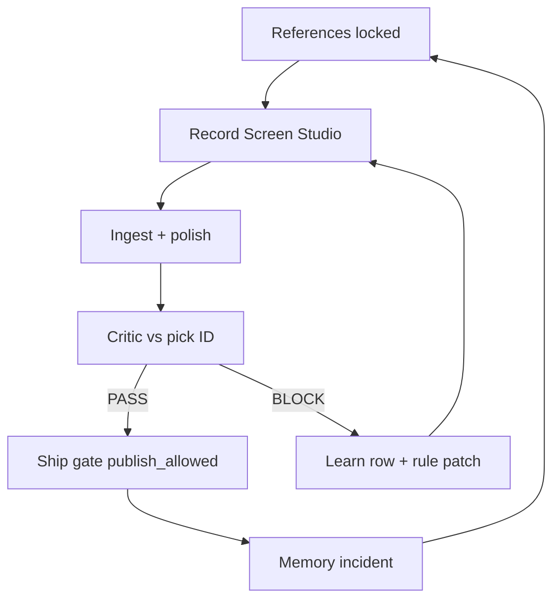

# Cinematic Film Factory — Big Picture · Full Roadmap · Worker Prompts (LOCKED v1)

**Saved:** 2026-06-16T12:00:00Z · **Retrofit:** doc-datetime-law batch retrofit
**Schema:** `cinematic-factory-big-picture-roadmap-v1`  
**Locked:** 2026-06-16  
**Authority:** Founder — full picture + roadmap + prompt-ready bundle  
**Parents:** `SINA_UNIFIED_ENGINE_STORY_LOCKED_v1.md` · `data/COMMERCIAL_FILM_FACTORY_MASTER_PLAN_v1.md` · `archive/attachments/2026-06-16/CINEMATIC_REFERENCE_3PICKS_LOCKED_MASTER_v1.md`  
**Machine SSOT:** `data/commercial-film-factory-phases-v1.json` · `data/commercial-film-routing-v1.json` · `data/reference-board-v1.json`

---

## 0. One sentence (the picture you did not have)

> **SourceA is building a governed cinematic compiler** — live product behavior becomes institutional proof film with receipts — **references tell us what “good” looks like**, **the factory hardens until critic PASS**, then workers, investors, and buyers see output. Scale is **one engine → many lanes → many formats**, not ten separate video projects.

---

## 1. Big picture — five layers (never skip order)

```text
L0  LAW + REFERENCES     — what “tier A” means (3 picks locked · 60+ URL catalog)
L1  FOUNDATION          — routing · quality bar · validators · Path A lock
L2  ENGINE              — capture → beats → VO → assemble → rules → memory
L3  FACTORY HARDENING   — critic · ship gate · ingest · learning circle · freeze/unfreeze
L4  OPERATIONS          — workers (INBOX) · n8n glue · one builder lane
L5  MARKET              — investors · NW1 · landing hero · distribution APIs
```

**Founder sequence (locked 2026-06-16):**

```text
References ✓ → Foundation ✓ → Harden factory (NOW) → Workers → Investors → Sell
```

**Anti-pattern:** Publish · pitch · invite workers **before** ship gate PASS on Screen Studio masters.

---

## 2. What we are actually building (not a video editor)

| Metaphor | Reality on disk |
|----------|-----------------|
| **Compiler** | `cinematic-film-factory/` · `commercial_short_film_v1.py` |
| **Event graph** | `lanes/*/event_graph.json` · beats = system events |
| **Rules engine** | `data/cinematic-rules-engine-v1.json` · IF BLOCK THEN dwell |
| **Critic circle** | `commercial_film_critic_circle_v1.py` — scores vs **locked reference pick** |
| **Learning circle** | gather → probe → critic → **learn** → improve → compile |
| **Ship gate** | `commercial_film_ship_gate_v1.py` — single public door |
| **Memory** | `film_memory.py` · `cinematic-film-memory-incidents-v1.jsonl` |
| **Control plane** | `n8n_film_factory_wire_v1.py` · Integration app `:13026` |

**Output contract:** Input = beats + live UI (or Screen Studio master). Output = MP4 + receipt + critic verdict. No hero without PASS.

---

## 3. Honest now-state (2026-06-16)

| Area | Status | Honest label |
|------|--------|--------------|
| Reference board + 3 picks | **LOCKED** | North stars exist |
| Phase 0 Playwright compiler | **RUNS** | Tier **C** — internal only |
| Phase 1 cinematic polish | **BLOCKED** | Polish cannot fix capture tier |
| P0 ship gate | **SHIPPED** | Validator PASS |
| P1 n8n wire | **SHIPPED** | Subordinate to gate |
| Public hero | **FROZEN** | Critic BLOCK |
| Self-grade A+ receipts | **FIXED** | Critic enforces external bar |
| NW1 / investor film swap | **DEFERRED** | After first PASS unfreeze |
| Distribution (phase 4) | **NOT STARTED** | After multi-format from masters |

---

## 4. Scale ladder — 100 → 1000 (what each level means)

| Level | Name | Definition of done | Primary proof |
|-------|------|-------------------|---------------|
| **L10** | References | Menu + picks + catalog | `reference-board-v1.json` · 3 picks locked |
| **L20** | Foundation | Routing · quality bar · briefs | Validators green on routing/sync/rules |
| **L30** | Engine v1 | Compiler runs all lanes | `witness-film-build.sh` receipt |
| **L40** | Factory hardened | Critic + ship gate + memory loop | **First STYLE-A3 PASS** · unfreeze |
| **L50** | Dual hero | SourceA 32s + WitnessBC 3m PASS | Both picks vs A5 motion bar |
| **L60** | Multi-format | One master → 9:16 · 1:1 · LinkedIn cut | Phase 2 beats live |
| **L70** | Orchestration | n8n runs compile→critic→gate unattended | E2E `:13026` + glue receipts |
| **L80** | Workers at scale | INBOX prompts · no founder terminal | Worker hub queue only |
| **L90** | Market ready | Landing hero live · NW1 with proof clip | `publish_allowed` on ship gate |
| **L100** | Institutional grade | Buyer-grade films on all tier A lanes | External critic equivalent PASS |
| **L200** | Memory mature | Every BLOCK → rule patch · regression suite | Incidents jsonl + evolved rules |
| **L300** | Director AI | OpenAI planner + OpenRouter A/B (phase 3) | Script variants with gate |
| **L500** | Distribution factory | Caption · hashtag · API publish per lane | Phase 4 first channel live |
| **L1000** | Portfolio media OS | 10 lanes × formats from one engine | Registry row per lane · template transfer |

**We are between L30 and L40.** Next clock = **L40** (first Screen Studio PASS).

---

## 5. Full roadmap — phases 0–7 (time-agnostic)

### Phase 0 — Deterministic compiler (BUILT · not public hero)
- Playwright truth · ElevenLabs · ffmpeg · routing · avatar tier C
- **Exit:** Internal compile receipts · sync validators PASS
- **Do not exit with:** Public embed swap

### Phase 1 — Cinematic finish + rules (BUILT · blocked on capture)
- `cinematic_finish` · SFX · BLOCK dwell · logo wall · v5 beats
- **Exit:** Screen Studio masters ingested · critic PASS vs picks
- **Blocker:** Playwright tier C

### Phase 2 — Multi-format intelligence (DRAFT)
- 16:9 master → 9:16 social · 1:1 · LinkedIn institutional · investor 30s
- **Exit:** One master → 4 derivatives without re-record
- **Start after:** L50 dual hero PASS

### Phase 3 — Orchestration (P1 WIRED · harden E2E)
- n8n · glue runner · film_ship_gate · OpenAI director (routed)
- **Exit:** Founder taps only · full pipeline from `:13026`
- **Start after:** L40 first PASS

### Phase 4 — Distribution (FUTURE)
- YouTube · LinkedIn · IG · TikTok · X APIs
- **Exit:** Scheduled publish with captions from same compiler
- **Start after:** L90 market ready

### Phase 5 — Memory loop (V1 SHIPPED · mature at L200)
- Incidents · rule evolution · self-healing patches
- **Exit:** BLOCK rate drops run-over-run with same reference pick

### Phase 6 — Workers + factory ops (AFTER L40)
- RUN INBOX · Worker hub · one SourceA Worker · no second build chat
- **Exit:** Founder never terminal for routine film ops

### Phase 7 — Investors · sell · scale (AFTER L90)
- NW1 · pilot decks · landing · AgentField surfaces
- **Exit:** Proof density in outbound · W3 pilot receipt

---

## 6. Foundation-first work breakdown (next 12 steps)

| Step | ID | Work | Owner | Validator / receipt |
|------|-----|------|-------|---------------------|
| 1 | **S01** | Validate factory stack green | Worker | `validate-commercial-film-*` · ship gate validator |
| 2 | **S02** | Record STYLE-A3 Screen Studio master | Founder | `~/Desktop/SourceA-Commercial-Master.mov` |
| 3 | **S03** | Ingest SourceA master | Worker | `sourcea_commercial_film_ingest_master_v1.py` |
| 4 | **S04** | Ship gate SourceA lane | Worker | `bash sourcea-commercial-film-ship.sh` |
| 5 | **S05** | Critic PASS vs A3+A5 | Machine | `commercial-film-critic-circle-receipt-v1.json` |
| 6 | **S06** | Unfreeze + embed hero | Worker | `commercial-short-demo.mp4` on site |
| 7 | **S07** | Record STYLE-B1 WitnessBC master | Founder | `~/Desktop/WitnessBC-Commercial-Master.mov` |
| 8 | **S08** | Ingest + ship gate WitnessBC | Worker | `witnessbc-commercial-film-ship.sh` |
| 9 | **S09** | n8n E2E film_ship_gate both lanes | Worker | `n8n-film-factory-wire-receipt-v1.json` |
| 10 | **S10** | Multi-format cuts from masters | Worker | Phase 2 beats · 9:16 export |
| 11 | **S11** | Memory loop: learn rows on every run | Worker | incidents jsonl non-empty |
| 12 | **S12** | NW1 pack with proof clip only | Worker | After L90 · not before S06 |

---

## 7. Learning + critic circle (operating system)



**Rules:**
- Critic compares to **STYLE-A3 / B1 / A5** — not internal A+.
- BLOCK without learn row = incomplete loop.
- `publish_allowed` only from ship gate — not from compile alone.

---

## 8. Portfolio lanes (one factory, many products)

| Lane | Tier A reference | Hero target | Avatar policy |
|------|------------------|-------------|---------------|
| **SourceA** | STYLE-A3 + A5 | 32s W1 proof | Product-only |
| **WitnessBC** | STYLE-B1 + A5 | ~3m GRC | No synthetic hero |
| **TrustField** | Vanta-class | TBD | Tier C test only |
| **Noetfield** | Linear agent | TBD | Tier C outbound |
| **Fitness** | Short-form C | 30s | Avatar OK tier C |

**Law:** New lane = new beats file + reference pick row — not new compiler.

---

## 9. What we defer (noise list)

- OpenAI director before L40 PASS
- TikTok/IG publish before L90
- HeyGen on WitnessBC tier A
- Second worker build chat
- Investor deck film swap before S06
- Remotion fake terminal as hero
- Grade inflation without critic

---

## 10. SSOT index (read order for any agent)

| Order | Path | Role |
|-------|------|------|
| 1 | This file | Big picture + roadmap + prompts |
| 2 | `CINEMATIC_REFERENCE_3PICKS_LOCKED_MASTER_v1.md` | Picks + catalog index |
| 3 | `VIDEO_REFERENCE_CATALOG_FULL_2026-06-15_v1.md` | 60+ URLs |
| 4 | `COMMERCIAL_FILM_FACTORY_MASTER_PLAN_v1.md` | Architecture + ledger |
| 5 | `commercial-film-factory-phases-v1.json` | Phase status |
| 6 | `commercial-film-routing-v1.json` | Lane routing |
| 7 | `CINEMATIC_FACTORY_100_QA_v1.md` | Training / certification |
| 8 | `STYLE_A3_*` · `STYLE_B1_*` briefs | Shot match |

---

# PART B — WORKER PROMPTS (copy to INBOX)

Use format: **WORK:** + prompt body. One prompt per INBOX run. Worker executes at full speed in scope.

---

## PROMPT-001 — Factory health check (run first)

```text
WORK: Film factory foundation audit

Read: archive/attachments/2026-06-16/CINEMATIC_FACTORY_BIG_PICTURE_ROADMAP_AND_PROMPTS_LOCKED_v1.md §3–§6

Run and report PASS/FAIL:
- bash scripts/validate-commercial-film-routing-v1.sh
- bash scripts/validate-commercial-film-sync-v1.sh
- bash scripts/validate-commercial-film-render-rules-v1.sh
- bash scripts/validate-commercial-film-ship-gate-v1.sh
- bash scripts/validate-n8n-film-factory-wire-v1.sh
- python3 scripts/commercial_film_critic_circle_v1.py --json --lane all

Quote factory_now_line. State freeze flag. List top 3 blockers to L40.
Do not publish. Do not outbound. STOP after report.
```

---

## PROMPT-002 — Harden ship gate E2E (SourceA dry run, no deploy)

```text
WORK: SourceA ship gate dry run

Preflight: landing :5180 reachable or deploy script ready.

Run: python3 scripts/commercial_film_ship_gate_v1.py --lane sourcea --json --skip-ingest --no-deploy

Read receipt: ~/.sina/enforcement/commercial-film-ship-gate-receipt-v1.json

Report: publish_allowed · steps[] · factory_now_line · next_action.

If BLOCK: write one learn row suggestion for cinematic-film-memory (do not hand-edit rules without incident).

STOP. No site deploy without founder Screen Studio master.
```

---

## PROMPT-003 — n8n control plane smoke

```text
WORK: n8n film wire smoke

From scripts/: python3 -c "
from n8n_integration_core import handle_action
import json
for a in ['film_status','film_critic']:
  print(a, json.dumps({k: handle_action({'action':a}).get(k) for k in ('ok','critic_verdict','publish_allowed','factory_now_line')}))
"

Run: python3 scripts/n8n_glue_runner_v1.py film-status

Confirm Integration app :13026 buttons map to same actions (grep n8n-standalone/index.html).

Report PASS/FAIL. STOP.
```

---

## PROMPT-004 — Post-ingest SourceA (after founder master exists)

```text
WORK: SourceA STYLE-A3 ingest + ship gate

Precondition: ~/Desktop/SourceA-Commercial-Master.mov exists (founder recorded).

Read: archive/attachments/2026-06-15/STYLE_A3_SOURCEA_SHOT_MATCH_BRIEF_2026-06-15_v1.md

Run: python3 scripts/sourcea_commercial_film_ingest_master_v1.py --json
Then: bash sourcea-commercial-film-ship.sh

Critic must score vs STYLE-A3 + STYLE-A5.

On PASS only: update commercial-short-demo.mp4 embed path per brief §8.

Report verdict · publish_allowed · paths. STOP.
```

---

## PROMPT-005 — Post-ingest WitnessBC (after founder master exists)

```text
WORK: WitnessBC STYLE-B1 ingest + ship gate

Precondition: ~/Desktop/WitnessBC-Commercial-Master.mov exists.

Read: archive/attachments/2026-06-16/STYLE_B1_WITNESSBC_SHOT_MATCH_BRIEF_LOCKED_v1.md

Ingest master → witnessbc commercial film path → bash witnessbc-commercial-film-ship.sh

Critic vs STYLE-B1 + A5. Report. STOP.
```

---

## PROMPT-006 — Learning circle incident write

```text
WORK: Film memory learn row from last critic BLOCK

Read: ~/.sina/enforcement/commercial-film-critic-circle-receipt-v1.json judgments + learnings

For each BLOCK judgment: append one row to ~/.sina/cinematic-film-memory-incidents-v1.jsonl with:
- reference_pick (A3|B1|A5)
- steal (what reference does that we do not)
- fix (one shot-list or rules-engine patch)
- lane

Propose minimal patch to data/cinematic-rules-engine-v1.json if warranted.

Validate JSON. STOP.
```

---

## PROMPT-007 — Multi-format derivatives (after L50)

```text
WORK: Phase 2 multi-format from PASS masters

Precondition: ship gate publish_allowed YES for sourcea and witnessbc.

Read: data/commercial-film-factory-phases-v1.json phase_2_multi_format

Generate 9:16 cut from witnessbc master using witnessbc-commercial-social-30s-beats-v1.json.

Do not re-record. Crop + captions only.

Receipt per derivative. STOP.
```

---

## PROMPT-008 — Validator chain maintenance

```text
WORK: Film factory validator green chain

Run all validate-commercial-film-* and validate-n8n-film-factory-wire-v1.sh.

Fix only failures in scripts/validators scope — not unrelated hub.

Re-run until all PASS.

Write summary to ~/.sina/enforcement/film-factory-validator-sweep-receipt-v1.json

STOP.
```

---

## PROMPT-009 — Reference board sync check

```text
WORK: Reference SSOT consistency

Verify alignment:
- data/reference-board-v1.json founder_3_picks_locked
- data/commercial-film-routing-v1.json founder_3_picks_locked
- archive/attachments/2026-06-16/CINEMATIC_REFERENCE_3PICKS_LOCKED_MASTER_v1.md

Report drift. Fix JSON only if mismatch. STOP.
```

---

## PROMPT-010 — Brain spawn: next INBOX after L40

```text
WORK: Queue next film steps after first PASS

Read ship gate + critic receipts.

If publish_allowed YES for sourcea: queue PROMPT-007 scope for Worker.
If still BLOCK: queue PROMPT-006 only.

Update factory-now narrative one line for hub Next steps (read ~/.sina/live-ongoing-prompts-next-10-v1.json pattern — do not hand-edit hub without scope).

STOP.
```

---

## PROMPT-FOUNDER-001 — Record (founder only · not Worker)

```text
FOUNDER: Record Screen Studio STYLE-A3

1. python3 scripts/publish_sourcea_landing_v1.py --serve --port 5180
2. Open http://127.0.0.1:5180/sourcea/proof.html?film_capture=1#w1-demo-film
3. Follow STYLE_A3 brief §4 second-by-second
4. Export 4K → ~/Desktop/SourceA-Commercial-Master.mov
5. Worker chat: WORK + PROMPT-004
```

---

## PROMPT-FOUNDER-002 — Record WitnessBC (founder only)

```text
FOUNDER: Record Screen Studio STYLE-B1

1. Start witnessbc-site :8090
2. Follow STYLE_B1 brief beat map 0–180s
3. Export 4K → ~/Desktop/WitnessBC-Commercial-Master.mov
4. Worker chat: WORK + PROMPT-005
```

---

## 11. Brain one-liner (every session)

```text
sa · Worker · n/30 · L40 harden: references locked · factory PASS before workers/investors/sell
```

---

## 12. Next tap (founder)

**Option A — Worker now:** Paste **PROMPT-001** into Worker INBOX → RUN INBOX  
**Option B — Record first:** **PROMPT-FOUNDER-001** → then PROMPT-004  
**Option C — Save prompts to inbox file:** say `WORK: wire PROMPT-001–010 to worker-prompt-inbox`

---

**END LOCKED v1**
