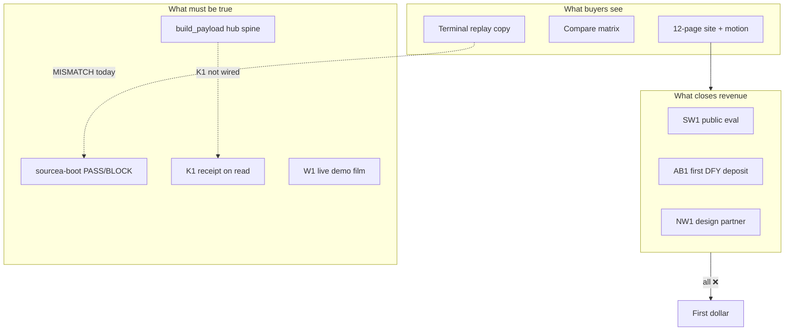

# SourceA — external critic response plan (founder)

**Saved:** 2026-06-16T04:33:35Z · **Retrofit:** doc-datetime-law batch retrofit
**Date:** 2026-06-15  
**Version:** v1  
**Lane:** Commercial strategy + site truth + product spine — **not roadmap input alone**  
**Authority:** Subordinate to `SOURCEA_UNIFIED_PORTFOLIO_COMMERCIAL_SSOT_LOCKED_v3.1.md`  
**Inputs:** External critic pass (chat) · `SOURCEA_SITE_BUYER_SPECIALIST_ANALYSIS_2026-06-15_v1.md` · `SOURCEA_AGENCY_UPGRADE_BENCHMARK_ADDENDUM_2026-06-15_v1.md` · `EXTERNAL_CRITIC_PITCH_STATS_BULLETS_2026-06-15_v1.md` · Graphify god-node report (`scripts/graphify-out/GRAPH_REPORT.md`)

---

## Founder read on the critic

### Fair hits (act on these)

- **Site is ahead of execution** — SW1–SW4, AB1, NW1 all ❌ on disk; self-score 90/A is internal marketing, not market truth.
- **Truth gap on eval** — Site shows `sourcea-boot verify --replay`; real CLI is `sourcea-boot --json` with four checks (`policy_version`, `provider`, `receipt_fresh`, `queue_truth`). A staff engineer who runs the terminal copy loses trust in one minute.
- **Agency-first home demoted Buyer 1** — Portfolio SSOT still positions platform eng as category validation; hero removed `sourcea-boot` from above-fold.
- **Trust theater** — DP/AR/GX monograms read as fake logos; illustrative footnotes help legally but do not replace one named design partner or deposit receipt.
- **Compare matrix is your marketing** — Naming  without rows or methodology is outbound ammo, not evidence.

### Overstated (do not panic)

- “Not a product company” — wrong **if** `sourcea-boot` + K1 + replay work on buyer stack. Model is **pre-revenue product with services GTM** until SW2/AB1.
- Critic ~71/100 — useful as **falsification target**, not final grade.

### Fatal if ignored

- Marketing promises commands and checks that **do not exist** — violates proof brand.
- More landing polish **without** SW1/AB1/NW1 motion = optimizing fiction.

---

## Root cause

**Diagnosis:** Sales theater layer built faster than falsifiable spine and win-code motion. Critic measures theater vs proof.

---

## Wave 0 — Truth on disk (48–72h)

**Law:** No fake progress. No new motion until CLI/marketing match.

| # | Fix | Files / proof | Win code |
|---|-----|---------------|----------|
| 0.1 | Restore hero dual CTA: Book proof demo + **Try sourcea-boot** | [`SourceA-landing/green-unified/index.html`](SourceA-landing/green-unified/index.html) hero `.ar-hero-actions` | SW1 |
| 0.2 | Terminal honesty: replace fake `verify --replay` with real `sourcea-boot --json` output | `index.html`, [`proof.html`](SourceA-landing/green-unified/proof.html), [`attach/agency-onepager.html`](SourceA-landing/green-unified/attach/agency-onepager.html) | SW1 |
| 0.3 | Align GitHub URL: `sourcea-io` vs `sourcea-ai` | [`packages/sourcea-boot/pyproject.toml`](packages/sourcea-boot/pyproject.toml) + all green-unified HTML | SW1 |
| 0.4 | Remove DP/AR/GX monograms; relabel “Design partner program — names on request” | `index.html` trust band | AB1 trust |
| 0.5 | Soften compare: “Capability map (illustrative)” + footnote to  | [`compare.html`](SourceA-landing/green-unified/compare.html), home `#compare` | Legal safety |

**Real CLI reference:** [`packages/sourcea-boot/src/sourcea_boot/cli.py`](packages/sourcea-boot/src/sourcea_boot/cli.py) — `--json`, four checks via `run_boot()`.

**Validate:** `bash SourceA-landing/green-unified/scripts/run-recipe.sh --e2e` + extend E2E for hero boot link.

---

## Wave 1 — Dual-lane clarity (1 week)

| # | Fix | Detail |
|---|-----|--------|
| 1.1 | Platform lane pass on [`platform.html`](SourceA-landing/green-unified/platform.html) | Buyer chips (platform primary), boot CTA hero, link to agency `#agency-path` |
| 1.2 | Home balance | Keep agency chip default; add line: “Platform team? Evaluate sourcea-boot first.” |
| 1.3 | Outbound routing | Eng → `platform.html`; DFY → `attach/agency-onepager.html` — not 12-page home in email |
| 1.4 | Procurement strip | New `security.html` or `attach/procurement-pack.html`: self-hosted · fail-closed · export bundle · shadow mode · **no SOC2 claims** |
| 1.5 | Honest rescore | Update  addendum: visual B+/A−; trust C+ until AB1/NW1; drop self-graded A |

**Sync:** [`scripts/sync_sourcea_landing_pages_v1.py`](scripts/sync_sourcea_landing_pages_v1.py) after nav/explore changes.

---

## Wave 2 — Close win codes (parallel, 2–4 weeks)

Portfolio SSOT §291: **W1 + SW1 + NW1 parallel P0** — not sequential excuses.

| Track | Actions | Closes |
|-------|---------|--------|
| **SW1** | Public repo · README &lt;5 min · `validate-sourcea-boot-v1.sh` in CI · one design-partner eval thread | SW1 ❌→✅ |
| **AB1** | Send agency one-pager + outreach snippet · log W3 via `governed_agentic_automation_offer_v1.py` | AB1 ❌→✅ |
| **NW1** | Noetfield lane only · `send_nw1_single_v1.py` · no engine vocabulary on compliance calls | NW1 ❌→✅ |
| **W1** | Film ALLOW · BLOCK · tamper-FAIL · embed on `proof.html` | W1 ❌→✅ |

**Proof targets:** `~/.sina/ab1-outbound-send-receipt-v1.json` · `~/.sina/nw1-outbound-send-receipt-v1.json` · public boot eval link.

**Founder rule:** AB1 before SW1 is fine for cash; do not claim “reference standard” until boot eval works in the wild.

---

## Wave 3 — Product spine (2–6 weeks)

| # | Fix | Critic / Graphify link |
|---|-----|------------------------|
| 3.1 | Ship K1 validator `validate-enforcement-kernel-v1.sh` (tamper-on-read FAIL) | SSOT §13 P0 |
| 3.2 | Hook K1 in [`build_payload()`](scripts/sina_command_lib.py) (~108 edges) — surface in hub Safety | God node fragility |
| 3.3 | Unify [`critic_boot_v1.py`](scripts/critic_boot_v1.py) ↔ `sourcea_boot.runner`; remove briefing auto-heal fake-green | One boot story |
| 3.4 | Either implement `sourcea-boot verify --replay` **or** never market it again | Terminal parity |
| 3.5 | `is_overnight()` staleness guard — refresh factory-now or fail-closed | Graphify edge |

---

## Wave 4 — Trust evidence (after Wave 2 motion)

Only with permission:

- One real design-partner logo
- AB3 case study
- Framework mapping page (educational — WitnessBC pattern, not certification)
- SIEM export as honest roadmap row

**Do not** chase SOC2 / AWS marketplace / Fortune logos pre-revenue — SSOT and strategy pack reject that trap.

---

## Frozen zone — do not do

Per portfolio SSOT §436–441:

- New portfolio vehicles before SW2 or NW1
- Category rename churn (“Cloudflare for agents”, etc.)
- Self-score A tier without win-code receipt
- Another site-only 10-step pass before Wave 0

---

## Success metrics (founder dashboard)

| Metric | Baseline (2026-06-15) | Target |
|--------|----------------------|--------|
| Win codes closed | 0 SW · 0 AB1 · 0 NW1 | ≥1 in 30d |
| CLI/marketing match | ❌ fake `verify --replay` | ✅ real boot on site |
| Critic demo-advance | ~71 | ≥80 after Wave 0+1 |
| Buyer specialist (friendly) | ~84 | ≥85 **after** first paid signal |
| `build_payload` K1 | ❌ not wired | ✅ hub PASS/BLOCK on read |
| Outbound receipts | ❌ | ab1 or nw1 send receipt on disk |

---

## Critic vs friendly score reconciliation

| Lens | Pre-agency | Post-agency (friendly) | Critic (honest) |
|------|------------|----------------------|-----------------|
| Overall | ~84 | ~90 (self) | ~71 |
| Trust | 5 | 8 (design) | C+ until named partner |
| Eval path | boot in hero | boot demoted | regression |
| Identity | dual lane tension | agency-first | drift from Buyer 1 SSOT |

**Use critic score for falsification; use friendly score for UX direction only.**

---

## Founder synthesis

Honest edge on disk remains: **tamper-evident receipts · critic_boot BLOCK · live replay · self-hosted law**. Site sells it; eval path and hub spine do not fully prove it yet.

**Order of operations:**

1. Tell the truth on the site (CLI, logos, compare)
2. Send outbound (AB1 + NW1 + SW1 link) in parallel
3. Wire K1 at `build_payload()` so hub is not theater
4. Polish trust with real names when permitted

---

## One next tap (execution)

**WORK: Wave 0** — hero boot CTA + honest terminal + remove fake monograms + compare footnote · one bounded pass · E2E green.

**Related attachments:** `SOURCEA_SITE_BUYER_SPECIALIST_ANALYSIS_2026-06-15_v1.md` · `SOURCEA_AGENCY_UPGRADE_BENCHMARK_ADDENDUM_2026-06-15_v1.md` · `EXTERNAL_CRITIC_PITCH_STATS_BULLETS_2026-06-15_v1.md`
