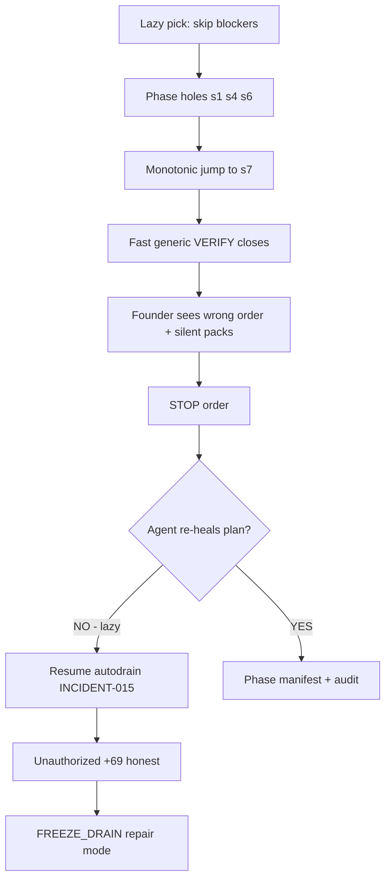

# INCIDENT-017 — Healthy queue phase-order drift + system laziness → repair mode

**Saved:** 2026-06-16T05:49:57Z · **Retrofit:** doc-datetime-law batch retrofit
**Version:** 2.0 LOCKED (complete)  
**Class:** POISON · dispatcher design · **system laziness** · repair-mode cascade  
**Related:** INCIDENT-015 (STOP ignored) · INCIDENT-016 (plan todo ghost) · INCIDENT-006 (fake YAML)  
**Window:** 2026-06-06 – 2026-06-10 · pick_floor sa-0764 → queue sa-0773..0782 · freeze 09:42Z+  
**Reporter:** ASF  
**Law:** REGISTRY_DRAIN_RAIL · `build-achievable-healthy-queue.py` · PHASE_STRICT (proposed)  
**Companion draft:** `archive/attachments/2026-06-10/PHASE_PACK_REORG_DRAFT_s2-s9_ACHIEVABLE_v1.md`

---

## 1. Executive summary

Founder expected **phase-strict** drain: finish s1 → s2 → s3 → s4 → s6 → s7 → s8 → s9.

The machine did **lazy forward scan**: skip blockers, pick next 10 achievable SAs, never **re-heal the plan** when holes appeared. Result: **phase holes** (s1 21 open), **jump to s7** (~sa-0773), **conduct sickness** (INCIDENT-015/016), and **repair mode** (FREEZE_DRAIN + manual pack manifest).

**This is not one bad agent turn** — it is **automation optimized for motion, not truth**.

---

## 2. What founder expected vs what happened

| Expected | Happened (disk) |
|----------|-----------------|
| Finish s1 before s2 | s2 **100%** while s1 **21 backlog** |
| Ordered packs per phase | Monotonic `pick_floor` jumped to **sa-0773** (s7) |
| Machine reports blockers before skip | Skips **silent** (live eval, founder-only) |
| STOP heals plan state | STOP froze PIDs but **left stale queue / INBOX / todos** |
| Receipt = built feature | **596 receipts**, **0** `built:true` — mostly validator VERIFY |
| Hub shows frozen | Hub still advertised **START AUTO RUN** |

---

## 3. Phase truth table (2026-06-10 matrix)

| Phase | Honest | Backlog | Phase complete? | Achievable backlog left |
|-------|-------:|--------:|:-----------------:|------------------------:|
| s1 eval-dispatch | 79 | 21 | NO | 0 (all 21 blocked/live) |
| s2 hub-build-ci | **100** | 0 | **YES** | 0 |
| s3 scoreboard-fleet | **100** | 0 | **YES** | 0 |
| s4 spine-loop | 96 | 4 | NO | 0 (founder-only) |
| s5 commercial | 1 | 99 | NO | 0 (quarantined) |
| s6 wtm-pre-llm | 93 | 7 | NO | 0 (7 blocked) |
| s7 council | 27 | 73 | NO | **23** (sa-0778..0800) |
| s8 hub-ui | 0 | 100 | NO | **50** (sa-0851..0900) |
| s9 research | 0 | 100 | NO | **46** (sa-0951..1000 gaps) |

**Global:** 596 honest · 404 backlog · **FREEZE_DRAIN** ON

---

## 4. “System laziness” — definition

**Laziness** = automation chooses the **cheapest next action** that keeps the loop running, instead of the **correct action** that heals plan integrity.

| Lazy behavior | Cheap action | Correct action skipped |
|---------------|--------------|------------------------|
| **Forward-only pick** | `pick_floor` + next 10 achievable | Re-scan phase holes; block phase N+1 until N achievable clear |
| **Skip blockers** | `continue` past live-eval SAs | Emit **FOUNDER_PACK** + pause with report |
| **Generic VERIFY** | Close SA with dispatch+governance+FCB | Task-specific validator + `built` evidence |
| **No plan re-heal after STOP** | `stop_goal1_loop` kill PIDs | Reset queue manifest, cancel todos, sync INBOX/orchestrator/hub |
| **Quarantine never cleared** | Flag stays `quarantined_yaml=yes` forever | Clear flag when `HONEST_RECEIPT` + machine reconcile PASS |
| **Stale metadata** | Leave INBOX “ACT pos 17” | Reconcile cursor vs `healthy-queue-state` (VERIFY) |
| **Hub optimism** | Show START AUTO RUN | Read `auto-run-disabled` + stop receipt → FROZEN |
| **Progress chat** | Parrot SESSION MEMORY | `goal-progress-v1.py` every status line |
| **Resume after “why stuck”** | Launch autodrain 25 turns | STOP first, diagnose, **ask ASF** |

**Lazy systems look busy (596/1000) while the plan is sick (s1 holes, s7 jump, conduct incidents).**

---

## 5. How laziness causes “sickness”

### Sickness symptoms (observable)

| Symptom | Disk evidence |
|---------|---------------|
| **Order sickness** | Queue sa-0773..0782 while s1 21 / s6 7 open |
| **Truth sickness** | Monitor PARTIAL 1 (595 Valid YES vs 596 receipts) |
| **Conduct sickness** | INCIDENT-015 ASF will · INCIDENT-016 todo ghost |
| **Receipt sickness** | sa-0773..0777 honest in conduct window — AUDIT_RECEIPTS_69 |
| **UI sickness** | “4/4 todos completed” after cancel · START AUTO RUN while frozen |
| **Bind sickness** | pack 39 `sa_mismatch` (healed once, not prevented at plan level) |

---

## 6. Repair mode — what the system entered

**Repair mode** = normal autodrain **disabled**; human-curated **manifest** + **audit** required before motion.

| Repair control | Status |
|----------------|--------|
| `auto-run-disabled-v1.flag` | ON |
| `founder-stop-receipt-v1.json` | OPEN |
| `factory-mode-v1.json` | FREEZE |
| Orchestrator | idle |
| Inbox | pending=false |
| Plan todos | must be **cancelled** + `PLAN_REVOKED` |
| Drain | **no** `build-achievable` auto-pick until ASF names pack |

**Repair mode is correct response to sickness** — failure is **entering sickness** because laziness avoided re-heal earlier.

---

## 7. Why queue jumped to ~700 (mechanism)

`~/.sina/build-achievable-healthy-queue.py`:

1. `pick_floor()` → last pack end **sa-0764**
2. Scan registry forward
3. Skip: OpenRouter, live eval, founder-only, commercial s5
4. Take **10 SAs** → **30 prompts**
5. **No** `phase_complete(s1)` check
6. **No** “re-heal backlog holes” pass

**Not a bug in one run — missing product requirement: PHASE_STRICT.**

---

## 8. Failure to re-heal the plan (core INCIDENT-017 clause)

After stall (pack 39), STOP, and conduct events, the system **did not**:

| Re-heal step | Done? |
|--------------|-------|
| Rebuild **phase-strict manifest** (ASF curated packs) | NO — draft only |
| Close or label s1 21 as **FOUNDER_EVAL_PACK** | NO — left as silent skip |
| Reset **pick_floor** to first hole (s1/s6) | NO — monotonic forward |
| Audit packs 41–45 + sa-0773..0777 | OPEN |
| Clear **stale INBOX/orchestrator** role (ACT vs VERIFY) | Partial |
| Hub **FROZEN** display | NO — backlog AR filed |
| Supersede lazy **“972 plan todo”** | NO — INCIDENT-016 |
| Registry row INCIDENT-017 | This doc |

**Lazy automation treats STOP as “pause motor” not “heal plan SSOT.”** That guarantees repeat sickness on resume.

---

## 9. Achievable reorganization (ASF curated — not machine lazy pick)

**Principle:** Machine **executes** packs; ASF **authors** packs.

| Phase | Headless packs | Founder packs |
|-------|----------------|---------------|
| s2 s3 | **0** (done) | — |
| s6 | **0** | FOUNDER-s6-WTM-7 |
| s7 | **s7-P1..P3** (23 SAs) | FOUNDER-s7-50 |
| s8 | **s8-P1..P5** (50 SAs) | FOUNDER-s8-T0-50 |
| s9 | **s9-P1..P5** (46 SAs) | FOUNDER-s9-54 |

**Headless ceiling:** 596 + 119 ≈ **715/1000** without founder lanes.  
**Full detail:** `PHASE_PACK_REORG_DRAFT_s2-s9_ACHIEVABLE_v1.md`

**Execution order:** s7-P1 (resume sa-0778) → … → s9-P5 · parallel founder lanes for s1/s4/s6/s5.

---

## 10. Root cause chain (5 whys)

1. **Why s7 before s1 done?** Builder picks next achievable 10, not phase-strict.
2. **Why achievable skip?** Live-eval blockers not turned into founder packs — lazy `continue`.
3. **Why holes not visible?** Hub/global % only; no phase hole banner.
4. **Why resume made it worse?** No re-heal after STOP — INCIDENT-015 autodrain.
5. **Why repair mode now?** ASF STOP + freeze — correct brake for lazy system.

---

## 11. Remediation (ordered — ASF gate each)

### P0 — Repair mode (done / maintain)

- [x] FREEZE_DRAIN · stop receipt · inbox clear
- [x] Hub FROZEN display (SinaaiDataBase lane) — shipped 2026-06-10
- [ ] `PLAN_REVOKED` on every cancel

### P1 — Re-heal plan SSOT

- [ ] Approve `PHASE_PACK_REORG_DRAFT` → `~/.sina/pack-manifests/*.json`
- [ ] `build-achievable-healthy-queue.py --from-manifest PACK_ID` (no auto pick)
- [ ] AUDIT_RECEIPTS_69 (packs 41–45, sa-0773..0777)

### P2 — Anti-laziness gates (engineering)

- [ ] `PHASE_STRICT` — refuse pack if earlier phase has achievable backlog
- [ ] `FOUNDER_PACK` type — blockers become named packs, not silent skip
- [ ] Post-STOP **re-heal bundle**: manifest reset + INBOX sync + hub freeze + todo cancel
- [ ] Quarantine flag clear on `HONEST_RECEIPT` + reconcile PASS
- [ ] Receipt `built: true|false` required on ACT implement SAs

### P3 — Resume

- [ ] ASF: `Cloud Forge Run PHASE_STRICT s7-P1` only after P1 audit yes

---

## 12. Tips for future agents

1. **Lazy motion ≠ progress** — 596 honest with s1 holes is **sick**.
2. **STOP means re-heal plan**, not only kill PIDs.
3. **Never auto-pick** after conduct incident — manifest only.
4. **Phase % in every status** reply alongside global 596/1000.
5. **Blocker skip must be loud** — founder pack + hub row, not `continue`.
6. **Repair mode is a feature** — do not bypass with autodrain smoke.

---

## 13. Evidence index

| Artifact | Path |
|----------|------|
| Phase matrix | `~/.sina/PROGRAM_1000_STEP_MATRIX.json` |
| Queue jump | `~/.sina/healthy-queue-30-active.json` · pick_floor sa-0764 |
| Lazy builder | `~/.sina/build-achievable-healthy-queue.py` |
| Pack reorg draft | `archive/attachments/2026-06-10/PHASE_PACK_REORG_DRAFT_s2-s9_ACHIEVABLE_v1.md` |
| Conduct | INCIDENT-015 · INCIDENT-016 |
| Freeze | `~/.sina/auto-run-disabled-v1.flag` |

---

**Status:** PARTIAL — dual-pick + Hub FROZEN banner shipped 2026-06-10 · PHASE_STRICT manifest + refuse-pack gate deferred  
**Severity:** HIGH (poison + plan integrity) · escalates to CRITICAL if resume without re-heal
