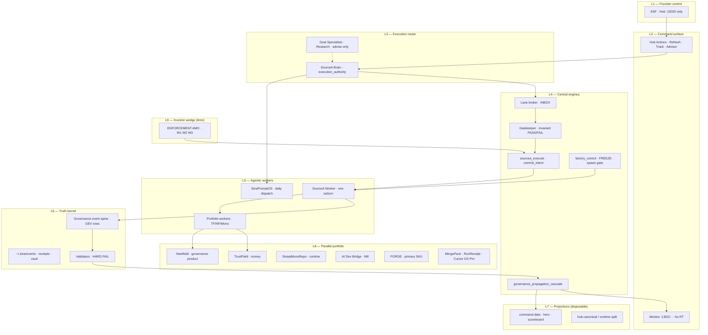

# SourceA — Full Layered Control Plan (LOCKED v1)

**Saved:** 2026-06-16T05:49:57Z · **Retrofit:** doc-datetime-law batch retrofit
**Version:** 1.1 — LOCKED  
**sequence_id:** SA-2026-06-11-FULL-LAYERED-CONTROL  
**Authority:** ASF · unifies fragmented big-picture docs into one operational map  
**Parent:** `CONTROLLED_EXECUTION_OS_MASTER_LOCKED_v1.md` · `SOURCEA_LIVE_GOVERNANCE_BIG_PICTURE_LOCKED_v1.md` · `GOAL_HIERARCHY_LOCKED_v1.md`  
**Real goal synthesis:** `RESEARCH/.../2026-06-11_BIG-PICTURE-REAL-GOAL-031.md`  
**Horizon:** 6-month wedge (ENFORCEMENT-6MO) inside 24-month Controlled Execution OS  
**Updated:** 2026-06-12 (disk audit — RT LIVE · D16 · integrity pause · missed clocks)

---

## 0. Real goal (two proofs — disk truth)

**24-month north star:**

> **Build a Controlled Execution OS** — agentic, parallel, multi-project — where **one central control layer** (Hub + Brain + gatekeeper + spine + validators) moves every business lane with **reliable enforcement**, honest projections, and minimal founder terminal use.

**6-month north star (two clocks — not one merged sprint):**

| Clock | Question | PASS |
|-------|----------|------|
| **Engine** | Can AI execution bypass governance? | **No** — BLOCK · ALLOW · tamper-FAIL live |
| **Money** | Will anyone pay on that proof? | **W3** — TF-001 / NF-001 deposit or signed SOW |

**External sentence (only category line):** *We make AI execution impossible to bypass governance.*

**Three product layers (never merge in one sprint doc):**

| Layer | Entity | 6mo P0 |
|-------|--------|--------|
| 1 | SourceA engine | W1 + W2 |
| 2 | Noetfield (product) | W3-NF parallel |
| 3 | TrustField (company) | W3-TF parallel |

**Agentic loop:** SCAN → SAY → PICK → PROVE → SHIP — **not** Cursor AUTO-RUN (`auto-run-disabled-v1.flag` ON).

**Does not replace** T0 north star (controlled automation factory) or WTM long arc.

---

## 1. Layer glossary (namespaces — do not mix)

| Namespace | Layers | What it measures | Canonical doc |
|-----------|--------|------------------|---------------|
| **Governance stack** | P0–P7 | Law depth · propagation · noise rejection | `SOURCEA_LIVE_GOVERNANCE_BIG_PICTURE_LOCKED_v1.md` |
| **WTM product** | Phases A–D (33 steps) | Pre-LLM world model + runtime | `WORLD_TARGET_MODEL_MAP_LOCKED_v5.md` |
| **Goal tiers** | T0–T7 | What Brain routes next | `GOAL_HIERARCHY_LOCKED_v1.md` |
| **Market reference** | L0–L7 | External analogs (not internal names) | `SOURCEA_REFERENCE_ARCHITECTURE_CONSTELLATION_LOCKED_v1.md` |
| **Meta reasoning** | L0–L12 | How to govern before locking | `META_REASONING_POLICY_STACK_LOCKED_v1.md` |
| **Control stack** | L1–L9 (this doc) | Founder → disk execution path | §2 below |

**Warning:** Governance L0–L12 ≠ WTM L0–L16. Hub founder P0 ≠ governance P0 SSOT.

---

## 2. Nine-layer central control stack (the real big picture)



### Golden rule (all layers)

```text
State is canonical. Events are history. Graph is intelligence.
Projections are disposable. Validators are authority.
```

Law: `brain-os/law/GOVERNANCE_RUNTIME_GOLDEN_RULE_LOCKED_v1.md`

---

## 3. North-star hierarchy (when plans conflict)

| Priority | Name | What it is | Wins when |
|----------|------|------------|-----------|
| **0** | Disk + validators | Machine PASS/FAIL | Always over chat, hub lag, critic paste |
| **0b** | Live Founder Form v2 + RT-LIVE receipt | Thorn→leaf read order | Over hub hero / Cloud Forge Run (`INCIDENT-027`) |
| **1** | ASF Hub PICK | Founder override | Over Brain default |
| **2** | T0 north star | Controlled automation factory · FORGE path | Over T2b side SKUs |
| **3** | Hub P0 headline | **STRATEGIC-SLICE** (WTM spine) | Over RunReceipt drain hero |
| **4** | **ENFORCEMENT-6MO** | Investor wedge W1–W3 | Over naming/whitepaper; **not** over FR-003/1.10 |
| **5** | T2b parallel | MergePack · RunReceipt · Cursor OS Pro | Parallel only — never blocks T0–T4 |
| **6** | T7 suppressed | TrustField MSB routing | Commercial vault — not default Brain pick |
| **7** | EXTERNAL_CRITIC | GPT/Claude/advisor | Input only — never reorder |

---

## 4. Central engine registry

| Engine | Script / surface | Trigger | Output | RT status |
|--------|------------------|---------|--------|-----------|
| **Gatekeeper** | `scripts/gatekeeper_v1.py` | Every execute / commit | PASS/FAIL · reasons | RT |
| **Commit intent** | `scripts/commit_intent_v1.py` | Demo + enforcement path | Receipt + spine bind | Shipped |
| **SourceA execute** | `scripts/sourcea_execute_v1.py` | Post-gate worker/cli/api | Spawn or deny | Partial |
| **Factory control** | `scripts/factory_control_v1.py` | FREEZE · stop · resume | Conduct state | RT |
| **Lane broker** | `scripts/goal1_lane_broker.py` | Brain pick · worker-submit | INBOX delivery | RT |
| **Propagation cascade** | `scripts/governance_propagation_cascade_v1.py` | G0 mtime · broker submit | monitor + hub align | RT ~5s |
| **Event spine** | `scripts/governance_event_spine_v1.py` | append_event | GEV-* rows | RT |
| **Brain intent gate** | `scripts/brain_intent_gate_v1.py` | Founder message classify | cheap E2E vs forbid | RT |
| **Universe validator** | `scripts/validate-universe-invariants-v1.sh` | CI · maintainer probe | receipt↔spine PASS | PASS |
| **Demo validator** | `scripts/validate-demo-enforcement-v1.sh` | W1/W2 acceptance | tamper FAIL | PASS |
| **Five-step machine** | `scripts/five_step_progress_machine_v1.py` | Daily SCAN→SHIP | progress receipt | RT |
| **Fork machine** | `scripts/complex_situation_fork_machine_v1.py` | Mega-chat triage | fork inventory | On demand |
| **ACE conflict** | `AUTO_CONFLICT_ENGINE_V3` | DESIGN/EXECUTION/DELIVERY | plane verdict | Advisory |
| **RT LIVE gate** | `scripts/rt_live_gate_v1.py` | Maintainer prove | receipt + spine + checksum | **PASS** |
| **S10 eternal audit** | `scripts/s10_eternal_audit_loop_v1.py` | Daily 10/day | self-heal prompts | RT |
| **Live founder form** | `live_founder_decision_form_v1.py` | Form FILLED | session law until RT | Active |
| **Hub** | `:13020` | Founder clicks | Actions · dispatch | **LAG** on hero copy |
| **Monitor** | `:13021` | Cascade | live projection | **RT** |

**Control-plane flow:** Intent → Gatekeeper → Broker → Worker → Validators → Spine → Cascade → Hub/Monitor.

---

## 5. Multi-project parallel matrix

| Project | Repo / workspace | Thread | Plane | Progress (honest) | Parallel rule |
|---------|------------------|--------|-------|-------------------|---------------|
| **SourceA** | `~/Desktop/SourceA` | ECOSYSTEM | Execution spine | Factory + validators | **Sole execution authority** |
| **TrustField** | TrustField Technologies | PORTFOLIO | Money / MSB | ~45% semantic | **W3 target TF-001** |
| **Noetfield** | Mono spec + product | PORTFOLIO | Governance product | ~19% | **W3 target NF-001** |
| **SinaaiMonoRepo** | MonoRepo | ECOSYSTEM | Runtime L0-meta | ~22% blocked | Governance specialist |
| **FORGE** | `~/Desktop/forge/` | — | T2 primary SKU | Launch checklist **complete** | GTM/launch next |
| **COMM-PARTNER-BOOT** | SourceA law | PORTFOLIO | AI infra credits | 5% · P05→P03 | **≠ W3** — credits not invoices |
| **AI Dev Bridge** | AI Dev Bridge OS | WIRE | M8 automation | Mostly PASS | **Never blocked by repos** |
| **MergePack** | mergepack | MERGEPACK | T2b evidence | Active parallel | Not north star |
| **RunReceipt** | product/ | FACTORY | T2b factory | Background | Not hub P0 |
| **Cursor OS Pro** | mobile lane | CURSOR-OS-PRO | App Store | Separate | Not factory |
| **VIRLUX / 777** | separate repos | PORTFOLIO | Delivery | Parallel | No wire block |
| **SinaPromptOS** | SinaPromptOS | PROMPTOS | Daily dispatch | M8 automation | Morning/evening loop |
| **SinaaiDataBase** | archive | — | Broker only | Read/search | **Never build here** |

Law: `SINAAI_PARALLEL_LANES_NO_BLOCK_PROGRESS_LOCKED_v1.md`

---

## 6. Agentic role matrix (autonomous parallel)

| Role | Workspace | Builds? | Routes? | Parallel with |
|------|-----------|---------|---------|---------------|
| **ASF** | Hub only | ❌ | override | — |
| **Brain** | SourceA | ❌ | ✅ execution_authority | Worker turns |
| **SourceA Worker** | SourceA | ✅ one sa | ❌ | Maintainer FR-003 |
| **Maintainer** | SinaaiDataBase | ✅ hub/panel | ❌ | Worker demo |
| **Commercial Goal** | TrustField | ❌ | ❌ | W3 outreach |
| **Governance Goal** | MonoRepo | ❌ | ❌ | Law review |
| **Research L1/L2** | SourceA | ❌ briefs | ❌ | All lanes |
| **Portfolio agents (8)** | per-repo | ✅ own repo | ❌ | Never edit SourceA |
| **SEMEJ** | Chrome automation | ❌ SourceA | ❌ | Optional |
| **S10 runner** | `~/.sina/bin/s10-eternal-daily` | Audit only | ❌ | Parallel factory |

**Hub proof UX (SinaaiDataBase):** `HUB_PROOF_UX_P0_LOCKED_v1.md` — P0-1 honest counter → P0-2 JSONL export → P0-3 overnight verify.

**Agentic automation ladder (honest):**

| Level | Today | Claimed? |
|-------|-------|----------|
| L0 Manual | Founder every step | — |
| **L1 Semi-auto** | Hub Actions · broker · one Worker turn | **YES** |
| L2 Supervised auto | Eval-1b · ENFORCE gate flip | Active per `system_roadmap.py` |
| L3 Zero-human | Full AUTO-RUN chain | **NO** — flag disabled permanently |

**L1 replacements (not AUTO-RUN):** Hub Actions · RUN INBOX · PLAN WITH NO ASF · S10 daily · SEMEJ · n8n/voice outbound.

Law: `FOUNDER_AGENTIC_COMMERCIAL_AND_NO_CURSOR_AUTORUN_LOCKED_v1.md` · `SINAAI_AGENTS_AND_AUTOMATION_UNIFIED_BLUEPRINT_LOCKED_v1.md` §4

**Daily agentic loop:** `SinaPromptOS/scripts/run-day.sh` → Cursor prompt → Worker build → validator → spine → cascade.

---

## 7. Five clocks (run in parallel)

```text
CLOCK A — PRODUCT (WTM machine SSOT)
  C7 runtime done · D16 unified memory merge SHIPPED
  Active: ENFORCE gate flip → then STRATEGIC-SLICE
  Maintainer: FR-003 · Phase 1.10 seal (deferred until RT LIVE per form)
  NOT active: D2 graph fusion (done — do not cite as current)

CLOCK B — PORTFOLIO (multi-project delivery)
  TrustField · Noetfield · Mono · VIRLUX · 777 · FORGE (launch-ready)
  Rule: repo blockers do NOT stop wire or SourceA spine

CLOCK C — INVESTOR WEDGE (ENFORCEMENT-6MO)
  W1 demo · W2 kernel · W3 TF/NF deposit
  Frozen: Trust OS sprint · whitepaper-first · Cloud Forge Run hero

CLOCK D — INTEGRITY 100 (SYS-INTEGRITY-100)
  Phase 2 picks SHIPPED (2026-06-11 receipt)
  Phases 3–10 PAUSED until RT LIVE (Q-NEXT-WORK 10.10 D)
  Canvas: sourcea-system-integrity-100.canvas.tsx

CLOCK E — AI INFRA PARTNERSHIPS (COMM-PARTNER-BOOT)
  P05 Voyage → P03 NVIDIA → P06 Groq → P04 Microsoft → P02 OpenAI
  Credits bootstrap — never replaces TF/NF invoice (W3)
```

---

## 8. ENFORCEMENT-6MO inside the big picture

```text
Controlled Execution OS (24 months)
├── CLOCK A: WTM D-phase + integrity Phases 3–10
├── CLOCK B: Portfolio parallel lanes
└── CLOCK C: ENFORCEMENT-6MO (Jun–Dec 2026)
        W1: 5-min Copilot demo (BLOCK/ALLOW/TAMPER)
        W2: commit path + receipt + spine + validator
        W3: TF-001 / NF-001 / CAD ≥2K
```

| W | Status (2026-06-12) | Next |
|---|---------------------|------|
| W1 | ~70% kernel — S1–S6 done · not filmed | S7 film · S8 Hub button |
| W2 | Validator PASS · `validate-demo-write-path-v1.sh` open | S9 bypass inventory · post-1.10 full gate |
| W3 | 0% — $0 | ASF outreach this week |

**Law stack:** `ENFORCEMENT_6MO_INVESTOR_WIN_LOCKED_v1.md` · `ENFORCEMENT_6MO_WEEKLY_OPERATING_PLAN_LOCKED_v1.md`  
**Artifacts:** `brain-os/demo/ENFORCEMENT_ARTIFACTS_INDEX_v1.md`  
**Control prompt:** `prompts/ENFORCEMENT_6MO_MASTER_CONTROL_PROMPT_v1.md` · `os/plan-library/ENFORCEMENT-6MO-MASTER-PROMPT_LOCKED_v1.md`  
**Fundraise:** `investor/AGENTIC_INFRA_FUNDRAISE_PORTFOLIO_STRATEGY_v1.md`

---

## 9. Data flow (canonical)

```text
Founder PICK (Hub)
  → Brain reconcile (Governance beats Commercial unless ASF override)
  → next-execution-pointer-v1.json
  → Broker gate (feasible · authority · Rail A)
  → INBOX → Worker (one sa-XXXX)
  → gatekeeper_v1 (invariants)
  → sourcea_execute_v1 / commit_intent_v1
  → disk write + receipt
  → governance_event_spine append (GEV-*)
  → validators (HARD FAIL)
  → propagation_cascade
  → monitor :13021 (RT) + hub projection (may LAG)
```

**INCIDENT-027 lesson:** Hub/files looked like reality → fix = form → prove → receipt → gate → P0 builder.

---

## 10. Shipped vs gaps (what we missed — honest)

### Shipped / proven

| Area | Evidence |
|------|----------|
| WTM Phase A–C | Execution spine · intelligence OS · runtime steps |
| G1+G2 spine kernel | Ledger + reference graph logged |
| Propagation cascade | Broker → cascade wired |
| RT LIVE receipt ↔ spine | Universe validator PASS |
| Copilot demo path | `validate-demo-enforcement-v1.sh` PASS |
| Integrity pack | Five-step · Fork · Batch 2 · Canvas |
| Authority coverage | T3_ORPHAN=0 · law purity |
| Parallel lanes law | Wire not blocked by repos |

### Gaps (merged — previously scattered)

| ID | Gap | Layer | Owner | Tier |
|----|-----|-------|-------|------|
| G1 | Hub hero copy LAG vs receipt PASS | L7 projection | Maintainer | P2 cosmetic |
| G2 | Full-repo single commit gate | L4 engine | Worker + Maintainer | P1 post-1.10 |
| G3 | Bypass inventory not automated | L4 | DEMO-ENF-S9 | P1 |
| G4 | W3 $0 economic signal | L8 portfolio | ASF + Commercial | **P0** |
| G5 | W1 not filmed | L9 wedge | ASF | P0 |
| G6 | Hub one-tap demo button | L2 surface | Maintainer S8 | P2 |
| G7 | Phase 1.10 seal + integrity Phases 3–10 | CLOCK D | Maintainer 2 | **paused until RT LIVE** |
| G8 | First operating loop + specialist YAML vaults empty | L3 | Goal Specialists | P1 |
| G9 | Level 3 zero-human | L5 agents | — | **not claimed** |
| G10 | Registry of Foundations slot | L6 memory | ASF | P3 |
| G11 | REF-MATRIX vendor residue in RESEARCH | P7 noise | ASF purge | P2 |
| G12 | MASTER_OPERATING_TRACKER §1 stale (AUTO-RUN hero) | L7 | Maintainer | P2 |
| G13 | RT-LIVE proven · hub hero still says "prove cascade" | L7 | Maintainer | P2 |
| G14 | S10 eternal audit not in agent routing | L4 | Brain | P2 |
| G15 | COMM-PARTNER-BOOT not wired to agents | CLOCK E | Commercial | P2 |
| G16 | HUB_PROOF_UX P0-1..3 not shipped | L2 | SinaaiDataBase | P1 post-1.10 |
| G17 | `validate-demo-write-path-v1.sh` missing | W2 | Worker | P1 |
| G18 | CONTROLLED_EXECUTION_OS §14 stale paths | L6 | Maintainer | P3 |
| G19 | WTM map v5.2 summary says "D2 active" (stale) | L6 | Maintainer | P3 |

---

## 11. 6-month execution map (all clocks)

| Month | CLOCK A (product) | CLOCK B (portfolio) | CLOCK C (ENFORCEMENT) |
|-------|-------------------|---------------------|------------------------|
| **Jun** | RT LIVE · FR-003 · 1.10 after RT | **Agentic** TF/NF outreach · founder final contact | S1–S6 done · W3 start |
| **Jul** | Integrity Phases 3–10 resume (if RT sealed) | Pilot scoping | Film W1 |
| **Aug** | Hub proof P0 if credible | LOI draft | Investor meetings |
| **Sep** | Commit gate v1 demo scope | Pilot proposal | Hostile Q&A harden |
| **Oct** | Integrity phase hardening | Seed conversations | Pipeline log |
| **Nov** | Freeze scope creep | Verbal pipeline | Tier B narrative |
| **Dec** | 1.10 + demo credible | **W3 PASS or honest miss** | W1+W2+W3 verdict |

---

## 12. 24-month compass (not 6-month scope)

| Phase | Target |
|-------|--------|
| **Year 1** | Controlled factory semi-auto L2 · FORGE beta · 3–5 regulated pilots |
| **Year 2** | Decision control plane SKU · export API · SOC2 path · seed/Series A |
| **North star** | Enterprise AI runs model; SourceA runs the decision — with receipt |

Do **not** sprint Decision Cloud / full OS / twin / causal graph before W1–W3.

---

## 13. Plan gate (every task — agentic rule)

Before any agent ships work, answer:

| Question | Must be YES for one of |
|----------|------------------------|
| Increases enforcement? | W2 · G2 · G3 |
| Increases demo credibility? | W1 · G5 · G6 |
| Increases willingness to pay? | W3 · G4 |
| Keeps parallel lane unblocked? | CLOCK B rule |
| Serves STRATEGIC-SLICE / FR-003? | CLOCK A |

If **no** → DELETE (ENFORCEMENT-6MO rule) or defer to P3.

---

## 14. Reading order (start here)

| # | Role | Read |
|---|------|------|
| 1 | Everyone | **This doc** (§0 two clocks · §7 five clocks) |
| 2 | Founder | `SOURCEA_LIVE_FOUNDER_DECISION_FORM_LOCKED_v1.md` · Hub Track |
| 3 | Real goal | `RESEARCH/.../2026-06-11_BIG-PICTURE-REAL-GOAL-031.md` |
| 4 | Brain | `SOURCEA_FLEET_HEADLINE_READ_ORDER_LOCKED_v1.md` · `GOAL_HIERARCHY_LOCKED_v1.md` |
| 5 | Brain | `SOURCEA_MASTER_OPERATING_TRACKER_LOCKED_v1.md` (verify §1 not stale) |
| 6 | Worker | `prompts/ENFORCEMENT_6MO_MASTER_CONTROL_PROMPT_v1.md` (if demo lane) |
| 7 | Maintainer | FR-003 · RT-LIVE · `INCIDENT-027` law |
| 8 | Commercial | `investor/ENFORCEMENT_OUTREACH_v1.md` · `AGENTIC_INFRA_FUNDRAISE_PORTFOLIO_STRATEGY_v1.md` |
| 9 | Integrity | `SOURCEA_SYSTEM_INTEGRITY_100_STEP_PLAYBOOK_LOCKED_v1.md` · Phase 2 receipt |
| 10 | S10 audit | `SOURCEA_S10_ETERNAL_SELF_HEAL_AUDIT_LOCKED_v1.md` |
| 11 | AI infra | `AI_INFRA_PARTNERSHIP_PROPOSALS_LOCKED_v1.md` |
| 12 | Hub proof | `HUB_PROOF_UX_P0_LOCKED_v1.md` |
| 13 | Deep governance | `SOURCEA_LIVE_GOVERNANCE_BIG_PICTURE_LOCKED_v1.md` |
| 14 | WTM machine | `scripts/system_roadmap.py` (D16 · ENFORCE) — not stale map summary |
| 15 | Navigation | `SOURCEA_SYSTEM_MAP_TREE_LOCKED_v1.md` |
| 16 | Layered advisory | `SOURCEA_LAYERED_ADVISORY_DRAFT_v1.md` + `SOURCEA_LAYERED_ADVISORY_DISK_DELTA_2026-06-12_v1.md` |
| 17 | Everything index | `SOURCEA_ECOSYSTEM_MASTER_CATALOG_LOCKED_v1.md` |

---

## 15. Machine pointers

| Pointer | Path |
|---------|------|
| Founder P0 | `PROGRAM_PROGRESS.json` → `STRATEGIC-SLICE` |
| Execution pointer | `~/.sina/next-execution-pointer-v1.json` |
| Healthy queue | `~/.sina/healthy-queue-v1.json` |
| Spine | `~/.sina/governance-event-spine-v1.jsonl` |
| RT LIVE receipt | `~/.sina/rt-live-gate-receipt-v1.json` (**PASS** · spine bound) |
| Live founder form | `~/.sina/live-founder-decision-form-v1.json` |
| Demo receipts | `~/.sina/demo-enforcement/receipts/` |
| S10 manifest | `~/.sina/s10-eternal-manifest-v1.json` |
| FREEZE | `~/.sina/auto-run-disabled-v1.flag` |
| Program progress | `PROGRAM_PROGRESS.json` |

---

## 16. Final rule

> **Specialists advocate · Brain decides · Workers act · Validators judge · Spine remembers · Hub projects · Founder overrides.**

The big picture is not another category rename. It is **one control layer** running **many projects in parallel** until **enforcement is unavoidable** — then **someone pays**.

---

*Supersedes chat-only big-picture fragments. Does not replace topic LOCKED laws — points to them.*
