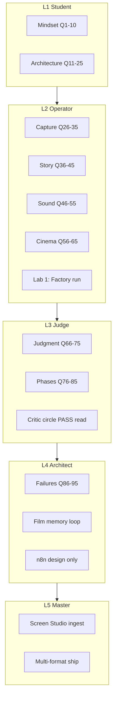

# Cinematic Trust Factory — 100 Q&A (Mastery Edition v4)

**Version:** 4.0.0 · **Date:** 2026-06-16  
**Edition:** Next-level — certification ladder · labs · deep dives · architect track  
**Sources:** GPT cinematic factory arc (4 stages) · critic circle · cinematic-film-factory · phases SSOT  
**Audience:** Founder + agents — **L1 study → L3 operator → L4 architect**

---

## Certification ladder

| Level | Name | Requirement | Unlocks |
|-------|------|-------------|---------|
| **L1** | Student | Read Modules 1–5 + score 12/15 on Quick Quiz (Part 11a) | Internal factory runs |
| **L2** | Operator | 100 Q&A complete + Part 11 exam 18/20 + 3 scenarios PASS | `witness-film-build.sh` with critic read |
| **L3** | Judge | L2 + Part 21 advanced 22/25 + pre-flight 10/10 | Public ship recommendations |
| **L4** | Architect | L3 + 2 labs (Part 16) + Deep Dives D1–D25 | Phase 3/4 design proposals |
| **L5** | Master | L4 + one critic PASS on Screen Studio ingest | Distribution + memory loop ownership |

**Rule:** No level skip. Judge before ship at every level.

---

## Mastery map (what unlocks what)



---

## Three study tracks

| Track | Who | Path | Time |
|-------|-----|------|------|
| **Agent** | Builder | Modules 1→10 → Part 11 → Lab 1 → Part 13 | 90 min |
| **Founder** | Decision | Q1–Q10 + Q66–Q75 + Part 19 decision tree + Q100 | 25 min |
| **Architect** | System design | All modules + D1–D25 + Part 21 + Labs 2–5 | 3 hrs |

---

## GPT evolution — 4 stages (curriculum spine)

| Stage | GPT name | You learn | SourceA status |
|-------|----------|-----------|----------------|
| **S1** | Minimal cinematic pipeline | Truth → beats → script → TTS → FFmpeg | **Shipped** — `cinematic-film-factory/` |
| **S2** | AI orchestration | OpenAI director · OpenRouter variants · n8n | **Routed** Phase 3 |
| **S3** | Commercial distribution | Multi-format · social APIs · metadata packs | **Routed** Phase 4 |
| **S4** | Self-healing intelligence | Incidents · rule evolution · closed loop | **Shipped v1** — `film_memory.py` |

**Build law:** S1 + S4 before S2 + S3. Orchestration multiplies garbage; memory prevents repeat garbage.

---

## How to study (v4)

| Step | Action | Cert impact |
|------|--------|-------------|
| 1 | Pick track (Agent / Founder / Architect) | — |
| 2 | Study modules in learning path | L1 |
| 3 | Part 11a Quick Quiz (15Q) → Part 11 Full (20Q) | L2 |
| 4 | Part 12 scenarios (5) — verbal PASS | L2 |
| 5 | Part 16 Lab 1 — factory run + read receipt | L2 |
| 6 | Part 21 Advanced (25Q) | L3 |
| 7 | Part 16 Labs 2–5 + Deep Dives D1–D25 | L4 |
| 8 | Screen Studio ingest + critic PASS | L5 |

**Legend:** 🎯 Trap · 📁 Disk · ⚡ Tier · ★ Difficulty (1–3) · 💡 Insight

**Memorize:** Q2 (product) · Q10 (real product) · Q100 (law)

---

## Learning path

```text
MODULE 1  Q1–10   ★     Mindset — compiler not video editor
MODULE 2  Q11–25  ★★    Architecture — layers, roles, event graph
MODULE 3  Q26–35  ★★    Truth capture — tier honesty
MODULE 4  Q36–45  ★★    Story — beats, script, dwell
MODULE 5  Q46–55  ★     Sound — VO vs capture tier
MODULE 6  Q56–65  ★★★  Cinema — FFmpeg limits
MODULE 7  Q66–75  ★★★  Judgment — critic before ship
MODULE 8  Q76–85  ★★    Roadmap — phases 0–5
MODULE 9  Q86–95  ★★★  Failures — institutional memory
MODULE 10 Q96–100 ★     Operations — commands, law
```

---

## Module 1 — Mindset (Q1–Q10) ★

**Teach:** You are building a **compiler**, not a video tool.  
💡 **Professor note:** If your team says “export a video,” correct them: “compile a proof artifact from system events.”

**Q1. ★ What am I building — a video editor or something else?**  
**A.** An **event-driven cinematic compiler** — real system behavior → timed beats → structural VO → cinema assembly → proof film.  
📁 `data/cinematic-film-factory-v1.json`  
🎯 Trap: “Our video tool” → CapCut/Canva thinking.

**Q2. ★ What is GPT’s one-sentence product definition?**  
**A.** **System behavior → cinematic proof compiler → multi-platform trust assets.**

**Q3. ★ Pipeline vs compiler?**  
**A.** Pipeline = run steps once. Compiler = **deterministic layers** (truth in → rules → film out). Variants = script A/B, not random rerenders.

**Q4. ★ Source of truth?**  
**A.** **Live product state** — Proof Lab `:8090`, SourceA `:5180` — never simulated dashboards.  
📁 `data/video-quality-bar-v1.json`

**Q5. ★ Factory output per run?**  
**A.** `final.mp4` + receipt + captions + beats.json + incident row + (later) multi-format pack.  
📁 `~/.sina/enforcement/cinematic-film-factory-receipt-v1.json`

**Q6. ★ Why no AI video generators on WitnessBC tier A?**  
**A.** Synthetic UI/face on a **trust product** = cognitive dissonance. Path A lock.  
📁 `commercial-film-routing-v1.json` → `rejects_as_hero`

**Q7. ★ Institutional vs tutorial?**  
**A.** Institutional = real proof + structural VO + editorial pacing (dwell, micro-cuts, SFX). Tutorial = screen record + voice.

**Q8. ★ Deterministic?**  
**A.** **Yes** — same beats + capture + rules → same assembly. Randomness only in variation layer (OpenRouter).

**Q9. ★ “Narrative proof infrastructure”?**  
**A.** Programmable layer: runtime governance → buyer-grade artifacts. Stripe : payments :: this : trust proof.

**Q10. ★★ Biggest conceptual mistake?**  
**A.** Treating **the MP4** as the product instead of **feedback + rule evolution** as the product.  
🎯 Trap: “Ship v7” without incident = infinite repeat loop.  
💡 **This is the entire GPT arc in one question.**

---

## Module 2 — Architecture (Q11–Q25) ★★

**Teach:** One job per layer. No layer theft.  
💡 **Professor note:** Architecture failures look like “we added AI everywhere” — role separation prevents that.

**Q11. ★★ Five minimal GPT layers?**  
**A.** Truth (Playwright) → Timing (beats) → Narrative (script) → Audio (TTS) → Editor (FFmpeg).

**Q12. ★★ Intelligence layer?**  
**A.** OpenAI = director · OpenRouter = variations · Decision engine = scene/proof selection.

**Q13. ★★ n8n role?**  
**A.** **Production OS** — plan → capture → TTS → ffmpeg → upload. Not IFTTT. **Phase 3 routed.**

**Q14. ★★ Execution layer?**  
**A.** Playwright + TTS API + FFmpeg container.

**Q15. ★★ Distribution layer?**  
**A.** One master → YouTube / TikTok / IG / LinkedIn / X + metadata. **Phase 4 routed.**

**Q16. ★★ Film Memory layer?**  
**A.** Incident → rule evolution → next compile uses patches.  
📁 `film_memory.py` · `cinematic-film-memory-incidents-v1.jsonl` · `cinematic-film-rules-evolved-v1.json`

**Q17. ★★ Director role?**  
**A.** **OpenAI** — structure, pacing, compliance semantics, beat optimization.

**Q18. ★★ Bulk writer role?**  
**A.** **OpenRouter** — hooks, CTAs, multilingual — never director.

**Q19. ★★ Lane separation?**  
**A.** Playwright ≠ copywriter · OpenAI ≠ pixel capture · FFmpeg ≠ truth observer.

**Q20. ★★ Event graph vs beats?**  
**A.** Graph: intent → hover → execute → policy → enforce → block → proof → audit. Beats: timestamps only.  
📁 `lanes/witnessbc/event_graph.json`

**Q21. ★★ Decision Engine?**  
**A.** Picks proof moments vs noise before edit. **Phase 3 routed.**

**Q22. ★★★ Cinematic Rules Engine?**  
**A.** IF block → hold 5–8s + zoom + tone. IF proof → slow + hash zoom. Not global vignette.  
📁 `cinematic-rules-engine-v1.json` · `assemble.py`

**Q23. ★★ SourceA code map?**  
**A.** **New:** `cinematic-film-factory/compiler.py`. **Legacy:** `commercial_short_film_v1.py`. **Judge:** `commercial_film_critic_circle_v1.py`.

**Q24. ★ Lane × tier SSOT?**  
**A.** `data/commercial-film-routing-v1.json`

**Q25. ★ Phase roadmap SSOT?**  
**A.** `data/commercial-film-factory-phases-v1.json`

---

## Module 3 — Truth capture (Q26–Q35) ★★

**Teach:** Honest tier labeling is professionalism.  
💡 **Professor note:** Tier C with A+ receipt is not optimism — it's fraud against your own buyer.

**Q26. ★★ Playwright’s job?**  
**A.** **Observe** real behavior · emit beats · zero simulation.

**Q27. ★★ Headless for public hero?**  
**A.** GPT: `headless=False` for smooth capture. Auto headless = **tier C**. ⚡ C ≠ public hero.

**Q28. ★★★ Playwright → Linear quality alone?**  
**A.** **No** for public ship. Linear = human-smooth + crisp UI = **S/A**.

**Q29. ★★ Playwright tier?**  
**A.** **C** — internal compiler / regression only.

**Q30. ★★ WitnessBC real state?**  
**A.** Proof Lab — scenarios, tamper FAIL, receipt hash, audit on `:8090`.

**Q31. ★★ WitnessBC URL + entry?**  
**A.** `http://127.0.0.1:8090/proof.html` · `bash witness-film-build.sh`

**Q32. ★★ When Playwright is right?**  
**A.** beats.json · compiler dev · CI regression · factory truth lane.

**Q33. ★★★ When Playwright is wrong for ship?**  
**A.** Homepage hero · sales outbound · investor film · tier A slots.

**Q34. ★★ No fake UI?**  
**A.** Live routes only. Remotion **cards** OK — not hero replacement.

**Q35. ★★★ Screen Studio vs Playwright?**  
**A.** Screen Studio = **S/A master**. Playwright = **C truth engine**.  
📁 `sourcea_commercial_film_ingest_master_v1.py`

---

## Module 4 — Story & timing (Q36–Q45) ★★

**Teach:** Meaning = pacing, not duration.

**Q36. ★★ beats.json?**  
**A.** Timing manifest — attempt/block/receipt + event-graph keys (seconds from T0).

**Q37. ★★ Who writes beats?**  
**A.** Capture layer only — `capture.py` or Screen Studio timeline marks.

**Q38. ★★ No Whisper?**  
**A.** Captions from beats + script SSOT — editorial control, no ASR drift.

**Q39. ★★ script.txt?**  
**A.** Narrative SSOT — structural VO, no fluff.  
📁 `lanes/witnessbc/script.txt`

**Q40. ★ Good VO line?**  
**A.** “When violations occur, execution is blocked. Every decision generates a cryptographic receipt.”

**Q41. ★ Bad VO?**  
**A.** Jargon soup · hype · TikTok hooks on GRC hero.

**Q42. ★★ Caption alignment?**  
**A.** Beat-range per line (`captions.py`) OR ElevenLabs timestamps → SRT/ASS.

**Q43. ★★ beats_timing.json (legacy)?**  
**A.** Rich manifest: beat windows, URL dwell, capture durations.

**Q44. ★★ Micro-cut acts?**  
**A.** Intent 0–4s → action 4–10s → **block 10–18s** → proof 18–25s → system 25–30s.

**Q45. ★★★ Block dwell?**  
**A.** **5–8 seconds** — GPT rule #1.  
🎯 Trap: 2s block flash = proof missed.

---

## Module 5 — Sound (Q46–Q55) ★

**Teach:** VO is necessary; capture tier is sufficient for quality ceiling.

**Q46. ★ ElevenLabs for institutional?**  
**A.** **Yes** — matches GPT commercial voice strategy.

**Q47. ★ macOS `say` for public hero?**  
**A.** Dev fallback only.

**Q48. ★ Silent segment bug?**  
**A.** Video-only concat dropped audio — compiler bug, not VO.

**Q49. ★★★ VO the main problem?**  
**A.** **No.** VO often strong · capture tier weak.

**Q50. ★ vo_lane?**  
**A.** `witnessbc` | `sourcea` — cache partition · shared key.

**Q51. ★★ elevenlabs_timestamps?**  
**A.** Word timing from API — captions without Whisper.

**Q52. ★ Re-fetch VO every retry?**  
**A.** **No** — cache unless script changes.

**Q53. ★★ Minimal SFX (GPT)?**  
**A.** click · error tone · confirm ding · optional hum.

**Q54. ★★ SFX in factory pathway?**  
**A.** `assemble.py` — sine bursts at block + receipt beats.

**Q55. ★★★ Great VO saves bad video?**  
**A.** **No.** Pro voice on tier C still reads cheap.

---

## Module 6 — Cinema (Q56–Q65) ★★★

**Teach:** FFmpeg emphasizes truth pixels — never creates them.

**Q56. ★★ FFmpeg role?**  
**A.** Grade · zoom on block · captions · loudness · concat — **never** capture.

**Q57. ★★★ Three GPT cinematic enhancements?**  
**A.** (1) Block zoom/hold (2) Micro-cut rhythm (3) Sound design.

**Q58. ★★ Grade?**  
**A.** contrast ~1.08 · brightness ~-0.02 — not heavy vignette.

**Q59. ★★ No vignette on auto capture?**  
**A.** Hides sellable UI — quality bar forbids.

**Q60. ★★ Linear reference?**  
**A.** 3840×2160 · 30fps · ~2533 kbps.  
📁 `video-quality-bar-v1.json`

**Q61. ★★★ v5 aspect failure?**  
**A.** 3840×1080 — wrong master_height — tier **F**.

**Q62. ★★ _master_polish?**  
**A.** Upscale · grade · loudnorm on existing pixels.

**Q63. ★★ Min 4K bitrate (critic)?**  
**A.** **3000 kbps**.

**Q64. ★★ finish-from-raw upgrade?**  
**A.** **No** — recovery only.

**Q65. ★★★ Polish C→A?**  
**A.** **Impossible.**

---

## Module 7 — Judgment (Q66–Q75) ★★★

**Teach:** Receipt grade ≠ market grade. Critic wins.

**Q66. ★★★ Critic circle?**  
**A.** Observe · Analyze · Search · Learn · Improve.  
📁 `commercial_film_critic_circle_v1.py`

**Q67. ★★ Run critic?**  
**A.** `python3 scripts/commercial_film_critic_circle_v1.py --json`

**Q68. ★★★ Current public verdict?**  
**A.** **BLOCK** — tier C/F · inflation · missing audio cases.

**Q69. ★★ Tiers S/A/B/C/F?**  
**A.** S=Screen Studio 4K · A=ingest · B=W1 · C=Playwright · F=broken.

**Q70. ★★★ Min public tier?**  
**A.** **A** (S preferred).

**Q71. ★★★ Grade inflation?**  
**A.** Receipt A+ · capture C.

**Q72. ★★ Freeze flag?**  
**A.** `~/.sina/commercial-film-render-frozen-v1.flag`

**Q73. ★★ R16?**  
**A.** acquire fails while freeze ON.

**Q74. ★★ Quality bar?**  
**A.** `data/video-quality-bar-v1.json`

**Q75. ★★ Critic vs founder judgment?**  
**A.** **Aligned** — BLOCK validates “stop trash videos.”

---

## Module 8 — Roadmap (Q76–Q85) ★★

**Teach:** Compiler + memory first · distribution last.

**Q76. ★★ Phase 0?**  
**A.** Compiler built · tier C internal · not public acceptable.

**Q77. ★★ Phase 1?**  
**A.** Cinematic rules + factory pathway shipped · public needs S/A capture.

**Q78. ★★ Phase 2?**  
**A.** Multi-format — **routed**.

**Q79. ★★ Phase 3?**  
**A.** n8n + OpenAI + OpenRouter — **after** PASS master.

**Q80. ★★ Phase 4?**  
**A.** Social APIs — **after** Phase 2.

**Q81. ★★ Phase 5?**  
**A.** **Shipped v1** — film_memory + incidents + rule patches.

**Q82. ★★★ n8n before master?**  
**A.** **No** — multiplies garbage.

**Q83. ★★ Path A lock?**  
**A.** Product-led institutional hero · no synthetic avatar tier A.

**Q84. ★★ Avatar/HeyGen?**  
**A.** Tier C social · LinkedIn volume — routed not rejected.

**Q85. ★★★ ONE next work?**  
**A.** Screen Studio → ingest → critic PASS.

---

## Module 9 — Failures (Q86–Q95) ★★★

**Teach:** Institutional memory = never repeat the same mistake twice.

**Q86. ★★★ “One more render” fixes tier C?**  
**A.** **No** without capture-tier fix.

**Q87. ★★ Parallel renders?**  
**A.** Forbidden — R1 one global render.

**Q88. ★★★ Trust receipt A+ alone?**  
**A.** **No** — critic is ship gate.

**Q89. ★★ cinematic_finish on C?**  
**A.** Hides UI · does not create Linear look.

**Q90. ★★ Ship without audio probe?**  
**A.** Historical disaster — `require_audio` now.

**Q91. ★★★ Skip observe?**  
**A.** Violates GPT core loop.

**Q92. ★★★ Distribute before PASS?**  
**A.** Garbage on every platform.

**Q93. ★★ OpenRouter as director?**  
**A.** **Wrong role.**

**Q94. ★★ Remotion as hero?**  
**A.** Cards only — not truth.

**Q95. ★★★ Our loop vs GPT loop?**  
**A.** We: Gen→Render→Render. GPT: Gen→Render→**Observe→Learn→Improve**.

---

## Module 10 — Operations (Q96–Q100) ★

**Q96. ★ Check freeze?**  
**A.** `python3 scripts/commercial_film_render_guard_v1.py status --json`

**Q97. ★ Machine readiness?**  
**A.** `machine-check --json` · Mac Guard `:13024`

**Q98. ★★★ ONE next action (Grade A)?**  
**A.** Screen Studio 4K → `sourcea_commercial_film_ingest_master_v1.py` → critic PASS.

**Q99. ★★ Before landing hero embed?**  
**A.** Critic PASS · tier ≥ A · audio · correct lane publish.

**Q100. ★★★ One-line law?**  
**A.** **Compiler once · observe every output · never ship C as A · improve capture tier and rules — not render count.**

---

## Part 11a — Quick Quiz (15Q · L1 gate · need 12/15)

| # | Q | A |
|---|---|---|
| QZ1 | Video editor or compiler? | Compiler |
| QZ2 | Source of truth? | Live product |
| QZ3 | Playwright public hero tier? | C — not for public |
| QZ4 | Block dwell seconds? | 5–8 |
| QZ5 | VO saves bad capture? | No |
| QZ6 | Polish upgrades tier? | No |
| QZ7 | Critic vs receipt? | Critic wins |
| QZ8 | GPT real product? | Feedback + rules |
| QZ9 | n8n before PASS master? | No |
| QZ10 | OpenAI role? | Director |
| QZ11 | OpenRouter role? | Variations |
| QZ12 | Factory entry WitnessBC? | `witness-film-build.sh` |
| QZ13 | Freeze flag path? | `commercial-film-render-frozen-v1.flag` |
| QZ14 | Min public tier? | A |
| QZ15 | One-line law? | Q100 answer |

---

## Part 11 — Full exam (20Q · L2 gate · need 18/20)

| # | Question | Answer |
|---|----------|--------|
| E1 | v6 Playwright fix tier C? | **No** |
| E2 | Receipt A+, critic C? | **Critic** |
| E3 | VO great, video bad? | **Capture** |
| E4 | After failed public film? | **Critic + incident** |
| E5 | block_playwright_hero? | **No public PW hero** |
| E6 | finish-from-raw upgrades? | **No** |
| E7 | n8n before master? | **Forbidden** |
| E8 | OpenAI vs OpenRouter? | **Director vs variations** |
| E9 | Film memory product? | **Feedback → rules** |
| E10 | Min RAM R2? | **4 GB** |
| E11 | R1 prevents? | **Parallel renders** |
| E12 | Whisper captions? | **No** |
| E13 | HeyGen WitnessBC tier A? | **Blocked** |
| E14 | Linear height? | **2160** |
| E15 | Block dwell? | **5–8s** |
| E16 | Unfreeze when? | **S/A PASS ingest** |
| E17 | Grade inflation? | **A+ receipt, C capture** |
| E18 | Mac Guard? | **R9 machine gate** |
| E19 | Deterministic variants? | **Script A/B** |
| E20 | Compiler input? | **System events** |

---

## Part 12 — Scenario lab (5 cases · L2)

| # | Case | Correct action |
|---|------|----------------|
| S1 | “v6 will fix v5” | STOP · critic · incident · Screen Studio |
| S2 | Receipt PASS, critic BLOCK | Ship nothing |
| S3 | VO budget low, video C | Do not ship · pause rerenders |
| S4 | HeyGen witnessbc.com hero | Refuse tier A · route tier C |
| S5 | machine-check BLOCK | Wait/heal · no parallel push |

---

## Part 13 — Pre-flight (10 items · L3)

All YES for public ship · any NO → STOP. (Same as v3 — see Part 15 disk map for commands.)

---

## Part 16 — Hands-on labs (L2–L5)

| Lab | Level | Command | Pass criteria |
|-----|-------|---------|---------------|
| **L1** | L2 | `bash scripts/validate-cinematic-film-factory-v1.sh` | PASS |
| **L2** | L2 | `CINEMATIC_SKIP_CAPTURE=1 bash witness-film-build.sh` | Receipt written · probe has audio |
| **L3** | L3 | `python3 scripts/commercial_film_critic_circle_v1.py --json` | Read verdict + issues · no argue |
| **L4** | L3 | `python3 scripts/commercial_film_render_guard_v1.py status --json` | Interpret freeze + R16 |
| **L5** | L5 | Record Screen Studio → `sourcea_commercial_film_ingest_master_v1.py` | Critic tier ≥ A |

---

## Part 17 — Deep dives (D1–D25 · L4)

| ID | Topic | Mastery insight |
|----|-------|-----------------|
| D1 | Compiler metaphor | Like GCC: source=events, object=beats, link=ffmpeg, binary=final.mp4 |
| D2 | Trust compression | Institutional film compresses 5-min sales cycle into 30s proof density |
| D3 | Event graph | Typed moments enable typed cinema rules — beats alone cannot |
| D4 | BLOCK as hero moment | For GRC buyer, block is climax — not embarrassment |
| D5 | Receipt hash frame | Cryptographic proof needs **dwell** not **flash** |
| D6 | Tier honesty | Labeling C as C protects founder credibility |
| D7 | Grade inflation mechanics | Pipeline grades process · critic grades pixels |
| D8 | Freeze semantics | Freeze is **governance**, not punishment |
| D9 | Lane isolation | WitnessBC v5 must not publish to SourceA OUT_LANDING |
| D10 | VO lane cache | Same key, separate namespaces — cost control |
| D11 | SFX psychology | 3 sounds = attention routing without music bed |
| D12 | zoompan on block | Spatial emphasis = “this moment matters” |
| D13 | Micro-cuts | Rhythm creates narrative without voice saying “now watch” |
| D14 | Screen Studio delta | Human cursor + OS compositor = tier jump Playwright cannot fake |
| D15 | ingest path | Ingest = truth upgrade without rewriting compiler |
| D16 | Incident schema | dropoff + confusion_zone + next_fix = experiment record |
| D17 | Rule evolution | Patches are **surgical** — not full rules rewrite |
| D18 | Closed loop | Output quality emerges from **memory**, not single heroic edit |
| D19 | n8n timing | Control plane after **signal** (PASS), not before |
| D20 | OpenRouter scope | Volume creativity — never compliance director |
| D21 | Multi-format | Same truth · different **framing** per platform |
| D22 | LinkedIn institutional | No hype hooks · proof density max |
| D23 | TikTok hook cut | First 2s from block moment — different compiler variant |
| D24 | Phase gating | Building Phase 4 before Phase 0 honesty = category error |
| D25 | L5 definition | Master = one PASS artifact + documented incident loop |

---

## Part 18 — Trap encyclopedia (top 20)

| # | Trap | Truth |
|---|------|-------|
| T1 | “It’s just a video” | It's a compiler |
| T2 | “One more render” | Fix tier or rules first |
| T3 | “VO will save it” | Capture ceiling dominates |
| T4 | “Polish to Linear” | Polish ≠ tier upgrade |
| T5 | “Receipt says A+” | Critic wins |
| T6 | “Headless is fine for hero” | Tier C only |
| T7 | “Skip critic this once” | Violates core loop |
| T8 | “Ship to learn” | Learn internally · ship after PASS |
| T9 | “HeyGen for GRC hero” | Path A blocks |
| T10 | “n8n will fix workflow” | Garbage in → garbage out |
| T11 | “Whisper for speed” | Loses editorial control |
| T12 | “2s block is enough” | 5–8s GPT law |
| T13 | “Parallel renders faster” | R1 corruption risk |
| T14 | “Remotion = product demo” | Truth capture required |
| T15 | “OpenRouter as director” | Role violation |
| T16 | “Distribution first” | Proof before reach |
| T17 | “MP4 is the product” | Memory is the product |
| T18 | “Ignore freeze” | R16 hard stop |
| T19 | “Cross-lane publish OK” | Lane isolation law |
| T20 | “v6 naming fixes v5” | Version number ≠ tier fix |

---

## Part 19 — Decision tree (founder / agent)

```text
Need a public hero film?
├─ NO → internal only: witness-film-build.sh OK (tier C labeled)
└─ YES
   ├─ critic PASS on file? ─ NO → STOP rerender
   │                              ├─ capture tier < A? → Screen Studio + ingest
   │                              ├─ rules issue? → read incident · patch rules
   │                              └─ re-run critic only after fix
   └─ YES → tier ≥ A? ─ NO → STOP
            └─ YES → audio? geometry? lane? ─ ALL YES → ship embed
```

---

## Part 20 — Competency matrix

| Skill | L1 | L2 | L3 | L4 | L5 |
|-------|----|----|----|----|-----|
| Explain compiler vs pipeline | ✓ | ✓ | ✓ | ✓ | ✓ |
| Run factory pathway | — | ✓ | ✓ | ✓ | ✓ |
| Interpret critic BLOCK | — | ✓ | ✓ | ✓ | ✓ |
| Honest tier labeling | — | ✓ | ✓ | ✓ | ✓ |
| Design event graph + rules | — | — | — | ✓ | ✓ |
| Phase 3/4 architecture | — | — | — | ✓ | ✓ |
| Screen Studio ingest PASS | — | — | — | — | ✓ |
| Own memory loop | — | — | — | — | ✓ |

---

## Part 21 — Advanced exam (25Q · L3 gate · need 22/25)

| # | Question | Answer |
|---|----------|--------|
| A1 | What is S4 in GPT curriculum? | Self-healing memory loop |
| A2 | What file patches block dwell evolution? | `cinematic-film-rules-evolved-v1.json` |
| A3 | Compiler receipt schema? | `cinematic-film-factory-receipt-v1` |
| A4 | Legacy vs new pathway entry? | `witnessbc-commercial-film.sh` vs `witness-film-build.sh` |
| A5 | Does skip-capture skip truth? | Yes — reuses prior capture |
| A6 | zoompan variable in assemble? | `in_time` at block window |
| A7 | Why captions.py not Whisper? | Deterministic beat-script alignment |
| A8 | incident next_fix example? | increase hold 3s→6s |
| A9 | Phase 5 shipped component? | film_memory.py |
| A10 | Min bitrate 4K critic? | 3000 kbps |
| A11 | witnessbc work dir? | `~/.sina/cinematic-film-factory/witnessbc` |
| A12 | Event proof_generation maps to legacy beat? | receipt |
| A13 | Can factory bypass render freeze? | New pathway separate from legacy acquire |
| A14 | ICP avatar tier A GRC? | Blocked — L1/L4 routing only |
| A15 | GPT Stage S2 status? | Routed Phase 3 |
| A16 | Three brain roles in order? | Director · Writer · Truth |
| A17 | Institutional vs TikTok first 2s? | Proof density vs hook |
| A18 | Grade inflation fix? | Critic + honest receipt |
| A19 | R1 purpose? | One render globally |
| A20 | proof density bar origin? | Claude/GPT critic merge — sales cycle collapse |
| A21 | FFmpeg creates pixels? | Never |
| A22 | publish_allowed in factory receipt? | false when critic BLOCK |
| A23 | rules_engine block_event hold max? | 8s default |
| A24 | L5 unlock? | Screen Studio PASS |
| A25 | Master one-line law? | Q100 |

---

## Part 22 — Agent certification checklist (L2 minimum)

- [ ] Scored 12/15 Quick Quiz (11a)
- [ ] Scored 18/20 Full Exam (11)
- [ ] 5/5 scenarios verbal PASS (12)
- [ ] Lab 1 validator PASS
- [ ] Lab 2 factory receipt read — stated tier + critic verdict
- [ ] Lab 3 critic run — quoted `factory_now_line` equivalent
- [ ] Can recite Q2, Q10, Q100 without notes
- [ ] Signed: “I will not ship C as A”

---

## Part 23 — Spaced review calendar

| Day | Review | Minutes |
|-----|--------|---------|
| D0 | Modules 1–5 + Quick Quiz | 30 |
| D1 | Modules 6–10 + Full Exam | 30 |
| D3 | Part 18 traps + Part 19 tree | 15 |
| D7 | Part 21 Advanced + Lab 2 | 25 |
| D14 | Deep D1–D25 skim | 20 |
| D30 | Full recert — exam + critic run | 45 |

---

## Part 24 — Amateur vs institutional (comparison)

| Dimension | Amateur | Institutional |
|-----------|---------|---------------|
| Truth | Simulated or generic UI | Live Proof Lab |
| Timing | Continuous scroll | Event graph + dwell |
| Voice | Random TTS | Structural script SSOT |
| Edit | One take + filter | Rules engine + micro-cuts |
| Sound | Music bed | 3 intentional SFX cues |
| Ship gate | “Looks OK” | Critic circle PASS |
| Learning | Hope | Incident → rule patch |
| Product | MP4 file | Memory system |

---

## Part 14 — Keyword index

| Keyword | Q# / Part |
|---------|-----------|
| compiler | Q1, Q3, D1 |
| certification | Ladder, Part 22 |
| cinematic-factory | Q5, Q23, Lab 2 |
| critic | Q66–75, Lab 3 |
| tier C | Q29, Q33, T6 |
| Screen Studio | Q35, Q85, Lab 5 |
| block dwell | Q45, E15, D12 |
| film memory | Q16, D16–D18 |
| traps | Part 18 |
| decision tree | Part 19 |

---

## Part 15 — SSOT disk map

| Topic | Path |
|-------|------|
| **100 Q&A Mastery (this file)** | `data/CINEMATIC_FACTORY_100_QA_v1.md` |
| Factory pathway | `data/cinematic-film-factory-v1.json` |
| Rules engine | `data/cinematic-rules-engine-v1.json` |
| Compiler | `cinematic-film-factory/compiler.py` |
| WitnessBC entry | `bash witness-film-build.sh` |
| Critic | `scripts/commercial_film_critic_circle_v1.py` |
| Render guard | `scripts/commercial_film_render_guard_v1.py` |
| Ingest (Grade A) | `scripts/sourcea_commercial_film_ingest_master_v1.py` |
| Factory receipt | `~/.sina/enforcement/cinematic-film-factory-receipt-v1.json` |
| Memory incidents | `~/.sina/cinematic-film-memory-incidents-v1.jsonl` |
| Rules evolved | `~/.sina/cinematic-film-rules-evolved-v1.json` |
| Freeze | `~/.sina/commercial-film-render-frozen-v1.flag` |

---

## Quick reference card (laminate)

| Question | Answer |
|----------|--------|
| Edition | **Mastery v4** |
| Cert levels | L1 Student → L5 Master |
| Building? | Cinematic **compiler** |
| Public min tier? | **A** (S preferred) |
| Playwright tier? | **C** internal |
| Real GPT product? | **Memory + rules** |
| Factory command? | `bash witness-film-build.sh` |
| Current verdict? | **BLOCK** |
| ONE next action? | Screen Studio → ingest → PASS |
| Law (Q100)? | Observe · never ship C as A |

---

## Version history

| Version | Change |
|---------|--------|
| 1.0.0 | Initial 100 Q&A |
| 2.0.0 | Exam · scenarios · pre-flight |
| 3.0.0 | Lesson edition · factory pathway |
| 4.0.0 | **Mastery** — cert ladder L1–L5 · mermaid map · GPT 4-stage · ★ difficulty · 15Q quick quiz · 25Q advanced · D1–D25 deep dives · 20 traps · decision tree · competency matrix · 5 labs · spaced review · amateur vs institutional |
