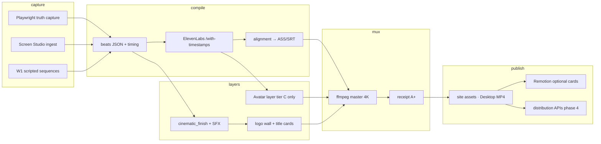

# Commercial Film Factory — Master Plan v1

**Date:** 2026-06-15  
**Machine SSOT:** `data/commercial-film-routing-v1.json`  
**Phases SSOT:** `data/commercial-film-factory-phases-v1.json`  
**Founder lock:** Path A — institutional hero finish + factory routing (ASF 2026-06-15)

---

## Executive summary

The **SourceA Commercial Film Factory** is an **event-driven cinematic compiler**, not a video editor. It turns **live product behavior** (Playwright truth capture, W1 sequences, beats timing) into **institutional proof films** with receipts — then **routes** the same factory to portfolio lanes (WitnessBC, SourceA, TrustField, Noetfield, Fitness) by **lane × tier**.

Advisor ideas (GPT, Claude Opus, Soonet, Gemini) are **never deleted** — they are **accepted**, **routed**, or **rejected per lane** in the routing SSOT. Path A rejects synthetic avatar heroes on trust products; it accepts cinematic finish, SFX, logo wall, and tier-C avatar tests on consumer lanes.

**Vision:** One compiler stack → many products → optional orchestration (n8n, OpenRouter) → optional distribution → optional film memory loop.

---

## What is LIVE now (Phase 0 + avatar v1 + v5 queued)

| Component | Status | Evidence |
|-----------|--------|----------|
| **Deterministic film compiler** | LIVE | `scripts/commercial_short_film_v1.py` |
| **WitnessBC hero (v1 beats)** | LIVE / v4 extended in progress | `witnessbc-commercial-film.sh` · `data/witnessbc-commercial-film-beats-v1.json` |
| **WitnessBC cinematic v5** | QUEUED (beats ready) | `data/witnessbc-commercial-film-beats-v5.json` · waiter script `~/.sina/witnessbc-commercial-v5-after-v4.sh` |
| **SourceA W1 proof cut (32s)** | LIVE · sync fixed | `sourcea-commercial-film.sh` · `w1_block`/`w1_tamper` sync · grade A+ |
| **Sync validator** | LIVE | `scripts/validate-commercial-film-sync-v1.sh` |
| **ElevenLabs VO + ASS alignment** | LIVE | `scripts/film_elevenlabs_wire_v1.py` · `scripts/elevenlabs_alignment_to_ass_v1.py` |
| **Routing SSOT + validator** | LIVE | `data/commercial-film-routing-v1.json` · `scripts/validate-commercial-film-routing-v1.sh` |
| **Avatar pipeline v1** | LIVE | `scripts/avatar_pipeline_v1.py` · `avatar-pipeline.sh` |
| **HeyGen v3 auto-generate** | WIRED (needs key + headshot) | `scripts/heygen_avatar_wire_v1.py` · `scripts/heygen_avatar_setup_v1.py --check` |
| **Remotion title cards** | Scaffold | `commercial-video-factory/` · not hero capture replacement |
| **n8n / film memory / publish APIs** | ROUTED future | Phase 3–5 in factory-phases doc |

---

## GPT / advisor ideas ledger

| Idea | Source | Status | Maps to | Phase |
|------|--------|--------|---------|-------|
| Minimal Playwright + ffmpeg stack | GPT | **accepted · already built** | `commercial_short_film_v1.py` | 0 |
| Outcome VO (not jargon) | GPT | **accepted** | witnessbc · sourcea · noetfield copy | 0–1 |
| Cinematic language + SFX | GPT | **accepted** | `polish.sfx` · `_mix_vo_sfx` | 1 |
| Cinematic rules engine | GPT | **accepted** | `cinematic_finish` · `_cinematic_vf` · tamper dwell | 1 |
| Event graph (beats + w1_sequence) | GPT | **routed** | `beats_timing.json` · `w1_sequence` | 1 |
| make_film shell commands | GPT | **partial** | `witnessbc-commercial-film.sh` · `sourcea-commercial-film.sh` | 0 |
| n8n orchestration brain | GPT / Claude | **routed** | webhook → director → capture → TTS → mux | 3 |
| OpenRouter hook/CTA variations | GPT | **routed** | script A/B in orchestration layer | 3 |
| Decision engine (AI planner) | GPT | **routed** | OpenAI director in phase 3 | 3 |
| Production docker-compose | GPT | **future** | VPS / Railway playwright + n8n | 3 |
| Film memory + rule evolution | GPT | **routed** | SQLite/Supabase + analyzer loop | 5 |
| Multi-format export | GPT | **routed** | 16:9 master → 9:16 / 1:1 social | 2 |
| Digital twin / personal media engine | GPT / Soonet | **routed · v1 scaffold** | `avatar_pipeline_v1.py` · tier C only | 0 + avatar |
| Finishing ≠ format pivot | Claude Opus | **accepted** | Path A finish — not HeyGen hero | 1 |
| Logo wall credibility frame | Soonet / Opus | **accepted** | TRUST beat · `_built_on_wall_png` | 1 |
| Dark frame + zoom hold | Gemini | **accepted visual · rejected copy** | `_cinematic_vf` · BLOCK dwell 5–8s | 1 |
| HeyGen avatar hero | Soonet | **routed_not_rejected** | tier C · trustfield test only | avatar |
| 30s Instagram script | Soonet / Opus | **routed** | `witnessbc-commercial-social-30s-beats-v1.json` | 2 |
| Founder selfie sign-off | Soonet | **routed** | tier C · 3s real face | 2 |
| Linear 4K reference | Founder | **accepted** | `video-quality-bar-v1.json` · 3840×2160 master | 0 |
| Full AI kernel / Decision Cloud rewrite | GPT (architecture paste) | **rejected for film factory** | Premature — not film scope | — |
| Synthetic avatar on WitnessBC tier A | Path A lock | **rejected per lane** | `founder_lock.rejects_as_hero` | — |

---

## Pipeline architecture



**Compiler contract:** Input = beats JSON + live URL base. Output = MP4 + receipt. No manual timeline editing in the hot path.

---

## Lane × tier matrix

| Lane | Tier A hero | Tier B proof | Tier C social | Tier D GTM | Avatar policy |
|------|-------------|--------------|---------------|------------|---------------|
| **witnessbc** | ACTIVE · v1 live · v5 queued | — | draft 30s beats | — | **no synthetic hero** |
| **sourcea** | queued full hero | ACTIVE 32s proof | — | — | none |
| **trustfield** | draft beats | — | draft · HeyGen OK | outbound attach | real founder tier C · no synthetic tier A |
| **noetfield** | draft NF-001 hero | — | draft 30s | — | real preferred tier C |
| **fitness** | — | — | placeholder | — | HeyGen / UGC open |
| **virlux** | — | — | not drafted | — | TBD |

**vo_lane cache split:** `witnessbc` → `~/.sina/film-voice-cache-witnessbc-v1/` · `sourcea` → `~/.sina/film-voice-cache-sourcea-v1/`

---

## Avatar / digital twin factory

**Purpose:** Master human asset → ElevenLabs VO → optional HeyGen talking photo → LinkedIn / social — **never** WitnessBC tier A hero.

| Item | Path / command |
|------|----------------|
| Config | `data/avatar-pipeline-config-v1.json` |
| Scripts | `data/avatar-scripts-v1.json` |
| Entry | `bash avatar-pipeline.sh linkedin` |
| Work root | `~/.sina/avatar-pipeline-v1/` |
| Master image | `~/.sina/avatar-pipeline-v1/master-image.jpg` (or Desktop founder headshot) |
| HeyGen env | `~/.sina/heygen-v1.env` → `HEYGEN_API_KEY` |
| ElevenLabs env | `~/.sina/elevenlabs-v1.env` |
| Manual mux | `python3 scripts/avatar_pipeline_v1.py --lane linkedin --avatar-video ~/Downloads/heygen-export.mp4 --json` |

**Quality tier (target):** 1080p talking photo · natural motion · institutional LinkedIn anchor 20–40s.

**Blocked by design:** `witnessbc.tier_A_hero` · any synthetic face as institutional GRC hero (cognitive dissonance on trust product).

**Gap:** Founder must add `HEYGEN_API_KEY` + master headshot before first auto render. Manual fallback + `--avatar-video` mux still available.

---

## Cinematic finish rules (Path A v5)

Enable in beats JSON:

```json
"cinematic_finish": true,
"polish": { "sfx": true, "cinematic_finish": true }
```

| Rule | Implementation | Reference |
|------|----------------|-----------|
| Dark-framed UI composite | `_cinematic_vf()` | witnessbc v5 · sourcea proof |
| SFX under VO | `_mix_vo_sfx()` | `polish.sfx: true` |
| Logo wall (credibility, not co-mark) | `_built_on_wall_png()` | sourcea TRUST beat |
| Tamper dwell | `tamper_dwell_seconds: 9.5` on TAMPER beat | witnessbc beats |
| BLOCK moment hold | 5–8s zoom hold | cinematic vf beat_id=BLOCK |
| Extended broll after VO | mux apad fix | v4 extended runtime |
| 4K master | `master_width/height: 3840×2160` | `video-quality-bar-v1.json` |
| Outcome narration | Policy violated · Execution stopped · Tamper FAIL | reject Gemini jargon |

**Proof reference cut:** `data/commercial-short-film-beats-v1.json` (SourceA — cinematic_finish already ON).

---

## Phases 1–5 roadmap

### Phase 0 — Deterministic compiler (LIVE)

**Acceptance:** Hero MP4 + receipt from shell one-tap · routing validator PASS · ElevenLabs or edge fallback · Playwright capture on live port.

### Phase 1 — Cinematic rules engine (QUEUED)

**Acceptance:** WitnessBC v5 render with `cinematic_finish + sfx` · dark frame visible · SFX audible on BLOCK/TAMPER · receipt v5 logged.

### Phase 2 — Multi-format (DRAFT beats saved)

**Acceptance:** 30s social cut from `witnessbc-commercial-social-30s-beats-v1.json` · same capture + VO · chapter-only or crop rules documented.

### Phase 3 — n8n / API orchestration (ROUTED)

**Acceptance:** Webhook trigger → beats JSON → capture → TTS → mux → R2 upload → receipt — one end-to-end headless run without Cursor.

### Phase 4 — Distribution (ROUTED)

**Acceptance:** Per-run bundle: `final.mp4` · `caption.txt` · `hashtags.json` · `thumbnail.png` · one API publish smoke test.

### Phase 5 — Film memory loop (ROUTED)

**Acceptance:** Render incident row · analyzer proposes rule delta · next render reads updated cinematic rules from SSOT.

---

## Founder commands cheat sheet

```bash
# Validators (run before ship)
bash scripts/validate-commercial-film-routing-v1.sh
bash scripts/validate-avatar-pipeline-v1.sh

# WitnessBC institutional hero (v1 default entry)
bash witnessbc-commercial-film.sh --json

# WitnessBC cinematic v5 (after v4 lands — or explicit beats)
python3 scripts/witnessbc_commercial_film_v1.py \
  --beats data/witnessbc-commercial-film-beats-v5.json --json

# SourceA W1 proof cut (32s cinematic reference)
bash sourcea-commercial-film.sh --json

# Screen Studio ingest (hand-polished master)
python3 scripts/sourcea_commercial_film_ingest_master_v1.py

# Draft lane renders
python3 scripts/commercial_short_film_v1.py \
  --beats data/trustfield-commercial-film-beats-v1.json --product trustfield --json

# Avatar / digital twin (tier C · LinkedIn)
bash avatar-pipeline.sh linkedin
bash avatar-pipeline.sh trustfield_social

# Remotion prospect reel (not hero replacement)
python3 scripts/remotion_artifact_factory_v1.py --sample --json
```

**Receipt paths:**

| Lane | Receipt |
|------|---------|
| WitnessBC | `~/.sina/enforcement/witnessbc-commercial-film-receipt-v1.json` (v5: `…-v5.json`) |
| SourceA | `~/.sina/enforcement/commercial-short-film-receipt-v1.json` |
| Avatar | `~/.sina/avatar-pipeline-v1/receipt-{lane}.json` |

---

## Next 10 factory work items (ordered)

1. **Land WitnessBC v4 extended** — complete GOVERNANCE→PRICING capture · verify Desktop MP4 + receipt.
2. **Render WitnessBC v5 cinematic** — `witnessbc-commercial-film-beats-v5.json` · sfx + dark frame · receipt v5.
3. **Run first HeyGen avatar** — `heygen_avatar_setup_v1.py --check` · headshot · `bash avatar-pipeline.sh linkedin`.
4. **Drop master image** — `~/.sina/avatar-pipeline-v1/master-image.jpg` · run `avatar-pipeline.sh linkedin`.
5. **Render 30s social cut** — `witnessbc-commercial-social-30s-beats-v1.json` (phase 2 proof).
6. **TrustField draft hero** — lock capture base · first `--product trustfield` render.
7. **Wire v5 into routing** — flip `cinematic_finish_v5_queued: false` when receipt PASS.
8. **Remotion bridge** — title card only for TrustField/Noetfield CTAs if Playwright titles insufficient.
9. **Phase 3 spike** — n8n webhook → existing shell entrypoints (no greenfield compiler).
10. **Film memory schema** — `film_memory` table design + incident row per render (phase 5 prep).

---

## Cursor skills (agent workflows)

| Skill | Purpose |
|-------|---------|
| `skill-commercial-film-factory` | Hero renders · beats · routing · v4/v5 · receipts · sync |
| `skill-avatar-heygen-factory` | Master image · ElevenLabs · HeyGen · tier C lanes |
| `skill-cinematic-finish-v1` | SFX · dark frame · logo wall · tamper dwell · sync_offset |
| `skill-commercial-film-routing` | SSOT · tier adjudication · Path A · validators |
| `skill-cinematic-orchestration` | Phase 3–5 · n8n · distribution · film memory (future) |
| `skill-founder-identity-layers` | Human 10–20% vs product 80–90% · ICP × presentation layer |

---

## GPT cinematic factory — full synthesis (routed, not greenfield)

GPT described a **cinematic trust distribution system**. In the repository that maps to **Phase 0 live + Phases 1–5 routed** — extend the compiler, do not replace it.

### Core principle (GPT + disk agree)

```text
NOT: generate videos
BUT: compile system behavior → proof film → routed distribution
```

**Compiler contract (Phase 0):**

```text
Truth source   = Playwright UI state changes (+ optional Screen Studio)
Timing source  = beats_timing.json + w1_sequence + sync_offset_event
Narrative source = beats JSON narration SSOT
Audio source   = ElevenLabs /with-timestamps (vo_lane cache split)
Final truth    = FFmpeg composition + receipt A+
```

### Role separation (GPT multi-model strategy → phased)

| Role | Tool | Phase | Status |
|------|------|-------|--------|
| Truth engine | Playwright + W1 player | 0 | **LIVE** |
| Cinema engine | FFmpeg + cinematic_finish | 0–1 | **LIVE / v5 queued** |
| Director brain | OpenAI (structure + beats) | 3 | routed |
| Variation writer | OpenRouter (hooks, CTA A/B) | 3 | routed |
| Orchestrator | n8n webhook control plane | 3 | routed |
| Publisher | Social APIs + multi-format | 4 | routed |
| Memory / self-heal | Supabase/SQLite + analyzer | 5 | routed |

### Event graph (GPT upgrade of simple beats)

GPT proposed intent → action → policy → block → receipt. Disk maps to:

| GPT event | Disk implementation |
|-----------|---------------------|
| intent_start | hook + `hook_w1_sequence` |
| action_execute | ALLOW beat / w1 allow click |
| enforcement_trigger | BLOCK beat · `w1_block` window |
| block_state | `sync_offset_event: w1_block` |
| proof_generation | PROOF · `w1_tamper` |
| audit_commit | receipt row · tamper FAIL terminal |

### Cinematic rules engine (GPT IF/THEN → code)

| Rule | Implementation |
|------|----------------|
| IF block_event | hold 5–9s · red frame · SFX sting · `w1_sequence [["block", N]]` |
| IF tamper_event | dwell 9.5s · `tamper_dwell_seconds` |
| IF trust_beat | logo wall PNG · no co-marketing claim |
| IF normal_action | faster cut · no Ken Burns on UI (`linear_ui_capture`) |
| IF VO says BLOCK | frame must show BLOCK/FAIL (`validate-commercial-film-sync-v1.sh`) |

### Micro-cut logic (GPT cinematic language)

Wide → macro → detail rhythm — not one continuous screen recording:

| Segment | Duration | Visual |
|---------|----------|--------|
| Hook | 7s | W1 allow → block tension |
| BLOCK | 10–11s | Terminal BLOCK hold |
| PROOF | 10s | tamper FAIL + hash line |
| TRUST | 6s | built-on logo wall |
| CTA | 5s | W1 player or proof surface |

### Multi-format export (Phase 2 — one render, many products)

| Output | Beats / method |
|--------|----------------|
| Master 16:9 | tier A hero |
| Investor 30s | `commercial-short-film-beats-v1.json` |
| Social 30s | `witnessbc-commercial-social-30s-beats-v1.json` |
| 9:16 / 1:1 | crop rules TBD from master |
| LinkedIn institutional | chapter_only captions |

### Orchestration architecture (Phase 3 — when founder says "production deploy")

```text
Webhook (n8n)
  → OpenAI director (beats + structure)
  → OpenRouter variations (pick best script)
  → bash witnessbc-commercial-film.sh | sourcea-commercial-film.sh
  → receipt + R2 upload
  → return asset URL
```

**Deploy options:** single VPS docker-compose · Railway/Fly Playwright sidecar · **wraps existing shell entrypoints — no new compiler repo.**

### Distribution layer (Phase 4)

Per run bundle:

```text
final.mp4 · final_9x16.mp4 · caption.txt · hashtags.json · thumbnail.png
```

Lane policy:

| Lane | Publish target |
|------|----------------|
| witnessbc | LinkedIn institutional only |
| trustfield | demo + pilot CTA |
| noetfield | NF-001 design partner |
| fitness | volume social OK |

### Film memory loop (Phase 5 — self-improving factory)

GPT: "Output is not the goal — feedback from output is the product."

**Incident schema (per render):**

```json
{
  "video_id": "commercial-short-film-receipt-v1",
  "dropoff_point": "block_scene",
  "confusion_zone": "receipt_hash too fast",
  "trust_peak": "block_event",
  "next_fix": "increase hold 3s → 6s",
  "rule_delta": { "tamper_dwell_seconds": 10.5 }
}
```

**Loop:** build → publish → measure → incident row → OpenAI analyzer → update cinematic rules in beats SSOT → next render.

**Storage:** SQLite local first · Supabase when multi-agent publish loop active.

---

## Identity layers (GPT big picture → one identity, three presentations)

**Core (fixed):** Builder / architect of AI governance systems.

**Ratio lock:** Human presence **10–20%** · System presence **80–90%**.

| Layer | Human % | Lanes | Film type |
|-------|---------|-------|-----------|
| **Institutional / Canada / funding** | 10–20% | LinkedIn · grants · VC | Master Human Asset: headshot + 20–40s anchor |
| **Product GRC / enterprise** | 0% hero | witnessbc · sourcea | Linear product-led · Path A |
| **Agency / execution** | narrator only | automation demos | outcome → system → result |
| **Hybrid Linear/Stripe** | 0–3s hook | tier C / v6 | face → blur → product (blocked for witnessbc tier A until v5) |
| **Digital twin** | AI from master image | fitness · trustfield tier C · linkedin volume | `avatar-pipeline.sh` |

### Three trust levels (GPT)

| Level | Model | Use |
|-------|-------|-----|
| 1 Face-first | Founder on camera | Early traction · Canada · investors |
| 2 Product-first | UI + motion + VO | GRC · enterprise · **Path A LOCKED** |
| 3 Hybrid | 0–3s human → product | Linear-style · tier C after v5 |

**Rule:** Synthetic HeyGen on trust hero (WitnessBC tier A) = **rejected**. Real face or product-only for GRC.

### Master Human Asset checklist (founder one-time)

1. `~/.sina/avatar-pipeline-v1/master-image.jpg` (or Desktop founder headshot)
2. Optional: 30s real phone video for LinkedIn (GPT anchor script in `data/avatar-scripts-v1.json`)
3. Optional: HeyGen image-to-video for volume (`bash avatar-pipeline.sh linkedin`)
4. **Do not** mix into WitnessBC tier A hero slot

---

## What NOT to build (GPT traps)

| GPT suggestion | Verdict |
|----------------|---------|
| New `witness-film/` repo | ❌ Duplicates factory |
| n8n before v4/v5 heroes land | ❌ Pressure not speed |
| HeyGen WitnessBC tier A hero | ❌ Path A lock |
| OpenRouter rewriting beats every run | ❌ Breaks deterministic compiler |
| TikTok auto-publish now | ❌ Phase 4 — no hero queue clear |
| Supabase memory now | ❌ Phase 5 — no watch data yet |
| Second ElevenLabs key | ❌ Lane cache split sufficient |

---

## Updated next 10 work items (2026-06-15 post-sync)

1. **Land WitnessBC v4 extended** — verify Desktop MP4 + receipt.
2. **Render WitnessBC v5 cinematic** — `witnessbc-commercial-film-beats-v5.json`.
3. **Run sync validator on every SourceA publish** — `validate-commercial-film-sync-v1.sh`.
4. **First HeyGen LinkedIn anchor** — headshot + `heygen_avatar_setup_v1.py --check` + `avatar-pipeline.sh linkedin`.
5. **Screen Studio truth capture** — `demo-enforcement-5min-v1.sh` → Grade A master ingest.
6. **30s social cut** — `witnessbc-commercial-social-30s-beats-v1.json`.
7. **TrustField draft hero** — lock capture base · first render.
8. **Phase 3 spike** — n8n webhook → existing shell only.
9. **Film memory schema** — incident row JSON + SQLite table design.
10. **Hybrid template beats file** — tier C 0–3s human hook (v6 draft).

---

*End COMMERCIAL_FILM_FACTORY_MASTER_PLAN_v1*
