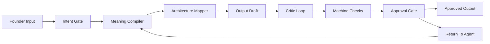

# Founder Intent Approval Machine (LOCKED v1)

**Saved:** 2026-06-27T09:22:00Z  
**Machine SSOT:** `data/founder-intent-approval-machine-v1.json`  
**Runner:** `scripts/founder_intent_approval_machine_v1.py`  
**Validator:** `scripts/validate-founder-intent-approval-machine-v1.sh`  
**Receipt:** `~/.sina/founder-intent-approval-machine-v1.json`

---

## One Law

Founder intent must become code, policy, proof, or approved output. It must not become copied phrases, hardcoded examples, or fake-green tests.

This machine exists because of two repeated failure classes:

- Founder gives examples; agents hardcode the examples instead of implementing the general capability.
- Founder describes an architecture state; agents paste the phrase into public product copy.

---

## Flow



---

## Stages

| Stage | Name | Purpose |
|---|---|---|
| S1 | Input Capture | Record founder text, surface, hashes, and optional candidate output. |
| S2 | Intent Gate | Classify public copy, architecture intent, example, boundary, diagnostic, work order, approval, or ambiguous. |
| S3 | Meaning Compiler | Translate founder language into behavior, invariant, copy, eval, machine change, or refusal. |
| S4 | Architecture Mapper | Route meaning to Brain, retrieval, live tools, guardrails, widget, Chat Unify, Hub/Form, Proof Pack, or docs. |
| S5 | Draft Builder | Define output shape: code, copy, eval, incident, approval receipt, or clarifying question. |
| S6 | Critic Loop | Reject literal-copying, hardcoded examples, fake green, internal leakage, weak proof, or public voice drift. |
| S7 | Machine Checks | Verify route, critic result, and proof path. |
| S8 | Approval Gate | Emit `APPROVED`, `APPROVED_SPEC`, `RETURN_TO_AGENT`, `FIX_DISK`, `FIX_MACHINES`, or `ASK_FOUNDER`. |
| S9 | Receipt | Persist verifiable JSON receipt. |

---

## Usage

```bash
python3 scripts/founder_intent_approval_machine_v1.py \
  --message "Brain should be highest confidence" \
  --surface brain \
  --json
```

Optional candidate-output critique:

```bash
python3 scripts/founder_intent_approval_machine_v1.py \
  --message "Brain should be highest confidence" \
  --candidate-output "You are the highest-confidence public guide" \
  --json
```

Validation:

```bash
bash scripts/validate-founder-intent-approval-machine-v1.sh
```

---

## Verdict Meaning

| Verdict | Meaning |
|---|---|
| `APPROVED` | Candidate output can ship. |
| `APPROVED_SPEC` | Interpretation/spec is approved; implementation can proceed. |
| `RETURN_TO_AGENT` | Candidate output has intent/critic blockers; rewrite. |
| `FIX_DISK` | Disk/source/eval/rule layer must be fixed before output. |
| `FIX_MACHINES` | Machine/validator/integration drift must be fixed before output. |
| `ASK_FOUNDER` | Founder decision is required. |

---

## Example

Founder says:

```text
Brain should be highest confidence.
```

Approved interpretation:

```text
Founder wants a system property: Brain should behave with evidence-backed confidence through retrieval, live tools, guardrails, uncertainty handling, evals, and clean public writing. The phrase must not become public identity copy.
```

Rejected output:

```text
You are the highest-confidence public guide for SourceA.
```

Reason:

```text
literal_copy — Candidate copied architecture intent into output.
```

---

## Chat Unify Role

Chat Unify should expose this as `intent_approval`: a machine that runs before Prompt Forge, Verify & Act, or Decisions when founder wording is subtle.

It is not a writer. It is the gate between founder language and approved output.

