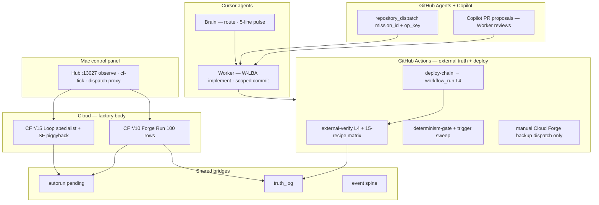

# GitHub Automation Living System Governance (LOCKED v1)

**Schema:** `github-automation-governance-v1`  
**Saved at (UTC):** 2026-07-03T08:59:00Z  
**Machine SSOT:** `data/github-automation-governance-v1.json`  
**Trigger registry:** `data/trigger-registry-v1.json`  
**Lane registry:** `data/automation-lane-registry-v1.json`  
**Conflict matrix:** `data/automation-conflict-matrix-v1.json`  
**Autorun laws:** `docs/GOVERNED_AUTORUN_LAWS_v3.md` (L14 + L15)

---

## One sentence

**A living system runs in parallel on every side — Cloud motors, GitHub Actions truth/deploy, GitHub Agents dispatch, Copilot PR proposals, Cursor Brain/Worker, Mac Hub observe — with one owner per action class and zero duplicate motors.**

---

## Parallel map (all sides at once)



---

## L15 — Automation lane ownership (extends L14)

| Rule | Enforcement |
|------|-------------|
| **One owner per action class** | `automation-lane-registry-v1.json` |
| **Parallel OK across lanes** | Different `lane_id` + different `exclusive` actions |
| **Duplicate motor forbidden** | Conflict matrix C001–C003 |
| **GHA never schedules factory motor** | SA-T5-cloud-forge-backup = dispatch only |
| **Copilot never replaces Worker** | C005 dedup with inbox head |
| **Agents never motor-drain** | repository_dispatch forbidden_actions |
| **Every GHA workflow has concurrency.group** | Lane registry `concurrency_group` |
| **Deploy chains to L4** | workflow_run — not duplicate push verify same SHA |
| **New trigger = registry row same commit** | L14 + `validate-trigger-registry-v1.sh` |

---

## Executor roles (who does what — no overlap)

| Executor | Owns | Must never |
|----------|------|------------|
| **Cloud CF→Railway** | 100 rows / 10m, loop 15m, SF piggyback | Run on Mac body |
| **GHA L4** | EXTERNAL_VERIFY_PASS, truth_log | Replace cloud motor |
| **GHA determinism** | D1–D8 CI, trigger sweep | Block L4 lane |
| **GHA deploy chain** | Railway/CF deploy | Skip post-deploy verify |
| **GHA motor backup** | Manual dispatch auto-tick | Cron schedule |
| **GitHub Agents** | repository_dispatch scoped | auto_tick, proceed |
| **GitHub Copilot** | PR code proposals | Merge without CI; duplicate W-LBA |
| **Cursor Worker** | Disk implementation | 24/7 motor |
| **Cursor Brain** | Route, pending pulse | Implement, local verify as PASS |
| **Mac Hub** | Observe, cf-tick, proxy | Railway motor drain |

---

## GitHub Copilot governance

Copilot is an **implementation accelerator**, not a factory motor or truth prover.

**Allowed:** PRs on Worker-scoped paths · CI on branch · comments on in-progress W-LBA

**Forbidden:**
- Add crons/triggers without `trigger-registry-v1.json` row in same PR
- POST Railway auto-tick or Cloud Forge proceed
- Merge without `external-verify` + `determinism-gate` + trigger sweep
- Parallel PR while Worker inbox has same W-LBA `in_progress`
- Edit `brain-os/law` or autorun laws without `EDIT ALLOWED`

**Flow:** Copilot PR → Worker review → CI gates → merge → deploy-chain → workflow_run L4

---

## GitHub Agents governance

**Standard dispatch verb:** `repository_dispatch`

**Required payload:**
```json
{
  "mission_id": "M2",
  "workflow_id": "loop-specialist-tick",
  "op_key": "sha256-prefix-40",
  "directive": "run|hold|throttle|escalate",
  "reason": "human-readable",
  "evidence": "optional path or url"
}
```

**Handler:** `.github/workflows/repository-dispatch-v1.yml` — validates payload, checks op_key dedup, routes to allowed workflow only.

**Brain emitter SSOT:** `data/brain-desired-state-v1.json` (when wired)

**Forbidden motor classes:** `cloud_forge_run_auto_tick`, `railway_motor_drain`, `proceed_full_pack`

---

## GitHub Actions workflow map

| Workflow | Lane | Concurrency group | Trigger |
|----------|------|-------------------|---------|
| `external-verify.yml` | L4 truth | `l4-external-verify` | push · workflow_run · dispatch |
| `determinism-gate.yml` | Determinism | `determinism-gate` | */6h · push · dispatch |
| `deploy-chain-v1.yml` | Deploy | `deploy-chain` | push · dispatch |
| `repository-dispatch-v1.yml` | Agents | `repository-dispatch` | repository_dispatch |
| `autonomous-drain-cron-v1.yml` | Motor backup | — | **dispatch only** |
| `validate-sourcea-boot-v1.yml` | Package | `validate-sourcea-boot` | push · PR |

**15-recipe matrix:** Inside `external-verify.yml` jobs — NOT 15 separate workflow files (C010).

---

## Cloud workers (trigger ownership)

| Worker | Cron | Owner lane | Notes |
|--------|------|------------|-------|
| `cloud-auto-runtime-tick-v1` | `*/10` | L_cloud_forge_run | Sole 100-row motor |
| `loop-specialist-tick-v1` | `*/15` | L_loop_specialist | SF piggyback inside |
| `signal-factory-tick-v1` | **NONE** | DEPRECATED | Do not deploy |

---

## Conflict matrix (top P0)

| ID | Conflict | Resolution |
|----|----------|------------|
| C001 | CF cron + GHA scheduled motor | GHA schedule forbidden |
| C002 | Dedicated SF cron + piggyback | Remove dedicated `[triggers]` |
| C003 | Brain-loop cron + bundled verify | Remove standalone cron |
| C004 | Double L4 same SHA | concurrency.group dedup |
| C005 | Copilot + Worker same W-LBA | Copilot waits |
| C006 | Agent dispatch motor | Reject payload |

Full list: `data/automation-conflict-matrix-v1.json`

---

## Pre-merge gates (all PRs touching automation)

1. `bash scripts/validate-trigger-registry-v1.sh`
2. `bash scripts/validate-github-automation-governance-v1.sh`
3. `bash scripts/validate-governed-autorun-skill-v1.sh` (if autorun touched)
4. CI: `determinism-gate` + `external-verify` on merge path

---

## Worker queue (automation wiring)

| ID | Title |
|----|-------|
| W-AUTO-001 | Wire `repository-dispatch-v1.yml` handler + op_key dedup |
| W-AUTO-002 | Add concurrency blocks to all GHA workflows missing group |
| W-AUTO-003 | Copilot PR template with lane + W-LBA dedup checkbox |
| W-AUTO-004 | Hub slice: automation lane status on :13027 |
| W-AUTO-005 | `brain-desired-state-v1.json` emitter for Agents |

---

## Standing duties

**Brain:** Read pending + conflict matrix C005 before routing Copilot/Agent work to Worker

**Worker:** One W-AUTO or W-LBA item · register triggers in same commit

**Loop specialist:** Never dispatch motor class via Agent payload

**All agents:** Check lane ownership before act — if not your `exclusive`, bridge or route

---

## Wired artifacts

| Artifact | Path |
|----------|------|
| Governance SSOT | `data/github-automation-governance-v1.json` |
| Trigger registry | `data/trigger-registry-v1.json` |
| Lane registry | `data/automation-lane-registry-v1.json` |
| Conflict matrix | `data/automation-conflict-matrix-v1.json` |
| Sweep | `scripts/sandbox_health_sweep_v1.py` |
| Validator | `scripts/validate-github-automation-governance-v1.sh` |
