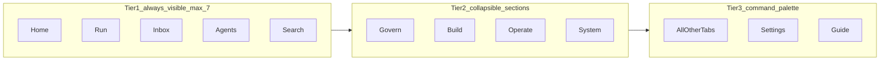

# Sina Command — UI / IA Upgrade Proposal v3

**Saved:** 2026-06-16T05:49:57Z · **Retrofit:** doc-datetime-law batch retrofit
**Type:** Deep research + full redesign proposal (no implementation)  
**Date:** 2026-06-10  
**Trigger:** Founder feedback — fragmented icons, junk-drawer nav, does not feel like a $100M-grade product  
**Benchmark apps:** [Linear](https://linear.app), [Vercel Dashboard](https://vercel.com/dashboard), [Stripe Dashboard](https://dashboard.stripe.com)  
**Builds on:** `HUB_UNIFY_RESEARCH_PROPOSAL_v2.md` (data/E2E) · `HUB_HOME_REDESIGN_SPEC_LOCKED_v1.md` (home content law)

---

## 0. Diagnosis — why it feels cheap (your screenshots + disk)

### 0.1 The numbers

| Problem | Evidence |
|---------|----------|
| **Too many nav items** | **39** static tabs in `NAV` + dynamic **Private agents** group injected at runtime (`app.js` L694–750, L1865–1870) |
| **Junk-drawer "More"** | **22 items** in one group — same mental model as a 2005 "Misc" folder |
| **Duplicate nav SSOTs** | `NAV` (sidebar) + `HUB_PAGES` (24 tiles) + `hub_essentials` quick tiles — **3 lists** to maintain |
| **Meaningless icons** | Glyph `◎` reused **7×** (Track, Live agents, Recent work, Ecosystem, …); `◆` **4×**, `◇` **4×** |
| **Mixed icon systems** | Unicode shapes (`⌂`, `◎`, `◈`) **and** emoji (`📌`, `🛡`, `🗺`, `👥`, `⛔`) in the same sidebar |
| **Top bar overload** | **8** header actions including emoji buttons (`⛔ Emergency`, `🛡 Safety`) + gold Refresh |
| **Home violates locked spec** | Spec: one status block, goals, 4 actions, events. **Disk:** advisor banner + progress + FROZEN + missed actions + safety card + factory safety + duplicate Safety buttons + raw `factory-now · dual_proof` strings |

### 0.2 What $100M apps do differently

They **cap primary navigation**, **recede chrome**, **one icon language**, and **hide power tools** behind search / shortcuts / settings — they do not show 40 equal-weight sidebar rows.

---

## 1. Reference class — three apps to steal from

### 1.1 Linear — *calm density, sidebar recedes*

**Source:** [How we redesigned the Linear UI](https://linear.app/now/how-we-redesigned-the-linear-ui) · [Behind the latest design refresh](https://linear.app/now/behind-the-latest-design-refresh)

| Principle | What they do | Sina Command gap |
|-----------|--------------|------------------|
| **Chrome hierarchy** | Sidebar dimmer; **content is brightest** | Sidebar + gold buttons + colored cards compete equally |
| **Visual noise reduction** | Full reset of tabs, headers, panels — not incremental patches | 5 years of feature = equal-weight nav rows |
| **Alignment discipline** | Icons/labels aligned on grid — "felt not seen" | Random emoji + mixed glyph sizes |
| **Personalized sidebar** | Reorder, hide, pin favorites; **More** for rare items | Fixed 39 items; scroll forever |
| **Structured layouts** | List / board / split — **one layout per view type** | Every tab is a bespoke HTML soup in `render*()` |
| **Theme system** | LCH tokens, 3 variables (base, accent, contrast) | CSS vars exist but **7 accent colors** on cards |

**Steal for Sina Command:**
- Max **7 pinned** sidebar items; everything else in collapsible sections or command palette
- Sidebar opacity **~60%** of main surface; active item only gets full contrast
- **One** header row: title + 2–3 actions max on Home

---

### 1.2 Vercel — *workflow-ordered nav, context as filter*

**Source:** [Dashboard navigation redesign](https://vercel.com/changelog/new-dashboard-navigation-available) (Feb 2026 default)

| Principle | What they do | Sina Command gap |
|-----------|--------------|------------------|
| **Workflow order** | Nav reordered for **most common developer paths** | Chronological feature addition order |
| **Collapsible sidebar** | Hide when coding; resizable | Fixed 248px always on |
| **Context switcher** | Team ↔ project as **filter**, not duplicate pages | "Private agents" = **N duplicate nav rows** |
| **Consistent tabs** | Same link pattern at team and project level | Same concept ("agents") in 4 tabs |
| **Mobile** | Floating bottom bar, one-handed | Desktop-only thinking |

**Steal for Sina Command:**
- **Context bar** under brand: `SourceA · FREEZE · sa-0778` (chip row) — not prose in every card
- **Agents as switcher**, not 12 sidebar entries: `TrustField ▾` opens agent workspace
- **Cmd+K** search replaces scrolling "More"

---

### 1.3 Stripe — *few primary destinations, shortcuts, plain English home*

**Source:** [Dashboard basics](https://docs.stripe.com/dashboard/basics) · [Organizations](https://docs.stripe.com/get-started/account/orgs) · [Dashboard redesign case study](https://mattstromawn.com/projects/stripe-dashboard/)

| Principle | What they do | Sina Command gap |
|-----------|--------------|------------------|
| **Primary nav (5)** | Home, Balances, Transactions, Customers, Product catalog | 39 "primary" looking items |
| **Shortcuts** | Pinned + recently visited — **personal**, not global dump | No recents; Essentials is another full map |
| **Home = analytics + alerts** | Charts + **actionable notifications** only | Home = 6 stacked panels + technical strings |
| **Settings separated** | Personal / Account / Product — not in main flow | Rules, sources, doc library mixed with daily work |
| **Keyboard** | `?` opens shortcut map | No shortcut layer |
| **Design system migration** | Tokens, responsive, a11y at scale | Custom CSS per feature (`sc-home-founder-*` sprawl) |

**Steal for Sina Command:**
- **Home** answers: "Am I blocked?" + "What one thing next?" + "Progress honest count"
- **Inbox** pattern for Actions output + Track commitments (not separate top-level chaos)
- **Products** section = factory tools (Goal1, Prompt feed, Agent loop) under one parent

---

## 2. Target product model — "Founder OS" not "feature museum"



### 2.1 New information architecture (replaces 5 groups + More)

| Tier | Item | Replaces (merge) | Founder question answered |
|------|------|------------------|---------------------------|
| **1** | **Home** | `command` | What is my status and honest progress? |
| **1** | **Run** | `goal1-auto-run`, `prompt-feed`, worker batch | How do I run the factory safely? |
| **1** | **Inbox** | `track`, `actions`, `backlog` badges | What needs my tap or attention? |
| **1** | **Agents** | `agent-loop`, `agents`, private workspaces | Who is working for me right now? |
| **1** | **Search** | `guide`, site search, Essentials | Where is anything? (Cmd+K) |
| **2** | **Govern** ▾ | advisor, order-guardian, decision-governance, council, rules | Decisions & law |
| **2** | **Build** ▾ | roadmaps, WTM, knowledge-library, repos, products | Plans & ship path |
| **2** | **Operate** ▾ | incident, conflict, intelligence, semej, fleet | Ops & triage |
| **2** | **System** ▾ | ecosystem, personal-db, hq, connected apps, doc-library | SSOT & wiring |
| **3** | **⌘K palette** | all 22 "More" items + Daily + Audio | Power user escape hatch |

**Count:** 5 always-visible + 4 collapsible parents = **9 sidebar rows** (vs 39+ today).

### 2.2 Icon system — one language

| Rule | Implementation |
|------|----------------|
| **Library** | [Lucide](https://lucide.dev) or Phosphor — **SVG sprite**, 20px, 1.5px stroke |
| **Tier 1 only** get unique icons | `home`, `play-circle`, `inbox`, `users`, `search` |
| **Tier 2** get **section** icon only; children are **text + badge** |
| **Ban** | Emoji in nav and primary buttons (`🛡`, `⛔`, `📌`) — move to semantic color dots |
| **Status** | FREEZE = amber dot; LIVE = green dot; blocked = red dot — not emoji |

### 2.3 Context strip (Vercel-style, below top bar)

Single row of **chips** — replaces repeated `factory-now · Valid YES 595 · …` strings:

```
[ FREEZE ]  [ Queue sa-0778 ]  [ 596 / 1000 verified ]  [ :13030 OK ]
```

Data from U0 hub-sync + future `proof_counter` — **one strip**, not copied into every card.

---

## 3. Home page redesign (aligned to locked spec + Stripe home)

**Law preserved:** `HUB_HOME_REDESIGN_SPEC_LOCKED_v1.md` — plain English, technical detail collapsed.

### 3.1 Current vs target

| Current (screenshots) | Target |
|-----------------------|--------|
| Advisor track banner at top | Move to **Inbox → Advisor** or dismissible pin |
| Duplicate Refresh buttons | **One** refresh in header (or remove — auto-sync U0) |
| 596/1000 + FROZEN + task title + metadata blob | **§1 Hero:** headline + one progress bar + kill state (GREEN/RED) |
| Missed actions card | **§2 Inbox preview** — max 3 items, link to Inbox |
| What to do now + Factory safety + STOP | **§3 Actions** — max **4** buttons, one primary |
| Bottom utility row (Refresh, Prompt feed, Export…) | **§4** overflow menu `···` |
| `factory-now · dual_proof` visible | **Details ▾** only |

### 3.2 Home layout wireframe

```
┌──────────────────────────────────────────────────────────────┐
│  Home                                    [ Safety ] [ ··· ]     │  ← 2 chrome actions max
├──────────────────────────────────────────────────────────────┤
│  CONTEXT STRIP:  FREEZE · sa-0778 · 596/1000 · worker OK        │
├──────────────────────────────────────────────────────────────┤
│  ● FROZEN — Semi-auto blocked until founder resume            │
│  ████████████░░░░░░░░  596 verified · 404 left                │
│  Next: Validate governance unification…  Step 3/357          │
│                                                               │
│  [ ▶ Start next batch ]     [ Open Run tab → ]                │
├──────────────────────────────────────────────────────────────┤
│  Needs you (2)                          [ Open Inbox → ]      │
│  · Safety check (FREEZE)                                      │
│  · Verify MergePack /health                                   │
├──────────────────────────────────────────────────────────────┤
│  Recent                              [ Show technical ▾ ]     │
│  18:15  Worker rebuild complete                               │
│  18:14  Hub sync generation 42                                │
└──────────────────────────────────────────────────────────────┘
```

---

## 4. Chrome & layout system (Linear-grade)

### 4.1 Design tokens (Stripe-scale discipline)

```css
/* Proposed token layer — replaces per-card accent sprawl */
--surface-canvas:  /* brightest — main content */
--surface-chrome:  /* sidebar, header — 55% luminance of canvas */
--surface-raised:  /* cards */
--text-primary / --text-secondary / --text-tertiary
--accent-primary:  /* one gold OR blue — not 7 card colors */
--status-success / --status-warn / --status-danger
--icon-size: 20px; --nav-row-height: 36px;
```

### 4.2 Component kit (extract from 5,280-line `app.css`)

| Component | Responsibility |
|-----------|----------------|
| `ScSidebar` | Tier 1/2 nav, collapse, badges |
| `ScContextStrip` | Queue, freeze, proof, worker chips |
| `ScPageHeader` | Title + max 3 actions |
| `ScCard` | One border, one radius — no yellow/green/blue border rainbow |
| `ScButton` | primary / secondary / danger — **no emoji prefix** |
| `ScStatusHero` | Home headline + progress + kill |
| `ScCommandPalette` | ⌘K fuzzy find all tabs |

### 4.3 Top bar reduction

| Today (8+) | Target (3) |
|------------|------------|
| Search, Mac log, Ask, LIVE pill, Emergency, Safety, Refresh, Brief | **⌘K**, **Safety**, **···** menu (Emergency, Brief, Mac log, Ask) |

Emergency stays available — **not** equal weight next to Refresh.

---

## 5. Engineering phases (UI track — separate from U2–U5 data)

| Phase | ID | Delivers | Effort | Approval phrase |
|-------|-----|----------|--------|-----------------|
| 0 | **UI-0** | Icon sprite + remove emoji from nav; dedupe ◎/◆/◇ | 0.5d | `ASF: UI-0 — icon system` |
| 1 | **UI-1** | New `nav-registry-v1.js` — 9-row IA; feature-flag sidebar | 1–2d | `ASF: UI-1 — nav IA` |
| 2 | **UI-2** | Context strip component; strip duplicate metadata from cards | 1d | `ASF: UI-2 — context strip` |
| 3 | **UI-3** | Home rewrite per wireframe §3.2 + locked spec | 2d | `ASF: UI-3 — home shell` |
| 4 | **UI-4** | Command palette (⌘K) replaces Essentials + More scroll | 1–2d | `ASF: UI-4 — command palette` |
| 5 | **UI-5** | Agent switcher (replaces Private agents nav spam) | 1d | `ASF: UI-5 — agent switcher` |
| 6 | **UI-6** | CSS token migration + `ScCard` unify | 2–3d | `ASF: UI-6 — design tokens` |

**Parallel data track (unchanged):** U2 live client, U3 tab registry, U5 gate ladder — see `HUB_UNIFY_RESEARCH_PROPOSAL_v2.md`.

**Recommended order:** UI-0 → UI-1 → UI-3 (visible win) → UI-2 → UI-4 → UI-5 → UI-6.

---

## 6. E2E simplification (unified with UI)

Add to future `gates/manifest-v1.yaml`:

```yaml
smoke:
  gates:
    - validate-hub-sync-ui-contract-v1.sh   # U0 shipped
    - validate-nav-registry-v1.sh           # UI-1: max 9 sidebar rows
    - validate-home-founder-plain-english-v1.sh  # no raw factory-now in default DOM
    - validate-icon-system-v1.sh            # UI-0: no emoji in .sc-nav-item
```

**Founder smoke after UI+U5:**
```bash
python3 scripts/gate_ladder_v1.py --tier smoke
# + open Home — 5 sidebar items visible, context strip 1 row, no emoji nav
```

---

## 7. Migration rules (don't break v5.1)

| Keep | Change |
|------|--------|
| Tab `id` routes (`command`, `goal1-auto-run`, …) | Aliases map old URLs → new IA |
| `home_founder_view` payload contract | Renderer only — UI-3 |
| `render*()` tab bodies (incremental) | Nav/chrome first; tab content over time |
| FREEZE / Safety semantics | Presentation only — same `data-action-id` |
| U0 hub-sync | Context strip data source |

---

## 8. Success — "$100M app" test

| Test | Pass criteria |
|------|----------------|
| **5-second** | New founder names: Home, Run, Inbox, Agents — without scrolling |
| **Sidebar** | ≤9 rows visible without scroll; no emoji icons |
| **Home** | One hero, one progress bar, ≤4 actions; no `dual_proof` in default view |
| **Chrome** | Header ≤3 buttons; sidebar visually recedes |
| **Search** | Any tab reachable in ⌘K ≤2 keystrokes |
| **Compare** | Side-by-side with Linear/Vercel — same **calm** density, not same pixels |

---

## 9. What we are NOT doing

- Rebrand to white SaaS — keep dark founder aesthetic
- Delete tabs/features — **re-home** them under IA tiers
- Next.js rewrite — stay `app.js` + extract modules
- Ignore locked home spec — UI-3 implements it visually
- Emoji-forward "friendly" UI — enterprise calm like Linear/Stripe

---

## 10. References

| App | URL | Steal |
|-----|-----|-------|
| Linear | https://linear.app/now/how-we-redesigned-the-linear-ui | Sidebar recedes, alignment, personalized nav |
| Vercel | https://vercel.com/changelog/new-dashboard-navigation-available | Workflow order, collapsible sidebar, context filter |
| Stripe | https://docs.stripe.com/dashboard/basics | 5 primary destinations, shortcuts, home analytics |
| shadcn Sidebar | https://ui.shadcn.com/docs/components/sidebar | Component structure for collapsible IA |
| Locked home spec | `brain-os/system/HUB_HOME_REDESIGN_SPEC_LOCKED_v1.md` | Content law |
| Data unify v2 | `docs/HUB_UNIFY_RESEARCH_PROPOSAL_v2.md` | SSE, slices, gate ladder |

---

*End UI/IA Upgrade Proposal v3 — research only. Pick `ASF: UI-0` or `ASF: UI-1` to start.*
