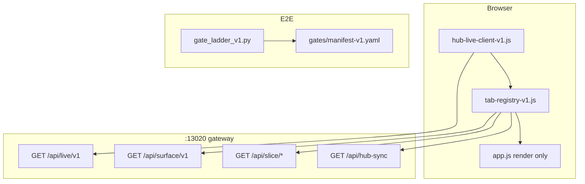

# Hub Unify — Research & Upgrade Proposal v2

**Saved:** 2026-06-16T05:49:57Z · **Retrofit:** doc-datetime-law batch retrofit
**Type:** Research + proposal only (no implementation in this doc)  
**Date:** 2026-06-10 (post-U0)  
**Supersedes stale sections in:** `HUB_UNIFY_UPGRADE_PROPOSAL_v1.md`, `HUB_UNIFY_AND_PROOF_MASTER_v1.md` §1.3 UI sync gap  
**Authority:** ASF approval per phase phrase

---

## 0. One sentence

> Turn the hub from **one 9.3k-line monolith + 277 validators + 9 poll timers** into **one live coordinator, one tab map, one gate ladder** — without undoing v5.1 (no request-thread builds, no new ports, FREEZE stays ON).

---

## 1. What you asked for vs what shipped

| Ask | Status |
|-----|--------|
| Research fragmentation in UI app | Done in architecture audit + this doc (fresh counts below) |
| Propose upgrade to reduce duplication | v1 docs exist; **this v2 doc updates them with post-U0 truth** |
| Simplify and unify E2E | Proposed as **U5 gate ladder** — **not built logged yet** |
| Implement everything | **Not requested** — only **U0** was approved (`ASF: UNIFY U0`) and is now **DONE** |

**U0 delivered (2026-06-10):** flat `hub-sync` contract + `home_founder_view` + `shellFieldsFromHubSync` + 45s poll + `validate-hub-sync-ui-contract-v1.sh`. Gates PASS (hub-sync ~5–87ms, `generation_id` 41→42).

Everything below is **proposed** — requires explicit ASF approval per phase.

---

## 2. UI app fragmentation (research, disk today)

**Primary file:** `agent-control-panel/assets/app.js` (~9,348 lines)

### 2.1 Scale

| Metric | Count | Notes |
|--------|------:|-------|
| `setInterval` polls | **9** | 8 in `app.js` + 1 mini-app |
| `fetch()` calls | **53** | 48 in `app.js` |
| `applyPayload` (full replace) | **40** sites | Monolith merge model |
| `mergeCommandPayload` (shallow) | **2** sites | U0 hub-sync path only |
| Ad-hoc `D.field = …` patches | **many** | loop, advisor, intelligence |
| `*Api()` tab wrappers | **18** | Each owns fetch + merge policy |
| Data hydration channels | **8+** | shell inline, shell JSON, full JSON, hub-sync, refresh, SSE, slice GETs, tab polls |

### 2.2 Active poll matrix (worst case: `command` tab)

| Timer | Interval | Endpoint |
|-------|----------|----------|
| Advisor live | 5s | `/api/founder-advisor-discussion` |
| Advisor UI tick | 1s | local counter only |
| Goal1 status | 4s | `/api/goal1-auto-run-status` |
| Health / reconnect | 20s | `/health` → may `hubAutoSync` |
| Hub-sync fallback | 45s | `/api/hub-sync` (U0) |
| SSE push | event-driven | `/api/live/v1` |

**Up to 6 concurrent refresh mechanisms** on one tab, plus founder Refresh → `POST /refresh`.

### 2.3 Top 5 UI pain points

1. **Three merge models for one store `D`** — `applyPayload` (wipe + replace), `mergeCommandPayload` (U0 shell), ad-hoc patches (loop/advisor/IC). Same tab can be updated three different ways → races and stale fields.

2. **Redundant sync layers** — SSE `hub.generation` already calls `hubAutoSync`; U0 added 45s poll; 20s health poll also triggers sync; 4s Goal1 poll overlaps command surface. No single coordinator owns “what changed, refetch what.”

3. **Agent loop triple path** — GET slice (`/api/agent-loop`), POST status on tab enter, 12s POST status poll — writes `agent_loop` / `agentLoop` / `loop` inconsistently; `data()` reads only `agent_loop`.

4. **hub-sync dual contract (legacy branch)** — U0 fixed the `json.ok` path; `json.data` branch still does full `applyPayload` if server ever returns wrapper. Goal1 arrives via hub-sync, refresh, or 4s poll — three sources.

5. **No tab→API map in code** — `HEAVY_TAB_KEYS` is implicit; 18 `*Api()` wrappers duplicate fetch/error/render patterns; two workspace POSTs use bare `/api/...` without `${API}`.

### 2.4 What U0 fixed vs what remains

| Fixed (U0) | Still fragmented |
|------------|------------------|
| Flat hub-sync merges shell fields | 40× `applyPayload` on mutations |
| `home_founder_view` in auto-sync | Heavy tabs still lazy-load 9MB `command-data.json` |
| `generation_id` → `refetchStaleTabs` | SSE + 45s + 20s + 4s still overlap |
| Contract validator | No `hub-live-client-v1.js` extraction |
| | No `tab-registry-v1.js` |

---

## 3. E2E fragmentation (research, disk today)

### 3.1 Scale

| Metric | Count |
|--------|------:|
| `validate-*.sh` scripts (repo) | **277** |
| `find_critical_bugs.py` shell validators | **32** |
| Python audits in FCB | **3** |
| Hub-specific `validate-hub-*` | **16** |
| Named E2E orchestrators | **6+** |
| **`gates/manifest-v1.yaml`** | **0** (proposal only) |
| **`gate_ladder_v1.py`** | **0** (proposal only) |

**CI truth today:** implicit list inside `find_critical_bugs.py` — not a manifest founders can run with one command.

### 3.2 Duplication examples

| Overlap | Cost |
|---------|------|
| Anti-staleness bundle runs 19 validators; **6** also listed standalone in FCB | **6 double-runs** every CI pass |
| `validate-hub-stabilization-e2e-light-v1.sh` pre-chain + `audit_backend_e2e_light_v1.py` health checks | Same probes twice |
| Gate N runs light E2E then FCB runs light E2E again | Full light stack **2×** |
| `audit_essentials_nav` + `audit_agent_governance` on strict build **and** FCB | Python audit **2×** |
| Heavy `audit_backend_e2e.py` (~466 lines) vs light (~260 lines) | Two modules, heavy **cancelled** unless `SINA_E2E_FORCE=1` |
| 8 brain validators duplicated under `brain-os/scripts/` | Copy drift risk |

### 3.3 Top 5 E2E simplification opportunities

1. **Ship gate ladder** — one `gates/manifest-v1.yaml` + `gate_ladder_v1.py --tier smoke|daily|ci|full`
2. **Dedupe FCB vs anti-staleness bundle** — remove 6 overlapping entries from one side
3. **Collapse light E2E wrapper** — single Python entry with optional `--preflight-only`
4. **Audit once per tier** — build OR FCB, not both, with receipt cache
5. **Retire or tier heavy E2E** — fold unique checks into `full` tier; delete dead FCB heal hooks referencing heavy path

---

## 4. Proposed target architecture



**Principles (unchanged from v5.1):**
- Request thread: **read disk only** — never `build_payload`
- Rebuild: worker `:13030` only
- FREEZE ON — no Cloud Forge Run in hub gates
- No new ports in U1–U5

---

## 5. Upgrade phases (revised roadmap)

Phases are **sequenced**; one phase = one gate report = one ASF approval.

| Order | ID | Delivers | Effort | User-visible win |
|-------|-----|----------|--------|------------------|
| ~~1~~ | ~~**U0**~~ | ~~hub-sync contract~~ | ~~1h~~ | **DONE** |
| 2 | **U2** | Extract `hub-live-client-v1.js`; kill redundant polls | 1–2d | One SSE coordinator; stop 45s/20s poll storm when live |
| 3 | **U3** | `tab-registry-v1.js` + per-tab slices | 2–3d | No 9MB JSON for default tabs; clear tab→API map |
| 4 | **U5** | `gate_ladder_v1.py` + manifest | 1–2d | `python3 scripts/gate_ladder_v1.py --tier smoke` replaces 6 scripts |
| 5 | **U4** | `state_read_lib_v1.py` | 1d | One queue/honest read path for validators + hub |
| 6 | **U1 polish** | SSE event types + surface route | 1d | Header chips from `/api/surface/v1` (SSE already exists) |

**Note:** U1 SSE server **already ships** (`/api/live/v1`, `connectHubLive` in `app.js`). Remaining U1 work is event contract hardening + optional `/api/surface/v1` — not greenfield.

**Proof UX (parallel track, separate approval):** HUB-P0-1 → P0-2 → P0-3 per `HUB_PROOF_UX_P0_LOCKED_v1.md`. Interleave with U3 (home slice) and U5 (smoke gates).

---

## 6. Phase detail (proposed only)

### U2 — Hub Live Client (highest UI leverage after U0)

**New file:** `agent-control-panel/assets/hub-live-client-v1.js`

```javascript
// Owns only:
// - EventSource /api/live/v1 + reconnect backoff
// - surfaceState { generation_id, freeze_status, queue_sa_id }
// - on hub.generation → HubSlices.refreshStale(keys)
// - on tab.invalidate → fetch slice for keys
// - fallback: single 60s hub-sync poll ONLY when SSE disconnected
```

**Remove from `app.js`:**
- `connectHubLive` / `onShellGenerationBump` (move to client module)
- 45s hub-sync interval (keep as fallback inside live client when `!connected`)
- 20s health poll that duplicates `hubAutoSync` (replace with SSE reconnect only)

**Keep until U3:** tab-specific polls (advisor 5s, loop 12s, goal1 4s on active tabs) — but register them in tab registry so they start/stop from one place.

**Gate:** Network tab shows **one** EventSource; with SSE up, no 45s hub-sync traffic for 2 minutes.

---

### U3 — Tab registry + slices

**New file:** `agent-control-panel/assets/tab-registry-v1.js`

| tabId | slice GET | keys in D | poll while active |
|-------|-----------|-----------|-------------------|
| `command` | `/api/hub-sync` | shell surface + `home_founder_view` | none (SSE) |
| `goal1-auto-run` | `/api/goal1-auto-run-status` | `goal1_auto_run` | 4s |
| `intelligence` | `/api/intelligence-circle` | `intelligence_circle` | none if SSE |
| `agent-loop` | `/api/agent-loop` | `agent_loop` only | 12s if loop active |
| `prompt-feed` | `/api/prompt-queue` | `prompt_queue` | 12s if auto_feed |

**Server (optional):** `GET /api/surface/v1` — `{ generation_id, freeze_status, queue_sa_id, nav, built_at, proof_counter }` for header chips.

**Merge policy (one rule):**
- Shell/slice keys → `mergeCommandPayload({ [key]: slice })`
- Full refresh / founder Refresh only → `applyPayload`
- **Deprecate** ad-hoc `Object.assign` on loop — normalize to `agent_loop` key only

**Gate:** Open Command + Goal1 + Intelligence + Agent loop + Prompt feed — **zero** `command-data.json` download in Network tab.

---

### U5 — Unified E2E gate ladder

**New files:**
- `gates/manifest-v1.yaml`
- `scripts/gate_ladder_v1.py`

```yaml
# gates/manifest-v1.yaml (proposed shape)
smoke:
  budget_s: 35
  gates:
    - validate-hub-sync-slim-v1.sh
    - validate-hub-sync-ui-contract-v1.sh
    - audit_backend_e2e_light_v1.py
    - validate-hub-four-rule-static-v1.sh   # if exists, else inline grep gate

daily:
  extends: smoke
  gates:
    - validate-anti-staleness-bundle-v1.sh  # standalone only — drop 6 dupes from FCB
    - validate-ecosystem-safety-v1.sh

ci:
  extends: daily
  gates:
    - find_critical_bugs.py --manifest-slice  # ~15 gates, not 32+19 nested

full:
  extends: ci
  env_required: SINA_E2E_FORCE=1
  gates:
    - audit_backend_e2e.py
```

**Founder one-liner (target):**
```bash
python3 scripts/gate_ladder_v1.py --tier smoke
```

**FCB migration:** `find_critical_bugs.py` becomes a **generator** that reads manifest `ci` tier — stops maintaining duplicate 32-entry list by hand.

**Gate:** `smoke` < 35s PASS; CI tier removes 6 duplicate bash runs vs today.

---

### U4 — State read lib (backend dedupe)

**New:** `scripts/state_read_lib_v1.py` — read-only facade used by hub-sync, SSE payloads, validators, `proof_counter` builder:

```python
def queue_head() -> str          # ~/.sina/run-inbox-disk-truth-v1.json → queue.sa_id
def factory_mode() -> str        # factory-now-v1.json
def generation() -> int          # command-data-shell.json
def honest_status() -> dict      # PROGRAM_1000_HONEST_STATUS.json
```

**Gate:** `grep -r 'queue_sa.json' scripts/` → 0; validators import lib instead of re-parsing five files.

---

## 7. What we explicitly do NOT do

- Split into microservices / new ports `:13021–13023`
- Rewrite all 277 validators at once
- Delete `command-data.json` (strict build + CI still need it)
- Merge conduct / INBOX desync into hub gates
- Drain factory while FREEZE ON
- Big-bang `app.js` rewrite — extract modules incrementally (U2 → U3)

---

## 8. Success metrics (upgrade complete)

| Layer | Today | Target |
|-------|-------|--------|
| Poll timers | 9 | ≤2 tab-local + 1 SSE fallback |
| Merge models | 3 | 2 (`mergeSlice` + `applyPayload` on full refresh only) |
| Boot JSON | Often 9MB full or shell + lazy heavy | Shell + slices only for 5 main tabs |
| E2E entrypoints | 6+ named scripts | 1 ladder, 4 tiers |
| FCB bash invocations | ~45 effective | ~25 (dedupe bundle overlap) |
| Founder smoke | Unknown which script | `gate_ladder --tier smoke` |

---

## 9. Recommended execution order (opinion)

1. **U5 smoke tier first** (1–2 days) — immediate E2E clarity; no UI risk  
2. **U2 live client** — stops poll storm; builds on U0 contract  
3. **U3 tab registry** — biggest perf win (no 9MB)  
4. **U4 state lib** — reduces validator drift  
5. **HUB-P0-1** proof counter — on home slice during U3  

U5-before-U2 is deliberate: founders get a simple gate story **before** more UI refactors.

---

## 10. Approval phrases

| Phase | Phrase |
|-------|--------|
| U2 | `ASF: UNIFY U2 — live client` |
| U3 | `ASF: UNIFY U3 — tab registry` |
| U4 | `ASF: UNIFY U4 — state read lib` |
| U5 | `ASF: UNIFY U5 — gate ladder` |
| Proof | `ASF: HUB-P0-1 — proof counter` (etc.) |

---

## 11. References

- `docs/HUB_UNIFY_UPGRADE_PROPOSAL_v1.md` — original technical phases
- `docs/HUB_UNIFY_AND_PROOF_MASTER_v1.md` — proof + unify merged plan
- `docs/HUB_LIVE_SYSTEM_DESIGN_v1.md` — SSE + surface API
- `architecture_audit/` — entrypoints, hotspots, state map (2026-06-10)
- `scripts/validate-hub-sync-ui-contract-v1.sh` — U0 gate (shipped)

---

*End Hub Unify Research & Proposal v2 — research only, no implementation.*
