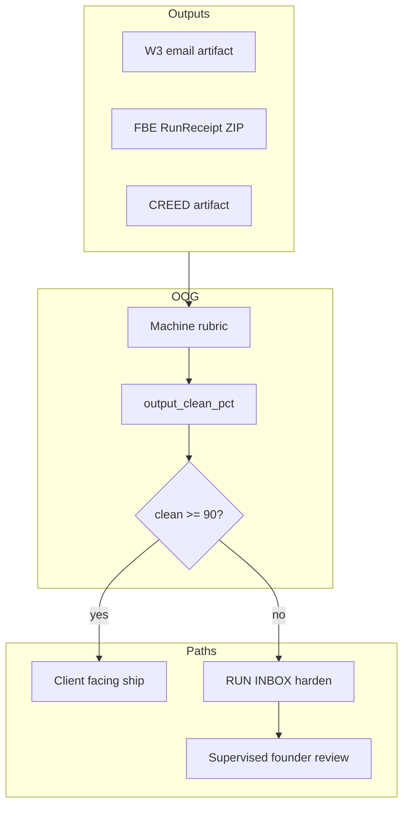

# SourceA Best Loop — Output Quality Gate — LOCKED v1

**Version:** 1.2.1 · **Saved:** 2026-06-18T18:00:17Z · **Status:** LOCKED
**Path:** `~/Desktop/SourceA/docs/SOURCEA_BEST_LOOP_OUTPUT_QUALITY_GATE_LOCKED_v1.md`
**Authority:** Founder · credibility law · never show weak products
**Phase:** POST-DESIGN — stacks on Better Loop v2; does not replace it

**Parents:**
- `docs/SOURCEA_STACK_MAP_AND_BETTER_LOOP_LOCKED_v1.md` (Better Loop v2 · BL1–BL11)
- `docs/SOURCEA_FOUNDER_EMAIL_FACTORY_STANDARD_LOCKED_v1.md` (**FEFS** · persuasion rubric · mandatory before send)
- `docs/SOURCEA_FACTORY_BUILDER_ENGINE_LOCKED_v1.md` (FBE tiers · quality contract)
- `data/fbe_quality_contract_v1.json` (GOLD critic ≥ 90 · assets ≥ 99%)
- `1 PAGER/CANADA_PRIORITY_A_SEND_READY_EMAILS_LOCKED_v1.md` (W3 send packs)
- `~/.sina/brain/COPY_SAFETY_AND_CLAIMS_REGISTRY_v1.yaml` (claims law)

---

## 0. One law

> **No factory output and no W3 send reaches a client until the artifact scores ≥ 90% clean on the Output Quality Gate (OQG).** The metric is **output cleanliness** — not founder approval rate.

**Output clean** = complete · spec-faithful · validator-clean · claim-safe · no placeholders · receipt-proven — measured on disk before ship.

| Score | Meaning |
|-------|---------|
| **~60% clean (today)** | Demonstrable but **rough** — gaps, caps, stubs, or unfinished bays block client grade |
| **≥ 90% clean (bar)** | Client-safe artifact — machines may stage; founder spot-checks or waives edge cases only |
| **≥ 95% clean sustained** | Lane eligible for **trusted auto-stage** (still no blind client send without receipt) |

**Better Loop** answers: *Is the system running?*  
**Best Loop** answers: *Is this **output** clean enough to show a client?*

Founder approval is what happens when output is **under** 90% clean (supervised mode) — it is **not** the score.

---

## 1. The gap (correct framing · Jun 2026)

**The gap is not “missing a founder approval % dashboard.”**  
**The gap is: factory and commercial outputs are ~60% clean, not 90% clean.**

| Lane | Output clean (live) | Why not 90% (if below) | Target |
|------|---------------------|------------------------|--------|
| **FBE / SourceA factories** | **~97%** | sample-bay gap −5 when refinery+assembly PASS · RunReceipt ZIP on disk | ≥ 90% clean receipt before client demo or deploy claim |
| **CREED / refinery** | **~100%** | dealer 16-step · DISBRAND/intake · read-only campus law | ≥ 90% = critic ≥ 90 + fidelity PASS on wired subset |
| **W3 emails (Canada pack)** | **~96%** | Ocree URL edge (92% artifact) · BQ2 gate blocks send without waiver | ≥ 90% = rubric PASS on **email body as artifact** before Mail |

**Nerve cross-ref:** `nerve_system_line` on `~/.sina/agent-live-surfaces-v1.json` · receipt `~/.sina/agent-nerve-system-receipt-v1.json` · `ship_gates.w3_send_ready` when OQG + Mail FROM + approved-not-sent align.

**~60% proven** = **~60% clean output** — built, partially validated, **not** client-grade. Harden design and validators until the **artifact** hits 90%, then trust automation for that lane.

---

## 2. What “clean” measures (objective · not a vote)

Each output class gets **`output_clean_pct`** (0–100) from **machine rubric + validators only**:

| Dimension | Examples |
|-----------|----------|
| **Completeness** | No `[First name]` · `[calendar link]` · stub sections in client path |
| **Spec fidelity** | Tier receipt matches claim · GOLD assets ≥ 99% · catalog SKU truth |
| **Validator clean** | COPY_SAFETY PASS · lane validators PASS · conduct 0 violations |
| **Claim safety** | Registry clean · no FINTRAC/KYB overclaim · brand separation |
| **Receipt chain** | RunReceipt ZIP · OQG receipt · send pack on disk |

Founder **reviews** when `output_clean_pct` &lt; 90. Founder **does not** substitute a thumbs-up for a failed rubric.

---

## 3. Trust modes (per lane · from **output clean** rolling 7-day)

| Mode | Output clean (7d avg) | Founder | Machines |
|------|----------------------|---------|----------|
| **Supervised** | &lt; 90% | Fix loop · reject weak artifacts | Prepare only · **no** client-facing ship |
| **Assisted** | 90–94% sustained | Spot-check · waiver on exceptions | Stage · one-tap after OQG PASS |
| **Trusted** | ≥ 95% sustained | Priority + capital | Auto-stage · notify · receipt still required |

Promotion/demotion from **measured clean %** + P0 quality incidents — not from founder satisfaction polls.

---

## 4. Output Quality Gate (OQG) — flow

**Hard block:** No `sent_at` on W3 · no MARKET_READY claim · no public embed unless **`output_clean_pct` ≥ 90** or documented waiver on disk.

---

## 5. Best Loop steps (BQ1–BQ5) — stacks on BL1–BL11

| Step | Name | Job | Pass |
|------|------|-----|------|
| **BQ1** | Score | Machine rubric → **`output_clean_pct`** per artifact | Receipt field `output_clean_pct` |
| **BQ2** | Gate | Block ship if clean &lt; 90 | `oqg_pass: true` or waiver id |
| **BQ3** | Show | Hub shows **lane clean %** + trust mode | Founder sees **output** score · not approval poll |
| **BQ4** | Track | Rolling 7-day **avg output clean** per lane | JSON receipt |
| **BQ5** | Promote | Supervised → Assisted → Trusted by **clean %** | 7d sustained + zero P0 quality FAILs |

---

## 6. Lane rubrics (100 pts → `output_clean_pct`)

### 6.1 W3 commercial (email as artifact)

| Check | Pts | Machine |
|-------|-----|---------|
| COPY_SAFETY / claims registry clean | 25 | registry grep PASS |
| Brand separation (TF vs NF) | 20 | lane validator |
| No placeholder tokens in client body | 20 | pack lint |
| CASL block + basis text present | 20 | schema fields |
| Attach + CTA URLs live | 15 | path/HTTP check |

### 6.2 SourceA FBE (factory receipt)

| Check | Pts | Machine |
|-------|-----|---------|
| Tier honest cap honored (no overclaim) | 25 | quality contract + receipt |
| Critic ≥ 90 | 25 | refinery verify |
| Assets fidelity ≥ 99% | 20 | refinery receipt |
| Required validators PASS for wave | 20 | fbe_w* validators |
| RunReceipt ZIP complete | 10 | bundle schema |

**90% clean ≈ GOLD bar met on receipt** — not “founder said OK.”

### 6.3 CREED / campus

| Check | Pts | Machine |
|-------|-----|---------|
| Fidelity matrix PASS (wired scope) | 35 | CREED verify |
| Dealer / 16-step audit PASS | 30 | verify receipt |
| DISBRAND + intake gate PASS | 20 | FBE charter gates |
| Read-only campus law (no Mac prod) | 15 | two-plane probe |

---

## 7. Hardening path (60% → 90% clean)

Priority order — **improve output**, not dashboards:

1. **FBE:** Close sample-bay · dealer audit FAIL · one MARKET_READY-honest subset  
2. **W3:** COPY_SAFETY + placeholder lint on every pack · score before Mail  
3. **CREED:** Fidelity + 16-step PASS on one wired bay  
4. **Wire BQ1–BQ3:** `output_clean_pct` on Hub next to Better Loop red count  

Stop list unchanged: no new factory **architecture** waves before first deposit — **harden existing outputs** to 90% clean.

---

## 8. Rejected: GPT “Master Loop Generator” (unbounded)

Conflicts with this law: infinite spawn · auto catalog deploy · business execution by “SourceAI” · reports without OQG on each **artifact**.

---

## 9. Founder role

| Founder | Machines |
|---------|----------|
| Vision · priority · capital | Measure **output clean %** · harden · receipt |
| Waiver only when rubric edge case (disk id) | Never ship &lt; 90% clean without waiver |
| Supervised review when output dirty | RUN INBOX fixes until rubric PASS |

---

## 10. Disk routing

| Topic | Path |
|-------|------|
| Best Loop law | `docs/SOURCEA_BEST_LOOP_OUTPUT_QUALITY_GATE_LOCKED_v1.md` |
| Better Loop | `docs/SOURCEA_STACK_MAP_AND_BETTER_LOOP_LOCKED_v1.md` |
| FBE quality contract | `data/fbe_quality_contract_v1.json` |
| Future OQG receipt | `~/.sina/best-loop-oqg-receipt-v1.json` · fields **`output_clean_pct`** · **`output_clean_now`** · **`fleet_output_clean_7d`** |
| OQG waiver (edge) | `~/.sina/oqg-waiver-v1.json` · template `data/commercial/oqg-waiver-v1.json` |
| Nerve system | `scripts/agent_nerve_system_v1.py` · `~/.sina/agent-nerve-system-receipt-v1.json` |

---

## 11. Success definition

- Every client-facing artifact has **`output_clean_pct`** on disk  
- Fleet average rises **60% → 90% clean** before automation trust  
- Hub shows **clean %** per lane — not “approval %”  
- **We never show weak products**

---

*LOCKED v1.2 — BQ1–BQ5 wired · BQ2 ship gate on send_w3_canada_v1.py · nerve ship_gates · check cart BQ+NS rows.*
