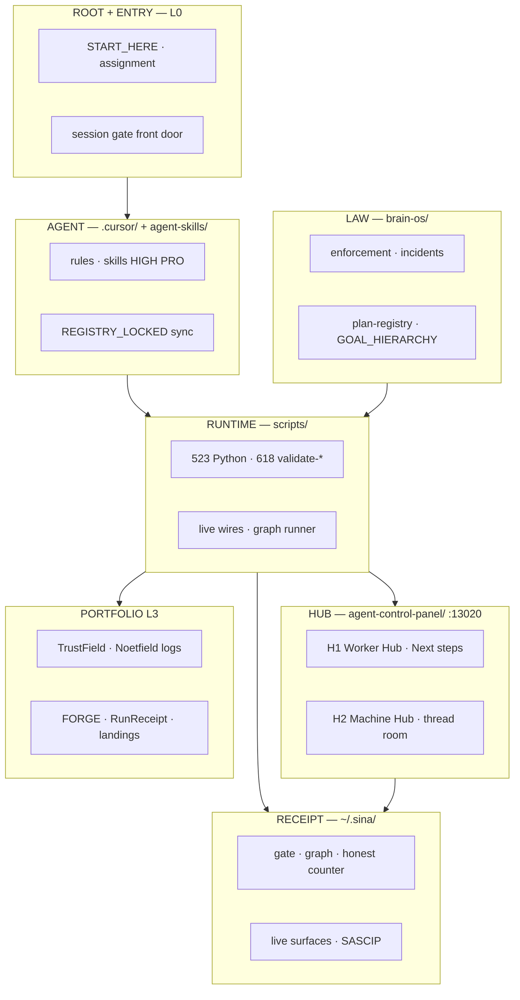

# SourceA — Full Directory & Node Map

**Version:** 1.1.0 LOCKED · **Saved:** 2026-06-16T10:00:00Z  
**Machine SSOT:** `data/sourcea_directory_node_map_v1.json`  
**Unified bundle:** `data/sourcea_agentic_unified_bundle_v1.json`  
**Node graph:** `data/sourcea_pipeline_node_graph_v1.json` v1.3  
**Charter:** `docs/SOURCEA_NODE_ARCHITECT_AGENTIC_AUTONOMOUS_SYSTEM_LOCKED_v1.md`  
**Repo:** `~/Desktop/SourceA` · **Wil parity (L3):** `~/Desktop/YA5/.cursor/governance/DIRECTORY_NODE_MAP.json`

> Every **directory** maps to **node ids** from the pipeline graph + logical nodes. **Planes** = top-level folders. **Receipt plane** = `~/.sina/` — chat is not memory.

**Factory posture:** 986/1000 Valid YES · SINGLE_SA · **5 tiers · 12 runner nodes** · 17 logical nodes

---

## Planes (top level)



---

## Node catalog (graph + logical)

### Graph runner nodes (12 — parallel tiers + LAT)

| Node id | Tier | Handler | Receipt |
|---------|------|---------|---------|
| `sascip_live_wire` | T0 | `stranger_agent_safety_live_wire_v1.py` | `~/.sina/stranger-agent-admission-receipt-v1.json` |
| `mac_health_probe` | T0 | `mac_health_live_v1.py` | Mac Health findings |
| `disk_live_wire` | T1 | `disk_live_wire_sync_v1.py` | `~/.sina/disk-live-wire-receipt-v1.json` |
| `governance_zero_drift` | T1 | `governance_zero_drift_live_wire_v1.py` | `~/.sina/governance-zero-drift-live-wire-v1.json` |
| `crawl_mirror_session` | T1 | `sourcea_crawl_mirror_pipeline_v1.py` | `~/.sina/crawl-mirror-receipt-v1.json` |
| `agentic_layer_fast` | T2 | `agentic_layer_pipeline_v2.py` | `~/.sina/agentic-layer-pipeline-v2.json` |
| `l1_brain_wire` | T2 | `l1_agent_pipeline_wire_v1.py` | `~/.sina/l1-agent-pipeline-wire-v1.json` |
| `hub_dual_heal` | T2 | `hub_dual_heal_v1.py` | hub heal receipt |
| `validate_w10_vocab` | T3 | `validate-anti-staleness-vocabulary-gate-v1.sh` | W10 bundle |
| `validate_two_hub` | T3 | `validate-two-hub-v1.sh` | two-hub receipt |
| `n8n_p0_operational` | T3 | `validate-n8n-p0-operational-v1.sh` | n8n glue |
| **`orient_routing_v1`** | **T_lat** | **`agent_orient_v1.py`** | **`~/.sina/orient-routing-report-v1.json`** |

### Logical nodes (directory wiring — not all in graph runner yet)

| Node id | Layer | Role |
|---------|-------|------|
| `session_gate_v1` | GOV | Every agent session start |
| `pipeline_node_graph_runner_v1` | L0.5 | Parallel tier orchestrator |
| `cross_lane_edit_guard_v1` | GOV | EDIT ALLOWED enforcement |
| `worker_inbox_v1` | L2 | RUN INBOX · queue SSOT |
| `hub_projection_v1` | L0 | command-data.json build |
| `mac_health_guard_v1` | L0 | `:13024` Heart UI |
| `program_1000_honest_v1` | L0.5 | 986/1000 honest counter |
| `founder_form_m1_v1` | L0 | M1 Canvas integrity form |
| `thread_room_v1` | ROOMS | H2 thread curation |
| `voyage_live_wire_v1` | L8 | Semantic vector wire |
| `orientation_pipeline_v1` | LAT | Founder word only |
| `hospital_pipeline_v1` | LAT | Founder word only |
| `maze_pipeline_v1` | LAT | Founder word only |
| `orient_routing_v1` | LAT | T_lat graph runner · orient cascade |
| `terminology_2026_v1` | L1 | Commercial tune SSOT |
| `directory_node_map_v1` | L0.5 | This map |

---

## Full directory tree (wired to nodes)

```text
~/Desktop/SourceA/                              plane: ROOT
│   nodes: session_gate_v1 · entry_gate_v1
│
├── START_HERE.md                               → entry_gate_v1
├── brain-os/law/entry/START_HERE_LOCKED_v1.md      → session_gate_v1
│
├── brain-os/                                   plane: LAW · L0.5
│   nodes: governance_zero_drift · cross_lane_edit_guard_v1
│   │
│   ├── system/                                 → GOAL_HIERARCHY · authority.yaml
│   ├── enforcement/                            → session gate · verbs · stack v2
│   ├── law/                                    → BRAIN_UNIFIED · layer stack
│   ├── incidents/                              → INCIDENT-* ack only
│   ├── plan-registry/sourcea-1000/             → REGISTRY.json · sa-* prompts
│   ├── contract/                               → Brain chat routing
│   └── wtm/                                    → Pre-LLM essays
│
├── scripts/                                    plane: RUNTIME · L0.5
│   nodes: pipeline_node_graph_runner_v1 · session_gate_v1
│   metrics: ~523 .py · ~618 validate-*.sh
│   │
│   ├── agent_session_gate_run_v1.py            → session_gate_v1 (all agents)
│   ├── pipeline_node_graph_runner_v1.py      → graph runner · 4 tiers
│   ├── disk_live_wire_sync_v1.py              → disk_live_wire
│   ├── governance_zero_drift_live_wire_v1.py → governance_zero_drift
│   ├── sourcea_crawl_mirror_pipeline_v1.py    → crawl_mirror_session
│   ├── stranger_agent_safety_live_wire_v1.py → sascip_live_wire
│   ├── mac_health_live_v1.py                 → mac_health_probe
│   ├── mac_health_guard.py                   → mac_health_guard_v1
│   ├── mac-health-standalone/                → :13024 UI
│   ├── agentic_layer_pipeline_v2.py          → agentic_layer_fast
│   ├── l1_agent_pipeline_wire_v1.py          → l1_brain_wire
│   ├── hub_dual_heal_v1.py                   → hub_dual_heal
│   ├── cross_lane_edit_guard_v1.py           → cross_lane_edit_guard_v1
│   ├── validate-pipeline-node-graph-v1.sh    → graph lint
│   ├── validate-anti-staleness-vocabulary-gate-v1.sh → validate_w10_vocab
│   ├── validate-crawl-mirror-v1.sh             → crawl_mirror_session
│   ├── validate-stranger-agent-safety-v1.sh  → sascip_live_wire
│   ├── validate-two-hub-v1.sh                → validate_two_hub
│   ├── validate-n8n-p0-operational-v1.sh     → n8n_p0_operational
│   ├── program-1000-honest-status-v1.py      → program_1000_honest_v1
│   ├── n8n_glue_runner_v1.py                 → n8n glue
│   ├── fixtures/n8n/workflow_manifest.json   → n8n manifest
│   ├── agent_orientation_pipeline_v1.py      → founder word: orientation
│   ├── agent_hospital_pipeline_v1.py       → founder word: hospital
│   ├── agent_maze_pipeline_v1.py             → founder word: maze
│   └── voyage_ai_live_wire_v1.py             → voyage_live_wire_v1
│
├── data/                                       plane: DATA
│   nodes: pipeline_node_graph_runner_v1 · directory_node_map_v1
│   │
│   ├── sourcea_pipeline_node_graph_v1.json   → graph SSOT · 11 nodes
│   ├── sourcea_directory_node_map_v1.json    → this map (machine)
│   └── agent_fleet/                            → fleet registry
│
├── agent-control-panel/                        plane: HUB · :13020
│   nodes: hub_projection_v1 · hub_dual_heal · validate_two_hub
│   │
│   ├── command-data.json                       → hub canonical SSOT
│   ├── command-data-runtime.json             → runtime projection
│   ├── worker-hub/                             → H1 · Next steps · RUN INBOX
│   ├── machines/                               → H2 · thread room
│   └── app.js                                  → Hub UI
│
├── .cursor/                                    plane: AGENT · L1-L2
│   nodes: cross_lane_edit_guard_v1 · session_gate_v1
│   │
│   ├── rules/                                  → entry gate · verbs · disk-live-wire
│   ├── skills/skill-foundational-agentic-systems/ → load first v2.0
│   ├── skills/skill-node-architect-agentic-system/ → node mesh v2.0
│   ├── skills/skill-architecting-pipelines-pro/    → pipelines PRO v2.0
│   ├── skills/founder-linkedin-language/       → terminology · form rows
│   └── agent-memory/                           → ECOSYSTEM_HARD_RULES
│
├── agent-skills/                               plane: AGENT
│   nodes: worker_inbox_v1 · l1_brain_wire
│   │
│   ├── REGISTRY_LOCKED_v1.json                 → skill sync SSOT
│   ├── sourcea_worker/                         → Worker lane
│   └── sourcea_brain/                          → Brain lane
│
├── .sina-loop/                                 plane: LOOP · L2
│   nodes: worker_inbox_v1
│   └── INBOX.md                                → queue head mirror
│
├── docs/                                       plane: DOCS · L1
│   nodes: terminology_2026_v1 · directory_node_map_v1
│   │
│   ├── SOURCEA_NODE_ARCHITECT_*_LOCKED_v1.md   → node charter N01-N20
│   ├── SOURCEA_DIRECTORY_NODE_MAP_LOCKED_v1.md → this doc
│   ├── SOURCEA_TERMINOLOGY_AND_COMMERCIAL_TUNE_2026_LOCKED_v1.md
│   ├── SOURCEA_ECOSYSTEM_GAP_AUDIT_*_LOCKED_v1.md
│   ├── SOURCEA_CRAWL_MIRROR_PIPELINE_LOCKED_v1.md
│   └── research-vault/                         → golden positioning
│
├── os/                                         plane: PLAN
│   ├── chat-handoffs/                          → worker assignment routing
│   └── plan-library/                           → plan rows
│
├── knowledge-library/fields/                   plane: RESEARCH · L8 books
│
├── RESEARCH/                                   plane: RESEARCH (sensor only)
│
├── archive/                                    plane: ARCHIVE (genealogy only)
│   └── attachments/founder-language/           → dictionary · forbidden YAML
│
├── n8n/                                        plane: GLUE · :5678
│   nodes: n8n_p0_operational
│
├── runreceipt/                                 plane: PORTFOLIO · RunReceipt SKU
├── product/                                    plane: PORTFOLIO · FORGE
├── cinematic-film-factory/                     plane: COMMERCIAL · WitnessBC
├── commercial-video-factory/                   plane: COMMERCIAL
├── SourceA-landing/                            plane: PORTFOLIO · public site
├── WitnessBC-landing/                          plane: COMMERCIAL
└── REPO_EXECUTION_LOGS/                        plane: PORTFOLIO L3
    ├── trustfield/                             → TrustField lane
    ├── noetfield/                              → Noetfield lane
    └── sourcea/                                → factory logs
```

---

## Receipt plane (`~/.sina/`)

| Path | Node | Role |
|------|------|------|
| `agent-live-surfaces-v1.json` | `disk_live_wire` | **factory_now_line** · inject |
| `agent_session_gate_receipt_v1.json` | `session_gate_v1` | Gate ok · SASCIP step |
| `pipeline-node-graph-receipt-v1.json` | `pipeline_node_graph_runner_v1` | Tier run proof |
| `disk-live-wire-receipt-v1.json` | `disk_live_wire` | Truth bundle sync |
| `governance-zero-drift-live-wire-v1.json` | `governance_zero_drift` | Score=100 wire |
| `crawl-mirror-receipt-v1.json` | `crawl_mirror_session` | Truth pipeline |
| `stranger-agent-admission-receipt-v1.json` | `sascip_live_wire` | ADMIT chain |
| `PROGRAM_1000_HONEST_STATUS.json` | `program_1000_honest_v1` | **986/1000** |
| `worker-prompt-inbox-v1.json` | `worker_inbox_v1` | INBOX SSOT |
| `live-ongoing-prompts-next-10-v1.json` | `worker_inbox_v1` | Next 10 turns |
| `healthy-queue-30-active.json` | `worker_inbox_v1` | Healthy pack |
| `agent-executor-daily-duty-card-v1.json` | `session_gate_v1` | D01-D23 |
| `agent-memory-mirror-v1.json` | `disk_live_wire` | Mirror inject |
| `voyage-ai-live-wire-v1.json` | `voyage_live_wire_v1` | L8 semantic |
| `thread-room/latest-curation-v1.json` | `thread_room_v1` | H2 spine |
| `mac-health/` | `mac_health_guard_v1` | Heart findings |

---

## Tier → directory quick map

| Tier | Primary directories |
|------|---------------------|
| **T0 Safety** | `scripts/stranger_*` · `scripts/mac_health_*` · `mac-health-standalone/` |
| **T1 Truth** | `scripts/disk_live_wire_*` · `scripts/governance_zero_drift_*` · `scripts/sourcea_crawl_mirror_*` · `data/` |
| **T2 Fleet** | `scripts/agentic_layer_*` · `scripts/l1_*` · `scripts/hub_dual_heal_*` · `agent-control-panel/` · `.sina-loop/` |
| **T3 Proof** | `scripts/validate-*.sh` · `scripts/fixtures/n8n/` · `n8n/` |

---

## Edge kinds (directory flow)

| Kind | Example |
|------|---------|
| `trigger` | `worker_inbox_v1` → `session_gate_v1` (RUN INBOX) |
| `wire` | `session_gate_v1` → `disk_live_wire` → parallel T1 |
| `gate` | `sascip_live_wire` must ADMIT before fleet writes |
| `fan-out` | `pipeline_node_graph_runner_v1` → T3 validators in parallel |
| `data` | `program_1000_honest_v1` → `hub_projection_v1` → H1 §1 |
| `surface` | `terminology_2026_v1` → hub copy · LinkedIn |
| `glue` | `n8n/` → external cron only |

Event bus topics: `spine.bridge` · `founder_action` · `factory.advance` · `governance.heal`

---

## Wil AI ↔ SourceA plane parity

| Wil plane | SourceA plane | Notes |
|-----------|---------------|-------|
| ROOT | ROOT + ENTRY | Wil AGENTS.md · SourceA START_HERE |
| PRODUCT (site/) | PORTFOLIO landings + YA5 | Wil owns 11k routes · SourceA cites read-only |
| RUNTIME (scripts/) | RUNTIME (scripts/) | Python vs mjs — same mesh idea |
| AGENT (.cursor/) | AGENT (.cursor/ + agent-skills/) | Skills HIGH PRO v2.0 |
| EVIDENCE (.e2e/) | RECEIPT (~/.sina/) | Proof JSON planes |
| LEGACY (SA/) | ARCHIVE (archive/) | Never active law |

**Rule:** Never edit Wil from SourceA Worker · never edit SourceA law from Wil.

---

## Hub surfaces (node-adjacent URLs)

| Surface | URL | Node |
|---------|-----|------|
| H1 Worker Hub | http://127.0.0.1:13020/ | `hub_projection_v1` |
| H2 Machine Hub | http://127.0.0.1:13020/machines/ | `thread_room_v1` |
| Mac Health Heart | http://127.0.0.1:13024/ | `mac_health_guard_v1` |
| n8n glue UI | http://127.0.0.1:5678 | `n8n_p0_operational` |

---

## Proof commands

```bash
cd ~/Desktop/SourceA
bash scripts/validate-pipeline-node-graph-v1.sh
python3 scripts/pipeline_node_graph_runner_v1.py --dry-run --json
python3 -c "import json; m=json.load(open('data/sourcea_directory_node_map_v1.json')); print(len(m['tree']),'top trees',len(m['logical_nodes']),'logical nodes')"
```

---

## Agent rules

1. **New directory with behavior** → add row here + graph node if executable.  
2. **Archive plane** → genealogy only — `validate-no-archive-as-law-v1.sh`.  
3. **n8n / GLUE plane** → external clocks — never law SSOT.  
4. **Receipt plane** → quote paths in commercial copy — not chat.  
5. **N05 milestone** → add `edges_in/out` on graph nodes matching §Edge kinds.

---

## Related

| Doc | Role |
|-----|------|
| `data/sourcea_pipeline_node_graph_v1.json` | Runner graph SSOT |
| `docs/SOURCEA_NODE_ARCHITECT_AGENTIC_AUTONOMOUS_SYSTEM_LOCKED_v1.md` | N01–N20 build plan |
| `docs/SOURCEA_TERMINOLOGY_AND_COMMERCIAL_TUNE_2026_LOCKED_v1.md` | Commercial words 2026 |
| `.cursor/skills/skill-node-architect-agentic-system/SKILL.md` | HIGH PRO node skill v2.0 |
| `~/Desktop/YA5/.cursor/governance/DIRECTORY_NODE_MAP.md` | Wil L3 parity |

---

**END LOCKED v1.0.0 · SOURCEA_DIRECTORY_NODE_MAP_LOCKED_v1.md**
