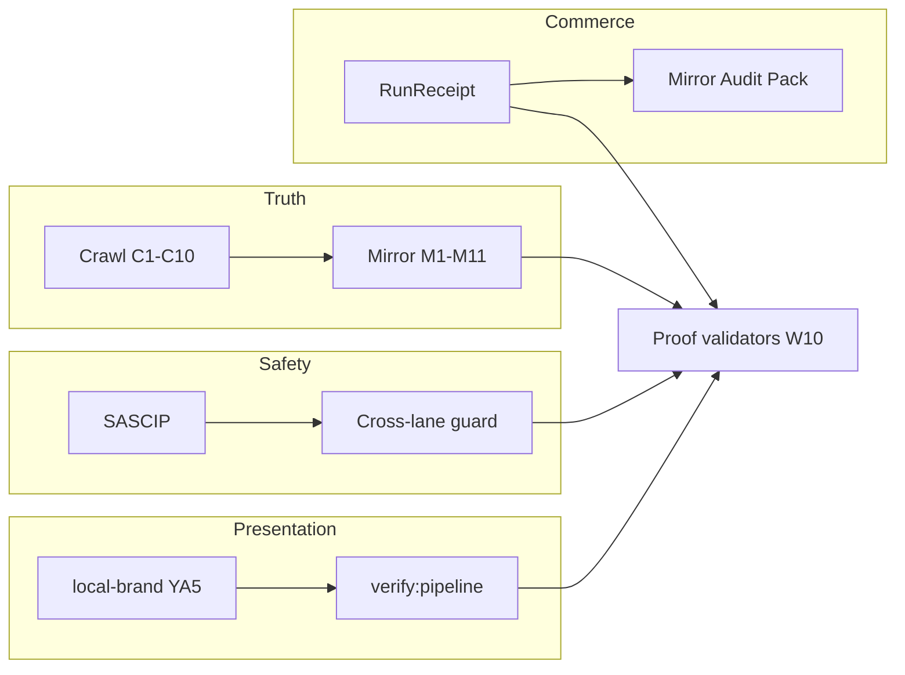

# SourceA — Ecosystem Gap Audit & System Map — LOCKED v1.0

**Version:** 1.0.0 LOCKED · **Saved:** 2026-06-16T10:05:00Z  
**Path:** `~/Desktop/SourceA/docs/SOURCEA_ECOSYSTEM_GAP_AUDIT_AND_SYSTEM_MAP_LOCKED_v1.md`  
**Authority:** Founder `FIX THEM ALL` + drift audit 2026-06-16  
**Skill:** `.cursor/skills/skill-architecting-pipelines-pro/SKILL.md` · `.cursor/skills/skill-node-architect-agentic-system/SKILL.md`  
**Node charter:** `docs/SOURCEA_NODE_ARCHITECT_AGENTIC_AUTONOMOUS_SYSTEM_LOCKED_v1.md`  
**Graph SSOT:** `data/sourcea_pipeline_node_graph_v1.json`  
**Plan spine:** `docs/SOURCEA_1000_STEP_MASTER_UPGRADE_PLAN15JUNE_LOCKED_v1.md` Part 1 + Part 3 · Epic **E11**

---

## 0. One sentence

> **Four pipelines (Truth · Safety · Presentation · Commerce) share one Proof Spine; gaps are what is not yet wired, not what chat claims is missing.**

Quote live queue from disk:

```bash
cd ~/Desktop/SourceA
python3 -c "import json; d=json.load(open('$HOME/.sina/agent-live-surfaces-v1.json')); print(d.get('factory_now_line')); print(d.get('sascip_line'))"
```

---

## 1. Four-pipeline system map

| Pipeline | Role | Maturity (16 Jun 2026) | Epic | Primary law |
|----------|------|------------------------|------|-------------|
| **Truth** (Crawl–Mirror) | Governance SSOT | Session tier **live** · gate wired · C1–C10 graph pending | E04–E06 | `SOURCEA_CRAWL_MIRROR_PIPELINE_LOCKED_v1.md` v1.4 |
| **Safety** (SASCIP + Mac) | Stranger admission | **v1.2 live** · Mac Health v3.0 tile | E07 | `STRANGER_AGENT_SAFETY_CONTROL_PIPELINE_LOCKED_v1.md` |
| **Presentation** (Local-brand YA5) | Customer mirror skin | `verify:pipeline` PASS | E08 | crawl-mirror §3 · YA5 |
| **Commerce** (GTM + RunReceipt) | Sellable proof | Draft phases 0–5 · no paying SKU yet | E09–E10 | crawl-mirror commercial phases |

**Proof Spine** (validators + receipts) gates all four.



---

## 2. Session gate wire order (machine truth)

Every non–pre-ship session runs (in order):

1. `disk_live_wire_sync` / anti-staleness auto-wire  
2. SASCIP live wire (`stranger_agent_safety_live_wire_v1.py`)  
3. Governance zero-drift live wire  
4. **`sourcea_crawl_mirror_pipeline_v1.py --tier session`** ← Wave 1 step 14 **DONE**  
5. Conduct gate + memory mirror inject  

**Receipt:** `~/.sina/agent_session_gate_receipt_v1.json` → step `sourcea_crawl_mirror_pipeline`

---

## 3. Eight-layer safety map (SASCIP + governance)

| Layer | Name | Fail-closed |
|-------|------|-------------|
| 1 | SASCIP | Stranger quarantine T5/T6 |
| 2 | Cross-lane edit guard | `ok: false` → no write |
| 3 | Founder verbs | SAVE · WORK · EDIT ALLOWED |
| 4 | Role separation | `execution_authority: false` |
| 5 | Session gate + conduct | Pre-ship scan |
| 6 | Mac emergency + cancel | Panic flags |
| 7 | External orchestrators | Token file |
| 8 | Proof validators | W10 bundle |

**Founder guide:** `docs/SOURCEA_STRANGER_AGENT_DEFENSE_IN_DEPTH_FOUNDER_GUIDE_LOCKED_v1.md`

---

## 4. Hub surfaces

| Surface | URL | Purpose |
|---------|-----|---------|
| H1 Worker Hub | `http://127.0.0.1:13020/` | Next steps · RUN INBOX glance · Advisor track |
| H2 Machine Hub | `http://127.0.0.1:13020/machines/` | Pending registry · scheduled receipts |
| Mac Health Heart | `http://127.0.0.1:13024/` | SASCIP admission · panic · prevention |
| Legacy archive | `http://127.0.0.1:13020/legacy/` | Museum only — not daily path |

**Naming:** Daily UI = **Worker Hub · Next steps** — not legacy Command brand (INCIDENT-034).

---

## 5. Drift audit — fixed 2026-06-16

| Was misleading | Truth on disk | Fix |
|----------------|---------------|-----|
| “Orchestrator missing” | `sourcea_crawl_mirror_pipeline_v1.py` exists + PASS | 1000-step Part 1 + GAP registry |
| “Session gate step 14 pending” | Wired in `agent_session_gate_run_v1.py` | crawl-mirror v1.4 |
| crawl-mirror doc v1.2 in plan | File was v1.3 → **v1.4** | Header + GAP rows |
| E07-F04 Planned | **DONE** | Defense guide + plan |
| W10 without crawl validator | Added to `validate-anti-staleness-vocabulary-gate-v1.sh` | scripts |

---

## 6. Open GAP registry (honest)

| Item | Status | Epic |
|------|--------|------|
| Full C1–C10 crawl graph + nightly tier | ❌ GAP | E04 Phase 5 |
| Hospital discharge clean | ❌ GAP | E03 Wave 0 |
| commercial-mirror-receipt union | ❌ GAP | E08 Wave 3 |
| Audience Hub P0 | ❌ GAP | E09 |
| E07-F03 partner webhook API v1.3 | Planned | E07 S0901+ |
| E07-F06 Hub “SASCIP check” one-tap | Planned | E07 |
| Hub `:13020` must be up for WTM API | Runtime | E02 |
| `find_critical_bugs` governance eval chain | 5 critical when hub/validators fail | E01 |

---

## 7. Paradox register (do not re-introduce)

| Paradox | Winner |
|---------|--------|
| “Never say Sina Command” vs INCIDENT-034 positive vocab | **Worker Hub · Next steps** — `001-founder-zero-sina-command-name.mdc` SUPERSEDED |
| Part 0 vs Part 3 plan authority | **Part 3 Version B** for execution order |
| Chat vs disk queue | **factory-now line** on `agent-live-surfaces-v1.json` |
| Legacy `app.js` vs Worker Hub | **worker-hub/index.html** — app.js retired |
| SAVE TO vs docs cross-lane | Machine guard needs **EDIT ALLOWED** for `docs/` even on new SAVE |

---

## 8. Founder daily path (positive)

| Step | Action |
|------|--------|
| Execute | Worker chat → **RUN INBOX** |
| Queue glance | Worker Hub → **Next steps** |
| Safety | Mac Health `:13024` · SASCIP ADMIT tile |
| Stop | Mac Health emergency or Hub Safety |
| Cross-lane fix | `EDIT ALLOWED: <path>` + `ACTION:` same message |
| Bounded build | `WORK:` + INBOX item |
| One research doc | `SAVE TO: docs/...` (+ EDIT ALLOWED for docs/) |

---

## 9. Architecting skill pointer

Agents and founder use the same skill for governable auto systems:

- **Project:** `.cursor/skills/skill-architecting-pipelines-pro/SKILL.md`  
- **Personal:** `~/.cursor/skills/sina-architecting-pipelines-pro/SKILL.md`

---

## 10. Node architect — unified graph (not fragments)

**Charter:** `docs/SOURCEA_NODE_ARCHITECT_AGENTIC_AUTONOMOUS_SYSTEM_LOCKED_v1.md`  
**Graph:** `data/sourcea_pipeline_node_graph_v1.json` · **Runner:** `scripts/pipeline_node_graph_runner_v1.py`  
**Skill:** `.cursor/skills/skill-node-architect-agentic-system/SKILL.md`

| Status | Build ID | Item |
|--------|----------|------|
| ✅ | N01 | Graph SSOT + runner + validator |
| ✅ | N02 | Charter LOCKED + skills |
| ⬜ | N03–N04 | Session gate delegates to runner |
| ⬜ | N07 | Hub node canvas UI |

**Open GAP:** Fragmented linear session gate steps until N03–N04 ship.

---

**END LOCKED v1.0.0 · SOURCEA_ECOSYSTEM_GAP_AUDIT_AND_SYSTEM_MAP_LOCKED_v1.md**
