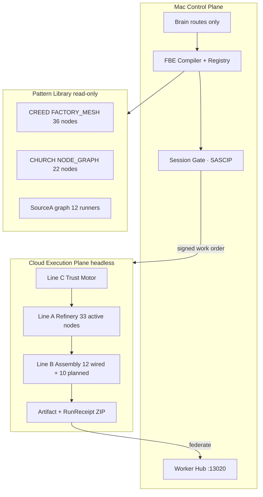

# SourceA Factory Builder Engine (FBE) — LOCKED v1.0

**Version:** 1.0.0 LOCKED · **Saved:** 2026-06-17T11:46:34Z  
**Path:** `~/Desktop/SourceA/docs/SOURCEA_FACTORY_BUILDER_ENGINE_LOCKED_v1.md`  
**Authority:** Founder order — governable executable factory lines · cloud headless · Mac control plane only  
**Machine SSOT:** `data/fbe_factory_builder_bundle_v1.json`  
**Stack map + Better Loop:** `docs/SOURCEA_STACK_MAP_AND_BETTER_LOOP_LOCKED_v1.md` · `STACK_MAP_BETTER_LOOP_ROUTE.yaml` · `2026-06-18T11:28:12Z`

**Parents:** `SINA_UNIFIED_ENGINE_STORY_LOCKED_v1.md` · `SOURCEA_NODE_ARCHITECT_AGENTIC_AUTONOMOUS_SYSTEM_LOCKED_v1.md` · `docs/SOURCEA_NODE_MESH_SYNESTM_BUILD_PLAN_LOCKED_v1.md` (E12)  
**Pattern sources (read-only import):** `PLUS ONE/CREED/.cursor/governance/FACTORY_MESH.json` · `PLUS ONE/CHURCH/.cursor/governance/NODE_GRAPH.json` · `data/sourcea_pipeline_node_graph_v1.json`

---

## 0. One sentence

> **SourceA FBE compiles three controlled factory lines (Trust Motor · Refinery · Assembly), spawns them headless in cloud, and federates receipts to Mac — quality spec in, platinum artifact + RunReceipt ZIP out; Mac manages the platform only.**

**Category sold:** Governable Executable Factory Line Systems (GEFLS) — not agents · not audit-only · not Mac-dependent production.

---

## 1. Big picture — where FBE sits

```text
L0   ASF + Hub (:13020) ........................ founder decides · Form · Actions
L0.5 Machine pipeline (Python) ............... validators · FBE · ~/.sina receipts
L1   Brain → Governance → Commercial → Brief ... route · reconcile · spawn factories
L2   Worker · Researcher · Maintainers ........ one sa/turn · hub SHIP · runtime
L3   PORTFOLIO LANES .......................... TrustField · Noetfield · Forge · Wil AI · YA5
L4   FBE FACTORY CAMPUSES (cloud headless) .... Refinery · Assembly · Motor per tenant
```

**Rule (unchanged):** One motor (SourceA L1) · many factory campuses (L4) · never a second engine.



---

## 2. Two-plane law (permanent)

| Plane | Location | Responsibility | Forbidden |
|-------|----------|----------------|-----------|
| **Control** | Mac · SourceA Hub | Registry · compile · spawn · freeze · receipt view · founder Actions | Production mirror/brand/locale jobs |
| **Execution** | Cloud containers/workers | Bay jobs · prove gates · artifact write · headless runners | Law edits · cross-tenant writes · chat SSOT |

**Invariant:** `factory-now` and queue SSOT stay on Mac. Job truth = cloud receipts federated to `~/.sina/fbe-runs/`.

---

## 3. Three factory lines (internal architecture)

Every FBE campus instance ships **exactly three lines**. Fourteen CREED capabilities are **commercial labels** mapped onto Line A nodes — not a separate machine tier.

| Line | FBE id | Role | Live pattern source | Node count |
|------|--------|------|---------------------|------------|
| **C** | `trust_motor` | Pre/post execution governance · work-order sign · federation | SourceA session gate · SASCIP · zero-drift | **18** (compile target) |
| **A** | `refinery` | Clone · brand · locale · voice · product delivery | CREED `FACTORY_MESH.json` | **36** (33 active · 3 deprecated) |
| **B** | `assembly` | Market intake · GTM · deploy · live prove | CHURCH `NODE_GRAPH.json` | **22** (12 wired · 10 planned) |

**Mesh SSOT import rule:** Never count nodes from `FACTORY_ARCHITECTURE` capabilities alone. CREED `NODE_GRAPH.json` lists 8 pointer nodes — full mesh is **`FACTORY_MESH.json`**.

---

## 4. Line A — Refinery (CREED 36-node map)

**Live proof (2026-06-17):** `factory-mesh-report.json` → `nodeCount: 36` · `ok: true` · `capabilityCount: 14`.

### 4.1 Active production wire (preserve edges)

```text
creed-orient → factory-docsync → factory-mirror → factory-route-audit
  → factory-clone-parity → factory-verify → factory-brand
  → factory-brand-visual-prove → factory-product-delivery → factory-locale-prove
  → factory-human-readable → factory-founder-language → factory-commercial-language
  → factory-voice-roundtrip → factory-critic → factory-heal → factory-comply → creed-session
```

### 4.2 Node registry (FBE Python compile — 1:1 creed id)

| creed_node_id | layer | fbe_python | status |
|---------------|-------|------------|--------|
| creed-orient-v1 | L0 | fbe_refinery_orient_v1.py | active |
| creed-session-v1 | L0 | fbe_refinery_session_v1.py | active |
| creed-boundary-v1 | GOV | fbe_refinery_boundary_v1.py | active |
| creed-isolation-v1 | GOV | fbe_refinery_isolation_v1.py | active |
| creed-workspace-purity-v1 | GOV | fbe_refinery_workspace_purity_v1.py | active |
| factory-definition-v1 | GOV | fbe_refinery_factory_definition_v1.py | active |
| factory-govern-v1 | GOV | fbe_refinery_govern_v1.py | active |
| factory-comply-v1 | GOV | fbe_refinery_comply_v1.py | active |
| factory-scaffold-v1 | L1 | fbe_refinery_scaffold_v1.py | active |
| factory-mesh-v1 | L1 | fbe_refinery_mesh_v1.py | active |
| factory-critic-v1 | L1 | fbe_refinery_critic_v1.py | active |
| factory-heal-v1 | L1 | fbe_refinery_heal_v1.py | active |
| factory-docsync-v1 | L1 | fbe_refinery_docsync_v1.py | active |
| factory-mirror-v1 | L2 | fbe_refinery_mirror_v1.py | active |
| factory-orchestrator-v1 | L2 | fbe_refinery_orchestrator_v1.py | active |
| factory-run-job-v1 | L2 | fbe_refinery_run_job_v1.py | active |
| factory-route-audit-v1 | L05 | fbe_refinery_route_audit_v1.py | active |
| factory-clone-parity-v1 | L05 | fbe_refinery_clone_parity_v1.py | active |
| factory-verify-v1 | L05 | fbe_refinery_verify_job_v1.py | active |
| factory-brand-v1 | L3 | fbe_refinery_brand_v1.py | active |
| factory-brand-visual-banners-v1 | L3 | fbe_refinery_brand_visual_banners_v1.py | active |
| factory-brand-visual-media-v1 | L3 | fbe_refinery_brand_visual_media_v1.py | active |
| factory-brand-visual-prove-v1 | L3 | fbe_refinery_brand_visual_prove_v1.py | active |
| factory-product-delivery-v1 | L3 | fbe_refinery_product_delivery_v1.py | active |
| factory-locale-discovery-v1 | L4 | fbe_refinery_locale_discovery_v1.py | active |
| factory-locale-parity-v1 | L4 | fbe_refinery_locale_parity_v1.py | active |
| factory-locale-match-v1 | L4 | fbe_refinery_locale_match_v1.py | active |
| factory-locale-prove-v1 | L4 | fbe_refinery_locale_prove_v1.py | active |
| factory-human-readable-v1 | L5 | fbe_refinery_human_readable_v1.py | active |
| factory-founder-language-v1 | L5 | fbe_refinery_founder_language_v1.py | active |
| factory-commercial-language-v1 | L5 | fbe_refinery_commercial_language_v1.py | active |
| factory-voice-roundtrip-v1 | L5 | fbe_refinery_voice_roundtrip_v1.py | active |
| factory-serve-v1 | L8 | fbe_refinery_serve_v1.py | active |
| factory-localize-v1 | L4 | — | deprecated → locale-prove |
| factory-content-v1 | L4 | — | deprecated → locale-prove |
| factory-commercial-v1 | L4 | — | deprecated → commercial-language |

### 4.3 Honest delivery law (imported)

`PRODUCT_DELIVERY_LAW.json`: **`deliveryMode: prove_only`** — usable product requires disk asset swap; CSS mask alone FAIL. FBE must not weaken this in cloud compile.

**Live gaps:** `sample-bay` orient — clone incomplete (route-audit · match-floor · reference-quality · fidelity-matrix · critic). Dealer audit **14/15** — FAIL `verify-16-steps`.

---

## 5. Line B — Assembly (CHURCH 22-node map)

**Live proof:** `CHURCH_DEFINITION.json` 8/8 factory · Phase 0 locked · upstream CREED read-only.

| church_node_id | layer | status | fbe_python |
|----------------|-------|--------|------------|
| church-orient-v1 | L0 | wired | fbe_assembly_orient_v1.py |
| church-architect-v1 | L0 | wired | fbe_assembly_architect_v1.py |
| church-boundary-v1 | GOV | wired | fbe_assembly_boundary_v1.py |
| church-rules-v1 | GOV | wired | fbe_assembly_rules_isolation_v1.py |
| church-definition-v1 | GOV | wired | fbe_assembly_definition_v1.py |
| church-neutrality-v1 | GOV | wired | fbe_assembly_neutrality_v1.py |
| church-isolation-v1 | GOV | wired | fbe_assembly_isolation_v1.py |
| church-policy-v1 | GOV | wired | fbe_assembly_policy_v1.py |
| church-dealer-letter-v1 | GOV | wired | fbe_assembly_dealer_letter_v1.py |
| church-verify-v1 | GOV | wired | fbe_assembly_verify_v1.py |
| church-intake-v1 | L2 | wired | fbe_assembly_intake_v1.py |
| church-market-fidelity-v1 | L05 | wired | fbe_assembly_market_fidelity_v1.py |
| church-scaffold-v1 | L1 | planned | fbe_assembly_scaffold_v1.py |
| church-merge-v1 | L2 | planned | fbe_assembly_merge_v1.py |
| church-brand-unity-v1 | L3 | planned | fbe_assembly_brand_unity_v1.py |
| church-narrative-v1 | L3 | planned | fbe_assembly_narrative_v1.py |
| church-forbidden-v1 | L3 | planned | fbe_assembly_market_forbidden_v1.py |
| church-demo-v1 | L4 | planned | fbe_assembly_demo_path_v1.py |
| church-gtm-v1 | L4 | planned | fbe_assembly_gtm_v1.py |
| church-deploy-v1 | L5 | planned | fbe_assembly_deploy_config_v1.py |
| church-domain-v1 | L5 | planned | fbe_assembly_domain_checklist_v1.py |
| church-live-smoke-v1 | L5 | planned | fbe_assembly_live_smoke_v1.py |

**Intake gate:** Refinery DISBRAND complete + fidelity ≥ GOLD before assembly intake. PLATINUM or founder waiver before MARKET_READY.

---

## 6. Line C — Trust Motor (SourceA govern)

Wraps existing SourceA runners — does not duplicate CREED gates.

| fbe_node_id | wraps | plane |
|-------------|-------|-------|
| fbe_motor_session_gate_v1 | agent_session_gate_run_v1.py | INTERNAL |
| fbe_motor_sascip_v1 | stranger_agent_safety_live_wire_v1.py | INTERNAL |
| fbe_motor_zero_drift_v1 | governance_zero_drift_live_wire_v1.py | INTERNAL |
| fbe_motor_disk_live_wire_v1 | disk_live_wire_sync_v1.py | INTERNAL |
| fbe_motor_vocabulary_v1 | vocabulary_guard_v1.py | INTERNAL |
| fbe_motor_pre_write_v1 | pre_write_guard_v1.py | INTERNAL |
| fbe_motor_work_order_sign_v1 | fbe_sign_work_order_v1.py | INTERNAL |
| fbe_motor_tenant_isolation_v1 | fbe_check_tenant_isolation_v1.py | INTERNAL |
| fbe_motor_conduct_v1 | agent_session_gate_run_v1.py --pre-ship | INTERNAL |
| fbe_motor_event_spine_v1 | fbe_event_spine_emit_v1.py | INTERNAL |
| fbe_motor_registry_sync_v1 | fbe_motor_registry_sync_v1.py | INTERNAL |
| fbe_motor_receipt_federate_v1 | fbe_receipt_federate_v1.py | INTERNAL |
| fbe_motor_critic_v1 | fbe_motor_critic_v1.py | INTERNAL |
| fbe_motor_verify_v1 | fbe_verify_motor_v1.py | INTERNAL |
| fbe_motor_hub_projection_v1 | fbe_hub_projection_v1.py | HUB_API |
| fbe_motor_mac_health_v1 | mac_health_live_v1.py | INTERNAL |
| fbe_motor_graph_delegate_v1 | pipeline_node_graph_runner_v1.py | INTERNAL |
| fbe_motor_factory_control_v1 | factory_control_v1.py | INTERNAL |

**Live posture:** SourceA graph v1.3 · 12 tier runners · 987/1000 Valid YES · queue sa-0889.

---

## 7. Three first factories (commercial spawn SKUs)

These are the **first three factory campuses** FBE compiles and sells. Each bundles Lines C+A+B with a vertical template.

### Factory 1 — `web-product-factory-v1` (Build Lab + Launch Desk)

| Field | Value |
|-------|-------|
| **Commercial name** | Controlled Web Product Factory |
| **Lines** | Motor + Refinery (36) + Assembly (22) |
| **Pattern** | CREED + CHURCH full campus |
| **First tenant** | Internal design partner · Wil AI lane |
| **Input** | Origin spec · brand brief · locale list |
| **Output** | Product bay + market pack + RunReceipt ZIP |
| **Tier target** | PLATINUM refinery → MARKET_READY assembly |
| **Wave** | W2–W3 (first cloud ship) |

### Factory 2 — `exchange-factory-v1` (Fintech Exchange Line)

| Field | Value |
|-------|-------|
| **Commercial name** | Controlled Exchange Factory |
| **Lines** | Motor + Refinery + Assembly (exchange template) |
| **Pattern** | CREED EX · match floor routes 100% · assets ≥99% |
| **First tenant** | TrustField commercial lane |
| **Input** | Exchange reference · regulatory voice perimeter |
| **Output** | Local confidential product (:5191-class) + receipts |
| **Tier target** | PLATINUM · MSB advisory perimeter on voice gates |
| **Wave** | W3 (after Factory 1 platinum) |

### Factory 3 — `forge-app-factory-v1` (Controlled App Ship Line)

| Field | Value |
|-------|-------|
| **Commercial name** | Controlled App Factory (FORGE) |
| **Lines** | Motor + Refinery (app scaffold subgraph) + Assembly (deploy only) |
| **Pattern** | FORGE SKU · SourceA Worker inbox · no web clone |
| **First tenant** | FORGE portfolio lane |
| **Input** | App spec · agent shell · ship gate class |
| **Output** | Controlled app artifact + session/receipt pack |
| **Tier target** | GOLD ship gate · G0–G3 proof class |
| **Wave** | W4 |

**Law:** Factory 2 and 3 **reuse Motor + compile rules** from Factory 1 — never fork a second trust engine.

---

## 8. FBE meta orchestrator (4 nodes)

| id | cmd | receipt |
|----|-----|---------|
| fbe_compiler_v1 | fbe_compile_template_v1.py | ~/.sina/fbe-compiled-template-v1.json |
| fbe_spawn_v1 | fbe_spawn_factory_v1.py | ~/.sina/fbe-factory-instance-v1.json |
| fbe_run_job_v1 | fbe_run_job_v1.py | ~/.sina/fbe-run-job-receipt-v1.json |
| fbe_hub_projection_v1 | fbe_hub_projection_v1.py | Hub API /api/fbe/v1 |

---

## 9. Pipelines (18 + bundle)

| id | tier | line | steps summary |
|----|------|------|---------------|
| fbe-compile-pipeline | F0 | meta | compile → definition 8/8 all lines |
| fbe-spawn-pipeline | F0 | meta | sign work order → spawn → motor verify |
| fbe-full-job-pipeline | F3 | bundle | motor session → refinery full → assembly full → federate |
| motor-session-pipeline | M0 | C | orient → gate → sascip → boundary → tenant |
| motor-wire-pipeline | M1 | C | zero_drift → vocabulary → live_wire → registry |
| motor-closeout-pipeline | M2 | C | conduct → federate → motor_verify |
| refinery-session-pipeline | R0 | A | orient → definition → neutrality |
| refinery-scaffold-pipeline | R1 | A | scaffold → mesh → docsync |
| refinery-ingest-pipeline | R2 | A | mirror → route_audit → clone_parity |
| refinery-prove-pipeline | R2 | A | match_floor → fidelity → reference → critic |
| refinery-brand-pipeline | R3 | A | brand → visual → product_delivery prove_only |
| refinery-locale-voice-pipeline | R3 | A | locale_prove → voice_roundtrip |
| refinery-full-pipeline | R3 | A | ingest → prove → brand → locale-voice → verify |
| assembly-session-pipeline | B0 | B | orient → definition → upstream_lock → policy |
| assembly-intake-pipeline | B1 | B | intake → market_fidelity |
| assembly-narrative-pipeline | B2 | B | narrative → brand_unity → demo_path |
| assembly-deploy-pipeline | B2 | B | deploy_config → live_smoke |
| assembly-full-pipeline | B3 | B | intake → narrative → deploy → verify |

**Runner:** `scripts/fbe_pipeline_runner_v1.py` — reads `data/fbe_node_graph_v1.json` (compiled from bundle).

---

## 10. Quality contract (business-enforced)

| Tier | Refinery | Assembly | Motor | Shippable |
|------|----------|----------|-------|-----------|
| BRONZE | routes 100% | — | session PASS | Demo only |
| GOLD | assets ≥99% · critic ≥90 | intake PASS | SASCIP ADMIT · drift ≥85 | Design partner |
| PLATINUM | fidelity matrix ALL · prove_only delivery PASS | brand unity (when wired) | federated partial | **Paid product ship** |
| MARKET_READY | PLATINUM | demo path · deploy · live smoke 200 | conduct 0 violations | **Commercial launch** |

**Law:** UI green ≠ tier. Only receipt `tier_achieved` field counts.

---

## 11. Work order + RunReceipt (buyer deliverable)

**Input schema:** `fbe-work-order-v1` — tenant · template_id · bay_slug · target_tier · origin · brand · locales.

**Output schema:** `fbe-run-receipt-v1` — artifact_uri · receipt_pack_uri · lines{motor,refinery,assembly} · sha256 · tier_achieved.

**Buyer ZIP contents:** federated JSON + artifact hash + governance session receipt + refinery bay receipts + assembly market receipts.

---

## 12. Python machine layout

```text
SourceA/
├── data/
│   ├── fbe_factory_builder_bundle_v1.json    # machine SSOT (this epic)
│   ├── fbe_node_graph_v1.json                # compiled 76 nodes (W0)
│   ├── fbe_pipelines_v1.json
│   ├── fbe_pattern_library_v1.json
│   └── fbe_quality_contract_v1.json
├── scripts/
│   ├── fbe_pipeline_runner_v1.py
│   ├── fbe_compile_template_v1.py
│   ├── fbe_spawn_factory_v1.py
│   ├── fbe_run_job_v1.py
│   ├── fbe_receipt_federate_v1.py
│   ├── fbe_sign_work_order_v1.py
│   └── fbe/
│       ├── motor/
│       ├── refinery/    # 33 active machines
│       ├── assembly/    # 22 machines (status field)
│       └── lib/         # cloud_adapter · boundary · receipts
├── cloud/
│   ├── Dockerfile.fbe-runner
│   └── fbe-worker-entrypoint.sh
└── docs/
    └── SOURCEA_FACTORY_BUILDER_ENGINE_LOCKED_v1.md  # this file
```

**Graph plane registration:** Add `factory_builder_engine_v1` to `sourcea_pipeline_node_graph_v1.json` as `plane: PORTFOLIO` (E12 · extends N10).

---

## 13. Hub integration (Mac only)

| API | Purpose |
|-----|---------|
| `GET /api/fbe/registry/v1` | All factory instances |
| `GET /api/fbe/work-orders/v1` | Active jobs |
| `GET /api/fbe/receipts/v1` | Federated proof |
| `POST /api/fbe/spawn/v1` | Template → cloud instance |
| `POST /api/fbe/actions/v1` | spawn · freeze · resume · retire |

Founder: **Actions only** — no Terminal.

---

## 14. Implementation waves

| Wave | Weeks | Deliverable | Proof |
|------|-------|-------------|-------|
| **W0** | 2 | Bundle JSON · validators · graph compile stub | validate-fbe-* PASS |
| **W1** | 4 | Line C motor delegate · receipt federate stub | motor_verify PASS |
| **W2** | 6 | Line A cloud runner · Factory 1 first bay | refinery_verify headless |
| **W3** | 4 | Line B cloud · Factory 1 MARKET_READY | fbe_run_job PASS |
| **W4** | 4 | Hub API · Factory 2 exchange · billing meter | design partner receipt |

---

## 15. Brain read order (live info — mandatory)

```text
1. ~/.sina/agent-live-surfaces-v1.json
2. PLUS ONE DECISIONS.md (latest material)
3. CREED FACTORY_MESH.json (not NODE_GRAPH alone)
4. CHURCH NODE_GRAPH.json (wired vs planned)
5. .e2e receipts (mesh · dealer-audit · orient)
6. Then architecture catalogs
```

**Saying:** Architecture tells the story · Mesh tells the truth · Receipts tell if it ships.

---

## 16. Relations (do not duplicate)

| Source | FBE relationship |
|--------|------------------|
| CREED | Pattern import Line A — do not merge repo |
| CHURCH | Pattern import Line B — upstream read-only |
| PLUS ONE shell | Parent campus prove — EXTRACT_STRATEGY not data |
| Wil AI | L3 commercial skin · tenant not motor |
| SourceA sa-1000 | Spine factory parallel — not product factory |
| RunReceipt SKU | Output pack format — evidence flywheel |

---

## 17. Golden nugget

**Sell the three-line campus headless.** Competitors sell agents or clones. SourceA FBE sells **Motor + Refinery + Assembly** with **prove_only** honesty and **RunReceipt** proof — Mac manages platform; cloud scales production.

---

**END SOURCEA_FACTORY_BUILDER_ENGINE_LOCKED_v1**
