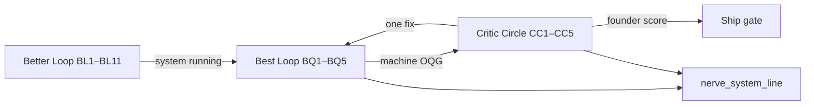

# Factory Output Critic Loop — LOCKED v1

**Version:** 1.0.0 · **Saved:** 2026-06-18T18:15:00Z · **Status:** LOCKED
**Path:** `~/Desktop/SourceA/docs/SOURCEA_FACTORY_OUTPUT_CRITIC_LOOP_LOCKED_v1.md`
**Authority:** Founder · factory builder foundation — repeatable process, not one-off hero outputs
**Phase:** POST-DESIGN

**Parents:**
- `docs/SOURCEA_STACK_MAP_AND_BETTER_LOOP_LOCKED_v1.md` (Better Loop BL · operating cadence)
- `docs/SOURCEA_BEST_LOOP_OUTPUT_QUALITY_GATE_LOCKED_v1.md` (Best Loop BQ · machine OQG)
- `docs/SOURCEA_FOUNDER_EMAIL_FACTORY_STANDARD_LOCKED_v1.md` (FEFS · W3 persuasion bar)
- `data/commercial-film-critic-circle-v1.json` (same Observe→Improve pattern for film)

---

## 0. One law (factory builder)

> **We are a factory builder.** Speed without a repeatable ≥90% standard is fake progress.  
> **Better Loop** asks: *Is the system running?*  
> **Best Loop** asks: *Does the artifact score ≥90% on disk?*  
> **Critic Circle** asks: *What one fix closes the gap — and did we re-run until true?*

No push hard-and-fast on send. **Loops + critic circle** own improvement until output matches real-world standard.

---

## 1. Three loops (do not merge)

| Loop | Question | Owner | Receipt |
|------|----------|-------|---------|
| **Better Loop** | Governance · queue · commercial flywheel running? | executor | `~/.sina/better-loop-pulse-receipt-v1.json` |
| **Best Loop OQG** | `output_clean_pct` ≥90 structural + FEFS? | machine | `~/.sina/best-loop-oqg-receipt-v1.json` |
| **Critic Circle** | Gap vs true standard · one next action | critic + executor | `~/.sina/factory-output-critic-circle-receipt-v1.json` |

**Brain lane inject** and **`pipeline_send_slot`** are **not** substitutes for Best Loop or Critic PASS.

---

## 2. Critic circle — Observe · Analyze · Search · Learn · Improve

Same discipline as commercial film critic circle — applied to **all factory outputs**.

| Step | Action |
|------|--------|
| **Observe** | Read OQG · W3 packs · founder review · FBE/CREED receipts |
| **Analyze** | Machine vs 90 · founder score vs 90 · FEFS instant-rejection |
| **Search** | Top failing checks · brain inject drift · structural-only false PASS |
| **Learn** | Append `~/.sina/factory-output-critic-incidents-v1.jsonl` — one row per gap |
| **Improve** | **One** bounded fix per turn · re-pack · re-OQG · re-critic — no batch rerender spam |

**Script:** `python3 scripts/factory_output_critic_circle_v1.py --json`

---

## 3. True ship gate (all must PASS)

| Gate | Bar | Source |
|------|-----|--------|
| Machine OQG | ≥90% | `best_loop_oqg_score_v1.py` (structural 40 + FEFS 60 for W3) |
| Founder score | ≥90% | Human founder after full read |
| Critic circle | `verdict: PASS` | No IMPROVE rows for artifact |
| Pipeline send slot | `cleared` | Workflow only — not quality |
| BQ2 send path | `assert_oqg_pass` | `send_w3_canada_v1.py` |
| Ops | Mail FROM + confirm-sent | Founder manual |

**W3 KPI:** get a human reply — FEFS R1–R10 + founder score enforce that, not brochure completeness alone.

---

## 4. Repeatable process (every artifact class)

1. **Produce** — template / bay / pack script (SSOT in `data/commercial/` or FBE bay)
2. **Score** — Best Loop OQG pulse
3. **Critic** — factory output critic circle
4. **Fix one thing** — rewrite · harden bay · fix URL · never stack five edits
5. **Re-score** — OQG + founder review
6. **Repeat 3–5** until machine ≥90 **and** founder ≥90 **and** critic PASS
7. **Ship** — only then pipeline send + Mail

Same chain for **W3 email · FBE RunReceipt · CREED bay** — not one hero email.

---

## 5. Check cart rows (CC1–CC5)

| ID | Command | Pass |
|----|---------|------|
| CC1 | `factory_output_critic_circle_v1.py --json` | receipt + artifacts |
| CC2 | W3 founder review | founder_score or PENDING flagged |
| CC3 | OQG W3 structural + FEFS split | both dimensions on checks |
| CC4 | incidents jsonl | learn step when IMPROVE |
| CC5 | nerve + better loop embed critic line | optional hub slice |

---

## 6. Disk routing

| Topic | Path |
|-------|------|
| Critic loop law | `docs/SOURCEA_FACTORY_OUTPUT_CRITIC_LOOP_LOCKED_v1.md` |
| Critic config | `data/factory-output-critic-circle-v1.json` |
| Critic receipt | `~/.sina/factory-output-critic-circle-receipt-v1.json` |
| Incidents log | `~/.sina/factory-output-critic-incidents-v1.jsonl` |
| FEFS | `docs/SOURCEA_FOUNDER_EMAIL_FACTORY_STANDARD_LOCKED_v1.md` |

---

*LOCKED v1 — foundation over hero outputs · critic circle improves until true ≥90% · Better + Best + Critic stay separate.*
