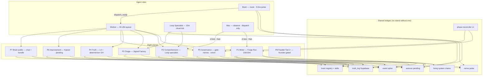

# SourceA Living Brain + Autorun Master Plan (LOCKED v1)

**Schema:** `sourcea-living-brain-autorun-master-plan-v1`  
**Saved at (UTC):** 2026-07-02T21:30:00Z  
**Machine SSOT:** `data/sourcea-living-brain-autorun-master-plan-v1.json`  
**Law:** `docs/GOVERNED_AUTORUN_LAWS_v3.md` (L1–L13 · D1–D8)

---

## One sentence

**One living brain:** eight execution planes, eight shared bridges, ten Worker queue items — cloud runs motors, Mac observes and dispatches, Brain routes, nothing ships as an island.

---

## The problem today (islands)

| Island | Runs alone | Missing bridge |
|--------|------------|----------------|
| Cloud Forge Run motor | ✅ 100 rows / 10m | Kaizen + full L11 cost rollup |
| Loop specialist | ✅ 15m | Worker inbox auto-wire; LOOP_AUTO_DISPATCH |
| Signal Factory | ✅ piggyback | Dedicated cron risk; Brain registry partial |
| Brain verifier | ✅ bundled + redundant */30 | Dedup; brain-core gate not live |
| GitHub L4 / determinism | ✅ | D6–D8; per-lane recipe matrix |
| Session gate + nerves | ✅ every turn | Mac nerve mesh Phase 3 |
| Kaizen / self-improve | ❌ law only | No queue motor |
| Parallel Tier 1+ lanes | ❌ blocked | Lane registry |

---

## Living system architecture

---

## Eight planes (every aspect)

### P1 — Motor (Cloud Forge Run)
- **Trigger:** CF `*/10` → Railway `auto-tick` → **100 rows mandatory**
- **SSOT:** `data/cloud-auto-runtime-v1.json`
- **Receipts:** `receipts/cloud/autonomous-forge-run-cycles/`
- **Worker phase:** `phase-market`
- **Harden:** Kaizen one-item-per-cycle; L11 cost in heartbeat

### P2 — Comprehension (Loop specialist)
- **Trigger:** CF `*/15` → Railway loop-specialist tick
- **SSOT:** `data/loop-specialist-cloud-contract-v1.json`
- **Mac observe:** `loop_specialist_tick_v1.py --json`
- **Harden:** CF account URL align; `LOOP_AUTO_DISPATCH` secrets; pending → Worker inbox

### P3 — Triage (Signal Factory)
- **Trigger:** Piggyback on P2 (not dedicated cron)
- **Skill:** `.cursor/skills/signal-factory/SKILL.md`
- **Registry:** `data/sourcea-base-brain-skills-v1.json` · verified_registered
- **Harden:** Disable dedicated `signal-factory-tick-v1` cron

### P4 — Truth (external verify + determinism)
- **L4:** `external-verify.yml` → Supabase `EXTERNAL_VERIFY_PASS`
- **L13 CI:** `determinism-gate.yml` → D1–D5
- **Harden:** D6–D8 in CI; `data/sourcea-verify-recipe-registry-v1.json` per lane

### P5 — Governance (gates · nerves · orient)
- **Entry:** `agent_session_gate_run_v1.py` every agent turn
- **Graph:** T0→T1→T2→T3 parallel → T_lat_orient
- **Nerves:** `agent_nerve_system_v1.py` → live surfaces
- **Orient step 14:** governed-autorun L1–L13
- **Harden:** Remove dead launchd refs; Mac nerve mesh Phase 3 when founder triggers

### P6 — Improvement (Kaizen · pending · drift)
- **Pending:** `autorun_pending_v1.py` on every cycle/tick
- **Better Loop:** session gate step
- **Harden:** `autorun_kaizen_queue_v1.py` + backlog JSON; L12 drift in heartbeat

### P7 — Brain public (chat + knowledge)
- **Assets:** brain-knowledge-bundle, brain-chat-worker, brain-core-gate-staging
- **Harden:** Deploy brain-core gate; remove redundant `*/30` brain-loop cron

### P8 — Parallel Tier 1+ (founder gated)
- **Law:** Lanes · concurrency keys · lock ordering — BLOCKED until founder triggers
- **Deliverable:** `data/autorun-lane-registry-v1.json` + CF routing

---

## Eight bridges (wire everything)

| Bridge | Path | Rule |
|--------|------|------|
| **truth_log** | Supabase + `data/truth-log-cloud-contract-v1.json` | L4 PASS only from here |
| **event spine** | `governance_event_spine_v1.py` | All material transitions logged |
| **autorun pending** | `receipts/cloud/autorun-pending/pending-latest-v1.json` | Brain reads every session |
| **nerve pulse** | `~/.sina/agent-nerve-system-receipt-v1.json` | Queue alignment + ship_gates |
| **living chains** | `data/living-system-chain-registry-v1.json` | PROVE belt before SHIP |
| **phase reconciler** | `phase_reconciler_v1.py` | L1 ONE authority |
| **brain registry** | `sourcea-brain-registry-inventory-v1.json` + base brain skills | No orphan assets |
| **execution spine** | `scripts/execution_spine/` | Hub tasks — not factory motor |

**Coherence law:** A plane that cannot write to ≥1 bridge is an island — fix or throttle.

---

## Worker-managed queue (W-LBA-001 … W-LBA-010)

Brain routes · Worker implements · cloud executes · Mac observes.

| ID | Plane | Action |
|----|-------|--------|
| **W-LBA-001** | P5 | Fix dead launchd refs; align loop-specialist CF account |
| **W-LBA-002** | P3 | Signal Factory piggyback-only; disable dedicated cron |
| **W-LBA-003** | P7 | Brain verifier bundled-only; drop */30 redundancy |
| **W-LBA-004** | P4 | Extend determinism D6–D8; per-lane verify recipes |
| **W-LBA-005** | P6 | Kaizen queue motor — one `machine_safe`/cycle |
| **W-LBA-006** | P1 | Expand living-system-chain registry (all planes) |
| **W-LBA-007** | P5 | Hub living-system dashboard slice (:13027) |
| **W-LBA-008** | P2 | LOOP_AUTO_DISPATCH secrets; pending → Worker inbox |
| **W-LBA-009** | all | Drain→Cloud Forge Run vocabulary pass |
| **W-LBA-010** | P8 | Lane registry (founder gated — Tier 1+) |

**Worker inbox:** `.sina-loop/INBOX.md` · `~/.sina/worker-prompt-inbox-v1.json`

---

## Brain standing duties (every session)

1. Read `pending-latest-v1.json` + nerve `ship_gates`
2. Report: loops · states · sink invariant · drift · cost (5 lines)
3. Surface `founder_blocked` (count, oldest, age) — never process
4. If `dispatch_ready`: paste **one** W-LBA item to Worker inbox
5. Never drain motor on Mac — `cf-tick` or Hub dispatch only

---

## Worker standing duties (every session)

1. INBOX head only — one W-LBA item when assigned
2. Scoped paths from master plan JSON — no whole-repo search
3. Commit one lane; deploy verify only in ship window
4. Append receipt path to `receipts/cloud/w-lba-*`

---

## Loop specialist standing duties (cloud 15m)

1. Observe/advise/dispatch comprehension loop
2. Piggyback Signal Factory tick
3. Refresh autorun pending
4. Escalate `founder_blocked` in heartbeat — never cancel

---

## Tool matrix (smart use — recipe proven)

| Tool | Role in living system |
|------|----------------------|
| **Cloudflare cron** | Primary scheduler — one cron per mission max |
| **Railway FBE** | Sole factory body — all motors |
| **GitHub Actions** | External truth (L4) + structural determinism (L13) |
| **Supabase truth_log** | Cross-plane truth bus |
| **Hub :13027** | Founder cockpit + living chain slice |
| **Hub :13020** | Worker Hub + execution spine |
| **n8n** | External glue only — retire Mac `*/10` motor glue |
| **Cursor Worker** | Implements W-LBA queue — not 24/7 motor |
| **Copilot / Noetfield** | Product lane only — not wired to factory spine |

---

## Rollout phases

| Phase | Scope | Owner |
|-------|-------|-------|
| **R0 — Bridge fix** | W-LBA-001, 002, 003, 009 | Worker (now) |
| **R1 — Truth harden** | W-LBA-004, 006 | Worker + CI |
| **R2 — Self-improve live** | W-LBA-005, 008 | Worker + Loop specialist |
| **R3 — Hub visibility** | W-LBA-007 | Worker |
| **R4 — Parallel Tier 1+** | W-LBA-010 | Founder trigger |

---

## Wired artifacts

| Artifact | Path |
|----------|------|
| This plan (machine) | `data/sourcea-living-brain-autorun-master-plan-v1.json` |
| This plan (human) | `docs/SOURCEA_LIVING_BRAIN_AUTORUN_MASTER_PLAN_LOCKED_v1.md` |
| Autorun laws v3 | `docs/GOVERNED_AUTORUN_LAWS_v3.md` |
| Governed autorun skill | `.cursor/skills/governed-autorun/SKILL.md` |
| Worker assignment | `data/sourcea-worker-professional-assignment-v1.json` |
| Node graph | `data/sourcea_pipeline_node_graph_v1.json` |
| Living chains | `data/living-system-chain-registry-v1.json` |

---

## Out of scope

Sales copy · LinkedIn · NOOS repo changes · founder decisions · Mac factory body.
