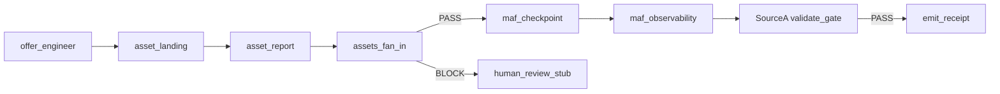

# SourceA — MAF Factory Job Pattern (v1)

**Saved at:** 2026-06-24T23:00:00Z  
**Authority:** Advisor pattern · `docs/SOURCEA_MICROSOFT_AGENT_FRAMEWORK_MAF_LOCKED_v1.md`  
**Implementation:** `apps/factory-runtime-spike/factory_runtime_spike/maf_workflow_v1.py`

---

## 0. One law

> **MAF WorkflowBuilder graph runs inside one Temporal activity. SourceA `validate_gate` + `emit_receipt` stay outside MAF — MAF internal checks are draft-only; L6 gate is canonical.**

---

## 1. Advisor pattern → SourceA mapping

| MAF concept (advisor) | SourceA spike (deterministic sim) |
|----------------------|-----------------------------------|
| `WorkflowBuilder` + `set_start_executor` | `build_maf_factory_workflow()` · LangGraph `StateGraph` |
| `offer_engineer_executor` | `offer_engineer_node` — positioning, pricing, hero |
| `asset_generator_executor` (fan-out) | `asset_landing_node` + `asset_report_node` → `assets_fan_in_node` |
| `proof_validator_executor` | **Outside MAF** — `run_validate_and_receipt_nodes()` in `langgraph_gate_v1.py` |
| `receipt_generator` | **Outside MAF** — `emit_receipt_activity` / `build_receipt()` |
| `conditional_edge` PASS → receipt | Temporal activity chain after MAF phase completes |
| `false_branch` → human review | `human_review_stub_node` (orientation only in sim) |
| `checkpoint=True` | `maf_checkpoint_node` → `maf_ckpt_ref` on state |
| `trace=True` | `maf_observability_node` → `maf_trace[]` on receipt |

---

## 2. Canonical hybrid chain (locked)

```text
Temporal: FactoryJobWorkflowV1
  Activity 0: sourcea_critic_boot_stub()     → PASS | BLOCK
  Activity 1: run_maf_factory_workflow()     → offer → assets (fan-out/in) → checkpoint → trace
  Activity 2: sourcea_validate_gate()        → PASS | BLOCK  ← moat
  Activity 3: emit_receipt()                 → fbe-execution-receipt-v1 JSON
```

**Dry-run:**

```bash
python3 apps/factory-runtime-spike/factory_runtime_spike/dry_run_v1.py \
  --fixture pureflow --embed maf --json --no-write
```

---

## 3. MAF graph shape (factory job)



Note: spike runs fan-out branches **sequentially** in LangGraph; real MAF `WorkflowBuilder.add_fan_out_edges` runs parallel on SDK.

---

## 4. Advisor Python sketch (reference — not production import)

Maps to real MAF SDK when cloud keys + `agent-framework` pip are available in ship window:

```python
# Reference only — spike uses LangGraph sim in maf_workflow_v1.py
#
# workflow = (
#     WorkflowBuilder(name="SourceA_Factory_Job")
#     .set_start_executor(offer_engineer)
#     .add_fan_out_edges(offer_engineer, [asset_landing, asset_report])
#     .add_fan_in_edges([asset_landing, asset_report], assets_merge)
#     .add_edge(assets_merge, checkpoint_executor)
#     .add_edge(checkpoint_executor, observability_executor)
# )
# # PASS/BLOCK gate and receipt — SourceA activities, not MAF terminal nodes
```

---

## 5. Receipt fields (MAF hybrid)

| Field | Meaning |
|-------|---------|
| `runtime_embed` | `maf-hybrid-v1` |
| `agent_framework` | `maf-sim-v1` or `agent-framework` when SDK wired |
| `maf_pattern` | `factory-job-fanout-gate-v1` |
| `maf_trace` | Ordered executor names (observability stand-in) |
| `maf_ckpt_ref` | Checkpoint id for replay orientation |
| `critic_boot` | SourceA pre-flight verdict |

---

## 6. When to swap sim → real MAF SDK

| Gate | Action |
|------|--------|
| P0 revenue | No SDK — sim only |
| P1b spike | **Now** — `--embed maf` dry-run |
| Paid Copilot-governance job | `agent-framework` pip in cloud activity |
| Azure AI Foundry host | Replace `ChatClientAgent` executors — keep SourceA gate |

---

## 7. Forbidden

- MAF `proof_validator_executor` as sole gate (must duplicate SourceA validators outside)
- MAF workflow as Temporal replacement
- Marketing MAF to SME Intelligence buyers

---

*Pattern v1 · internal · June 2026*
