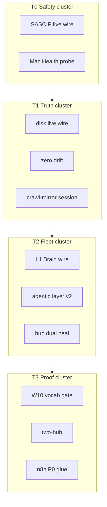

# SourceA — Node Architect Agentic Autonomous System — LOCKED v1.0

**Version:** 1.0.0 LOCKED · **Saved:** 2026-06-16T11:00:00Z  
**Path:** `~/Desktop/SourceA/docs/SOURCEA_NODE_ARCHITECT_AGENTIC_AUTONOMOUS_SYSTEM_LOCKED_v1.md`  
**Authority:** Founder order — unified nodes, not fragmented pipelines  
**Graph SSOT:** `data/sourcea_pipeline_node_graph_v1.json`  
**Runner:** `scripts/pipeline_node_graph_runner_v1.py`  
**Skills:** `.cursor/skills/skill-node-architect-agentic-system/SKILL.md` · `~/.cursor/skills/sina-node-architect-agentic-system/SKILL.md`  
**Related:** `docs/SOURCEA_ECOSYSTEM_GAP_AUDIT_AND_SYSTEM_MAP_LOCKED_v1.md` · `.cursor/skills/skill-architecting-pipelines-pro/SKILL.md` · `SINA_AUTOMATION_SPINE_AND_N8N_LOCKED_v1.md`

---

## 0. One sentence

> **Every capability is a node with inputs, outputs, receipts, and governance edges — parallel tiers like n8n, but Python + disk SSOT owns law; n8n glues external clocks only.**

**Anti-goal:** Fragmented pipelines (session gate here, crawl-mirror there, n8n elsewhere) with no shared node registry.

---

## 1. Node vs fragmented pipeline

| Fragmented (old) | Node system (target) |
|------------------|----------------------|
| Linear script chains | **Graph** — nodes + edges + tiers |
| Chat claims “wired” | **Receipt** per node (`~/.sina/*-receipt-v1.json`) |
| Duplicate orchestrators | **One runner** reads graph SSOT |
| n8n as brain | n8n = **external glue** tier only |
| Validators orphaned | Each node maps to `validate-*` or embeds proof |
| Agents improvise | **Skills** load same graph for founder + agent |

---

## 2. Node anatomy (mandatory fields)

Every node in `sourcea_pipeline_node_graph_v1.json`:

| Field | Meaning |
|-------|---------|
| `id` | Stable machine id (snake_case) |
| `label` | Founder-readable name |
| `cmd` | Execute vector (python3/bash script) |
| `receipt` | Optional disk proof path |
| `required` | Fail tier if false |
| `parallel` | Tier-level — run with siblings |
| `plane` | `INTERNAL` · `RUNTIME_GLUE` · `HUB_API` · `PORTFOLIO` |
| `skip_if` | `hub_down` · `panic_active` · etc. |
| `edges_in` / `edges_out` | (Phase 2) explicit graph edges |
| `governance` | SASCIP tier · cross-lane · founder verb |

---

## 3. System map — four pipelines as node clusters



**Cross-cluster edges (Phase 2+):** event bus topics `spine.bridge` · `factory.advance` · `governance.heal` fan-out from any node completion.

---

## 4. Reference index (canonical paths)

| Layer | Reference |
|-------|-----------|
| **Graph SSOT** | `data/sourcea_pipeline_node_graph_v1.json` |
| **Runner** | `scripts/pipeline_node_graph_runner_v1.py` |
| **Validator** | `scripts/validate-pipeline-node-graph-v1.sh` |
| **Graph receipt** | `~/.sina/pipeline-node-graph-receipt-v1.json` |
| **Session gate** | `scripts/agent_session_gate_run_v1.py` (Phase 2: delegate to runner) |
| **n8n manifest** | `scripts/fixtures/n8n/workflow_manifest.json` |
| **Agentic stack** | `SOURCEA_AGENTIC_LAYER_STACK_LOCKED_v2.md` |
| **SASCIP** | `docs/STRANGER_AGENT_SAFETY_CONTROL_PIPELINE_LOCKED_v1.md` |
| **Crawl-mirror** | `docs/SOURCEA_CRAWL_MIRROR_PIPELINE_LOCKED_v1.md` v1.4 |
| **Gap audit** | `docs/SOURCEA_ECOSYSTEM_GAP_AUDIT_AND_SYSTEM_MAP_LOCKED_v1.md` |
| **1000-step plan** | `docs/SOURCEA_1000_STEP_MASTER_UPGRADE_PLAN15JUNE_LOCKED_v1.md` Epic E11 |
| **Event bus** | Runtime `spine.bridge` · `founder_action` (MonoRepo) |

---

## 5. Skills (founder + agent — same graph)

| Skill | Path | Audience |
|-------|------|----------|
| **Node architect** | `.cursor/skills/skill-node-architect-agentic-system/SKILL.md` | Agents — design · wire · validate nodes |
| **Founder mirror** | `~/.cursor/skills/sina-node-architect-agentic-system/SKILL.md` | Founder — one-liner · daily path |
| **Architecting PRO** | `.cursor/skills/skill-architecting-pipelines-pro/SKILL.md` | Parent — four pipelines + checklist |

**Load order:** Node architect → Architecting PRO → Gap audit doc.

---

## 6. Build plan — nodes not fragments (N01–N20)

**Epic E11** in 1000-step spine · **do not** duplicate pipeline scripts — **register as nodes**.

| ID | Phase | Priority | Node / deliverable | Proof |
|----|-------|----------|-------------------|-------|
| **N01** | 0 | P0 | Graph SSOT v1 + runner + validator | `validate-pipeline-node-graph-v1.sh` PASS |
| **N02** | 0 | P0 | This LOCKED charter + skills synced | Files logged |
| **N03** | 1 | P0 | Session gate delegates T0–T1 to runner | Gate receipt shows graph tier |
| **N04** | 1 | P0 | Remove duplicate linear steps in gate | No double crawl-mirror |
| **N05** | 1 | P1 | Explicit `edges_in/out` in graph JSON | Schema v1.1 |
| **N06** | 1 | P1 | Event bus emit on node complete | `spine.bridge` tail |
| **N07** | 2 | P1 | Hub node canvas UI `:13020` | Visual graph read-only |
| **N08** | 2 | P1 | Founder one-tap “Run graph tier T3” | Hub action |
| **N09** | 2 | P2 | n8n workflows import from manifest auto | `n8n_glue_runner_v1.py` |
| **N10** | 2 | P2 | Portfolio nodes (TrustField · YA5 · NF) | `plane: PORTFOLIO` |
| **N11** | 3 | P1 | C1–C10 crawl as node subgraph | Epic E04 |
| **N12** | 3 | P1 | M1–M11 mirror nodes | crawl-mirror Phase 5 |
| **N13** | 3 | P2 | Autonomous tier — scheduled graph (not AUTO-RUN Cursor) | Cron + founder flag |
| **N14** | 3 | P2 | Node health dashboard Mac Health | `:13024` tile |
| **N15** | 4 | P2 | RunReceipt per node execution | Commercial SKU hook |
| **N16** | 4 | P2 | Partner webhook nodes (SASCIP external) | E07-F03 |
| **N17** | 4 | P3 | Multi-Mac graph federation | Enterprise |
| **N18** | 4 | P3 | Self-heal — runner reorders failed nodes | `--self-heal` |
| **N19** | 5 | P3 | Full graph nightly tier | ≤15 min budget |
| **N20** | 5 | P4 | Customer-facing “Mirror Audit Pack” = exported graph receipt | Commerce E09 |

### Wave order

```text
Wave 0 (done)     N01 N02 — graph + charter + skills
Wave 1 (this week) N03 N04 N05 — session gate + edges schema
Wave 2 (2–4 wk)   N07 N08 N09 — Hub UI + n8n glue sync
Wave 3 (Q3)       N11 N12 N13 — crawl/mirror subgraph + scheduled tier
Wave 4 (Q4+)      N15 N16 N20 — receipts + commercial
```

---

## 7. Governance (autonomous but governable)

| Rule | Enforcement |
|------|-------------|
| No node writes law without founder verb | cross_lane_edit_guard |
| Strangers cannot add nodes | SASCIP T5 quarantine |
| n8n never SSOT for prompts/law | `SINA_AUTOMATION_SPINE_AND_N8N_LOCKED_v1.md` |
| Each node must have receipt or validator | Graph schema lint |
| Parallel only within tier | Runner ThreadPool per tier |
| Fail-closed on required node | Tier ok=false → graph ok=false |

**Autonomous:** scheduled tiers · n8n cron · event bus fan-out.  
**Governable:** founder verbs · SASCIP · Mac emergency stop · conduct pre-ship.

---

## 8. Proof commands

```bash
cd ~/Desktop/SourceA
bash scripts/validate-pipeline-node-graph-v1.sh
python3 scripts/pipeline_node_graph_runner_v1.py --dry-run --json
python3 scripts/pipeline_node_graph_runner_v1.py --json
cat ~/.sina/pipeline-node-graph-receipt-v1.json | python3 -m json.tool
bash scripts/sync-cursor-agent-skills.sh
```

---

## 9. Founder one-liner

> **Nodes, not fragments:** one graph logged, parallel tiers like n8n, every step receipted, agents and founder read the same skill.

---

**END LOCKED v1.0.0 · SOURCEA_NODE_ARCHITECT_AGENTIC_AUTONOMOUS_SYSTEM_LOCKED_v1.md**
