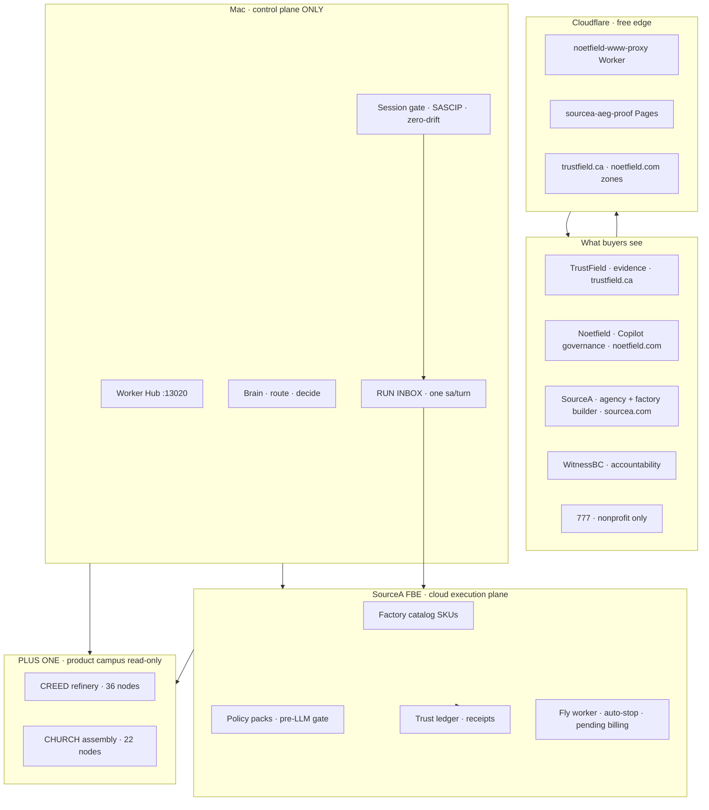

# SourceA Stack Map (Future You) + Better Loop — LOCKED v2

**Version:** 2.2.0 · **Saved:** 2026-06-18T21:05:49Z-06-18T21:04:57Z · **Status:** LOCKED
**Path:** `~/Desktop/SourceA/docs/SOURCEA_STACK_MAP_AND_BETTER_LOOP_LOCKED_v1.md`
**Authority:** Founder · post-factory-design era · check + optimize only
**Phase:** **POST-DESIGN** — no new architecture waves; operate the loop
**Vocabulary SSOT:** `data/sourcea-forge-vocabulary-disambiguation-v1.json`

**Parents:**
- `docs/SOURCEA_FACTORY_BUILDER_ENGINE_LOCKED_v1.md` (FBE · two-plane law)
- `docs/SOURCEA_ECOSYSTEM_FAST_BUSINESS_MODEL_LOCKED_v2.md` (commercial horizons)
- `1 PAGER/PORTFOLIO_ALL_PATHS_BY_BRAND_LOCKED_v1.md` (brand routing)
- `1 PAGER/PORTFOLIO_SOURCEA_WITNESSBC_777_INSIGHT_PLAN_LOCKED_v1.md` (30-day plans)

---

## 0. Was the stack map locked before this file?

| Artifact | Stack map? | Better Loop? |
|----------|------------|--------------|
| FBE charter | Control vs execution plane (partial) | No |
| Business model v2 | 4-layer stack + horizons | No |
| Portfolio all-paths | Brand cross-cut mermaid | No |
| Portfolio insight plan | Four engines map | No |
| **This file** | **Full future stack map** | **Yes — operating loop** |

Chat-only diagrams are **not SSOT** until this file (and mirrors below).

---

## 1. Stack map — future you (LOCKED)



### Layer table

| Layer | Lives | Job | Status (Jun 2026) |
|-------|-------|-----|-------------------|
| **L0 Mac control** | Hub · Brain · session gate | Spawn · approve · check · optimize | **LIVE** |
| **L1 Edge** | Cloudflare Workers/Pages | Proxy · AEG proof host | **DEPLOYED** (www proxy + aeg-proof) |
| **L2 FBE cloud** | Fly/Railway skeleton | Headless factory jobs | **BUILT** · Fly billing pending |
| **L3 Campus** | PLUS ONE / CREED / CHURCH | Refinery + assembly patterns | **READ-ONLY import** |
| **L4 Brands** | TF · NF · SA · WBC · 777 | Separate vocabulary · separate SOW | **ROUTING LOCKED** |

**Law:** Mac never runs production at scale. Mac manages platform; cloud runs factories.

---

## 2. Better Loop v1 (POST-DESIGN — LOCKED)

> Mac manages the platform · cloud runs factories · agents execute one `sa`/turn · founder approves money and messages · everything else receipts itself.

### Four auto loops

| Loop | Flow | Founder |
|------|------|---------|
| **Governance pulse** | session gate → truth bundle → queue → SASCIP → zero-drift | Nothing unless red → **hospital** |
| **Product spine** | RUN INBOX → one sa → ACT → validator → receipt | Worker chat **RUN INBOX** |
| **Commercial** | Attract → Prove → Close → Expand | Approve sends · reply · book demo |
| **Factory execution** | work order → policy gate → cloud run → receipt → sleep | Check receipt ZIP |

### Founder check card (5 min)

1. Worker Hub → Next steps — one clear row  
2. factory-now — Valid YES · drift 0  
3. RUN INBOX — one turn + receipt  
4. W3 — replies · no stuck approved_not_sent  
5. Edge — www.noetfield.com · landing proof links  

### Optimize cadence (one lever / week)

| Week | Lever |
|------|-------|
| Money | Ocree + Fundmore deposit |
| Cloud | Fly worker + MARKET_READY receipt |
| Loop | queue_sa align |
| Surface | film → book rate |
| Factory | one catalog shadow pilot |

### Stop list (loop discipline)

No new FBE waves before first deposit · no blended emails · no architecture as procrastination · **never “forge email”** — say **ICP compile** · **Forge** = product only (`~/Desktop/forge`).

### Commercial compile order (LOCKED — Jun 2026)

```text
SourceA (sourcea-factory) → Noetfield (fundmore) → TrustField (ocree)
→ Forge product → WitnessBC · 777 · advisor_pre_call
```

Machine SSOT: `data/icp-output-compiler-v1.json` · accounts: `data/icp-compile/`

---

## 2b. Better Loop v2 — 11-step cart (BL1–BL11 · MACHINE WIRED)

**Check cart SSOT:** `~/.sina/better-loop-checkcart-v1.json`  
**Pulse:** `python3 scripts/better_loop_pulse_v1.py --json`  
**Receipt:** `~/.sina/better-loop-pulse-receipt-v1.json`  
**Live line:** `better_loop_line` on `~/.sina/agent-live-surfaces-v1.json`  
**Hub card:** `GET /api/worker-hub/v1` → `better_loop` slice

| Step | Name | Owner | Pass |
|------|------|-------|------|
| BL1 | LOCK doctrine v2 | executor | doc + mirrors synced |
| BL2 | Check cart SSOT | executor | `better-loop-checkcart-v1.json` |
| BL3 | Pulse engine | executor | `better_loop_pulse_v1.py --json` |
| BL4 | Pulse receipt | executor | mandatory loops green |
| BL5 | Live wire line | executor | `better_loop_line` on surfaces |
| BL6 | Session gate inject | executor | gate step `better_loop_pulse` |
| BL7 | Hub founder card | executor | 6 checks + weekly lever + nerve/OQG slices |
| BL8 | Commercial loop | commercial | W3 `approved_not_sent` surfaced |
| BL9 | Factory loop | worker | FBE bundle + Fly receipt read-only |
| BL10 | Validator | executor | `validate-better-loop-v1.sh` |
| BL11 | Ship wire W1–W10 | executor | law wire cart on lock ship |

**Weekly lever (disk):** `money` — **SourceA Sina read** → Noetfield compile → TrustField send (W1 scoreboard)

**Founder path unchanged:** RUN INBOX · Hub Better Loop glance · approve money/messages only.

---

## 2c. Best Loop BQ1–BQ5 + Nerve NS (OUTPUT QUALITY · SHIP GATES)

**Law:** `docs/SOURCEA_BEST_LOOP_OUTPUT_QUALITY_GATE_LOCKED_v1.md` v1.2  
**OQG pulse:** `python3 scripts/best_loop_oqg_score_v1.py --json`  
**OQG receipt:** `~/.sina/best-loop-oqg-receipt-v1.json`  
**Nerve pulse:** `python3 scripts/agent_nerve_system_v1.py --json`  
**Nerve receipt:** `~/.sina/agent-nerve-system-receipt-v1.json`  
**Live line:** `nerve_system_line` on `~/.sina/agent-live-surfaces-v1.json`

| Step | Name | Pass |
|------|------|------|
| BQ1 | OQG score | per-lane `output_clean_pct` + fleet receipt |
| BQ2 | W3 send gate | `send_w3_canada_v1.py` blocks &lt;90 without waiver |
| BQ3 | Hub slices | `nerve_system` + `best_loop_oqg` on Worker Hub API |
| BQ4 | Trust 7d | `fleet_output_clean_7d` + `trust_mode_7d` per lane |
| BQ5 | Fleet bar | fleet ≥90% before trusted automation |
| NS1 | Nerve pulse | queue aligned + unified lines |
| NS2 | Nerve validator | `validate-agent-nerve-system-v1.sh` PASS |

**Ship gates (nerve receipt):** `w3_oqg_pass` · `w3_conversation_interest_pass` · `w3_receiver_interest_pass` · `w3_rrl_pass` · `w3_critic_pass` · `w3_sina_read_pass` · `w3_send_ready`

**Vocabulary:** `docs/SOURCEA_FACTORY_VOCABULARY_FOUNDER_HUMAN_ONLY_LOCKED_v1.md` — Founder = Sina human only

**Factory v2:** `docs/SOURCEA_FOUNDER_EMAIL_FACTORY_v2_SPEC_LOCKED_v1.md`

**Check cart rows:** BQ1–BQ5 + NS1–NS2 + CC1–CC5 appended to `~/.sina/better-loop-checkcart-v1.json` · validator `validate-nerve-system-cart-v1.sh`

---

## 2d. Critic Circle CC1–CC5 (REPEATABLE IMPROVE UNTIL TRUE ≥90%)

**Law:** `docs/SOURCEA_FACTORY_OUTPUT_CRITIC_LOOP_LOCKED_v1.md`  
**Critic pulse:** `python3 scripts/factory_output_critic_circle_v1.py --json`  
**Receipt:** `~/.sina/factory-output-critic-circle-receipt-v1.json`  
**Live line:** `critic_circle_line` on Better Loop pulse + nerve surfaces

| Step | Name | Pass |
|------|------|------|
| CC1 | Critic score | W3 + FBE + CREED artifacts scored vs 90 bar |
| CC2 | One next action | `next_action_only` — one bounded fix per turn |
| CC3 | Sina read checks | `w3_critic_circle` + `w3_sina_read` on pulse |
| CC4 | Incidents log | `~/.sina/factory-output-critic-incidents-v1.jsonl` |
| CC5 | Ship wire | nerve `w3_send_ready` requires critic + **Sina read** PASS |

**Factory law:** Better Loop = system running · Best Loop = machine ≥90% · Critic Circle = close gap until true standard — not push-hard-and-fast on send.

---

## 2e. Receiver Interest Loop RIL1–RIL3 (RECIPIENT POV)

**Law:** `docs/SOURCEA_RECEIVER_INTEREST_LOOP_LOCKED_v1.md`  
**RIL pulse:** `python3 scripts/receiver_interest_loop_v1.py --json`  
**Receipt:** `~/.sina/receiver-interest-loop-receipt-v1.json`  
**Assets SSOT:** `data/w3-receiver-interest-assets-v1.json`

| Step | Name | Pass |
|------|------|------|
| RIL1 | Receiver interest score | preview/demo URL + recipient hook ≥90% |
| RIL2 | Interest asset SSOT | per-account demo/catalog URLs on disk |
| RIL3 | RIL loop law | LOCKED doc datetime PASS |

**Factory law:** Machine OQG can PASS with nothing interesting to click — RIL scores from the recipient's chair only.

---

## 2f. Advisor pre-call APC1–APC3 (HUMAN CLARITY · NOT W3)

**Law:** `docs/SOURCEA_ADVISOR_PRE_CALL_EMAIL_STANDARD_LOCKED_v1.md`  
**APC pulse:** `python3 scripts/advisor_pre_call_email_loop_v1.py --json`  
**Receipt:** `~/.sina/advisor-pre-call-email-loop-receipt-v1.json`  
**SSOT:** `data/advisor-pre-call-email-v1.json` · example `data/advisor-pre-call-examples/richard-alberta-v1.txt`

| Step | Name | Pass |
|------|------|------|
| APC1 | Human clarity score | `human_clarity_pct` ≥90 · no jargon hard fails |
| APC2 | SSOT + example | rules JSON + canonical Richard compile on disk |
| APC3 | APC loop law | LOCKED doc datetime PASS |

**Factory law:** Scheduled advisor/mentor pre-call only — business-not-AI audience · **Sina read** ship authority · separate from W3 commercial.

---

## 2g. ICP Output Compiler ICO1–ICO3 (FDG · BRAND ORDER)

**Law:** `data/icp-output-compiler-v1.json` · `data/factory-output-route-compiler-v1.json`  
**Compiler:** `python3 scripts/icp_output_compiler_v1.py --account <id> --json`  
**Receipt:** `~/.sina/icp-output-compiler-receipt-v1.json`  
**Accounts:** `data/icp-compile/{account}-v1.json` · bodies `*-approved-v1.txt`

| Step | Name | Pass |
|------|------|------|
| ICO1 | FDG failure moment | scenario · pressure · consequence on account stub |
| ICO2 | Machine loops | ICP ≥90 · CIL ≥92 · RIL ≥90 (Mode B) · OQG ≥90 · RRL D/E |
| ICO3 | Brand gate | SourceA → Noetfield → TrustField · then Forge product |

**Vocabulary:** **ICP compile** — never “forge email.” **Forge** = `~/Desktop/forge` product only. Legacy path renames: vocabulary SSOT `drift_watch`.

**Current (Jun 2026):** `sourcea-factory` machine PASS · await Sina read · `fundmore` queued · `ocree` machine-ready behind Noetfield gate.

---

## 2h. Response Reality Layer RRL1–RRL2 (HUMAN REACTION SIM)

**Law:** `scripts/response_reality_layer_v1.py`  
**Receipt:** `~/.sina/response-reality-layer-receipt-v1.json`

| Step | Name | Pass |
|------|------|------|
| RRL1 | Reaction sim | **D** curious or **E** would_reply only |
| RRL2 | Ship boundary | RRL is machine sim — **Sina read** remains sole ship authority |

**Factory law:** OQG can PASS while recipient would ignore — RRL scores from the recipient's chair after read.

---

## 3. Horizon routing (from business model v2 — federated here)

| Horizon | When | Win metric |
|---------|------|------------|
| **H1 Prove it pays** | 30–60d | CAD ≥ $2K deposit + shadow pilot |
| **H2 Prove it scales** | mo 2–4 | Cloud receipt + 2–3 factory customers |
| **H3 Platform** | 2027 | NF/TF retainers + catalog maintenance ARR |

---

## 4. Disk routing index (where each piece lives)

| Topic | LOCKED path |
|-------|-------------|
| Stack map + Better Loop | `docs/SOURCEA_STACK_MAP_AND_BETTER_LOOP_LOCKED_v1.md` |
| FBE engine | `docs/SOURCEA_FACTORY_BUILDER_ENGINE_LOCKED_v1.md` |
| FBE machine bundle | `data/fbe_factory_builder_bundle_v1.json` |
| Business model horizons | `docs/SOURCEA_ECOSYSTEM_FAST_BUSINESS_MODEL_LOCKED_v2.md` |
| Brand routing | `1 PAGER/PORTFOLIO_ALL_PATHS_BY_BRAND_LOCKED_v1.md` |
| Canada W3 sends | `1 PAGER/CANADA_PRIORITY_A_SEND_READY_EMAILS_LOCKED_v1.md` |
| W3 approvals | `data/commercial/w3-canada-send-approvals-v1.json` |
| Portfolio 30-day | `1 PAGER/PORTFOLIO_SOURCEA_WITNESSBC_777_INSIGHT_PLAN_LOCKED_v1.md` |
| CF www proxy code | `Noetfield/.../infra/cf-www-proxy/` |
| AEG host script | `SourceA/scripts/host_aeg_bundle_v1.py` |
| Fly deploy (free-only) | `SourceA/cloud/fly.toml` · `scripts/deploy_fbe_fly_free_v1.sh` |
| Portfolio route YAML | `1 PAGER/portfolio-300-locked/STACK_MAP_BETTER_LOOP_ROUTE.yaml` |
| Machine routing JSON | `data/commercial/stack-map-routing-v1.json` |
| Better Loop check cart | `~/.sina/better-loop-checkcart-v1.json` |
| Better Loop pulse receipt | `~/.sina/better-loop-pulse-receipt-v1.json` |
| Pulse script | `scripts/better_loop_pulse_v1.py` |
| Validator | `scripts/validate-better-loop-v1.sh` · `scripts/validate-nerve-system-cart-v1.sh` |
| OQG law + receipt | `docs/SOURCEA_BEST_LOOP_OUTPUT_QUALITY_GATE_LOCKED_v1.md` · `~/.sina/best-loop-oqg-receipt-v1.json` |
| ICP compiler | `data/icp-output-compiler-v1.json` · `scripts/icp_output_compiler_v1.py` · `data/icp-compile/` |
| Forge vocabulary | `data/sourcea-forge-vocabulary-disambiguation-v1.json` |
| RRL | `scripts/response_reality_layer_v1.py` |
| Advisor pre-call | `docs/SOURCEA_ADVISOR_PRE_CALL_EMAIL_STANDARD_LOCKED_v1.md` · `scripts/advisor_pre_call_email_loop_v1.py` |
| Nerve system | `scripts/agent_nerve_system_v1.py` · `~/.sina/agent-nerve-system-receipt-v1.json` |

---

## 5. Portfolio folder routing

| Folder / plan | What to read | Action |
|---------------|--------------|--------|
| `1 PAGER/` | All LOCKED commercial + this file mirror | Strategy · sends |
| `portfolio-300-locked/W3_FIRST_QUEUE.yaml` | Ocree · Fundmore approve | Hub send |
| `portfolio-300-locked/prompts/canada-rwa/` | pf-0242–0244 | Email drafts |
| `portfolio-300-locked/prompts/sourcea/` | S-P* agency paths | Asset B loop |
| `portfolio-300-locked/prompts/trustfield/` | T-P* · TF-* | Ocree lane |
| `portfolio-300-locked/prompts/noetfield/` | N-P* · NF-RD | Fundmore lane |
| `SourceA/docs/` | FBE + stack map | Worker implementation |
| `SourceA/os/commercial/` | Mirrors for Worker INBOX | Same content |
| `~/.sina/` | Receipts · truth bundle | Session gate only |

---

## 6. 30-day Better Loop scoreboard

| Week | Auto wins | Founder optimize |
|------|-----------|------------------|
| W1 | Proxy live · landing client-language · SourceA ICP machine PASS | **Sina read** sourcea-factory → compile fundmore |
| W2 | INBOX 5+ sa without paste | Follow-ups on replies |
| W3 | One cloud factory job receipt | Fly billing + deploy |
| W4 | First deposit + pilot scoped | Case study row |

---

*LOCKED v2.2 — Better Loop BL1–BL11 · ICP compile order · RRL wired · Forge vocabulary synced.*
