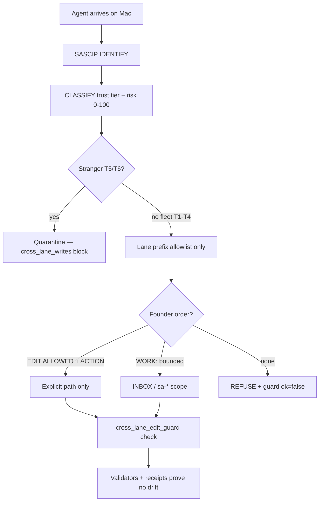

# SourceA — Stranger Agent Defense in Depth (Founder Guide) — LOCKED v1.0

**Version:** 1.0.0 LOCKED · **Saved:** 2026-06-16T08:55:00Z  
**Path:** `~/Desktop/SourceA/docs/SOURCEA_STRANGER_AGENT_DEFENSE_IN_DEPTH_FOUNDER_GUIDE_LOCKED_v1.md`  
**Machine law (implementation):** `docs/STRANGER_AGENT_SAFETY_CONTROL_PIPELINE_LOCKED_v1.md` (SASCIP v1.2)  
**Cross-lane law:** `SINA_CROSS_LANE_EDIT_FORBIDDEN_INCIDENT_LOCKED_v1.md` · `.cursor/rules/000-cross-lane-edit-forbidden.mdc`  
**Future plan spine:** `docs/SOURCEA_1000_STEP_MASTER_UPGRADE_PLAN15JUNE_LOCKED_v1.md` · Epic **E07** (Safety SASCIP & Mac)  
**System map:** `docs/SOURCEA_ECOSYSTEM_GAP_AUDIT_AND_SYSTEM_MAP_LOCKED_v1.md`  
**Architecting skill:** `.cursor/skills/skill-architecting-pipelines-pro/SKILL.md`

---

## 0. Short answer (founder)

SourceA does **not** rely on “trust the model.” It uses **defense in depth** — identify every agent session, quarantine strangers on write, restrict each lane to an allowlist, require founder verbs for cross-lane edits, and prove posture logged every session. Nothing is a perfect OS sandbox, but **unapproved strangers are designed to fail closed** on code/system changes.

**Quote live posture from disk** (not chat):

```bash
cd ~/Desktop/SourceA
python3 -c "import json; d=json.load(open('$HOME/.sina/agent-live-surfaces-v1.json')); print(d.get('sascip_line'))"
cat ~/.sina/stranger-agent-monitor-v1.json | python3 -m json.tool
```

Healthy: `ADMIT` · `stranger: false` · tier **T1–T4** · `cross_lane_writes: allow` only inside lane · Mac Health tile **ADMIT** at `http://127.0.0.1:13024/`.

---

## 1. Big picture — eight layers



| Layer | Name | Fail-closed behavior |
|-------|------|----------------------|
| **1** | SASCIP | Fingerprint → tier → quarantine strangers |
| **2** | Cross-lane edit guard | `ok: false` → no write |
| **3** | Founder verbs | SAVE · WORK · EDIT ALLOWED — else REFUSE |
| **4** | Role separation | `execution_authority: false` lanes advise only |
| **5** | Session gate + conduct | SASCIP + conduct before substantive work |
| **6** | Mac emergency + cancel | Panic flags · agent-cancel · inbox clear |
| **7** | External orchestrators | Token file — no self-admit |
| **8** | Proof validators | Anti-staleness · tamper tests · `find_critical_bugs` |

---

## 2. Layer 1 — SASCIP

**Law:** `docs/STRANGER_AGENT_SAFETY_CONTROL_PIPELINE_LOCKED_v1.md` v1.2  
**Orchestrator:** `scripts/stranger_agent_safety_pipeline_v1.py`  
**Session wire:** `scripts/stranger_agent_safety_live_wire_v1.py` (ADMIT → PROBE → PANIC → WATCH → SERVE)

Every session gate runs stranger admission before substantive work:

`IDENTIFY → CLASSIFY → CONTROL → PROVE → SERVE`

**Fingerprint inputs:** workspace root · fleet chat hash · MCP servers (unknown → risk bump) · git branch/dirty · process signals · bulk-edit intent in founder text.

| Tier | Who | Write policy |
|------|-----|--------------|
| **T0** | Founder elevation (`EDIT ALLOWED` / `WORK:` / `SAVE TO:`) | Only what founder explicitly named |
| **T1–T2** | Fleet Brain / Worker / Maintainer | Lane allowlist only |
| **T3** | Portfolio repos (TrustField, etc.) | Portfolio workspace match |
| **T4** | Registered lane (e.g. `sourcea_worker`) | Prefix allowlist |
| **T5** | Stranger | `cross_lane_writes: block` · bulk edit block |
| **T6** | Hostile (risk ≥85 or Mac emergency) | Block + factory freeze recommend |

**Audit receipts:**

| File | Purpose |
|------|---------|
| `~/.sina/stranger-agent-admission-receipt-v1.json` | Last admission |
| `~/.sina/stranger-agent-monitor-v1.json` | Hub + Mac Health `:13024` tile |
| `~/.sina/agent-live-surfaces-v1.json` → `sascip_line` | Quote every reply |
| `~/.sina/stranger-agent-registry-v1.json` | Fleet fingerprint registry |

---

## 3. Layer 2 — Cross-lane edit guard

**Law:** `SINA_CROSS_LANE_EDIT_FORBIDDEN_INCIDENT_LOCKED_v1.md`

Before any cross-lane disk edit:

```bash
cd ~/Desktop/SourceA
python3 scripts/cross_lane_edit_guard_v1.py check --agent <id> --path "<target>" --json
```

If `ok: false` → **do not write**. Strangers resolve through SASCIP first (`STRANGER_QUARANTINE`). Admitted agents only touch paths in their **lane prefix allowlist** — e.g. Worker → `scripts/`, not random `docs/*_LOCKED.md` without founder order.

**Demo (expect block on docs without order):**

```bash
python3 scripts/cross_lane_edit_guard_v1.py check \
  --agent cursor --path "docs/SOME_LOCKED.md" --json
# → ok: false · reason: CROSS_LANE_PATH_FORBIDDEN
```

---

## 4. Layer 3 — Founder verbs

**Law:** `.cursor/rules/000-cross-lane-edit-forbidden.mdc`

| Verb | Meaning |
|------|---------|
| **WORK:** | Bounded build — INBOX / sa-* / product scope only |
| **SAVE TO:** | One named doc — write once, stop |
| **EDIT ALLOWED:** `<path>` + **ACTION:** | Cross-desk edit — nothing else |

Without these, agents **REFUSE** — no “helpful” SSOT, registry, or hub JSON wiring.

---

## 5. Layers 4–8 (summary)

| Layer | SSOT pointer |
|-------|----------------|
| **4 Role separation** | `SOURCEA_AGENTIC_LAYER_STACK_LOCKED_v2.md` · Brain routes · Worker builds · governance/commercial `execution_authority: false` |
| **5 Session gate** | `scripts/agent_session_gate_run_v1.py` · SASCIP + conduct + pre-ship |
| **6 Mac emergency** | `scripts/mac_health_emergency_stop_v1.py` · `mac-health-emergency-active-v1.flag` · `agent-cancel-v1.flag` |
| **7 Partner bots** | `~/.sina/config/stranger-agent-external-tokens-v1.json` · `--external-orchestrator` |
| **8 Validators** | `validate-stranger-agent-safety-v1.sh` · anti-staleness bundle · `find_critical_bugs.py` |

---

## 6. Founder checks (copy-paste — must `cd` first)

```bash
cd ~/Desktop/SourceA

# 1. Current admission posture
python3 scripts/stranger_agent_safety_pipeline_v1.py --role worker --agent cursor --json

# 2. Would this path be allowed?
python3 scripts/cross_lane_edit_guard_v1.py check \
  --agent cursor --path "docs/SOME_LOCKED.md" --json

# 3. Live surface line
python3 -c "import json; d=json.load(open('$HOME/.sina/agent-live-surfaces-v1.json')); print(d.get('sascip_line'))"

# 4. Continuous watch pulse
python3 scripts/stranger_agent_safety_pipeline_v1.py --watch --json

# 5. Full safety validator
bash scripts/validate-stranger-agent-safety-v1.sh
```

**Why Terminal failed from `~`:** scripts live under `~/Desktop/SourceA/scripts/` — not `~/scripts/`. Always `cd ~/Desktop/SourceA` first. Lines starting with `#` are comments — do not paste them as commands.

---

## 7. Alarm vs healthy signals

| Healthy | Alarm |
|---------|-------|
| `stranger: false` | `T5_stranger_quarantine` / `T6_hostile_block` |
| Tier T1–T4 · badge **ADMIT** | `STRANGER_QUARANTINE` from guard |
| Guard `ok: true` inside lane only | Unknown MCP in fingerprint |
| `critical_count: 0` (when hub up) | Mac Health tile **QUARANTINE** |
| `sascip_line` ends with **ADMIT** | Session gate conduct violations |

---

## 8. Honest limits

- **Not a macOS sandbox** — shell can bypass workflow if something ignores guards.
- **Registered Worker is trusted in-lane** — `sourcea_worker` editing `scripts/` on INBOX is by design.
- **Cursor rules instruct** — SASCIP + guard + validators are the machine backstop.
- **Hub `:13020` required** for some API checks (WTM, live hub projection) — **disk receipts work offline**.

---

## 9. Founder control summary

| You want | You do |
|----------|--------|
| Block stranger writes | Default T5 quarantine — no action |
| One cross-lane fix | `EDIT ALLOWED: <exact path>` + `ACTION:` same message |
| Bounded build | `WORK:` + RUN INBOX |
| One research doc | `SAVE TO: docs/...` |
| Stop everything | Mac Health emergency stop or Hub Safety |
| Admit external bot | Token in `stranger-agent-external-tokens-v1.json` + `--external-orchestrator` |

---

## 10. Future plan (E07 — locked backlog)

| ID | Priority | Item | Status |
|----|----------|------|--------|
| **E07-F01** | P0 | This founder guide LOCKED v1.0 | ✅ DONE 2026-06-16 |
| **E07-F02** | P0 | Mac Health v3.0 SASCIP tile + E2E | ✅ DONE 2026-06-16 |
| **E07-F03** | P1 | Partner webhook API v1.3 | Planned · S0901+ in 1000-step |
| **E07-F04** | P1 | Session gate crawl-mirror after SASCIP (step 14) | ✅ DONE 2026-06-16 · receipt step `sourcea_crawl_mirror_pipeline` |
| **E07-F05** | P2 | Kernel-adjacent sandbox research (honest limits §8) | Research only |
| **E07-F06** | P1 | Founder one-tap “SASCIP check” Hub action | Planned |
| **E07-F07** | P0 | Architecting pipelines PRO skill (agent + founder) | ✅ DONE 2026-06-16 · `.cursor/skills/skill-architecting-pipelines-pro/` |

**Canonical execution order:** `docs/SOURCEA_1000_STEP_MASTER_UPGRADE_PLAN15JUNE_LOCKED_v1.md` Part 3 Version B.  
**Architecting skill:** `.cursor/skills/skill-architecting-pipelines-pro/SKILL.md` · `~/.cursor/skills/sina-architecting-pipelines-pro/SKILL.md`

---

## 11. Related surfaces

| Surface | URL / path |
|---------|------------|
| Mac Health Heart | `http://127.0.0.1:13024/` · SASCIP admission card |
| H1 Worker Hub | `http://127.0.0.1:13020/` |
| H2 Machine Hub | `http://127.0.0.1:13020/machines/` |
| Worker Advisor track | `http://127.0.0.1:13020/?tab=advisor-discussion` |

---

**END LOCKED v1.0.0 · SOURCEA_STRANGER_AGENT_DEFENSE_IN_DEPTH_FOUNDER_GUIDE_LOCKED_v1.md**
