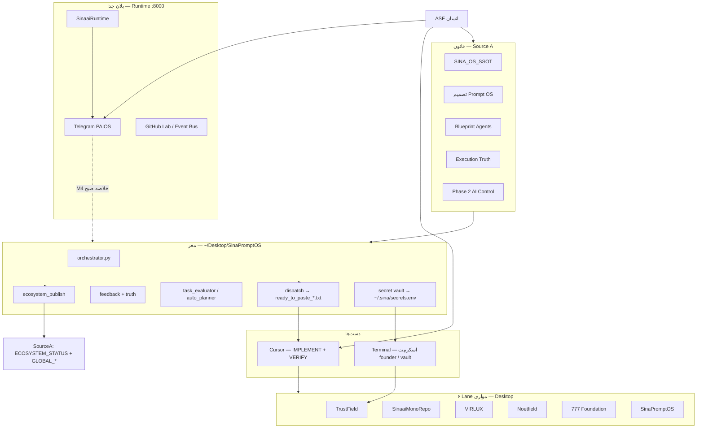

> **ARCHIVED 2026-07-05T13:00:00Z** — lineage only. See `docs/archive/superseded-law-v1/`.

# برنامهٔ جامع اکوسیستم سینا — نقشهٔ شهر، مراحل M، تلگرام، و گام‌های بعدی

**نسخه:** 1.0 — برای اشتراک و اجرا  
**تاریخ:** 2026-06-02  
**وضعیت:** هم‌راستا با اسناد قفل‌شدهٔ Source A  
**مکان کانونی:** `~/Desktop/SourceA/SINAAI_MASTER_PLAN_FA_SHARE_v1.md`  
**نگهدار:** ASF (سینا)

> این سند **یک نقشهٔ شهر** است: همهٔ بحث‌ها، M1 تا M9، Phase 2، تلگرام، Prompt OS، Cursor، و کار روزانه — **به فارسی** و قابل فرستادن برای تیم یا خودت فردا.

---

## ۱. جملهٔ یک‌خطی (هدف نهایی)

**یک سیستم‌عامل اجرای کار برای ۶ پروژهٔ موازی** — یکشنبه فکر، دوشنبه تا جمعه اجرا — مغز محلی **Prompt OS**، دست‌ها **Cursor در هر repo**، ناظر **ASF**، و در آینده **اعلان صبح (M4) + زمان‌بند macOS (M6) + پل تلگرام برای تأیید و خلاصه**.

این **شرکت AI خودمختار** نیست. این **خط تولید supervised** است.

---

## ۲. نقشهٔ شهر (معماری کل)



### ۲.۱ سه هواپیما (اشتباه رایج را حذف کن)

| هواپیما | مسیر | نقش |
|---------|------|-----|
| **A — Prompt OS** | `SinaPromptOS` | رتبه‌بندی، پرامپت Cursor، truth، publish به Source A |
| **B — Cursor** | هر repo جدا | ساخت/تست کد محصول؛ **یک** workspace در هر لحظه |
| **C — Runtime** | `SinaaiMonoRepo/SinaaiRuntime` | تلگرام، agent spine، fleet — **نه** جایگزین Prompt OS |

**قانون:** Prompt OS ترافیک تولید تلگرام را route نمی‌کند. Runtime پرامپت TrustField را خودکار نمی‌سازد مگر پل صریح بعداً.

---

## ۳. شش repo و اولویت جهانی

| repo | workspace | فایل صف | وزن معمول |
|------|-----------|---------|-----------|
| TrustField | `TrustField Technologies/` | `os/plan.json` | درآمد / infra |
| SinaaiMonoRepo | `SinaaiMonoRepo/` | `os/plan.json` | PAIOS / consolidation |
| VIRLUX | `VIRLUX/` | `os/plan.json` | محصول |
| Noetfield | `Noetfield/` | `os/plan.json` | محصول |
| 777 Foundation | `The 777 Foundation/` | `os/plan.json` | NGO / وب |
| Sina Prompt OS | `SinaPromptOS/` | `os/plan.json` | خود سیستم |

**مدل قفل:** موازی — حداکثر **۳ پرامپت در هر سیکل** (`max_tasks_per_cycle: 3`). یک repo قهرمان نیست.

**workspace اشتباه:** `SinaaiDataBase` خالی است — **هرگز** به‌عنوان محل اجرا باز نکن؛ مسیر داخل `ready_to_paste_*.txt` را دنبال کن.

---

## ۴. جدول کامل مراحل M (Prompt OS + اتوماسیون)

### ۴.۱ فاز ۱ — Execution OS (بسته شده ✅)

| مرحله | نام | چه می‌سازد | وضعیت |
|-------|-----|-------------|--------|
| **M0** | تصمیم + سلسلهٔ اسناد | پایان جنگ معماری | ✅ قفل |
| **M1** | `projects/*.json` + حافظه | چیدمان چندپروژه | ✅ |
| **M2** | داشبورد Streamlit `:8765` | top 3 + کپی | 🟡 نیمه‌کاره |
| **M2T** | Execution Truth Layer | شواهد → re-rank | ✅ قفل + کد |
| **FB** | Feedback + `REPO_STATUS_REPORTS/` | intent → rank | ✅ |
| **M3** | `mark-done` + `mark-done-verified` | حافظه + evidence | ✅ |

### ۴.۲ فاز ۲ v1 — AI زیر نظر (ساخته شده ✅)

| مرحله | نام | خروجی | وضعیت |
|-------|-----|--------|--------|
| **P2-M1** | Task Evaluator | DONE / NOT_DONE / PARTIAL | ✅ |
| **P2-M2** | Auto-Planner | پیشنهاد micro-step یا NEEDS_ASF | ✅ (اعمال خودکار OFF) |
| **P2-M3** | Semantic Progress | پیشرفت معنایی ۰–۱۰۰ | ✅ v1 بدون embedding |

### ۴.۳ فاز بعد — اتوماسیون روزانه (بعدی 🔜)

| مرحله | نام | هدف | پیش‌نیاز | وضعیت |
|-------|-----|------|----------|--------|
| **M4** | اعلان صبح | Telegram **یا** macOS notification — خلاصه ۳ lane بدون باز کردن UI | ۳–۵ روز loop واقعی + log | **✅ v1** — `morning-notify.sh` |
| **M5** | `auto_sync_plan` امن | فقط با `--verified` بعد از VERIFY PASS | M4 پایدار + evaluator | **بعدی** |
| **M6** | launchd صبح | فقط `run-full-cycle.sh` صبح — **نه** daemon ۲۴/۷ | بعد از M4 | **بعدی** |
| **M7** | WebSocket dashboard | push زنده | M3–M4 پایدار | Phase 2b |
| **M8** | Cursor SDK / Cloud Agent | ارسال خودکار به چت Cursor | Phase 2b/3 | آینده |
| **M9** | Docker + systemd + Redis | بستهٔ deploy | Phase 3 | آینده |

**قانون قفل:** M7–M9 را **قبل از** M3–M4 پایدار شروع نکن.

---

## ۵. نردبان خودمختاری (L0 → L3) و جای Mها

| سطح | نام | تلاش ASF | قابلیت سیستم | M مرتبط |
|-----|-----|----------|--------------|---------|
| **L0** | مرکز فرمان دستی | UI باز، کپی پرامپت، paste Cursor | **الان** | M1–M3, dispatch |
| **L1** | حافظهٔ زمان‌بندی‌شده | ~۲ دقیقه/روز | snapshot + **اعلان (M4)** | M4, M6 |
| **L2** | حلقهٔ Verify | فقط روی FAIL | به‌روزرسانی `plan.json` بعد از PASS | M5 |
| **L3** | worker نیمه‌خودکار | استراتژی فقط | Cursor SDK per repo + Runtime موازی | M8 |

**الان:** L0 با dispatch یک‌فایله (`ready_to_paste_<repo>.txt`).

---

## ۶. تلگرام — نقشه و اتصال (دو مسیر)

### ۶.۱ مسیر Runtime (محصول / PAIOS)

| موضوع | جزئیات |
|--------|---------|
| کد | `SinaaiMonoRepo/SinaaiRuntime` — پورت `:8000` |
| توکن | در vault: `TELEGRAM_BOT_TOKEN` (از harvest) |
| بدهی قفل | **یک** مسیر canonical تلگرام — ۵ درخت قدیمی را freeze کن |
| جریان | پیام → liaison → workers → leader → پاسخ؛ **never silent** (زنجیره LLM) |
| تأیید انسان | اجرای production فقط بعد از تأیید ASF روی تلگرام |

**گام‌های اتصال Runtime (فاز Agent — جدا از M4):**

1. Runtime را با `.env` از vault بالا بیاور (`vault-sync-all` → Runtime `.env`).
2. یک bot canonical را در registry اعلام کن (اسناد Phase 1 agent exit).
3. تست: پیام تست → پاسخ &lt; ۳۰s با failover chain.
4. Langfuse روی مسیر multi-agent (چک‌لیست blueprint).

### ۶.۲ مسیر Prompt OS (M4 — اعلان صبح، نه چت کامل)

| موضوع | جزئیات |
|--------|---------|
| هدف M4 | هر صبح: «۳ lane امروز» + لینک/خلاصه blocker — **بدون** باز کردن ۶ repo |
| کانال‌ها | (الف) Bot تلگرام جدا برای **digest** یا (ب) macOS notification |
| دادهٔ ورودی | `run-full-cycle.sh` + `data/day/YYYY-MM-DD/morning-summary.md` |
| پیاده‌سازی پیشنهادی | `scripts/morning-notify.sh` + env `TELEGRAM_DIGEST_BOT_TOKEN` یا همان bot با `chat_id` ASF |

**تفکیک مهم:** M4 = **خواندنی** برای ASF. Runtime = **اجرایی** با gate.

---

## ۷. حلقهٔ عملیاتی روزانه (۵ روز اجرا)

### ۷.۱ صبح (۱۵–۲۰ دقیقه)

```bash
cd ~/Desktop/SinaPromptOS && source .venv/bin/activate
./scripts/run-full-cycle.sh      # publish + truth + phase2
./scripts/dispatch-day.sh        # ۶ فایل ready_to_paste_*.txt
# یا: ./scripts/run-day.sh morning
```

1. باز کن: `outputs/ready_to_paste_<repo>.txt` — **یک فایل = یک paste** (نه IMPLEMENT جدا).
2. Cursor workspace همان repo را باز کن.
3. IMPLEMENT → VERIFY.
4. بعد از PASS:

```bash
./scripts/submit-execution-log.sh <repo> log.yaml
./scripts/mark-done-verified.sh <repo> log.yaml
```

### ۷.۲ ظهر / عصر

- تکرار dispatch برای lane دوم و سوم (حداکثر ۳ در روز).
- TrustField infra: **Terminal** — نه چت:

```bash
# vault: فقط CF_API_TOKEN — بدون RENDER_API_KEY (بدون کارت)
./scripts/vault-sync-all.sh
cd ~/Desktop/TrustField\ Technologies && ./scripts/founder_free_auto.sh
```

قانون: `FOUNDER_NO_CREDIT_CARD_INFRA_LOCKED_v1.md`

### ۷.۳ شب

```bash
./scripts/run-day.sh evening
```

### ۷.۴ یکشنبه (فکر — بدون Cursor سنگین)

- `config/projects.json` — وزن و اولویت
- هر `os/plan.json` — صف هفته
- `os/task_definition.json` — معیار پذیرش واقعی

---

## ۸. Source A — فایل‌های زنده (نقشهٔ وضعیت)

| فایل | نویسنده |
|------|---------|
| `ECOSYSTEM_STATUS.md` | Prompt OS |
| `GLOBAL_PRIORITY.json` | Prompt OS |
| `GLOBAL_BLOCKERS.json` | Prompt OS |
| `EXECUTION_TRUTH.json` | Prompt OS |
| `PHASE2_EVALUATIONS.json` | Prompt OS |
| `REPO_STATUS_REPORTS/*.yaml` | ASF (واقعی، نه seed جعلی) |
| `REPO_EXECUTION_LOGS/<repo>/*.yaml` | ASF بعد از VERIFY |

**اگر گم شدی:** فقط `SINAAI_ECOSYSTEM_FINAL_STATE_AND_NEXT_PLAN_LOCKED_v1.md`.

---

## ۹. Vault اسرار (یک‌بار برای همیشه)

| مسیر | نقش |
|------|-----|
| `~/.sina/secrets.env` | گاوصندوق مرکزی (~۸۴ کلید harvest شده) |
| `scripts/vault-harvest.sh` | جمع از `.env`های Desktop |
| `scripts/vault-sync-all.sh` | پر کردن repo `.env` / `.env.founder` |

**TrustField vault (رایگان):** `CF_API_TOKEN`, `CF_ZONE_ID` — **نه** `RENDER_API_KEY`. سپس `founder_free_auto.sh` + `founder_free_verify.sh`.

راهنما: `SECRETS_VAULT.md`

---

## ۱۰. مشکلات باز (اولویت‌دار)

| # | موضوع | شدت | اقدام |
|---|--------|------|--------|
| 1 | Seed STATUS REPORTS ممکن است جعلی باشد | متوسط | YAML واقعی یا حذف seed |
| 2 | Execution log واقعی کم است | بالا | بعد از هر VERIFY واقعی submit کن |
| 3 | TrustField VERIFY FAIL (SQLite / DNS) | بالا | کلید Render+CF در vault |
| 4 | `acceptance_criteria` generic | متوسط | ASF در `task_definition.json` دقیق کند |
| 5 | M4–M6 ساخته نشده | برنامه‌ریزی | بعد از ۳–۵ روز loop |
| 6 | M8 Cursor auto-send | آینده | Phase 2b/3 |
| 7 | workspace اشتباه | بالا | مسیر header پرامپت |

---

## ۱۱. برنامهٔ بزرگ ۹۰ روزه (فازبندی حرفه‌ای)

### فاز A — تثبیت (روز ۱–۱۴) «فقط اجرا»

| هفته | کار ASF | کار سیستم |
|------|---------|------------|
| 1 | ۳ lane/روز؛ log واقعی per repo | `run-full-cycle` + dispatch |
| 2 | TrustField infra unblock | vault + founder scripts |
| 3 | پاکسازی seed reports | truth re-rank معتبر |
| 4 | یکشنبه: plan.json هفته ۲ | بدون سند جدید |

**خروجی فاز A:** حداقل ۱ execution log معتبر per repo + TrustField VERIFY سبز یا blocker documented.

### فاز B — L1 اتوماسیون (روز ۱۵–۳۵)

| کار | تحویل |
|-----|--------|
| **M4** | `morning-notify.sh` — Telegram digest یا macOS |
| **M6** | `~/Library/LaunchAgents/com.sina.prompt-os.morning.plist` |
| تکمیل **M2** | دکمهٔ کپی هر ۳ lane در UI |
| Runtime smoke | bot canonical + یک تست end-to-end |

### فاز C — L2 امن (روز ۳۶–۶۰)

| کار | تحویل |
|-----|--------|
| **M5** | `auto_sync_plan` فقط `--verified` |
| P2-M1 روی log واقعی | evaluator قابل اعتماد |
| Mono | یک مسیر تلگرام + registry در git |

### فاز D — L3 انتخابی (روز ۶۱–۹۰)

| کار | تحویل |
|-----|--------|
| **M8** spike | Cursor SDK — یک repo pilot |
| Phase 2b | Auto-finish (git diff + test hook) **یا** embedding memory |
| **نه** | M9 Docker pack تا M4–M6 پایدار |

---

## ۱۲. نقشهٔ اسناد (ترتیب خواندن — برای اشتراک)

| # | فایل | برای چه کسی |
|---|------|-------------|
| 1 | **این فایل** | همه — نقشهٔ شهر فارسی |
| 2 | `SINAAI_ECOSYSTEM_FINAL_STATE_AND_NEXT_PLAN_LOCKED_v1.md` | وضعیت + next قفل |
| 3 | `ASF_FULL_DAY_EXECUTION_PLAYBOOK_LOCKED_v1.md` | ساعت‌به‌ساعت روز |
| 4 | `PROMPT_OS_CORE_MVP_BUILD_ORDER_LOCKED_v1.md` | صف build M4+ |
| 5 | `SINAAI_AGENTS_AND_AUTOMATION_UNIFIED_BLUEPRINT_LOCKED_v1.md` | Agents + Telegram |
| 6 | `CURSOR_REPO_SPECIALIZED_NOTICES_v2.md` | پرامپت NOTICE هر repo |
| 7 | `SECRETS_VAULT.md` | کلیدها |
| 8 | `~/Desktop/SinaPromptOS/ASF_FINAL_HANDOFF_FA.md` | یک‌صفحهٔ روزانه |

---

## ۱۳. چک‌لیست «فردا صبح» (کپی کن)

- [ ] `cd ~/Desktop/SinaPromptOS && ./scripts/run-full-cycle.sh`
- [ ] `./scripts/dispatch-day.sh`
- [ ] باز کردن `ready_to_paste_*` برای lane ۱
- [ ] VERIFY → `submit-execution-log` → `mark-done-verified`
- [ ] تکرار تا ۳ lane
- [ ] اگر TrustField: vault پر → `founder_infra_full_auto.sh`
- [ ] شب: `run-day.sh evening`
- [ ] یکشنبه: فقط plan.json — نه معماری جدید

---

## ۱۴. آنچه عمداً نمی‌سازیم (قفل)

- شرکت AI خودمختار ۲۴/۷
- یک repo قهرمان برای همهٔ محصولات
- `auto_plan_apply` پیش‌فرض ON
- چت Cursor از Python بدون M8
- SSOT چهارم یا blueprint ادغامی جدید

---

## ۱۵. امضای پذیرش نهایی

| مورد | وضعیت |
|------|--------|
| Phase 1 Execution OS | ✅ بسته |
| Phase 2 AI Control v1 | ✅ بسته |
| مدل موازی ≤۳ | ✅ |
| Vault مرکزی | ✅ harvest؛ TrustField keys دستی |
| M4–M6 | 🔜 بعد از loop واقعی |
| تلگرام Runtime | 🔜 فاز Agent جدا از M4 digest |

**تاریخ امضا ASF:** __________

---

*این سند را می‌توانی به تیم، مشاور، یا خودت در آینده بفرستی. برای به‌روزرسانی رسمی، نسخهٔ انگلیسی قفل در Source A مرجع حقوقی است؛ این فایل ترجمهٔ عملیاتی و نقشهٔ شهر است.*
