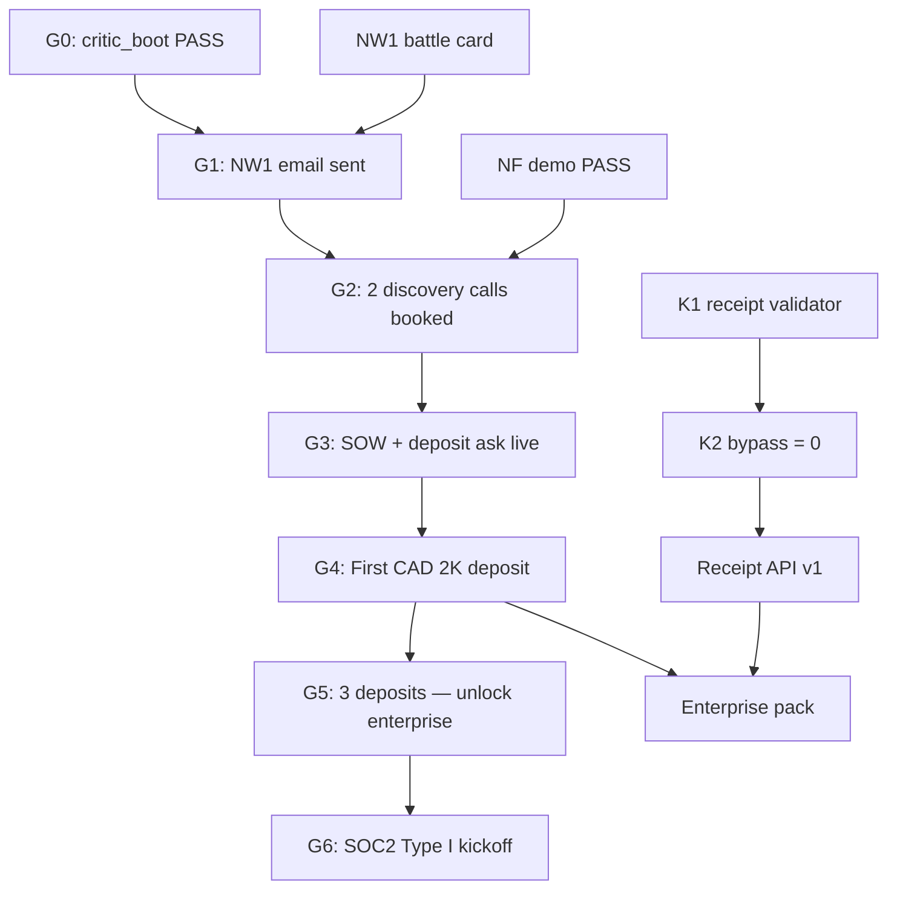

> **ARCHIVED 2026-07-05T13:00:00Z** — lineage only. See `docs/archive/superseded-law-v1/`.

# SourceA Control Plane — 200 Plan Branch Index LOCKED v1

**Saved:** 2026-06-16T05:49:57Z · **Retrofit:** doc-datetime-law batch retrofit
**Version:** 1.0 · **Locked:** 2026-06-15  
**Parent:** `SOURCEA_CONTROL_PLANE_200_PLAN_LOCKED_v1.md` (summary tables)  
**Extension:** `archive/attachments/commercial_goal_specialist/sina_os/branches/` — 14 bucket branches  
**Authority:** SSOT v3.1 · Constellation v1 · Jun 2026 competitor + NW1 + orchestrator partner corpus

---

## What “branch” means

Each **PLAN-XXX** is a **leaf** on the control-plane execution tree. Branches add what summary tables omit:

| Field | Purpose |
|-------|---------|
| **Objective** | One measurable outcome |
| **Acceptance** | PASS/FAIL gate — no vibes |
| **Depends / Unblocks** | DAG edges — no orphan work |
| **Artifact** | Disk path or buyer deliverable |
| **Competitor angle** | Who you beat / partner / lose to |
| **Failure mode** | What kills the plan |
| **Week** | Target week (8-week blueprint) |

**Smart judgment:** Branch order follows **deposits × proof density × procurement unblock** — not validator count, not critic reorder.

---

## Branch files (14)

| Branch | Plans | File |
|--------|-------|------|
| B01 W3 Outreach | 001–025 | `BRANCH_B01_W3_OUTREACH_PLAN_001_025_LOCKED_v1.md` |
| B02 W2 Kernel | 026–040 | `BRANCH_B02_W2_KERNEL_PLAN_026_040_LOCKED_v1.md` |
| B03 W1 Film | 041–050 | `BRANCH_B03_W1_FILM_PLAN_041_050_LOCKED_v1.md` |
| B04 Regulatory | 051–065 | `BRANCH_B04_REGULATORY_PLAN_051_065_LOCKED_v1.md` |
| B05 Competitive | 066–075 | `BRANCH_B05_COMPETITIVE_PLAN_066_075_LOCKED_v1.md` |
| B06 TF / NF | 076–085 | `BRANCH_B06_VERTICAL_TF_NF_PLAN_076_085_LOCKED_v1.md` |
| B07 Partnerships | 086–093 | `BRANCH_B07_PARTNERSHIPS_PLAN_086_093_LOCKED_v1.md` |
| B08 Packaging | 094–100 | `BRANCH_B08_PACKAGING_PLAN_094_100_LOCKED_v1.md` |
| B09 GTM Scale | 101–120 | `BRANCH_B09_GTM_SCALE_PLAN_101_120_LOCKED_v1.md` |
| B10 Enterprise | 121–140 | `BRANCH_B10_ENTERPRISE_PLAN_121_140_LOCKED_v1.md` |
| B11 Kernel API | 141–160 | `BRANCH_B11_KERNEL_API_PLAN_141_160_LOCKED_v1.md` |
| B12 Category | 161–175 | `BRANCH_B12_CATEGORY_PLAN_161_175_LOCKED_v1.md` |
| B13 EU Entry | 176–190 | `BRANCH_B13_EU_ENTRY_PLAN_176_190_LOCKED_v1.md` |
| B14 US Entry | 191–200 | `BRANCH_B14_US_ENTRY_PLAN_191_200_LOCKED_v1.md` |

**Plans 201–300:** `BLUEPRINT_MARKET_300_PLANS_TIER1_RESEARCH_REPORT_v1.md` — platform moat · CS · board metrics (next branch wave).

---

## Stage gates (hard)

| Gate | Condition | Unlocks |
|------|-----------|---------|
| **G0** | `validate-critic-boot-v1.sh` PASS | All agent sessions · PLAN-026 credibility |
| **G1** | PLAN-002 sent ≥1 NW1 email w/ battle card | PLAN-005 pipeline |
| **G2** | ≥2 qualified discovery calls (budget + timeline) | PLAN-006 close |
| **G3** | PLAN-006 SOW PDF + refund clause logged | Deposit conversation |
| **G4** | ≥1 CAD $2K deposit received | PLAN-008 upsell · social proof |
| **G5** | ≥3 deposits cumulative | PLAN-121–140 enterprise · PLAN-196 US entity |
| **K1** | Forged receipt → FAIL on read | W1 film · PLAN-141 API |
| **K2** | Bypass inventory = 0 + CI gate | Category claims · analyst brief |

---

## Cross-bucket dependency spine (critical path)

| Order | Plan cluster | Why first |
|-------|--------------|-----------|
| 1 | **067 · 081 · 085** (done) | Outbound ammunition |
| 2 | **002 · 011 · 014** + NF demo | Revenue motion |
| 3 | **006 · 007 · 064 · 065** | Close friction removal |
| 4 | **026 · 038 · 034 · 157 · 158** | Proof beats observability |
| 5 | **105 · 106 · 141 · 145** | Geordie parity + embed |
| 6 | **069 · 176** | Partner + EU SKU narrative |
| 7 | **041–044** | Film — **other repo** after K1 |
| 8 | **121+** | After G5 only |

---

## Weekly operating rhythm (Tier-1)

| Day | Block | Plans |
|-----|-------|-------|
| **Mon** | Outreach batch 10 | 011 · 103 · 002 · 024 |
| **Tue** | Discovery + demo | 005 · 014 · NF demo script |
| **Wed** | Kernel / M2 | 026–040 · 141–145 |
| **Thu** | Follow-up + CRM | 018 · 010 · 110 |
| **Fri** | Retro + scorecard | 097 · 120 · 119 |

**Energy split:** 45% commercial · 25% kernel · 15% demo · 15% buffer — validators ≠ Friday topic.

---

## Intelligence layer (Jun 2026 — branch-wide)

### L6 runtime peers (SourceA engine)

Beat on: **tamper FAIL · SSOT re-brief · self-hosted law · critic_boot**  
Lose on: **cloud scale · SIEM packs · enterprise sales army**  
Watch: Notenic · FuseGov · SourceA · AgentPEP · Microsoft Auth Fabric

### Noetfield lane (NW1 primary)

Beat on: **governance latency · board TLE · procurement ZIP · 4–6 week NF-RD**  
Lose on: **data estate breadth (Securiti) · agent inventory UI (SourceA) · Azure-only**  
Partner-not-fight: Purview (complement) · Temporal/LangGraph (layer above)

### Wrong comparisons (void in outbound)

- “We replace Temporal” → use PLAN-069 partner doc  
- “We are Vanta for AI” → use PLAN-013 receipts vs templates  
- “AI OS / Trust OS” → use PLAN-161 governance runtime only

---

## P0 plan roster (22 — full cards in branches)

`002` `005` `006` `011` `014` `026` `027` `034` `038` `041` `042` `043` `044` `067` `076` `077` `081` `094` `100` `103` `105` `141` `145` `157` `158` `161` `176`

*(Film P0s 041–044 execute in other repo; SourceA runs NF demo substitute.)*

---

## ASF FIVE-STEP — branch pick (this week)

1. **PLAN-002** — NW1 email + battle card attach  
2. **PLAN-011** — 10-email Monday batch  
3. **PLAN-006** — SOW PDF ready before second call  
4. **PLAN-026/038** — K1 tamper FAIL proof for demo  
5. **PLAN-105** — landing promises 10-min instrument  

---

## Metrics north star (branch KPIs)

| Metric | Target W8 | Plan owner |
|--------|-----------|------------|
| Deposits CAD | ≥ $2K (1) | 002 · 006 · 094 |
| Outreach sent | 50 cumulative | 003 · 011 · 103 |
| Discovery calls | 2 booked W2 | 005 · 104 |
| K1 tamper FAIL | demo reproducible | 026 · 038 |
| Bypass count | 0 | 027 · 157 · 158 |
| NF demo runs | 3 founder PASS | 077 · demo script |
| Enterprise pack | zip manifest exists | 140 (after G5) |

---

## Frozen (branches do not authorize)

- Architecture layers · WTM build · hub validator marathon  
- Buyer 3 RFP before SW2  
- SOC2 kickoff before G5  
- Temporal Cloud replatform as P0  
- Critic-driven plan reorder

---

*End index — open bucket branch file for full PLAN cards.*
