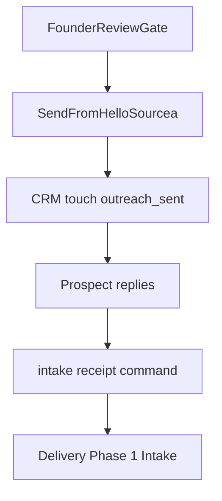

# ACG First Send Package (v1)

**Status:** Prepared — awaiting founder sign-off on `ACG_FOUNDER_REVIEW_GATE_v1.md`  
**Do not send until gate is signed**

---

## Package contents

1. [`ACG_FIRST_PROSPECT_INSTANCE_v1.md`](ACG_FIRST_PROSPECT_INSTANCE_v1.md) — personalized brief + email
2. [`ACG_FIRST_PROSPECT_PACKET_v1.md`](ACG_FIRST_PROSPECT_PACKET_v1.md) — full template reference
3. Intake checklist (§2 of prospect packet) — attach or inline in email
4. Tool inventory request (§3) — attach on kickoff
5. Security questions (§4) — send if regulated sector

---

## Send workflow



---

## Commands (post-send)

```bash
# After prospect replies — write intake receipt
python3 scripts/agentic_cost_governance_intake_v1.py receipt \
  --audit-id ACG-20260705-001 --json

# Advance CRM on meeting booked
python3 scripts/sourcea_revenue_engine_crm_v1.py touch \
  --id RE-ACG-001 \
  --stage audit_discovery_scheduled \
  --audit-id ACG-20260705-001 \
  --json
```

---

## Explicitly not included

- Production firewall deployment
- Noetfield.com publish
- Guaranteed savings claims
- Auto-send (founder sends manually)
